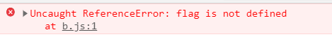
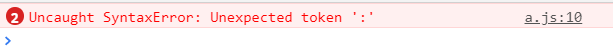
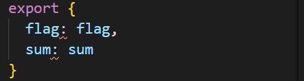
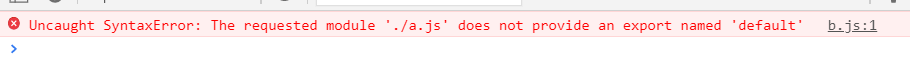
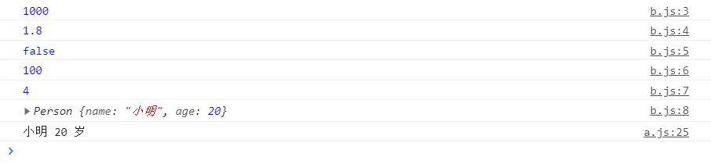
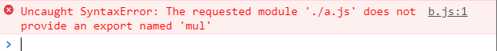
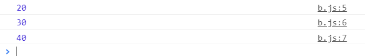

# Import和export

## 环境准备

三个文件 `1.html`、`a.js` 和 `b.js`，并要能使代码在服务器环境下运行（不然后面会报跨域的错误）

**1.html**

```html
<!DOCTYPE html>
<html lang="zh_CN">
<head>
    <meta charset="UTF-8">
    <title>Document</title>
</head>
<body>
    <script src="./a.js"></script>
    <script src="./b.js"></script>
</body>
</html>
```

**a.js**

```js
let flag = false
```

**b.js**

```js
console.log(flag)
```

这是三个特别特别简单的代码，然后我们让他们在服务器上运行，为了方便我就使用 `vscode` 的 `Live Server`插件运行代码

**运行结果**

打开控制台后，会发现输出一行 false

## 模块化

由此可以看出，在js文件中定义的变量已经污染了全局，随着项目的增大这可能会导致不必要的麻烦

于是我们需要进行如下操作

```html
<script src="a.js" type="module"></script>
<script src="b.js" type="module"></script>
```

当在 script 标签上加上 `type="module"`就代表这个文件是一个模块，之中定义的属性在全局就访问不到了。

然后我们再看控制台，就会发现如下的错误



这就表明我们在 js 中定义的变量已经不会污染全局了

但是有些时候我们还是需要引用不同 js 文件中的变量的，那么看下面

## export、import

### export

在ES6中，不同模块的内容是不会共享的，我们必须将需要的内容通过 `export` 给暴露出去，如下

**a.js**

```js
// 1.单个导出
export var num1 = 1000
export var height = 1.8


// 2.批量导出
let flag = false
let sum = 100
export {
	flag,sum
}

// 3.导出方法
export function add(x, y){ return x + y}

// 4.导出类
export class Person{

  constructor(name, age){
    this.name = name
    this.age = age
  }

  show(){
    console.log(this.name + ' ' + this.age + ' 岁')
  }
}
```

这里需要注意的是，批量导入并不是我们平时认为的ES6增强写法

```js
export {
	flag,sum
}
```

如果你认为上面代码等于如下的，那就错了

```js
export {
	flag: flag,
	sum: sum
}
```

他会报下面的错误，并且连编译器也会认为这个写法不合法

<table>
    <tr>
        <td></td>
        <td></td>
    </tr>
</table>

### import

1、接下来我们想在 `b.js`这个文件用到上述所有的变量，这时我们可以使用 `import`进行导入，于是乎如下

**b.js**

```js
import values from './a.js'
console.log(values);
```

在 node.js 中我们常常将 `a.js`  通过 `const values = require('./a.js')`将a.js的变量 一股脑的全部导入到 values 这个变量中

所以面对 `import` 我们很自然的就想这么用，但是意外就发生了，如果如上述所写，就会出现下面的错误



说是啥没有提供一个默认导出的变量，这个先放着，后面再讲

2、正确写法如下

**b.js**

```js
import {num1, height, flag, sum, add, Person} from './a.js'

console.log(num1)
console.log(height)
console.log(flag)
console.log(sum)
console.log(add(1, 3))
console.log(new Person('小明', 20))
new Person('小明', 20).show()
```

输出结果如下



> 这里可以发现，我们要想使用 a.js 文件中的某个变量必须要用 `{}`括起来，这就和之前面批量导出用 `export {}`的花括号，括住想要导出的变量相对应了

### import * as

之前面我们通过 `import {} from`  将想要导出的变量全部写在花括号里，但是若里面的变量太多，又全部都需要使用，那么这种写法可真要累死人

所幸有个更方便的写法，如下所示，我们可以将 a.js 中的所有文件全部导入到 values 变量中，然后用 `values.xx`的方式调用

**b.js**

```js
import * as values from './a.js'

console.log(values.num1)
console.log(values.height)
console.log(values.flag)
console.log(values.sum)
console.log(values.add(1, 3))
console.log(new values.Person('小明', 20))
new values.Person('小明', 20).show()
```

输出结果也没有任何变化，和上面的一样

## export default

1、之前我们首次使用 import，想用导入全部变量时出现了如下错误

```js
import values from './a.js'
```


2、现在我们就应该能懂的为什么会报错，并且 `export default` 是什么意思了，我们先在 a.js 加上一行

**a.js**

```js
export default function mul(x, y){
  return x * y
}
```

3、然后再在 b.js 文件中引入

**b.js**

```js
import values from './a.js'

console.log(values(2, 10))
```

输出结果


> 所以 export default 的作用就是导出一个默认变量，这个默认变量就是扛把子，之后我们使用 import xx from aa 的时候就会将 aa 中的默认变量赋到 xx 上面，而无需使用 import { xx } from aa 了

**注意**

1、如果我们按照之前花括号的方式进行导入

```js
import {mul} from './a.js'

console.log(values(2, 10))
```

会报这样的错误



2、经过测试，有如下三种方法可以导入 `export default` 默认暴露出的变量

```js
import values from './a.js'
import {default as m} from './a.js'
import * as val from './a.js'

console.log(values(2, 10))
console.log(m(3, 10))
console.log(val.default(4, 10))
```

输出结果



## import 和 require 的区别

最后再来说一下 import 和 require 的区别

1. 出现的时间、地点不同

|                 | 年份 | 出处                  |
| --------------- | ---- | --------------------- |
| require/exports | 2009 | CommonJS              |
| import/export   | 2015 | ECMAScript2015（ES6） |

2. 不同端(客户端/服务器)的使用限制

|         | require/exports | import/export                                                |
| ------- | --------------- | ------------------------------------------------------------ |
| Node.js | 所有版本        | Node 9.0+（启动需加上 flag --experimental-modules） Node 13.2+（直接启动） |
| Chrome  | 不支持          | 61+                                                          |
| Firefox | 不支持          | 60+                                                          |
| Safari  | 不支持          | 10.1+                                                        |
| Edge    | 不支持          | 16+                                                          |

+ 原生浏览器不支持 require/exports，可使用支持 CommonJS 模块规范的 Browsersify、webpack 等打包工具，它们会将 require/exports 转换成能在浏览器使用的代码。
+ import/export 在浏览器中无法直接使用，我们需要在引入模块的 <script> 元素上添加type="module属性。

3. require/exports 是运行时动态加载，import/export 是静态编译

## 参考

https://zhuanlan.zhihu.com/p/121770261

https://www.bilibili.com/video/BV15741177Eh?p=74

https://www.bilibili.com/video/BV15741177Eh?p=75