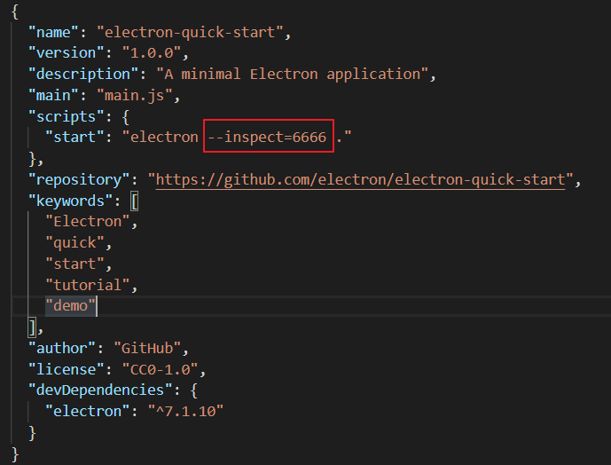
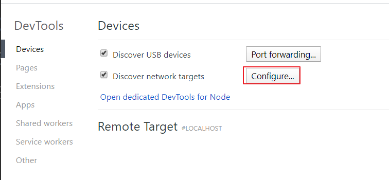
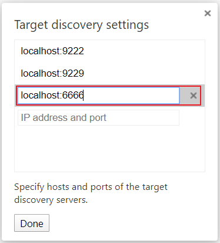
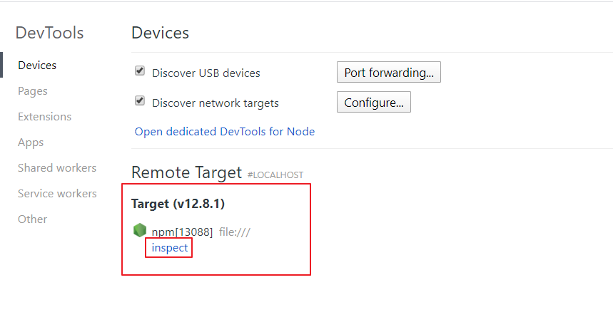

[toc]


# Electron学习

# 一、入门案例

## 1、案例

### 1 小程序

（1）首先新建一个文件，并在此文件夹中打开命令行，输入如下

```shell
$ npm init
```

（2）修改package.json文件

经过第一步会生成一个package.json文件内容大概如下

```json
{
  "name": "electron-demo",
  "version": "1.0.0",
  "description": "",
  "main": "index.js",
  "scripts": {
    "test": "echo \"Error: no test specified\" && exit 1"
  },
  "author": "",
  "license": "ISC"
}

```

name就是你自己项目的名字，默认是你所在文件的名称，现在我们要将它改为electron项目，只需修改**scripts**就行，如下

```json
{
  "name": "electron-demo",
  "version": "1.0.0",
  "description": "",
  "main": "index.js",
  "scripts": {
    "start": "electron ."
  },
  "author": "",
  "license": "ISC"
}

```

（3）安装Electron

现在我们需要下载electron项目的相关依赖

```sh
npm install --save-dev electron@6.0.1
```

经过测试如果不带版本号他会默认下载最新版，而最新版淘宝镜像没有同步过来总会出错，所以选一个较低版本的

（4）编写函数入口文件

入口文件就是main属性所指的，在这里就是`index.js`，下面来编写他，写一个最简单的程序

```javascript
const { app, BrowserWindow } = require('electron')

function createWindow () {   
  // 创建浏览器窗口
  let win = new BrowserWindow({
    width: 800,
    height: 600,
    webPreferences: {
      nodeIntegration: true
    }
  })

  // 加载index.html文件
  win.loadFile('index.html')
}
app.on('ready', createWindow)
```

### 2 换源

该命令可以改变装包用的资源点，使访问外网变为访问国内网

```shell
npm install -gd express --registry=http://registry.npm.taobao.org
```

需要使用–registry参数指定镜像服务器地址，为了避免每次安装都需要–registry参数，可以使用如下命令进行永久设置：

```shell
npm config set registry http://registry.npm.taobao.org
```

默认的electron源非常慢，所以要切换到别的源，如下命令设置淘宝的镜像源

```cmd
npm config set ELECTRON_MIRROR=https://npm.taobao.org/mirrors/electron/
```

### 3 安装失败排错

然后在`npm start`，在这里我遇到了个问题，如下

```cmd
UnhandledPromiseRejectionWarning: Error: EPERM: operation not permitted, lstat 'E:\Temp\electron-download-TkJ3cy\electron-v7.1.10-win32-x64.zip'

Electron failed to install correctly, please delete node_modules/electron and try installing again at getElectronPath
```

就是类似这样的错误，截取了一点。

一来说是因为electron被墙了，**换个源**基本上就能解决

如果换源后还出现含有`404`类的错误，大概是因为镜像源还没同步过来，需要选用**低版本**安装

目前测试使用较稳定的，如下

```shell
npm install --save-dev electron@6.0.1
```

## 1.2 主进程调试

### 1.2.1 使用 vscode 调试

添加`launch.json`，填写如下代码

```json
{
  "version": "0.2.0",
  "configurations": [
    {
      "name": "Debug Main Process",
      "type": "node",
      "request": "launch",
      "cwd": "${workspaceFolder}",
      "runtimeExecutable": "${workspaceFolder}/node_modules/.bin/electron",
      "windows": {
        "runtimeExecutable": "${workspaceFolder}/node_modules/.bin/electron.cmd"
      },
      "args" : ["."]
    }
  ]
}
```

### 1.2.2 使用 chrome 调试

1、首先修改`package.json`文件，修改运行参数



`inspect=`后面紧跟着端口信息，然后打开`chrome`，输入`chrome://inspect/`回车，可以看到如下



点击`configure`



输入主机及端口信息，然后点击`Done`



然后点击`inspect`即可用`chrome`进行调试

# 二、核心模块

> [参考文档](https://www.electronjs.org/docs)

## app模块

申明周期

1、ready：应用初始化完成

2、browser-window-created：窗口创建完成

3、before-quit：窗口关闭之前

4、will-quit：窗口关闭了，但是程序还没有关闭，即将关闭

5、quit：应用程序关闭触发

写法如下

```
const { app, BrowserWindow } = require('electron')

app.on('ready', () => {
  const mainWin = new BrowserWindow({
    width: 800,
    height: 600
  })
  mainWin.loadFile('static/index.html')
})
```

官方还提供了一个方法来`whenReady`代替监听`ready`，如下

```
const { app, BrowserWindow } = require('electron')

app.on('ready', () => {
  const mainWin = new BrowserWindow({
    width: 800,
    height: 600
  })
  mainWin.loadFile('static/index.html')
})
```


**单例模式**

`requestSingleInstanceLock` 用来返回是否获取到该软件的锁，如果返回 false，则说明系统存在运行中的实例，这时需要立即退出程序。

```js
const { app } = require('electron')
let myWindow = null

const additionalData = { myKey: 'myValue' }
const gotTheLock = app.requestSingleInstanceLock(additionalData)

if (!gotTheLock) {
  app.quit()
} else {
  app.on('second-instance', (event, commandLine, workingDirectory, additionalData) => {
    // Print out data received from the second instance.
    console.log(additionalData)

    // Someone tried to run a second instance, we should focus our window.
    if (myWindow) {
      if (myWindow.isMinimized()) myWindow.restore()
      myWindow.focus()
    }
  })

  // Create myWindow, load the rest of the app, etc...
  app.whenReady().then(() => {
    myWindow = createWindow()
  })
}
```

## BrowserWindow模块

```js
const { app, BrowserWindow } = require('electron')

app.on('ready', () => {
    const mainWin = new BrowserWindow({
        width: 800,
        height: 600,
        frame: false, // 是否显示边框
        resizable: false, // 是否可以调整大小
        minWidth: 100,
        maxWdith: 1000,
        minHeight: 60,
        maxHeight: 600,
        show: false, // 是否显示窗口，当内容完全加载好后显示界面用户体验会更好
        webPreferences: {
          nodeIntegration: true,  // 是否开启 node 集成，默认为 false
          contextIsolation: false  // 是否开启上下文隔离，默认true
          // 配置玩这两个后就可以在渲染进程中使用 node 的接口了
        }
    })
    mainWin.loadFile('static/index.html')
})
```

*主线程中的东西修改后需要重启程序才能生效*


## 模板

```js
// Modules to control application life and create native browser window
const {app, BrowserWindow, Menu} = require('electron')
const path = require('path')

// Keep a global reference of the window object, if you don't, the window will
// be closed automatically when the JavaScript object is garbage collected.
let mainWindow

function createWindow () {
  // Create the browser window.
  mainWindow = new BrowserWindow({
    width: 800,
    height: 600,
    show: false,
    minWidth: 700,
    minHeight: 470,
    title: 'cnblogsUpload',
    webPreferences: {
      preload: path.join(__dirname, 'preload.js'),
      nodeIntegration: true
    }
  })
  // Menu.setApplicationMenu(null)
  // and load the index.html of the app.
  // mainWindow.loadFile('index.html')
  mainWindow.loadFile('static/index.html')
  
  // Open the DevTools.
  // mainWindow.webContents.openDevTools()

  // Emitted when the window is closed.
  mainWindow.on('closed', function () {
    // Dereference the window object, usually you would store windows
    // in an array if your app supports multi windows, this is the time
    // when you should delete the corresponding element.
    mainWindow = null
  })
  
  mainWindow.once('ready-to-show', ()=>{
	  mainWindow.show();
  })
}

// This method will be called when Electron has finished
// initialization and is ready to create browser windows.
// Some APIs can only be used after this event occurs.
app.on('ready', createWindow)

// Quit when all windows are closed.
app.on('window-all-closed', function () {
  // On macOS it is common for applications and their menu bar
  // to stay active until the user quits explicitly with Cmd + Q
  if (process.platform !== 'darwin') app.quit()
})

app.on('activate', function () {
  // On macOS it's common to re-create a window in the app when the
  // dock icon is clicked and there are no other windows open.
  if (mainWindow === null) createWindow()
})

// In this file you can include the rest of your app's specific main process
// code. You can also put them in separate files and require them here.

```

# 三、进程对象

# 四、文件对象(File)

# 五、常用组件

## BrowserWindow

（1）去除边框

创建对象时，指定frame属性为false，如下

```js
mainWindow = new BrowserWindow({
    width: 800,
    height: 600,
    frame: false, //无边框
    webPreferences: {
      preload: path.join(__dirname, 'preload.js'),
      nodeIntegration: true
    }
  })
```

（2）优化显示效果

有时界面元素过多，会先显示一部分，然后其他部分再慢慢加载出来，这样用户体验不是太好，因此初始化时我们可以先让界面不显示，然后等元素全部加载完毕后再显示出来，如下

```js
mainWindow = new BrowserWindow({
    width: 800,
    height: 600,
    show: false, //暂时不显示
    webPreferences: {
      preload: path.join(__dirname, 'preload.js'),
      nodeIntegration: true
    }
  })
  
mainWindow.once('ready-to-show', ()=>{
    mainWindow.show() //等全部加载完毕后再显示
})
```

（3）修改背景色

初始化对象的时候指定`backgroundColor`属性

```js
 mainWindow = new BrowserWindow({
    width: 800,
    height: 600,
    backgroundColor: 'red',//指定背景色
    webPreferences: {
      preload: path.join(__dirname, 'preload.js'),
      nodeIntegration: true
    }
  })
```

（4）父子窗口

通过使用 `parent` 选项，你可以创建子窗口：

```javascript
const { BrowserWindow } = require('electron')

let top = new BrowserWindow()
let child = new BrowserWindow({ parent: top })
child.show()
top.show()
```

`child` 窗口将总是显示在 `top` 窗口的顶部.

（5）模态窗口

模态窗口是禁用父窗口的子窗口，创建模态窗口必须设置 `parent` 和 `modal` 选项：

```js
const { BrowserWindow } = require('electron')

let top = new BrowserWindow()
let child = new BrowserWindow({ 
	parent: top,
	modal: true
})
child.show()
top.show()Copy
```

## BrowserView

(1)示例

```javascript
// 在主进程中.
const { BrowserView, BrowserWindow } = require('electron')

let win = new BrowserWindow({ width: 800, height: 600 })
win.on('closed', () => {
  win = null
})

let view = new BrowserView()
win.setBrowserView(view)
view.setBounds({
    x: 0, y: 0, width: 300, height: 300
})
view.webContents.loadURL('https://electronjs.org')
```

## Dialog

An example of showing a dialog to select multiple files:

```javascript
const { dialog } = require('electron')
console.log(dialog.showOpenDialog({ properties: ['openFile', 'multiSelections'] }))
```

`dialog.showOpenDialogSync([browserWindow, ]options)`

- `browserWindow` [BrowserWindow](https://www.electronjs.org/docs/api/browser-window) (可选)
- `选项` Object
  - `title` String (可选)
  - `defaultPath` String (可选)
  - `buttonLabel` String (可选) - 「确认」按钮的自定义标签, 当为空时, 将使用默认标签。
  - `filters` [FileFilter[\]](https://www.electronjs.org/docs/api/structures/file-filter) (可选)

返回值： `String[] | undefined`, the file paths chosen by the user; if the dialog is cancelled it returns `undefined`.

`filters` 指定一个文件类型数组，用于规定用户可见或可选的特定类型范围。例如:

```javascript
{
  filters: [
    { name: 'Images', extensions: ['jpg', 'png', 'gif'] },
    { name: 'Movies', extensions: ['mkv', 'avi', 'mp4'] },
    { name: 'Custom File Type', extensions: ['as'] },
    { name: 'All Files', extensions: ['*'] }
  ]
}
```

## 系统快捷键

`globalShortcut` 模块可以在操作系统中注册/注销全局快捷键, 以便可以为操作定制各种快捷键。

**注意:** 快捷方式是全局的; 即使应用程序没有键盘焦点, 它也仍然在持续监听键盘事件。 在应用程序模块发出 `ready` 事件之前, 不应使用此模块。

```javascript
const { app, globalShortcut } = require('electron')

app.on('ready', () => {
  // 注册一个 'CommandOrControl+X' 的全局快捷键
  const ret = globalShortcut.register('CommandOrControl+X', () => {
    console.log('CommandOrControl+X is pressed')
  })

  if (!ret) {
    console.log('registration failed')
  }

  // 检查快捷键是否注册成功
  console.log(globalShortcut.isRegistered('CommandOrControl+X'))
})

app.on('will-quit', () => {
  // 注销快捷键
  globalShortcut.unregister('CommandOrControl+X')

  // 注销所有快捷键
  globalShortcut.unregisterAll()
})
```

## ipcMain

下面是在渲染和主进程之间发送和处理消息的一个例子：

```javascript
// 在主进程中.
const { ipcMain } = require('electron')
ipcMain.on('asynchronous-message', (event, arg) => {
  console.log(arg) // prints "ping"
  event.reply('asynchronous-reply', 'pong')
})

ipcMain.on('synchronous-message', (event, arg) => {
  console.log(arg) // prints "ping"
  event.returnValue = 'pong'
})
//在渲染器进程 (网页) 中。
const { ipcRenderer } = require('electron')
console.log(ipcRenderer.sendSync('synchronous-message', 'ping')) // prints "pong"

ipcRenderer.on('asynchronous-reply', (event, arg) => {
  console.log(arg) // prints "pong"
})
ipcRenderer.send('asynchronous-message', 'ping')
```

`send`是异步的发送，需要通过`event.reply`返回消息

`sendSync`是同步发送，可以通过设置`event.returnValue`返回信息

主进程通过如下方法向渲染进程通信

```js
mainWindow.webContents.send("事件", "message")
```

## 菜单

尝试用一个模板来创建菜单，模板是一个菜单项数组

```js
const template = [
    { label: '第一个菜单' },
    { type: 'separator' },
    { role: 'hide' },
    { role: 'hideothers' },
    { role: 'unhide' },
    { type: 'separator' },
    { role: 'quit' }
]

const menu = Menu.buildFromTemplate(template)
```

可以通过如下方法将这个菜单设为应用程序的菜单

```
Menu.setApplicationMenu(menu)
```

也可以通过如下方法将菜单作为上下文菜单弹出

```js
menu.popup()
```

在菜单模板中可以添加`submenu`属性来添加子菜单

```
const template = [
	{
		label: "子菜单",
		submenu:[
			{label: "子菜单项"}
		]
	}
]
```

## 网络

Example usage:

```javascript
const { app } = require('electron')
app.on('ready', () => {
  const { net } = require('electron')
  const request = net.request('https://github.com')
  request.on('response', (response) => {
    console.log(`STATUS: ${response.statusCode}`)
    console.log(`HEADERS: ${JSON.stringify(response.headers)}`)
    response.on('data', (chunk) => {
      console.log(`BODY: ${chunk}`)
    })
    response.on('end', () => {
      console.log('No more data in response.')
    })
  })
  request.end()
})
```

只有在应用程序发出 `ready` 事件之后, 才能使用 `net` API。尝试在 `ready` 事件之前使用该模块将抛出一个错误。

必须显示调用`request.end()`才能完成一次请求