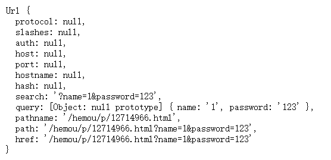
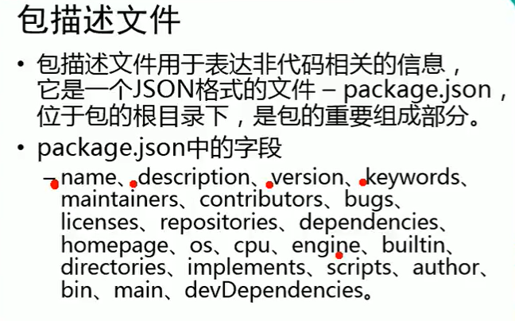

# Node.js

# 一、入门程序

## 1、解析执行JavaScript

新建文本，代码内容如下

```js
var foo = 'bar'
console.log(foo)
```

保存为`demo1.js`或其他，在当前路径打开命令行

并输入命令 `node .\demo1.js`

**注意**：文件名不能是`node.js`

## 2、读取、写文件

写文件

```js
var fs = require('fs')

fs.writeFile('./data/hello.md', '# 大家哈，我是渣渣辉！', function(error){
    console.log(error);
})
```

读取文件

```js
var fs = require('fs')

fs.readFile('./data/hello.md', function(error, data){
    if(!error){
        console.log(data.toString());
    }else{
        console.log(error);
    }
})
```

## 3、简单http服务

```js
var http = require('http')

var server = http.createServer();

server.on('request', function(req, resp){
    console.log('hello! I am server!');
    console.log('请求路径', req.url);

    //write可以有多次，但最后一定要用end结束相应，否则浏览器会一直等待
    resp.write('hello ')
    resp.write('node.js')

    resp.end()
})

server.listen(80, function(){
    console.log('服务已启动！');
})
```

## 4、模块

### 1.引入模块

**require 方法的作用**

+ 加载文件模块并执行里面的代码
+ 拿到被加载文件模块导出的接口对象
  + 每个文件模块都提供了一个对象：`exports`，它默认是一个空对象
+ 引入相对路径模块时，`./`必不可少

### 2.核心模块

- 操作文件`fs`
- http服务构建`http`
- path路径操作模块`path` 
- `url`路劲操作模块
- `os`操作系统信息模块

#### 1）文件模块

+ writeFile(dir ,  [content] , function(err){} )
+ readFile(dir , function(err, data ){} )
+ readdir(dir,  function(err, files ){} )

#### 2）路径操作模块

> 参考文档：https://nodejs.org/docs/latest-v13.x/api/path.html

- path.basename：获取路径的文件名，默认包含扩展名
- path.dirname：获取路径中的目录部分
- path.extname：获取一个路径中的扩展名部分
- path.parse：把路径转换为对象
  - root：根路径
  - dir：目录
  - base：包含后缀名的文件名
  - ext：后缀名
  - name：不包含后缀名的文件名
- path.join：拼接路径
- path.isAbsolute：判断一个路径是否为绝对路径

## 4、拓展

### 1.模板引擎 art-template

**核心方法**

```js
// 基于模板名渲染模板
template(filename, data);

// 将模板源代码编译成函数
template.compile(source, options);

// 将模板源代码编译成函数并立刻执行
template.render(source, data, options);
```

模板引擎render方法中data参数必须是字符串类型

2）

### 2.服务端渲染和客户端渲染

客户端渲染不利于SEO搜索引擎优化

服务端渲染是可以被爬虫抓取到的，客户端异步渲染是很难被爬虫抓取到的

真正的网站既不是纯异步也不是纯服务端渲染出来的而是两者结合来做的

例如京东的商品列表就采用的是服务端渲染，目的了为了SEO搜索引擎优化

### 3.url核心模块

```js
var http = require('http');
var url = require('url');
var util = require('util');
 
http.createServer(function(req, res){
    res.writeHead(200, {'Content-Type': 'text/plain; charset=utf-8'});
    res.end(util.inspect(url.parse(req.url, true)));
}).listen(3000);
```



### 4.代码风格问题

当采用了无分号的代码风格时，需要注意：

当一行代码是以`(`、`[`、\`开头时，则需要再前面补上一个`；`

### 5.301和302的区别

301：永久性跳转，他会从缓存中查询，而不是发送请求

302：临时性跳转

# 二、模块系统

## 1、CommonJs模块规范

在Node中的JavaScript还有一个很重要的概念：模块系统。

+ 模块作用域
+ 使用require方法用来加载模块
+ 使用exports接口对象用来导出模块中的成员

## 2、加载 `require`

语法：

```js
var [自定义变量名称] = require('[模块]')
```

两个作用：

+ 执行被加载模块中的代码
+ 得到被加载模块中的`exports`导出接口对象

## 3、导出`exports`

+ ==Node中是模块作用域，默认文件中所有的成员只在当前文件模块有效==
+ 对于希望可以被其它模块访问的成员，我们就需要把这些公开的成员都挂载到exports接口对象中就可以了导出多个成员（必须在对象中）：

**导出多个成员（必须在对象中）**

```js
exports.a = 123
exports.b = 'hello'
exports.c = function(){
    console.log('cc')
}
```

**导出单个对象**

```js
str = 'hello'

module.exports = str
```

注意导出单个对象时，后导出的会覆盖前面导出的

==注意==

在node内部`exports`和`module.exports`存在着下面的关系

```js
exports = module.exports
```

所以说，想要导出单个对象时，必须使用`module.exports`

### 原理

创建一个文件moudel.js，内容如下

```js
console.log(arguments.callee + '')
```

控制台会输出

```js
function (exports, require, module, __filename, __dirname) {
console.log(arguments.callee + '')
}
```

所以模块中的代码实际上时包装在一个函数中执行的，并且在函数执行时，同事传递了5个实参

+ exports：用来将变量或函数暴露到外部
+ require：用来引入外部的模块
+ module： exports = module.exports
+ __filename：当前模块文件完整路径
+ __dirname：当前模块文件所在文件夹的名字

==而我们通过 require 加载模块的时候返回的就是 export 对象==

## 4、模块加载规则

+ 核心模块：模块名
+ 第三方模块：模块名
+ 用户自定义的模块：路径
+ 优先从缓存中加载：require加载模块时会先放到缓存中，然后将其引用赋给相关变量
+ 判断模块标识：
  + 核心模块
  + 第三方模块：既不是核心模块、也不是路径
    + 先找到当前文件所处目录中的`node_modules`目录
    + 找到`node_modules/[模块名]/package.js`文件夹
      + 找到`package.js`中的`main`属性
      + `main`属性中记录了模块的入口模块
    + 若没有找到`package.js`或着`package.js`中没有`main`属性，则直接加载`index.js`
    + 若任没有`index.js`，则返回上一级目录，并执行相同的规则，若还找不到则继续上上一级查找
    + 直到当前磁盘根目录还没找到，则报错`can not find module xxx`
  + 自定义模块：`./`、`../`、`/`，`.js`后缀可以省略

**模块查找机制**

+ 优先从缓存中加载
+ 核心模块
+ 路劲形式的文件模块
+ 第三方模块

## 5、package.json和package-lock.json

**package.json**

+ 建议每个项目都要有个`package.json`
+ 可以通过`npm init`或`npm init -y`来生成`package.json`文件
+ 执行`npm install [包名]`的时候建议加上`--save`参数，他会保存依赖信息
+ 当`node_module`不存在时，执行`npm install`会自动下载`package.json`中的所有依赖

**package.-lock.json**

npm 5以前是不会有`package-lock.json`这个文件

npm5以后才加入这个文件

当你安装包的时候，npm都会生成或者更新`package-lock.json`这个文件

- npm5以后的版本安装都不要加`--save`参数，它会自动保存依赖信息
- 当你安装包的时候，会自动创建或者更新`package-lock.json`文件
- `package-lock.json`这个文件会包含`node_modules`中所有包的信息（版本，下载地址等）
  - 这样的话重新`npm install`的时候速度就可以提升
- 从文件来看，有一个`lock`称之为锁
  - 这个`lock`使用来锁版本的
  - 如果项目依赖了`1.1.1`版本
  - 如果你重新install其实会下载最细版本，而不是`1.1.1`
  - `package-lock.json`的另外一个作用就是锁定版本号，防止自动升级

## 6、\__dirname和__filename

在每个模块中，除了`require`,`exports`等模块相关的API之外，还有两个特殊的成员：

- `__dirname`，是一个成员，可以用来**动态**获取当前文件模块所属目录的绝对路径

- `__filename`，可以用来**动态**获取当前文件的绝对路径（包含文件名）

- `__dirname`和`__filename`是不受执行node命令所属路径影响的

在文件操作中，使用相对路径是不可靠的，因为node中文件操作的路径被设计为相对于执行node命令所处的路径。

所以为了解决这个问题，只需要把相对路径变为绝对路径（绝对路径不受任何影响）就可以了。

就可以使用`__dirname`或者`__filename`来帮助我们解决这个问题

在拼接路径的过程中，为了避免手动拼接带来的一些低级错误，推荐使用`path.join()`来辅助拼接

```javascript
var fs = require('fs');
var path = require('path');

// console.log(__dirname + 'a.txt');
// path.join方法会将文件操作中的相对路径都统一的转为动态的绝对路径
fs.readFile(path.join(__dirname + '/a.txt'),'utf8',function(err,data){
	if(err){
		throw err
	}
	console.log(data);
});
```

> 补充：模块中的路径标识和这里的路径没关系，不受影响（就是相对于文件模块）

**注意：**

**模块中的路径标识和文件操作中的相对路径标识不一致**

**==模块中的路径标识就是相对于当前文件模块，不受node命令所处路径影响==**


## 7、npm

### 1.npm网站

> npmjs.com

### 2.npm命令行工具

只要安装了node就已经安装了npm

查看版本

```cmd
npm --version
```

升级npm

```cmd
npm install --global npm
```

### 3.常用命令

+ npm init
  + npm init -y 可以跳过向导，快速生成
+ npm install
  + 一次性把dependencies选项中的所以依赖安装
  + npm i
+ npm install 包名
  + npm i 包名
  + npm i 包名 --no-save
+ npm install --save 包名
  + 下载并且保存依赖至package.json中
  + npm -i -S 包名
+ npm uninstall 包名
  + npm un 包名
  + npm un 包名 --no-save
+ npm uninstall --save 包名
  + 删除的同时把依赖从package.json中去除
  + npm un -S 包名
+ npm --help
  + 查看帮助
+ npm 命令 --help
  + 查看指定命令帮助

### 4.解决npm被墙

npm存储包文件的服务器在国外，有时候会被墙，速度很慢，所以我们需要解决这个问题。

http://npm.taobao.org/淘宝的开发团队把npm在国内做了一个备份。

安装淘宝的cnpm：

```c
npm install --global cnpm
```

接下来你安装包的时候把之前的[npm]替换成[cnpm]

举个例子：

```shell
#还是使用国外的服务器
npm install jquery

#走国内的淘宝的服务器
cnpm install jquery
```

如果不想安装cnpm又想使用淘宝服务器来下载

```shell
npm install jquery --registry=https://registry.npm.taobao.org
```

但是每一次手动这样加参数很麻烦，所我们可以把这个选项加入配置文件中：

```shell
npm config set registry https://registry.npm.taobao.org

#查看npm配置信息
npm config list
```

只要配置了上面的命令，以后都会从淘宝服务器下载



# 三、Express

## 1、入门程序

```js
//引包
var express = require('express')

//创建服务器应用程序
//和以前的http.createServer一样
var app = express()

//指定公开目录
app.use('/static/', express.static('./public/'))

app.get('/', function(req, resp){
    resp.send('hello express!无情')
})

app.get('/about', function(req, resp){
    resp.send('hello，我是express！')
})

app.listen(80, function(){
    console.log('running...')
})
```

## 2、nodemon自动重启服务

安装nodemon

```
npm install --global nodemon
```

## 3、简单案例

### 1.静态资源

```js
app.use(express.static('public'))
app.use('/static', express.static('public'))
```


### 2.配置art-template模板引擎

#### 1）简单使用

**安装**

```shell
npm i --S art-template express-art-template
```

**配置**

```js
app.engine('art', require('express-art-template'))
```

配置使用art-template 模板引擎

==第一个参数，表示当渲染以**.art**结尾的文件的时候，使用**art-template**模板引擎==

express-art-template 是专门用来在Express中把art-template整合到Express中

虽然外面这里不需要加载 `art-template`但是也必须安装原因就在于express-art-template依赖了art-template

**渲染**

Express为Response相应对象提供了一个方法：`render`

`render`方法默认是不可以使用，但是如果配置了模板引擎就可以使用了

```js
res.render('html模板名', {模板数据})
```

第一个参数不能写路径，默认会去项目中的`views`目录查找该模板文件

也就是说==Express有一个约定：开发人员把所有的视图文件都放到views目录中==

**修改视图文件夹**

==如果想要修改默认的`views`目录，则可以==

```js
app.set('views'， [render函数的默认路径])
```

#### 2）子模版和模板的继承

**模板页**

```html
<!DOCTYPE html>
<html lang="zh">
<head>
	<meta charset="UTF-8">
	<meta name="viewport" content="width=device-width, initial-scale=1.0">
	<meta http-equiv="X-UA-Compatible" content="ie=edge">
	<title>模板页</title>
	<link rel="stylesheet" href="/node_modules/bootstrap/dist/css/bootstrap.css"/>
	{{ block 'head' }}{{ /block }}
</head>
<body>
	<!-- 通过include导入公共部分 -->
	{{include './header.html'}}

	<!-- 留一个位置 让别的内容去填充 -->
	{{ block  'content' }}
		<h1>默认内容</h1>
	{{ /block }}
	
	<!-- 通过include导入公共部分 -->
	{{include './footer.html'}}
	
	<!-- 公共样式 -->
	<script src="/node_modules/jquery/dist/jquery.js" ></script>
	<script src="/node_modules/bootstrap/dist/js/bootstrap.js" ></script>
	{{ block 'script' }}{{ /block }}
</body>
</html>
```

**使用**

```html
<!-- 继承(extend:延伸，扩展)模板也layout.html -->
<!-- 把layout.html页面的内容都拿进来作为index.html页面的内容 -->
{{extend './layout.html'}}

<!-- 向模板页面填充新的数据 -->
<!-- 填充后就会替换掉layout页面content中的数据 -->
<!-- style样式方面的内容 -->
{{ block 'head' }}
	<style type="text/css">
		body{
			background-color: skyblue;
		}
	</style>
{{ /block }}
{{ block 'content' }}
	<div id="">
		<h1>Index页面的内容</h1>
	</div>
{{ /block }}
<!-- js部分的内容 -->
{{ block 'script' }}
	<script type="text/javascript">
		
	</script>
{{ /block }}
```

### 3.获取get请求数据

Express内置了一个API，可以直接通过`req.query`来获取

```js
req.query
```

### 4.获取post请求数据

在Express中没有内置获取表单POST请求体的API，这里我们需要使用一个第三方包：`body-parser`。

**安装**

```shell
npm i -S body-parser
```

**配置**

```js
//解析 application/x-www-form-urlencoded
app.use(bodyParse.urlencoded({extended: false}))
//解析 application/json
app.use(bodyParse.json())
```

只要加入这个配置，则在req 请求对象上会多出来一个属性`body`

也就是说你就可以直接通过`req.body`来获取表单POST 请求体数据了	

==注意：此配置一定要在注册路由之前==

### 5.配置session

安装：

```javascript
npm install express-session
```

配置：

```javascript
//该插件会为req请求对象添加一个成员:req.session默认是一个对象
//这是最简单的配置方式
//Session是基于Cookie实现的
app.use(session({
  //配置加密字符串，他会在原有的基础上和字符串拼接起来去加密
  //目的是为了增加安全性，防止客户端恶意伪造
  secret: 'keyboard cat',
  resave: false,
  saveUninitialized: true,//无论是否适用Session，都默认直接分配一把钥匙
  cookie: { secure: true }
}))
```

### 6.案例代码

```js
const express = require('express')
const moment = require('moment')
const bodyParser = require('body-parser')

const app = express()

// 静态资源目录
app.use('/js', express.static('node_modules/jquery/dist'))
app.use(express.static('node_modules/bootstrap/dist'))

// 配置body-parser中间件
app.use(bodyParser.urlencoded({extended: false}))
app.use(bodyParser.json())

app.engine('art', require('express-art-template'))

var messages = [
    {name: '李四', msg: '老王快交电费'}
]

app.get('/', function(req, resp){
    resp.render('index.art', {
        comments: messages
    })
})

app.get('/remark', function(req, resp){
    resp.render('remark.art')
})

app.post('/addComment', function(req, resp){
    var comment = req.body
    comment.dateTime = moment(new Date()).format('YYYY-MM-DD HH:mm:ss')
    messages.unshift(comment)
    resp.redirect('/')
})

app.listen(80, function(){
    console.log('running...')
})
```

# 四、CRUD文件存储方式

## 1、设计路由

| 请求方法 | 请求路径         | get参数 | post参数 | 描述             |
| -------- | ---------------- | ------- | -------- | ---------------- |
| GET      | /students        |         |          | 渲染开始页面     |
| GET      | /students/new    |         |          | 渲染添加学生界面 |
| POST     | /students/new    |         |          | 处理添加学生请求 |
| GET      | /students/edit   | id      |          | 渲染编辑页面     |
| POST     | /students/edit   |         |          | 处理编辑请求     |
| GET      | /students/delete | id      |          | 处理删除请求     |

## 2、路由模块的提取

**常规思路**

在router.js编写一个函数，把express的对象app作为参数传递过去

然后再函数中编写路由

**Express提供的方式**

router.js

```js
var express = require('express')
var router = express.Router()

router.get('/students', function(req, resp){

})

module.exports = router
```

app.js

```js
const express = require('express')
const bodyParser = require('body-parser')
const router = require('./router')

const app = express()

// 静态资源目录
app.use('/js', express.static('node_modules/jquery/dist'))
app.use(express.static('node_modules/bootstrap/dist'))

// 配置body-parser中间件
app.use(bodyParser.urlencoded({extended: false}))
app.use(bodyParser.json())

app.engine('html', require('express-art-template'))

// 在这里使用router编写的路由模块
app.use(router)

app.listen(80, function(){
    console.log('running...')
})
```

# 五、MongoDB

## 1、关系型和非关系型数据库

### 1.关系型数据库

> 表就是关系，或者说表与表之间存在关系

- 所有的关系型数据库都需要通过`sql`语言来操作
- 所有的关系型数据库在操作之前都需要设计表结构
- 而且数据表还支持约束
  - 唯一的
  - 主键
  - 默认值
  - 非空

### 2.非关系型数据库

- 非关系型数据库非常的灵活
- 有的关系型数据库就是key-value对儿
- 但MongDB是长得最像关系型数据库的非关系型数据库
  - 数据库 -> 数据库
  - 数据表 -> 集合（数组）
  - 表记录 ->文档对象

一个数据库中可以有多个数据库，一个数据库中可以有多个集合（数组），一个集合中可以有多个文档（表记录）

```json
{
    qq:{
       user:[
           {},{},{}...
       ]
    }
}
```

- 也就是说你可以任意的往里面存数据，没有结构性这么一说

## 2、基本概念

+ 可以有多个数据库
+ 一个数据库中可以有多个集合（表）
+ 一个表中可以有多个文档（表记录）

```json
{
	qq:{
        users: [
            {name: '张三', age: 18},
            {name: '李四', age: 18},
            {name: '王五', age: 18},
			...
        ],
        ...
    },
	taobao: {
        
    },
    jindong:{
        
    },
    ...
}
```


## 3、基本操作

### 1.启动和关闭数据库

**启动：**

```shell
# mongodb 黑默认使用执行mongod命令所处盘符根目录下的/data/db作为自己的数据存储目录
# 所以在第一次执行该命令之前先自己手动新建一个/data/db
mongod
```

如果想要修改默认的数据存储目录，可以：

```shell
mongod --dbpath=数据存储目录路径
```

**停止**

在控制台中按下`ctrl+c`或者直接关闭控制台

### 2.连接数据库

**连接**

```shell
# 该命令默认连接本地mongod
mongod
```

**退出**

```shell
# 在状态输入
exit
```

### 3.基本命令

+ `show dbs`
  + 查看显示所有的数据库
+ `use [数据库名称]`
  + 切换到指定的数据库（如果没有就会新建）
+ `db`
  + 查看当前操作的数据库
+ 插入数据
  + db.user.insertOne({"name":"hemou"})
+ 查询数据
  + db.user.find()
  + show collections 查看所有集合

## 4、Node中操作Mongodb数据库

### 1.官方提供的`mongodb`包

网址：https://github.com/mongodb/node-mongodb-native

### 2.第三方`mogoose`包

第三方包：mongoose 基于MongoDB官方的mongodb包再一次做了封装。

**1）起步**

安装

```shell
npm i mongoose
```

hello world

```js
const mongoose = require('mongoose');
mongoose.connect('mongodb://localhost/test', {useNewUrlParser:true});

const Cat = mongoose.model('Cat', { name: String });

const kitty = new Cat({ name: 'Zildjian' });
kitty.save().then(() => console.log('meow'));
```

## 5、Mongoose的使用

### 1.设计Schema发布模型

```js
const mongoose = require('mongoose');

const Schema = mongoose.Schema

//1.连接数据库
mongoose.connect("mongodb://localhost/forum")

//2.设计文档结构
var userSchema = new Schema({
    username: {
        type: String,
        required: true
    },
    password: {
        type: String,
        required: true
    },
    email: {
        type: String
    }
})

//3.将文档结构发布为模型
//  mongoose.model方法就是用来将一个架构发布为model
//  第一个参数：传入一个大写名词单数字符串用来表示你的数据库名称
//             mongoose会自动将大写名词的字符串生成小写复数的集合名称
//             例如这里的User最终会变为users集合名称
//  第二个参数：架构Schema
//  返回值：模型的构造函数
var User = mongoose.model('User', userSchema)
```

### 2.添加数据

```js
// 5.通过模型构造函数对User中的数据进行操作
var user = new User({
	username: 'admin',
	password: '123456',
	email: 'xiaochen@qq.com'
});

user.save(function(err, ret) {
	if (err) {
		console.log('保存失败');
	} else {
		console.log('保存成功');
		console.log(ret);
	}
});
```

### 3.删除数据

```js
User.remove({
	username: 'xiaoxiao'
}, function(err, ret) {
	if (err) {
		console.log('删除失败');
	} else {
		console.log('删除成功');
		console.log(ret);
	}
});
```

根据条件删除一个：

```javascript
Model.findOneAndRemove(conditions,[options],[callback]);
```

根据id删除一个：

```javascript
User.findByIdAndRemove(id,[options],[callback]);
```

### 4.修改数据

根据指定条件更新一个：

```javascript
User.FindOneAndUpdate([conditions],[update],[options],[callback]);
```

根据id更新一个：

```javascript
// 更新	根据id来修改表数据
User.findByIdAndUpdate('5e6c5264fada77438c45dfcd', {
	username: 'junjun'
}, function(err, ret) {
	if (err) {
		console.log('更新失败');
	} else {
		console.log('更新成功');
	}
});
```

### 5.查询数据

查询所有：

```javascript
// 查询所有
User.find(function(err,ret){
	if(err){
		console.log('查询失败');
	}else{
		console.log(ret);
	}
});
```

条件查询所有：

```javascript
// 根据条件查询
User.find({ username:'xiaoxiao' },function(err,ret){
	if(err){
		console.log('查询失败');
	}else{
		console.log(ret);
	}
});
```

条件查询单个：

```javascript
// 按照条件查询单个，查询出来的数据是一个对象（{}）
// 没有条件查询使用findOne方法，查询的是表中的第一条数据
User.findOne({
	username: 'xiaoxiao'
}, function(err, ret) {
	if (err) {
		console.log('查询失败');
	} else {
		console.log(ret);
	}
});
```

# 六、操作Mysql数据库

文档：https://www.npmjs.com/package/mysql

## 1、安装

```shell
npm install --save  mysql
```
## 2、基本使用

```javascript
// 引入mysql包
var mysql      = require('mysql');

// 创建连接
var connection = mysql.createConnection({
  host     : 'localhost',	//本机
  user     : 'me',		//账号root
  password : 'secret',	//密码12345
  database : 'my_db'	//数据库名
});

// 连接数据库	（打开冰箱门）
connection.connect();

//执行数据操作	（把大象放到冰箱）
connection.query('SELECT * FROM `users` ', function (error, results, fields) {
  if (error) throw error;//抛出异常阻止代码往下执行
  // 没有异常打印输出结果
  console.log('The solution is: ',results);
});

//关闭连接	（关闭冰箱门）
connection.end();
```

# 七、中间件

## 1、基本概念

中间件：把很复杂的事情分割成单个，然后依次有条理的执行。就是一个中间处理环节，有输入，有输出。

说的通俗易懂点儿，中间件就是一个（从请求到响应调用的方法）方法。

把数据从请求到响应分步骤来处理，每一个步骤都是一个中间处理环节。


同一个请求对象所经过的中间件都是同一个请求对象和响应对象。

```javascript
var express = require('express');
var app = express();
app.get('/abc',function(req,res,next){
	// 同一个请求的req和res是一样的，
	// 可以前面存储下面调用
	console.log('/abc');
	// req.foo = 'bar';
	req.body = {
		name:'xiaoxiao',
		age:18
	}
	next();
});
app.get('/abc',function(req,res,next){
	// console.log(req.foo);
	console.log(req.body);
	console.log('/abc');
});
app.listen(3000, function() {
	console.log('app is running at port 3000.');
});

```

## 2、中间件的分类

### 1.应用程序级别的中间件

万能匹配（不关心任何请求路径和请求方法的中间件）：

```javascript
app.use(function(req,res,next){
    console.log('Time',Date.now());
    next();
});
```

关心请求路径和请求方法的中间件：

```javascript
app.use('/a',function(req,res,next){
    console.log('Time',Date.now());
    next();
});
```

### 2.路由级别的中间件

严格匹配请求路径和请求方法的中间件

get:

```javascript
app.get('/',function(req,res){
	res.send('get');
});
```

post：

```javascript
app.post('/a',function(req,res){
	res.send('post');
});
```

put:

```javascript
app.put('/user',function(req,res){
	res.send('put');
});
```

delete:

```javascript
app.delete('/delete',function(req,res){
	res.send('delete');
});
```

## 3、错误处理中间件

```javascript
app.use(function(err,req,res,next){
    console.error(err,stack);
    res.status(500).send('Something broke');
});
```

### 1.配置使用404中间件

```javascript
app.use(function(req,res){
    res.render('404.html');
});
```

### 2.配置全局错误处理中间件

```javascript
app.get('/a', function(req, res, next) {
	fs.readFile('.a/bc', funtion() {
		if (err) {
        	// 当调用next()传参后，则直接进入到全局错误处理中间件方法中
        	// 当发生全局错误的时候，我们可以调用next传递错误对象
        	// 然后被全局错误处理中间件匹配到并进行处理
			next(err);
		}
	})
});
//全局错误处理中间件
app.use(function(err,req,res,next){
    res.status(500).json({
        err_code:500,
        message:err.message
    });
});
```

## 4、内置中间件

- express.static(提供静态文件)
  - http://expressjs.com/en/starter/static-files.html#serving-static-files-in-express

## 5、第三方中间件

> 参考文档：http://expressjs.com/en/resources/middleware.html

- body-parser
- compression
- cookie-parser
- mogran
- response-time
- server-static
- session