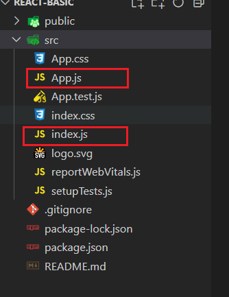

# React介绍及环境搭建

## 简介

+ React是什么
  + React由Meta公司研发，是一个用于构建Web和原生交互界面的库
+ React的优势
  + 相较于传统基于DOM开发的优势
    + 组件化的开发方式
    + 不错的性能
  + 相较于其它前端框架的优势
    + 丰富的生态
    + 跨平台支持

## 环境搭建

`create-react-app` 是一个快速创建React开发环境的工具，底层由 webpack 构建，封装了配置细节，开箱即用

执行命令：

```shell
npx create-react-app react-basic
```

1. `npx`： Node.js工具命令，查找并执行后续的包命令
2. `create-react-app`：核心包（固定写法），用于创建Reacti项目
3. `react-basic`： React项目的名称（可以自定义）

### `package.json`


### 主要文件



+ `index.js`

  ```jsx
  // 项目的入口，从这里开始运行
  
  // React 必要的两个核心包
  import React from 'react';
  import ReactDOM from 'react-dom/client';
  
  // 导入项目的根组件
  import App from './App';
  
  // 把 App 根组件渲染到 id 为 root 的 dom 节点上
  const root = ReactDOM.createRoot(document.getElementById('root'));
  root.render(
    <App />
  );
  ```

+ `App.js`

  ```jsx
  // 项目的根组件
  function App() {
    return (
      <div className="App">
        Hello World
      </div>
    );
  }
  
  export default App;
  ```

刚学时就这两个最重要，其他文件都可以删掉

