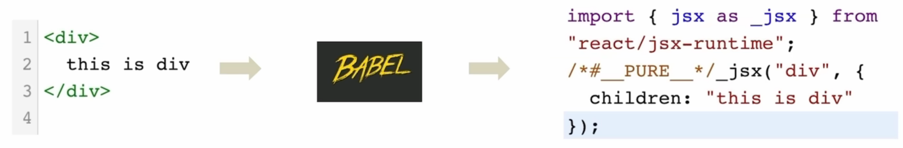

# JSX 学习

## 简介

+ 什么是 JSX
  + 概念：JSX是 JavaScript 和 XML(HTML) 的缩写，表示在 Js 代码中编写 HTML 模版结构，它是 React 中编写 UI 模版的方式
  + 优势：1）HTML的声明式模版写法；2）JS的可编程能力

+ JSX 的本质
  + JSX 并不是标准的 JS 语法，它是 JS 的语法扩展，浏览器本身不能识别，需要通过解析工具做解析之后才能在浏览器中运行
    

## 识别 JS 表达式

在 JSX 中可以通过大括号语法}识别 JavaScript 中的表达式，比如常见的变量、函数调用、方法调用等等

+ 使用引号传递字符串
+ 使用 JavaScript 变量
+ 函数调用和方法调用
+ 使用 JavaScript 对象

```jsx
const count = 100;

function getName() {
  return 'HeMOu';
}

function App() {
  return (
    <div className="App">
      Hello World <br/>
      {/* 1. 使用引号传递字符串 */}
      {'this is a string'}<br/>
      {/* 2. 使用 JavaScript 变量 */}
      {count}<br/>
      {/* 3. 函数调用和方法调用 */}
      {getName()}<br/>
      {new Date().toLocaleDateString()}<br/>
      {/* 4. 使用 JavaScript 对象 */}
      <div style={{ color: 'red' }}>使用 JavaScript 对象</div>

    </div>
  );
}

export default App;
```

***注意***：if 语句、switch 语句、变量声明属于语句，不是表达式，不能出现在 {} 中

## 实现列表渲染

```jsx
const list = [
  { id: 1001, name: 'Vue' },
  { id: 1002, name: 'React' },
  { id: 1003, name: 'Angular' },
]

function App() {
  return (
    <div className="App">
      {list.map(item => <li key={item.id}>{item.name}</li>)}
    </div>
  );
}

export default App;
```

## 条件渲染

### 基础条件渲染

在React中，可以通过逻辑与运算符 `&&`、三元表达式(`? :`)实现基础的条件渲染

```jsx
{flag &&<span>this is span</span>}
{loading ? <span>loading...</span> : <span>this is span</span>}
```

### 复杂条件渲染

```jsx
function getArticleTpl(type) {
  if (type === 0) {
    return <div>Article type 0</div>;
  } else if (type === 1) {
    return <div>Article type 1</div>;
  } else {
    return <div>Article type 2</div>;
  }
}

function App() {
  return (
    <div className="App">
      {getArticleTpl(2)}
    </div>
  );
}

export default App;
```

# React 获取 DOM

1、使用 `useRef` 创建 ref 对象，并与 JSX 绑定

```jsx
const inputRef = useRef(null)

<input type="text" ref={inputRef} />
```

2、在DOM可用时，通过inputRef..current拿到DOM对象

```js
console.log(inputRef.current)
```

