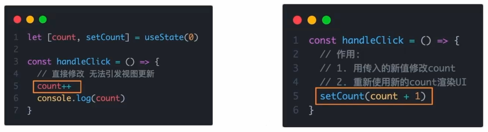
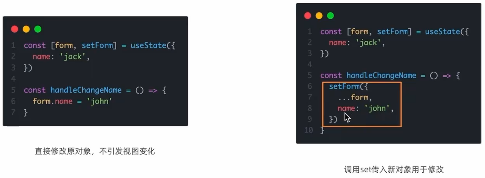
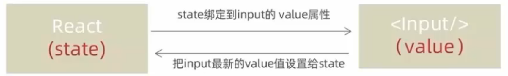

# React 状态

## `useState` 

### 基础使用

`useState` 是一个 React Hook（函数），它允许我们向组件添加一个==状态变量==，从而控制影响组件的渲染结果

本质：和普通 JS 变量不同的是，状态变量一旦发生变化组件的视图 UI 也会跟着变化（==数据驱动视图==）

```jsx
import { useState } from "react";

function App() {
  const [count, setCount] = useState(0);
  return (
    <div className="App">
      <p>You clicked {count} times.</p>
      <button onClick={() => setCount(count + 1)}>Click me</button>
    </div>
  );
}

export default App;
```

1. `useState` 是一个函数，返回值是一个数组
2. 数组中的第一个参数是状态变量，第二个参数是 set 函数用来修改状态变量
3. `useState` 的参数将作为 count 的初始值

### 修改规则

1、状态不可变

在 React 中，状态被认为是只读的，我们应该始终替换它而不是修改它，直接修改状态不能引发视图更新



2、修改对象状态

规则：对于对象类型的状态变量，应该始终传给 set 方法一个全新的对象来进行修改



## 受控表单绑定

概念：使用React组件的状态（useState）控制表单的状态



1、准备一个 React 状态值

```
const [value, setValue] = useState('')
```

2、通过的 value 属性绑定状态，通过 `onChange` 属性绑定状态同步的函数

```jsx
<input type="text" value={value} onChange={e => setValue(e.target.value)} />
```

