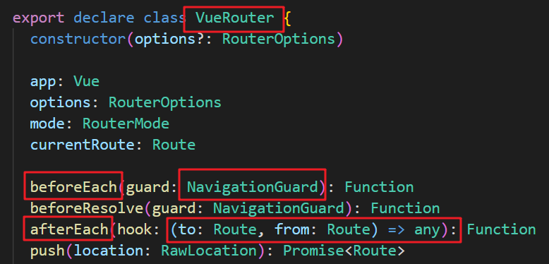
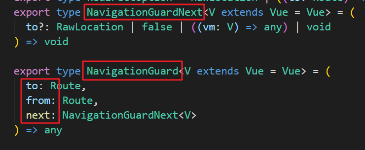

# 路由

## 浏览器的 history 模式

+ history.hash 
+ history.pushState()
+ history.replaceState()
+ history.back()
+ history.go()
+ history.forward()

## 安装和使用

### 安装依赖

```
npm i vue-router --save
```

### 使用

1. 创建文件夹 router，然后在这个文件夹中创建一个文件 index.js

2. 引入并使用组件 

   ```js
   import Vue from 'vue'
   import Router from 'vue-router'
   
   Vue.use(Router)
   ```

3. 使用 router-link 组件来导航

   ```vue
   <!-- 2. 使用 router-link 组件来导航 -->
   <router-link to="/login">登录</router-link>
   <router-link to="/register">注册</router-link>
   ```

4. 使用 router-view 组件来显示匹配到的组件

   ```vue
   <router-view></router-view>
   ```

5. 创建组件，如 login.vue 文件，里面写上需要的内容

6. 路由映射配置

   ```js
   import Vue from 'vue'
   import Router from 'vue-router'
   
   Vue.use(Router)
   
   // 创建一个路由 router 实例，通过 routers 属性来定义路由匹配规则
   const routes = [
       { path: '/login', component: login },
       { path: '/register', component: register }
   ]
   
   export default new Router({
       routes,
   	mode: 'history' // 改为history模式，默认为hash
   })
   ```

7. 使用 router 属性安装路由

   ```js
   // 6. 创建 Vue 实例，得到 ViewModel
   var vm = new Vue({
       el: '#app',
       router: router // 使用 router 属性来使用路由规则
   });
   ```

## 路由跳转

### router-link 和 高亮

```vue
<router-link active-class=“active” tag="span" to="/home" replace></router-link>
```

+ to：前往路径

+ tag：将router-line渲染成某个标签

+ ==replace==：因为默认使用的是类似 history.pushState()，加上 replace 就不能后退了

+ active-class：

  + 当 router-link 被点击时会自动添加 router-link-active 属性，可以添加 active-class 修改添加的类名

  + 若想统一点击后添加的类名，可以在创建路由时修改配置

    ```js
    new VueRouter({
    	routes,
        linkActiveClass: 'active'
    })
    ```


### 代码跳转路由

+ this.$router.push()
  + router.push({ path: '/register', query: { plan: 'private' } })

+ this.$router.replace()

## 路由参数传递

### \$router 和 $route

+ $router：代表时我们创建的 `new VueRouter` 这个对象

  ```js
  const router = new VueRouter({
    mode: 'history',
    base: process.env.BASE_URL,
    routes
  })
  ```

+ $route：代表当前被激活的路由

### param传参

我们先如此配置路由规则

```js
const router = new VueRouter({
    routes:[
        { path: '/register/:id/:name', component: register }
    ]
})
```

然后编写 router-link

```vue
<div id="app" class="container">
    <router-link to="/register/1/hemou">占位符方式：/login/1/hemou</router-link>
    <router-view></router-view>
</div>
```

这样当我们点击 router-link 时就会跳转到 register 这个组件，然后我们在 register 这个组件中使用如下方法就可以获取到 `id` 和 `name` 所代表的值了

```vue
<script>
    export default {
        data(){
            return {
                id: this.$route.params.id,
                name: this.$route.params.name
            }
        }
    }
</script>
```

### query传参

## 路由懒加载

当打包构建应用时，Javascript包会变得非常大，影响页面加载。

如果我们能把不同路由对应的组件分割成不同的代码块，然后当路由被访问的时候才加载对应组件，这样就更高效了

### 普通模式

```js
...
import Home from '../views/Home.vue'

const routes = [
  {
    path: '/',
    name: 'Home',
    component: Home
  }
]
```

在顶部直接引入，这就是普通的加载，这会将所有的路由信息全部打包在一起

### 懒加载

```js
const routes = [
  {
    path: '/about',
    name: 'About',
    component: () => import(/* webpackChunkName: "about" */ '../views/About.vue')
  }
]
```

而上面的写法，编译后会将路由代码拆分为一个单独的块（chunk），该块在访问该路由时会被延迟加载。

我们可以在这个引入模块的括号里面加上注释 `/* webpackChunkName: "xxx" */`，这样生成的块就会以（[注释名].[hash].js）方式命名

## 路由嵌套

在路由规则中定义子路由

**router/index.js**

```js
const routes = [
  {
    path: '/',
    redirect: '/home'
  },
  {
    path: '/home',
    name: 'Home',
    component: Home,
    children: [
      {
        path: 'child1',
        component: () => import('../components/child1')
      },
      {
        path: 'child2',
        component: () => import('../components/child2')
      }
    ]
  }
]
```

1、因为子路由可能有很多，所以 children 的属性是个数组

2、子路由的 `path`  开头可以不加上前缀，因为他会自动将父路由路径拼接上去

3、但是引用子路由时必须加上前缀，注意还要在子路由中加上一个 `router-view`

**home.vue**

```vue
<div>
    <router-link to="/home/child1">child1</router-link>
    <router-link to="/home/child2">child2</router-link>
    <router-view/>
</div>
```

## 路由导航守卫

### 简介

> vue-router提供的导航守卫主要用来监听监听路由的进入和离开的.
>
> vue-router提供了beforeEach和afterEach的钩子函数，它们会在路由即将改变前和改变后触发。

1、VueRouter 的 beforeEach 方法接受一个 NavigationGuard，翻译过来就是导航守卫作为参数，这个导航守卫本生就是个函数。

而afterEach方法就接受一个匿名函数





2、而函数涉及到有三个参数 `to`、`from`和 `next`

看源码可知  `to` 和 `from`这两个参数是`Route`，也就是一个路由配置项，并且这个 `next`也是一个函数

+ to: Route: 即将要进入的目标 路由对象

+ from: Route: 当前导航正要离开的路由

+ next: Function: 一定要调用该方法来 resolve 这个钩子。执行效果依赖 next 方法的调用参数。
  + ==next(): 进行管道中的下一个钩子==。如果全部钩子执行完了，则导航的状态就是 confirmed (确认的)。
  + next(false): 中断当前的导航。如果浏览器的 URL 改变了 (可能是用户手动或者浏览器后退按钮)，那么 URL 地址会重置到 from 路由对应的地址。
  + ==next('/') 或者 next({ path: '/' }): 跳转到一个不同的地址==。当前的导航被中断，然后进行一个新的导航。你可以向 next 传递任意位置对象，且允许设置诸如 `replace: true`、name: 'home' 之类的选项以及任何用在 `router-link` 的 `to` prop 或 router.push 中的选项。
  + next(error): (2.4.0+) 如果传入 next 的参数是一个 Error 实例，则导航会被终止且该错误会被传递给 router.onError() 注册过的回调。

### 使用

```js
const routes = [
    {
        path: '/home',
        name: 'Home',
        meta: {
            title: '首页'
        }
    }
]

const router = new VueRouter({
    ...,
    routes
})

router.beforeEach((to, from, next) => {
    if(to.meta && to.meta.title) document.title = to.meta.title
    next()
})
```

1. 定义路由时我们可以添加一些元数据 `meta`，比如页面的名字
2. 然后使用全局导航将页面的名字改为元数据中提供的名字

### 全局与局部导航守卫

之前通过给new出的 VueRouter 配置 beforeEach 或 afterEach 方法，这属于全局守卫，对所有的路由起效果

而我们可以进行如下配置，定义局部专享的导航守卫

```js
const router = new VueRouter({
  routes: [
    {
      path: '/foo',
      component: Foo,
      beforeEnter: (to, from, next) => {
        // ...
      }
    }
  ]
})
```

## kepp-alive

keep-alive是Vue内置的一个组件，可以使**被包含的组件**保留状态，或**避免重新渲染**。它们有两个非常重要的属性：

+ include-字符串或正则表达，只有匹配的组件会被缓存口
+ exclude-字符串或正则表达式，任何匹配的组件都不会被缓存

```vue
<keep-alive include="Home,Profile">
    <router-view />
</keep-alive>
```

上面代码就表示缓存 `Home`和 `Profile`组件，这个名字来自于 每个 `.Vue`文件的 name 属性，注意==多个组件不能加空格==

router-view 也是一个组件，如果直接被包在keep-alive里面，所有路径匹配到的视图组件都会被缓存

再介绍两个函数，他们的使用与created等函数类似，这两个函数只有被`keep-alive`保持住状态后才能被使用

+ activated：当前路由处于活跃状态时调用
+ destroyed：当前路由离开活跃状态时调用

