[toc]

# Vue.js笔记

# 一、基础

## 什么是Vue.js

+ Vue.js 是目前**最火**的一个前端框架，React是**最流行**的一个前端框架（React除了开发网站，还可以开发手机App，Vue语法也是可以用于进行手机App开发的，需要借助于Weex）
+ Vuejs是前端的**主流框架之一**，和Angularjs、Reactjs一起，并成为前端三大主流框架！
+ Vuejs 是一套构建用户界面的框架，**只关注视图层**，它不仅易于上手，还便于与第三方库或既有项目整合。（Vue有配套的第三方类库，可以整合起来做大型项目的开发）
+ 前端的主要工作？主要负责MVC中的V这一层；主要工作就是和界面打交道；

## 为什么要学习流行框架

+ 企业为了提高开发效率：在企业中，时间就是效率，效率就是金钱；
+ 提高开发效率的发展历程：原生JS->Jquery之类的类库->前端模板引擎->Angular.js/Vue.js在Vue中，一个核心的概念，就是让用户不再操作DOM元素，解放了用户的双手，让程序员可以更多的时间去关注业务逻辑；
+ 增强自己就业时候的竞争力
  + 人无我有，人有我优

## 框架和库的区别

+ 框架：是一套完整的解决方案；对项目的侵入性较大，项目如果需要更换框架，则需要重新架构整个项目。
  + node 中的express；
+ 库（插件）：提供某一个小功能，对项目的侵入性较小，如果某个库无法完成某些需求，可以很容易切换到其它库实现需求。

## Node（后端）中的MVC与前端中的MVVM之间的区别

+ MVC是后端的分层开发概念；
+ MVVM是前端视图层的概念，主要关注于视图层分离，也就是说：MVVM把前端的视图层，分为了三部分Model，View，VM（ViewModel）
+ 为什么有了MVC还要有MVVM

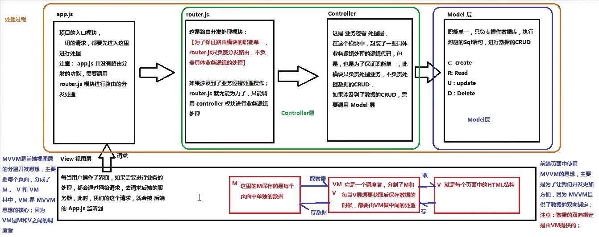

# 二、基础

## 1、模板语法

### 插值

#### 插值表达式

数据绑定最常见的形式就是使用 {{...}}（双大括号）的文本插值：

```html
<div id="app">   
	<p>{{ message }}</p> 
</div>
```

#### 闪烁（v-cloak）

**{{ }} 会产生闪烁**，当网速较慢的时候，双花括号还没有解析，就被渲染到浏览器上去了，这时需要给标签加一个 v-cloak 属性，然后再定义一个css样式，给 v-cloak 设置display为none，例如：

```html
<style type="text/css">
    [v-cloak]{
    	display: none;
    }
</style>
<p v-cloak>{{ msg }}</p>
```

#### 文本（v-text）

```html
<div id="app">
    <div v-text="message"></div>
</div>
    
<script>
new Vue({
  el: '#app',
  data: {
    message: '<h1>菜鸟教程</h1>'
  }
})
</script>
```

默认v-text是没有表达式闪烁的问题

v-text会覆盖元素中原本的内容，但是插值表达式只会替换自己的这个占位符，不会把整个元素清空

#### Html（v-html）

双大括号和`v-text`会将数据解释为普通文本，而非 HTML 代码。为了输出真正的 HTML，需要使用`v-html`

```html
<div id="app">
    <div v-html="message"></div>
</div>
    
<script>
new Vue({
  el: '#app',
  data: {
    message: '<h1>Vue.js</h1>'
  }
})
</script>
```

#### 属性（v-bind）

Mustache (双大括号)语法不能作用在 HTML attribute 上，遇到这种情况应该使用 [`v-bind` 指令](https://cn.vuejs.org/v2/api/#v-bind)：

以下实例判断 class1 的值

```html
<div id="app">
  <label for="r1">修改颜色</label><input type="checkbox" v-model="use" id="r1">
  <br><br>
  <div v-bind:class="{'class1': use}">
    v-bind:class 指令
  </div>
</div>
    
<script>
new Vue({
    el: '#app',
  data:{
      use: false
  }
});
</script>
```

#### JavaScript 

Vue.js 都提供了完全的 JavaScript 表达式支持。

```html
<div id="app">
    {{5+5}}<br>
    {{ ok ? 'YES' : 'NO' }}<br>
    {{ message.split('').reverse().join('') }}
    <div v-bind:id="'list-' + id">菜鸟教程</div>
</div>
    
<script>
new Vue({
  el: '#app',
  data: {
    ok: true,
    message: 'RUNOOB',
    id : 1
  }
})
</script>
```

### 指令

指令是带有 v- 前缀的特殊属性。

指令 attribute 的值预期是**单个 JavaScript 表达式** （`v-for` 是例外情况）

指令的职责是，当表达式的值改变时，将其产生的连带影响，响应式地作用于 DOM。

#### 参数

一些指令能够接收一个“参数”，在指令名称之后以冒号表示。例如，`v-bind` 指令可以用于响应式地更新 HTML attribute：

```html
<div id="app">
    <pre><a v-bind:href="url">Vue.js</a></pre>
</div>
```

在这里 `href` 是参数，告知 `v-bind` 指令将该元素的 `href` attribute 与表达式 `url` 的值绑定。

另一个例子是 `v-on` 指令，它用于监听 DOM 事件：

```php+HTML
<a v-on:click="doSomething">
```

在这里参数是监听的事件名。

#### 修饰符

修饰符是以半角句号 **.** 指明的特殊后缀，用于指出一个指令应该以特殊方式绑定。例如，**.prevent** 修饰符告诉 **v-on** 指令对于触发的事件调用 **event.preventDefault()**：

```html
<form v-on:submit.prevent="onSubmit"></form>
```

### 缩写

#### v-bind缩写

Vue.js 为两个最为常用的指令提供了特别的缩写：

```html
<!-- 完整语法 -->
<a v-bind:href="url"></a>
<!-- 缩写 -->
<a :href="url"></a>
```

#### v-on缩写

```html
<!-- 完整语法 -->
<a v-on:click="doSomething"></a>
<!-- 缩写 -->
<a @click="doSomething"></a>
```

## 2、表单输入绑定

### v-bind的缺点

v-bind只能实现数据的单项绑定，从M自动绑定到V，无法实现数据的双向绑定

### 双向数据绑定（v-model）

在 input 输入框中我们可以使用 v-model 指令来实现双向数据绑定：

`v-model` 会忽略所有表单元素的 `value`、`checked`、`selected` attribute 的初始值而总是将 Vue 实例的数据作为数据来源。

`v-model` 在内部为不同的输入元素使用不同的 property 并抛出不同的事件：

- text 和 textarea 元素使用 `value` property 和 `input` 事件；
- checkbox 和 radio 使用 `checked` property 和 `change` 事件；
- select 字段将 `value` 作为 prop 并将 `change` 作为事件。

```html
<div id="app">
    <p>{{ message }}</p>
    <input v-model="message">
</div>
    
<script>
new Vue({
  el: '#app',
  data: {
    message: 'Runoob!'
  }
})
</script>
```

v-model**只能运用在表单元素**，**v-model** 指令用来在 input、select、textarea、checkbox、radio 等表单控件元素上创建双向数据绑定，根据表单上的值，自动更新绑定的元素的值。

## 3、样式绑定

操作元素的 class 列表和内联样式是数据绑定的一个常见需求。

因为它们都是 attribute，所以我们可以用 `v-bind` 处理它们：只需要通过表达式计算出字符串结果即可。

不过，字符串拼接麻烦且易错。因此，在将 `v-bind` 用于 `class` 和 `style` 时，Vue.js 做了专门的增强。

表达式结果的类型除了字符串之外，还可以是对象或数组。

### class属性绑定

#### 对象语法

我们可以为 v-bind:class 设置一个对象，从而动态的切换 class:

**实例 1**

```html
<div v-bind:class="{ active: isActive }"></div>
```

上面的语法表示 `active` 这个 class 存在与否将取决于数据 property `isActive` 的 `truthiness`

**实例 2**

你可以在对象中传入更多字段来动态切换多个 class。此外，`v-bind:class` 指令也可以与普通的 class attribute 共存。当有如下模板：

```html
<div
  class="static"
  v-bind:class="{ active: isActive, 'text-danger': hasError }"></div>
```

和如下 data：

```js
data: {
  isActive: true,
  hasError: false
}
```

结果渲染为：

```html
<div class="static active"></div>
```

当 `isActive` 或者 `hasError` 变化时，class 列表将相应地更新。例如，如果 `hasError` 的值为 `true`，class 列表将变为 `"static active text-danger"`。

**实例3**

绑定的数据对象不必内联定义在模板里：

```html
<div v-bind:class="classObject"></div>
<script> 
    data: {
      classObject: {
        active: true,
        'text-danger': false
      }
    }
</script>
```

渲染的结果和上面一样。我们也可以在这里绑定一个返回对象的[计算属性](https://cn.vuejs.org/v2/guide/computed.html)。这是一个常用且强大的模式：

```html
<div v-bind:class="classObject"></div>
<script> 
    data: {
      isActive: true,
      error: null
    },
    computed: {
      classObject: function () {
        return {
          active: this.isActive && !this.error,
          'text-danger': this.error && this.error.type === 'fatal'
        }
      }
    }
</script>

```

#### 数组语法

**实例1**

我们可以把一个数组传给 `v-bind:class`，以应用一个 class 列表：

```html
<div v-bind:class="[activeClass, errorClass]"></div>
```

```js
data: {
  activeClass: 'active',
  errorClass: 'text-danger'
}
```

渲染为：

```html
<div class="active text-danger"></div>
```

**实例2**

如果你也想根据条件切换列表中的 class，可以用三元表达式：

```html
<div v-bind:class="[isActive ? activeClass : '', errorClass]"></div>
```

这样写将始终添加 `errorClass`，但是只有在 `isActive` 是 truthy[[1\]](https://cn.vuejs.org/v2/guide/class-and-style.html#footnote-1) 时才添加 `activeClass`。

不过，当有多个条件 class 时这样写有些繁琐。所以在数组语法中也可以使用对象语法：

```html
<div v-bind:class="[{ active: isActive }, errorClass]"></div>
```

### style内联样式绑定

#### 对象语法

**实例1**

`v-bind:style` 的对象语法十分直观——看着非常像 CSS，但其实是一个 JavaScript 对象。CSS property 名可以用驼峰式 (camelCase) 或短横线分隔 (kebab-case，记得用引号括起来) 来命名：

```html
<div v-bind:style="{ color: activeColor, fontSize: fontSize + 'px' }"></div>
```

```js
data: {
  activeColor: 'red',
  fontSize: 30
}
```

**实例2**

直接绑定到一个样式对象通常更好，这会让模板更清晰：

```html
<div v-bind:style="styleObject"></div>
```

```js
data: {
  styleObject: {
    color: 'red',
    fontSize: '13px'
  }
}
```

同样的，对象语法常常结合返回对象的计算属性使用。


#### 数组语法

`v-bind:style` 的数组语法可以将多个样式对象应用到同一个元素上：

**实例1**

```html
<div id="app">
    <div v-bind:style="[baseStyles, overridingStyles]">Vue.js</div>
</div>
<script>
    new Vue({
        el: '#app',
        data: {
            message: '',
            classObj: {blue: true},
            baseStyles: {'font-size': '20px'},
            overridingStyles: {color: 'red'}
        }
</script>
```

**实例2**

```html
<div v-bind:style="[baseStyles, overridingStyles]"></div>
```

## 4、条件渲染

### v-if

`v-if` 指令用于条件性地渲染一块内容。这块内容只会在指令的表达式返回 truthy 值的时候被渲染。

```html
<h1 v-if="awesome">Vue is awesome!</h1>
```

#### v-else

你可以使用 `v-else` 指令来表示 `v-if` 的“else 块”：

```html
<div v-if="Math.random() > 0.5">
  Now you see me
</div>
<div v-else>
  Now you don't
</div>
```

`v-else` 元素必须紧跟在带 `v-if` 或者 `v-else-if` 的元素的后面，否则它将不会被识别。

#### v-else-if

`v-else-if`，顾名思义，充当 `v-if` 的“else-if 块”，可以连续使用：

```html
<div v-if="type === 'A'">
  A
</div>
<div v-else-if="type === 'B'">
  B
</div>
<div v-else-if="type === 'C'">
  C
</div>
<div v-else>
  Not A/B/C
</div>
```

类似于 `v-else`，`v-else-if` 也必须紧跟在带 `v-if` 或者 `v-else-if` 的元素之后。

### v-show

另一个用于根据条件展示元素的选项是 `v-show` 指令。用法大致一样：

```html
<h1 v-show="ok">Hello!</h1>
```

不同的是带有 `v-show` 的元素始终会被渲染并保留在 DOM 中。`v-show` 只是简单地切换元素的 CSS property `display`。

### v-if 与 v-show

v-if的特点：每次都会**重新删除或创建元素**，**有较高**的**切换性能消耗**

v-show的特点：每次不会重新进行Dow的删除和创建操作，只是**切换了元素的 display:none样式**，有较高的初始渲染消耗

如果元素涉及到频繁的切换，最好不要使用v-if

### v-if 与v-for 一起使用

**不推荐**同时使用 `v-if` 和 `v-for`

当 `v-if` 与 `v-for` 一起使用时，`v-for` 具有比 `v-if` 更高的优先级


## 5、列表渲染

### v-for迭代数组

循环使用 v-for 指令。

v-for 指令需要以 **site in sites** 形式的特殊语法， sites 是源数据数组并且 site 是数组元素迭代的别名。

v-for 可以绑定数据到数组来渲染一个列表：

```HTML
<div id="app">
  <ol>
    <li v-for="site in sites">
      {{ site.name }}
    </li>
  </ol>
</div>
 
<script>
new Vue({
  el: '#app',
  data: {
    sites: [
      { name: 'Runoob' },
      { name: 'Google' },
      { name: 'Taobao' }
    ]
  }
})
</script>
```

```html
<div v-for="(item, i) in list">索引值：{{i}}——>项：{{item}}</div>
<script>
    new Vue({
        el: '#app',
        data: {
        list: [123, 234, 345, 678, 890],
    }
</script>
```

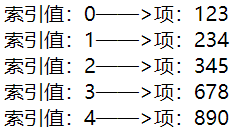

### v-for 迭代对象

你也可以用 `v-for` 来遍历一个对象的 property。

```html
<ul id="v-for-object" class="demo">
  <li v-for="value in object">
    {{ value }}
  </li>
</ul>
```

```js
new Vue({
  el: '#v-for-object',
  data: {
    object: {
      title: 'How to do lists in Vue',
      author: 'Jane Doe',
      publishedAt: '2016-04-10'
    }
  }
})
```

结果：

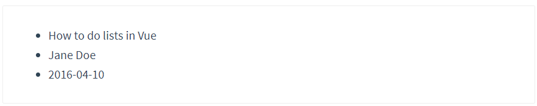

### v-for 迭代整数

v-for 也可以循环整数，且值从1开始

```html
<div id="app">
  <ul>
    <li v-for="n in 10">
     {{ n }}
    </li>
  </ul>
</div>
```

### v-for注意事项

**2.2.0+的板本里，当在组件中使用 v-for时，key 现在是必须的。**

当Vue.js用v-for 正在更新已渲染过的元素列表时，它默认用“**就地复用**“策略。如果数据项的顺序被改变，Vue将**不是移动DOM元素来匹配数据项的顺序，而是简单复用此处每个元素**，并且确保它在特定素引下显示已被渲染过的每个元素。

为了给Vue一个提示，以便它能**跟踪每个节点的身份，从而重用和重新排序现有元素**，你需要为每项提供一个唯一key 属性。

```html
<div id="app">
    <div class="box">
        <input type="text" v-model="id" placeholder="id">
        <input type="text" v-model="name" placeholder="name">
        <input type="button" value="添加" @click="add">
        <p v-for="item in items">
        	<input type="checkbox">{{ item.name }}
        </p>
    </div>
</div>

<script>
var vm = new Vue({
    el: '#app',
    data: {
        id: '',
        name: '',
        items: [
            {id: '1', name: '嬴政'},
            {id: '2', name: '赵高'},
            {id: '3', name: '荀子'},
            {id: '4', name: '李斯'},
            {id: '5', name: '韩非'}
        ]
    },
    methods: {
        add(){
        	this.items.unshift({id: this.id, name: this.name})
        }
    }
})
</script>
```

在这个例子中，假设给第一个checkbox打了勾，如下

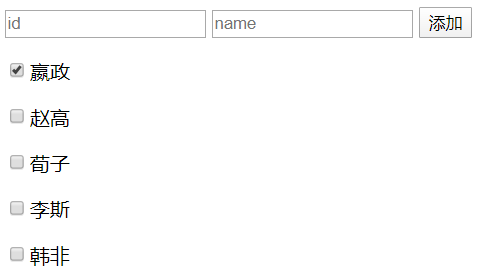

然后我们添加一个项目，则会发现勾选的项目不一致

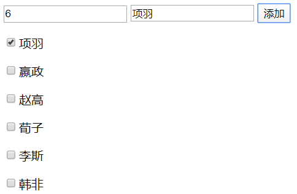

面对这种问题，W我们需要给遍历项绑定key属性，以便追踪项目

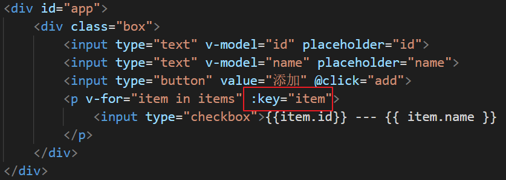

但若仅这样修改的话，将会报错

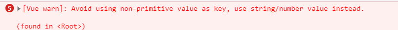

**正确做法**

```html
<div id="app">
    <div class="box">
        <input type="text" v-model="id" placeholder="id">
        <input type="text" v-model="name" placeholder="name">
        <input type="button" value="添加" @click="add">
        <p v-for="item in items" :key="item.id">
            <input type="checkbox">{{item.id}} --- {{ item.name }}
        </p>
    </div>
</div>
```

**注意：**

1.v-for循环的时候，key属性只能使用number获取string

2.key在使用的时候，必须**使用v-bind** 属性绑定的形式，指定key的值

3.在组件中，使用v-for循环的时候，或者在一些特殊情况中，如果v-for有问题，必须在使用v-for的同时，指定唯一的`字符串/数字类`型：key值

## 6、事件处理

### 事件监听

可以用 `v-on` 指令监听 DOM 事件，并在触发时运行一些 JavaScript 代码。

```html
<div id="app">
  <button v-on:click="counter += 1">增加 1</button>
  <p>这个按钮被点击了 {{ counter }} 次。</p>
</div>
 
<script>
new Vue({
  el: '#app',
  data: {
    counter: 0
  }
})
</script>
```

### 事件处理方法

然而许多事件处理逻辑会更为复杂，所以直接把 JavaScript 代码写在 `v-on` 指令中是不可行的。因此 `v-on` 还可以接收一个需要调用的方法名称。

```html
<div id="app">
   <!-- `greet` 是在下面定义的方法名 -->
  <button v-on:click="greet">Greet</button>
</div>
 
<script>
var app = new Vue({
  el: '#app',
  data: {
    name: 'Vue.js'
  },
  // 在 `methods` 对象中定义方法
  methods: {
    greet: function (event) {
      // `this` 在方法里指当前 Vue 实例
      alert('Hello ' + this.name + '!')
      // `event` 是原生 DOM 事件
      if (event) {
          alert(event.target.tagName)
      }
    }
  }
})
// 也可以用 JavaScript 直接调用方法
app.greet() // -> 'Hello Vue.js!'
</script>
```

### 内联处理器中的方法

除了直接绑定到一个方法，也可以在内联 JavaScript 语句中调用方法：

```html
<div id="example-3">
  <button v-on:click="say('hi')">Say hi</button>
  <button v-on:click="say('what')">Say what</button>
</div>
```
```js
new Vue({
  el: '#example-3',
  methods: {
    say: function (message) {
      alert(message)
    }
  }
})
```

有时也需要在内联语句处理器中访问原始的 DOM 事件。可以用特殊变量 `$event` 把它传入方法：

```html
<button v-on:click="warn('Form cannot be submitted yet.', $event)">
  Submit
</button>
```

```js
// ...
methods: {
  warn: function (message, event) {
    // 现在我们可以访问原生事件对象
    if (event) {
      event.preventDefault()
    }
    alert(message)
  }
}
```

### 事件修饰符

Vue.js 为 v-on 提供了事件修饰符来处理 DOM 事件细节，如：event.preventDefault() 或 event.stopPropagation()。

Vue.js通过由点`.`表示的指令后缀来调用修饰符。

- `.stop`：防止冒泡
- `.prevent`：阻止默认事件的发生
- `.capture`：添加事件监听器时使用事件捕获模式
- `.self`：只当事件在该元素本身触发时才触发回调
- `.once`：事件只执行一次

```html
<!-- 阻止单击事件冒泡 -->
<a v-on:click.stop="doThis"></a>

<!-- 提交事件不再重载页面 -->
<form v-on:submit.prevent="onSubmit"></form>

<!-- 修饰符可以串联  -->
<a v-on:click.stop.prevent="doThat"></a>

<!-- 只有修饰符 -->
<form v-on:submit.prevent></form>

<!-- 添加事件侦听器时使用事件捕获模式（默认是冒泡机制）采用此模式事件由外向内 -->
<div v-on:click.capture="doThis">...</div>

<!-- 只当事件在该元素本身（而不是子元素）触发时触发回调 -->
<div v-on:click.self="doThat">...</div>

<!-- click 事件只能点击一次，2.1.4版本新增 -->
<a v-on:click.once="doThis"></a>
```

### 按键修饰符

Vue 允许为 v-on 在监听键盘事件时添加按键修饰符：

```html
<!-- 只有在 keyCode 是 13 时调用 vm.submit() -->
<input v-on:keyup.13="submit">
```

#### 内置修饰符

记住所有的 keyCode 比较困难，所以 Vue 为最常用的按键提供了别名：

```html
<!-- 同上 -->
<input v-on:keyup.enter="submit">
<!-- 缩写语法 -->
<input @keyup.enter="submit">
```

全部的按键别名：

- `.enter`
- `.tab`
- `.delete` (捕获 "删除" 和 "退格" 键)
- `.esc`
- `.space`
- `.up`
- `.down`
- `.left`
- `.right`
- `.ctrl`
- `.alt`
- `.shift`
- `.meta`

实例

```html
<!-- Alt + C -->
<input @keyup.alt.67="clear">
<!-- Ctrl + Click -->
<div @click.ctrl="doSomething">Do something</div>
```

#### 自定义按键修饰符

```js
Vue.config.keycode.f2 = 113
```

## 7、计算属性和侦听器

### `watch`属性的使用

考虑一个问题：想要实现 `名` 和 `姓` 两个文本框的内容改变，则全名的文本框中的值也跟着改变；

#### 监听`data`中属性的改变

```html
<div id="app">
    <input type="text" v-model="firstName"> +
    <input type="text" v-model="lastName"> =
    <span>{{fullName}}</span>
</div>

<script>
    // 创建 Vue 实例，得到 ViewModel
    var vm = new Vue({
        el: '#app',
        data: {
            firstName: 'jack',
            lastName: 'chen',
            fullName: 'jack - chen'
        },
        methods: {},
        watch: {
            'firstName': function (newVal, oldVal) { // 第一个参数是新数据，第二个参数是旧数据
                this.fullName = newVal + ' - ' + this.lastName;
            },
            'lastName': function (newVal, oldVal) {
                this.fullName = this.firstName + ' - ' + newVal;
            }
        }
    });
</script>
```

#### 监听路由对象的改变

```html
<div id="app">
    <router-link to="/login">登录</router-link>
    <router-link to="/register">注册</router-link>

    <router-view></router-view>
</div>

<script>
    var login = Vue.extend({
        template: '<h1>登录组件</h1>'
    });

    var register = Vue.extend({
        template: '<h1>注册组件</h1>'
    });

    var router = new VueRouter({
        routes: [
            { path: "/login", component: login },
            { path: "/register", component: register }
        ]
    });

    // 创建 Vue 实例，得到 ViewModel
    var vm = new Vue({
        el: '#app',
        data: {},
        methods: {},
        router: router,
        watch: {
            '$route': function (newVal, oldVal) {
                if (newVal.path === '/login') {
                    console.log('这是登录组件');
                }
            }
        }
    });
</script>
```

#### 深度监听

```
watch: {
  ‘$store.state.orgid’() {
    ...
  },
  firstName: {
    handler(newName, oldName) {
      this.fullName = newName + ' ' + this.lastName;
    },
    // 代表在wacth里声明了firstName这个方法之后立即先去执行handler方法
    immediate: true
  }
}
```


### `computed`计算属性的使用

1. 默认只有`getter`的计算属性：

```html
<div id="app">
    <input type="text" v-model="firstName"> +
    <input type="text" v-model="lastName"> =
    <span>{{fullName}}</span>
</div>

<script>
    // 创建 Vue 实例，得到 ViewModel
    var vm = new Vue({
        el: '#app',
        data: {
            firstName: 'jack',
            lastName: 'chen'
        },
        methods: {},
        computed: { // 计算属性； 特点：当计算属性中所以来的任何一个 data 属性改变之后，都会重新触发 本计算属性 的重新计算，从而更新 fullName 的值
            fullName() {
                return this.firstName + ' - ' + this.lastName;
            }
        }
    });
</script>
```

2. 定义有`getter`和`setter`的计算属性：

```html
<div id="app">
    <input type="text" v-model="firstName">
    <input type="text" v-model="lastName">
    <!-- 点击按钮重新为 计算属性 fullName 赋值 -->
    <input type="button" value="修改fullName" @click="changeName">

    <span>{{fullName}}</span>
</div>

<script>
    // 创建 Vue 实例，得到 ViewModel
    var vm = new Vue({
        el: '#app',
        data: {
            firstName: 'jack',
            lastName: 'chen'
        },
        methods: {
            changeName() {
                this.fullName = 'TOM - chen2';
            }
        },
        computed: {
            fullName: {
                get: function () {
                    return this.firstName + ' - ' + this.lastName;
                },
                set: function (newVal) {
                    var parts = newVal.split(' - ');
                    this.firstName = parts[0];
                    this.lastName = parts[1];
                }
            }
        }
    });
</script>
```

### `watch`、`computed`和`methods`之间的对比

1. `computed`属性的结果会被缓存，除非依赖的响应式属性变化才会重新计算。主要当作属性来使用；
2. `methods`方法表示一个具体的操作，主要书写业务逻辑；
3. `watch`一个对象，键是需要观察的表达式，值是对应回调函数。主要用来监听某些特定数据的变化，从而进行某些具体的业务逻辑操作；可以看作是`computed`和`methods`的结合体；

## 8、过滤器

Vue.js 允许你自定义过滤器，被用作一些常见的文本格式化。**过滤器只能用在两个地方：插值表达式和v-bind表达式**。由"管道符"指示, 格式如下：

```html
<!-- 在两个大括号中 -->
{{ message | capitalize }}

<!-- 在 v-bind 指令中 -->
<div v-bind:id="rawId | formatId"></div>
```

过滤器函数接受表达式的值作为第一个参数。

以下实例对输入的字符串第一个字母转为大写：

```html
<div id="app">
  {{ message | capitalize }}
</div>
    
<script>
new Vue({
  el: '#app',
  data: {
    message: 'runoob'
  },
  filters: {
    capitalize: function (value) {
      if (!value) return ''
      value = value.toString()
      return value.charAt(0).toUpperCase() + value.slice(1)
    }
  }
})
</script>
```

过滤器可以串联：

```
{{ message | filterA | filterB }}
```

过滤器是 JavaScript 函数，因此可以接受参数：

```
{{ message | filterA('arg1', arg2) }}
```

这里，message 是第一个参数，字符串 'arg1' 将传给过滤器作为第二个参数， arg2 表达式的值将被求值然后传给过滤器作为第三个参数。

或者创建**全局过滤器**

```html
Vue.filter('dateFormate', function(){
	...
})
```

私有过滤器

```html
<script>
    var vm = new Vue({
        el: '#app',
        filters: {
            dateFormatte(data){
                var dt = new Date(data)
                var y = dt.getFullYear()
                var M = dt.getMonth() + 1
                var d = dt.getDay()

                var h = dt.getHours()
                var m = dt.getMinutes()
                var s = dt.getSeconds()

                return `${y}年${M}月${d}日 ${h}:${m}:${s}`
            }
        }
    })
</script>
```

==了解一下ES6新语法==

```js
var s = dt.getSeconds().toString().padStart(2, '2')
```

让数变为2位，不足的用第二个参数进行补足

## 9、注意

在vm实例中，如果想要获取data上的数据，或者想要调用methods中的方法，必须通过**this.数据属性名**或**this.方法名**来进行访问，这里的this，就表示我们new出来的VM实例对象

若定义方法时可以采用lambda表达式，这样方法可以直接访问this


# 三、自定义指令

## 1、定义

一个指令定义对象可以提供如下几个钩子函数 (均为可选)：

- `bind`：只调用一次，指令第一次绑定到元素时调用。在这里可以进行一次性的初始化设置。
- `inserted`：被绑定元素插入父节点时调用 (仅保证父节点存在，但不一定已被插入文档中)。
- `update`：所在组件的 VNode 更新时调用，**但是可能发生在其子 VNode 更新之前**。指令的值可能发生了改变，也可能没有。但是你可以通过比较更新前后的值来忽略不必要的模板更新 (详细的钩子函数参数见下)。

- `componentUpdated`：指令所在组件的 VNode **及其子 VNode** 全部更新后调用。
- `unbind`：只调用一次，指令与元素解绑时调用。

```js
Vue.directive('focus', {
	bind: function(el){// 每当指令绑定到元素上的时候，会立即执行这个bind函数，只执行一次
        //注意：在每个函数中，第一个参数，永远是e1，表示被绑定了指令的那个元素
        //这个el参数，是一个原生的Js对象
        //在元素刚绑定了指令的时候，还没有插入到DOM中去，这时候，调用focus 方法没有作用
        //因为，一个元素，只有插入DoM之后，才能获取焦点
		el.focus()
        //和样式相关在此处
	},
    inserted: function(el){//inserted 表示元素插入到DoM中的时候，会执行inserted函数【触发1次】
        el.focus()
        //和JS行为相关在此处
    },
    updated: function(el){//当vNode更新的时候，会执行updated，可能会触发多次
        
    }
})
```

使用 vue.directive（）定义全局的指令 v-focus

参数1：指令的名称，注意，在定义的时候，指令的名称前面，不需要加v-前缀，但是：在调用的时候，必须在指令名称前加上v-前缀来进行调用

参数2：是一个对象，这个对象身上，有一些指令相关的函数，这些函数可以在特定的阶段，执行相关的操作

接下来我们来看一下钩子函数的参数 (即 `el`、`binding`、`vnode` 和 `oldVnode`)。

## 2、钩子函数对象

指令钩子函数会被传入以下参数：

- `el`：指令所绑定的元素，可以用来直接操作 DOM。
- `binding`：一个对象，包含以下 property：
  - `name`：指令名，不包括 `v-` 前缀。
  - `value`：指令的绑定值，例如：`v-my-directive="1 + 1"` 中，绑定值为 `2`。
  - `oldValue`：指令绑定的前一个值，仅在 `update` 和 `componentUpdated` 钩子中可用。无论值是否改变都可用。
  - `expression`：字符串形式的指令表达式。例如 `v-my-directive="1 + 1"` 中，表达式为 `"1 + 1"`。
  - `arg`：传给指令的参数，可选。例如 `v-my-directive:foo` 中，参数为 `"foo"`。
  - `modifiers`：一个包含修饰符的对象。例如：`v-my-directive.foo.bar` 中，修饰符对象为 `{ foo: true, bar: true }`。
- `vnode`：Vue 编译生成的虚拟节点。移步 [VNode API](https://cn.vuejs.org/v2/api/#VNode-接口) 来了解更多详情。
- `oldVnode`：上一个虚拟节点，仅在 `update` 和 `componentUpdated` 钩子中可用。

## 3、函数简写

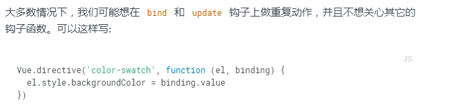

# 四、Vue实例生命周期

生命周期：从Vue实例创建、运行、到销毁期间，总是伴随着各种各样的事件，这些事件，统称为生命周期！

生命周期钩子：就是生命周期事件的别名而已

生命周期钩子=生命周期函数=生命周期事件

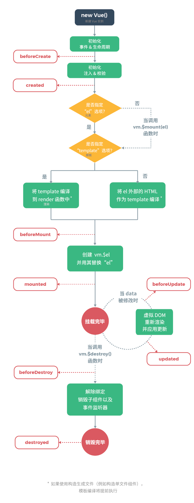

**主要的生命周期函数分类**

+ 创建期间的生命周期函数：
  + beforeCreate：实例刚在内存中被创建出来，此时，还没有初始化好data和methods属性
  + created：实例已经在内存中创建OK，此时data和methods已经创建OK，此时还没有开始编译模板
  + beforeMount：此时已经完成了模板的编译，但是还没有挂载到页面中
  + mounted：此时，已经将编译好的模板，挂载到了页面指定的容器中显示

+ 运行期间的生命周期函数：
  + beforeUpdate：状态更新之前执行此函数，此时data中的状态值是最新的，但是界面上显示的数据还是旧的，因为此时还没有开始重新渲染DOM节点
  + updated：实例更新完毕之后调用此函数，此时data中的状态值和界面上显示的数据，都已经完成了更新，界面已经被重新渲染好了！
+ 销毁期间的生命周期函数：
  + beforeDestroy：实例销毁之前调用。在这一步，实例仍然完全可用。
  + destroyed:Vue 实例销毁后调用。调用后，Vue实例指示的所有东西都会解绑定，所有的事件监听器会被移除，所有的子实例也会被销毁。

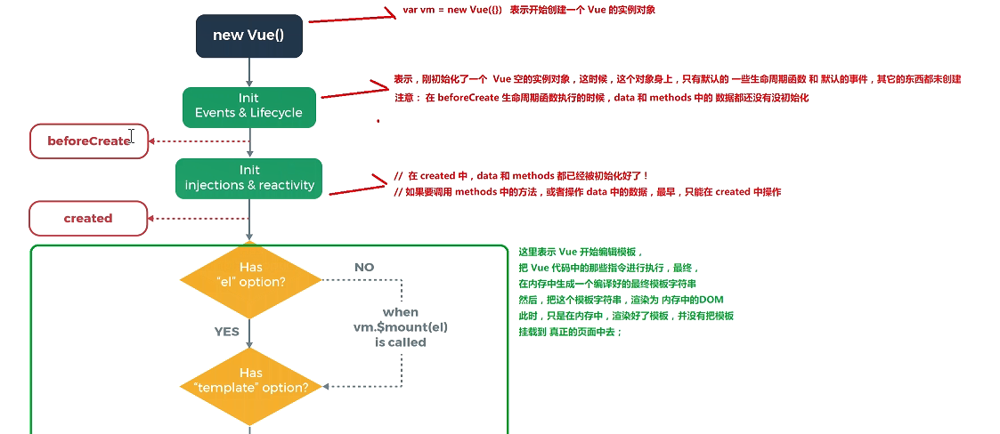

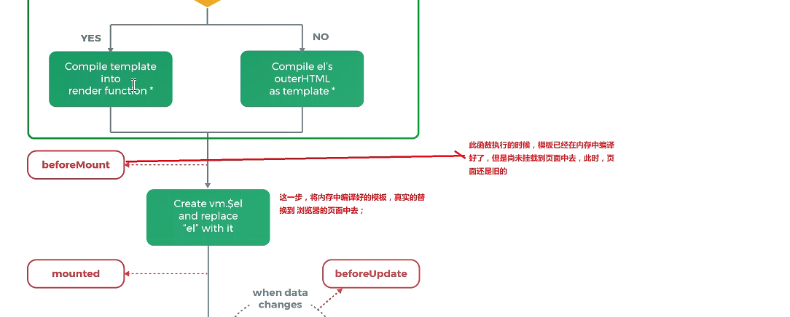

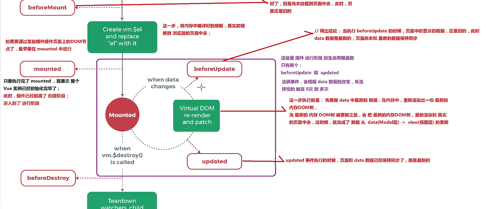

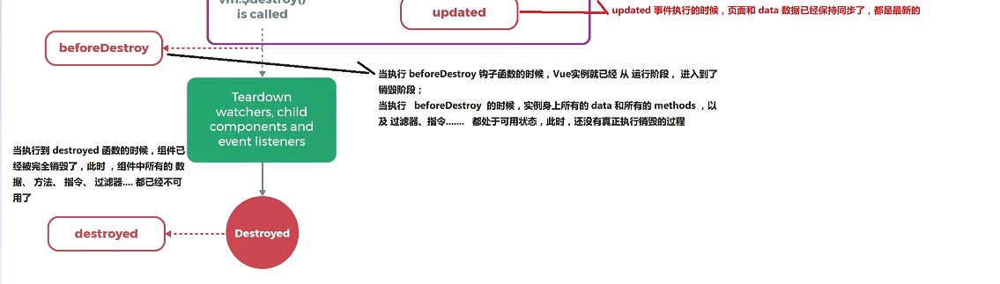

# 五、Vue实现发送请求

通过使用vue-resource实现get，post，jsonp请求

除了vue-resource之外还可以使用‘axios’的第三方包实现数据的请求

首先下载`vue-resource`js文件，因为vue-resource依赖于vue，所以导入js脚本时，vue的需要放在上面

## 1、get请求

以下是一个简单的 Get 请求实例，请求地址是一个简单的 txt 文本：

```js
window.onload = function(){
    var vm = new Vue({
        el:'#box',
        data:{
            msg:'Hello World!',
        },
        methods:{
            get:function(){
                //发送get请求
                this.$http.get('/try/ajax/ajax_info.txt').then(function(res){
                    document.write(res.body);    
                },function(){
                    console.log('请求失败处理');
                });
            }
        }
    });
}
```

如果需要传递数据，可以使用 **this.$http.get('get.php',{params : jsonData})** 格式，第二个参数 **jsonData** 就是传到后端的数据。

```json
this.$http.get('get.php',{params : {a:1,b:2}}).then(function(res){
    document.write(res.body);    
},function(res){
    console.log(res.status);
});
```

## 2、post请求

post 发送数据到后端，需要第三个参数 **{emulateJSON:true}**。

emulateJSON 的作用： 如果Web服务器无法处理编码为 application/json 的请求，你可以启用 emulateJSON 选项。

```js
window.onload = function(){
    var vm = new Vue({
        el:'#box',
        data:{
            msg:'Hello World!',
        },
        methods:{
            post:function(){
                //发送 post 请求
                this.$http.post('/try/ajax/demo_test_post.php',{name:"菜鸟教程",url:"http://www.runoob.com"},{emulateJSON:true}).then(function(res){
                    document.write(res.body);    
                },function(res){
                    console.log(res.status);
                });
            }
        }
    });
}
```

## 3、语法&API

你可以使用全局对象方式 Vue.http 或者在一个 Vue 实例的内部使用 this.$http来发起 HTTP 请求。

```
// 基于全局Vue对象使用http
Vue.http.get('/someUrl', [options]).then(successCallback, errorCallback);
Vue.http.post('/someUrl', [body], [options]).then(successCallback, errorCallback);

// 在一个Vue实例内使用$http
this.$http.get('/someUrl', [options]).then(successCallback, errorCallback);
this.$http.post('/someUrl', [body], [options]).then(successCallback, errorCallback);
```

vue-resource 提供了 7 种请求 API(REST 风格)：

```
get(url, [options])
head(url, [options])
delete(url, [options])
jsonp(url, [options])
post(url, [body], [options])
put(url, [body], [options])
patch(url, [body], [options])
```

除了 jsonp 以外，另外 6 种的 API 名称是标准的 HTTP 方法。

options 参数说明:

| 参数        | 类型                           | 描述                                                         |
| :---------- | :----------------------------- | :----------------------------------------------------------- |
| url         | `string`                       | 请求的目标URL                                                |
| body        | `Object`, `FormData`, `string` | 作为请求体发送的数据                                         |
| headers     | `Object`                       | 作为请求头部发送的头部对象                                   |
| params      | `Object`                       | 作为URL参数的参数对象                                        |
| method      | `string`                       | HTTP方法 (例如GET，POST，...)                                |
| timeout     | `number`                       | 请求超时（单位：毫秒） (`0`表示永不超时)                     |
| before      | `function(request)`            | 在请求发送之前修改请求的回调函数                             |
| progress    | `function(event)`              | 用于处理上传进度的回调函数 ProgressEvent                     |
| credentials | `boolean`                      | 是否需要出示用于跨站点请求的凭据                             |
| emulateHTTP | `boolean`                      | 是否需要通过设置`X-HTTP-Method-Override`头部并且以传统POST方式发送PUT，PATCH和DELETE请求。 |
| emulateJSON | `boolean`                      | 设置请求体的类型为`application/x-www-form-urlencoded`        |

通过如下属性和方法处理一个请求获取到的响应对象：

| 属性       | 类型                       | 描述                                                |
| :--------- | :------------------------- | :-------------------------------------------------- |
| url        | `string`                   | 响应的 URL 源                                       |
| body       | `Object`, `Blob`, `string` | 响应体数据                                          |
| headers    | `Header`                   | 请求头部对象                                        |
| ok         | `boolean`                  | 当 HTTP 响应码为 200 到 299 之间的数值时该值为 true |
| status     | `number`                   | HTTP 响应码                                         |
| statusText | `string`                   | HTTP 响应状态                                       |
| **方法**   | **类型**                   | **描述**                                            |
| text()     | `约定值`                   | 以字符串方式返回响应体                              |
| json()     | `约定值`                   | 以格式化后的 json 对象方式返回响应体                |
| blob()     | `约定值`                   | 以二进制 Blob 对象方式返回响应体                    |

## 4、全局配置

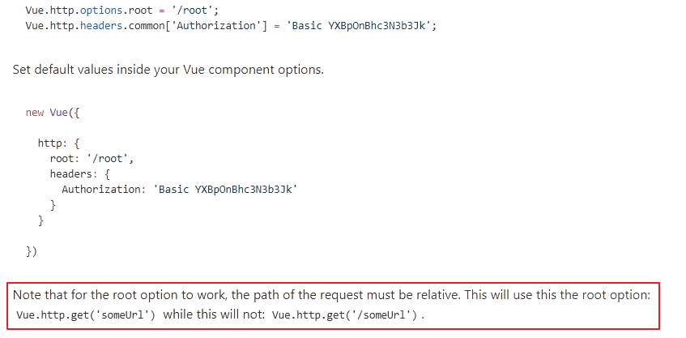

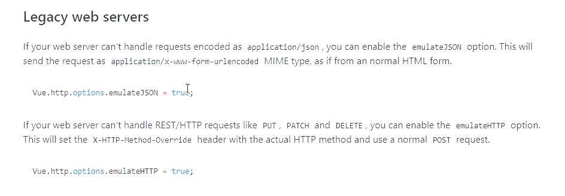

## axios


# 六、过渡和动画

## 1、概述

Vue 在插入、更新或者移除 DOM 时，提供多种不同方式的应用过渡效果。包括以下工具：

- 在 CSS 过渡和动画中自动应用 class
- 可以配合使用第三方 CSS 动画库，如 Animate.css
- 在过渡钩子函数中使用 JavaScript 直接操作 DOM
- 可以配合使用第三方 JavaScript 动画库，如 Velocity.js

在这里，我们只会讲到进入、离开和列表的过渡

## 2、单元素/组件过渡

Vue 提供了 `transition` 的封装组件，在下列情形中，可以给任何元素和组件添加进入/离开过渡

- 条件渲染 (使用 `v-if`)
- 条件展示 (使用 `v-show`)
- 动态组件
- 组件根节点

这里是一个典型的例子：

```html
<div id="demo">
  <button v-on:click="show = !show">
    Toggle
  </button>
  <transition name="fade">
    <p v-if="show">hello</p>
  </transition>
</div>
```

```js
new Vue({
  el: '#demo',
  data: {
    show: true
  }
})
```

```css
.fade-enter-active, .fade-leave-active {
  transition: opacity .5s;
}
.fade-enter, .fade-leave-to /* .fade-leave-active below version 2.1.8 */ {
  opacity: 0;
}
```

当插入或删除包含在 `transition` 组件中的元素时，Vue 将会做以下处理：

1. 自动嗅探目标元素是否应用了 CSS 过渡或动画，如果是，在恰当的时机添加/删除 CSS 类名。
2. 如果过渡组件提供了 [JavaScript 钩子函数](https://cn.vuejs.org/v2/guide/transitions.html#JavaScript-钩子)，这些钩子函数将在恰当的时机被调用。
3. 如果没有找到 JavaScript 钩子并且也没有检测到 CSS 过渡/动画，DOM 操作 (插入/删除) 在下一帧中立即执行。

### 过渡的类名

在Vue中要想使用动画的过渡效果，可以使用Vue自身提供的`transition`标签，然后定义动画css。

**在进入/离开的过渡中，会有 6 个 class 切换。**

1. `v-enter`：定义进入过渡的开始状态。在元素被插入之前生效，在元素被插入之后的下一帧移除。
2. `v-enter-active`：定义进入过渡生效时的状态。在整个进入过渡的阶段中应用，在元素被插入之前生效，在过渡/动画完成之后移除。这个类可以被用来定义进入过渡的过程时间，延迟和曲线函数。
3. `v-enter-to`:  定义进入过渡的结束状态。在元素被插入之后下一帧生效 (与此同时 `v-enter` 被移除)，在过渡/动画完成之后移除。
4. `v-leave`: 定义离开过渡的开始状态。在离开过渡被触发时立刻生效，下一帧被移除。
5. `v-leave-active`：定义离开过渡生效时的状态。在整个离开过渡的阶段中应用，在离开过渡被触发时立刻生效，在过渡/动画完成之后移除。这个类可以被用来定义离开过渡的过程时间，延迟和曲线函数。
6. `v-leave-to`:  定义离开过渡的结束状态。在离开过渡被触发之后下一帧生效 (与此同时 `v-leave` 被删除)，在过渡/动画完成之后移除。

对于这些在过渡中切换的类名来说，如果你使用一个没有名字的 `<transition>`，则 `v-` 是这些类名的默认前缀。如果你使用了 `<transition name="my-transition">`，那么 `v-enter` 会替换为 `my-transition-enter`。

如下，这些定义的类会**对所有没有name属性的transition标签起作用**

```html
<style>
    .v-enter, .v-leave-to{
        opacity: 0;
        transform: translateX(150px);
    }
    .v-enter-active, v-leave-active{
        transition: all 0.8s ease;
    }
</style>
<div id="demo">
  <button v-on:click="show = !show">
    Toggle
  </button>
  <transition>
    <p v-if="show">hello</p>
  </transition>
</div>
```

### 自定义过渡类名

如果想定义的动画只对部分transition标签起作用的话，可以给transation标签添加name属性，然后定义css动画时以name为前缀，如下

```html
<style>
    .my-enter, .my-leave-to{
        opacity: 0;
        transform: translateX(150px);
    }
    .my-enter-active, my-leave-active{
        transition: all 0.8s ease;
    }
</style>
<div id="demo">
  <button v-on:click="show = !show">
    Toggle
  </button>
  <transition name="my">
    <p v-if="show">hello</p>
  </transition>
</div>
```

很容易发现只是将6个类的前缀替换为了transition标签的name属性值

在这种情况下你可以用组件上的 `duration` 属性定制一个显性的过渡持续时间 (以毫秒计)：

```html
<transition :duration="1000">...</transition>
```

你也可以定制进入和移出的持续时间：

```html
<transition :duration="{ enter: 500, leave: 800 }">...</transition>
```

### 指定过渡的类名

我们可以通过以下 attribute 来自定义过渡类名：

- `enter-class`
- `enter-active-class`
- `enter-to-class` (2.1.8+)
- `leave-class`
- `leave-active-class`
- `leave-to-class` (2.1.8+)

他们的优先级高于普通的类名，这对于 Vue 的过渡系统和其他第三方 CSS 动画库，如 [Animate.css](https://daneden.github.io/animate.css/) 结合使用十分有用。

示例：

```html
<link href="https://cdn.jsdelivr.net/npm/animate.css@3.5.1" rel="stylesheet" type="text/css">

<div id="example-3">
  <button @click="show = !show">
    Toggle render
  </button>
  <transition
    name="custom-classes-transition"
    enter-active-class="animated tada"
    leave-active-class="animated bounceOutRight"
  >
    <p v-if="show">hello</p>
  </transition>
</div>
<script>
    new Vue({
      el: '#example-3',
      data: {
        show: true
      }
    })
</script>
```

在很多情况下，Vue 可以自动得出过渡效果的完成时机。默认情况下，Vue 会等待其在过渡效果的根元素的第一个 `transitionend` 或 `animationend` 事件。然而也可以不这样设定——比如，我们可以拥有一个精心编排的一系列过渡效果，其中一些嵌套的内部元素相比于过渡效果的根元素有延迟的或更长的过渡效果。


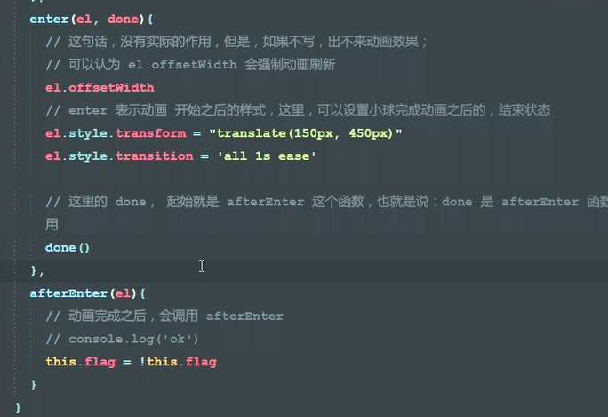

### 钩子函数

通过钩子函数可以实现半场动画

可以在属性中声明 JavaScript 钩子

```html
<transition
  v-on:before-enter="beforeEnter"
  v-on:enter="enter"
  v-on:after-enter="afterEnter"
  v-on:enter-cancelled="enterCancelled"

  v-on:before-leave="beforeLeave"
  v-on:leave="leave"
  v-on:after-leave="afterLeave"
  v-on:leave-cancelled="leaveCancelled"
>
  <!-- ... -->
</transition>
```

```js
// ...
methods: {
  // --------
  // 进入中
  // --------

  beforeEnter: function (el) {
    // ...
  },
  // 当与 CSS 结合使用时
  // 回调函数 done 是可选的
  enter: function (el, done) {
    // ...
    done()
  },
  afterEnter: function (el) {
    // ...
  },
  enterCancelled: function (el) {
    // ...
  },

  // --------
  // 离开时
  // --------

  beforeLeave: function (el) {
    // ...
  },
  // 当与 CSS 结合使用时
  // 回调函数 done 是可选的
  leave: function (el, done) {
    // ...
    done()
  },
  afterLeave: function (el) {
    // ...
  },
  // leaveCancelled 只用于 v-show 中
  leaveCancelled: function (el) {
    // ...
  }
}
```

这些钩子函数可以结合 CSS `transitions/animations` 使用，也可以单独使用。

当只用 JavaScript 过渡的时候，**在 `enter` 和 `leave` 中必须使用 `done` 进行回调**。否则，它们将被同步调用，过渡会立即完成。

推荐对于仅使用 JavaScript 过渡的元素添加 `v-bind:css="false"`，Vue 会跳过 CSS 的检测。这也可以避免过渡过程中 CSS 的影响。

## 3、初始渲染过渡

可以通过 `appear` attribute 设置节点在初始渲染的过渡

```html
<transition appear>
  <!-- ... -->
</transition>
```

这里默认和进入/离开过渡一样，同样也可以自定义 CSS 类名。

```html
<transition
  appear
  appear-class="custom-appear-class"
  appear-to-class="custom-appear-to-class" (2.1.8+)
  appear-active-class="custom-appear-active-class"
>
  <!-- ... -->
</transition>
```

自定义 JavaScript 钩子：

```html
<transition
  appear
  v-on:before-appear="customBeforeAppearHook"
  v-on:appear="customAppearHook"
  v-on:after-appear="customAfterAppearHook"
  v-on:appear-cancelled="customAppearCancelledHook"
>
  <!-- ... -->
</transition>
```

在上面的例子中，无论是 `appear` attribute 还是 `v-on:appear` 钩子都会生成初始渲染过渡。

## 4、多个元素的过渡

我们之后讨论多个组件的过渡，对于原生标签可以使用 `v-if`/`v-else`。最常见的多标签过渡是一个列表和描述这个列表为空消息的元素：

```html
<transition>
  <table v-if="items.length > 0">
    <!-- ... -->
  </table>
  <p v-else>Sorry, no items found.</p>
</transition>
```

可以这样使用，但是有一点需要注意：

当有**相同标签名**的元素切换时，需要通过 `key` attribute 设置唯一的值来标记以让 Vue 区分它们，否则 Vue 为了效率只会替换相同标签内部的内容。即使在技术上没有必要，**给在 `transition` 组件中的多个元素设置 key 是一个更好的实践。**

示例：

```html
<transition>
  <button v-if="isEditing" key="save">
    Save
  </button>
  <button v-else key="edit">
    Edit
  </button>
</transition>
```

在一些场景中，也可以通过给同一个元素的 `key` attribute 设置不同的状态来代替 `v-if` 和 `v-else`，上面的例子可以重写为：

```html
<transition>
  <button v-bind:key="isEditing">
    {{ isEditing ? 'Save' : 'Edit' }}
  </button>
</transition>
```

使用多个 `v-if` 的多个元素的过渡可以重写为绑定了动态属性的单个元素过渡。例如：

```html
<transition>
  <button v-if="docState === 'saved'" key="saved">
    Edit
  </button>
  <button v-if="docState === 'edited'" key="edited">
    Save
  </button>
  <button v-if="docState === 'editing'" key="editing">
    Cancel
  </button>
</transition>
```

可以重写为：

```html
<transition>
  <button v-bind:key="docState">
    {{ buttonMessage }}
  </button>
</transition>
// ...
computed: {
  buttonMessage: function () {
    switch (this.docState) {
      case 'saved': return 'Edit'
      case 'edited': return 'Save'
      case 'editing': return 'Cancel'
    }
  }
}
```

### 过渡模式

同时生效的进入和离开的过渡不能满足所有要求，所以 Vue 提供了 **过渡模式**

- `in-out`：新元素先进行过渡，完成之后当前元素过渡离开。
- `out-in`：当前元素先进行过渡，完成之后新元素过渡进入。

用 `out-in` 重写之前的开关按钮过渡：

```html
<transition name="fade" mode="out-in">
  <!-- ... the buttons ... -->
</transition>
```

## 5、多个组件的过渡

多个组件的过渡简单很多 - 我们不需要使用 `key` attribute。相反，我们只需要使用[动态组件](https://cn.vuejs.org/v2/guide/components.html#动态组件)：

使用`is`可以动态的切换不同的组件

```html
<transition name="component-fade" mode="out-in">
  <component v-bind:is="view"></component>
</transition>
```

```js
new Vue({
  el: '#transition-components-demo',
  data: {
    view: 'v-a'
  },
  components: {
    'v-a': {
      template: '<div>Component A</div>'
    },
    'v-b': {
      template: '<div>Component B</div>'
    }
  }
})
```

```css
.component-fade-enter-active, .component-fade-leave-active {
  transition: opacity .3s ease;
}
.component-fade-enter, .component-fade-leave-to
/* .component-fade-leave-active for below version 2.1.8 */ {
  opacity: 0;
}
```

## 8、列表过渡

- 前面，关于已经讲到如何过渡：

  - 单个节点
  - 同一时间渲染多个节点中的一个

  那么怎么同时渲染整个列表，比如使用 `v-for`？在这种场景中，使用 `<transition-group>` 组件。在我们深入例子之前，先了解关于这个组件的几个特点：

  - 不同于 `<transition>`，它会以一个真实元素呈现：默认为一个 `<span>`。你也可以通过 `tag` attribute 更换为其他元素。
  - [过渡模式](https://cn.vuejs.org/v2/guide/transitions.html#过渡模式)不可用，因为我们不再相互切换特有的元素。
  - 内部元素**总是需要**提供唯一的 `key` attribute 值。
  - CSS 过渡的类将会应用在内部的元素中，而不是这个组/容器本身。

  ### 列表的进入/离开过渡

  现在让我们由一个简单的例子深入，进入和离开的过渡使用之前一样的 CSS 类名。

  ```html
  <div id="list-demo" class="demo">
    <button v-on:click="add">Add</button>
    <button v-on:click="remove">Remove</button>
    <transition-group name="list" tag="p">
      <span v-for="item in items" v-bind:key="item" class="list-item">
        {{ item }}
      </span>
    </transition-group>
  </div>
  ```

  ```js
  new Vue({
    el: '#list-demo',
    data: {
      items: [1,2,3,4,5,6,7,8,9],
      nextNum: 10
    },
    methods: {
      randomIndex: function () {
        return Math.floor(Math.random() * this.items.length)
      },
      add: function () {
        this.items.splice(this.randomIndex(), 0, this.nextNum++)
      },
      remove: function () {
        this.items.splice(this.randomIndex(), 1)
      },
    }
  })
  ```

  ```css
  .list-item {
    display: inline-block;
    margin-right: 10px;
  }
  .list-enter-active, .list-leave-active {
    transition: all 1s;
  }
  .list-enter, .list-leave-to
  /* .list-leave-active for below version 2.1.8 */ {
    opacity: 0;
    transform: translateY(30px);
  }
  ```

  

# 七、组件

## 1、基本示例

这里有一个 Vue 组件的示例：

```js
// 定义一个名为 button-counter 的新组件
Vue.component('button-counter', {
  data: function () {
    return {
      count: 0
    }
  },
  template: '<button v-on:click="count++">You clicked me {{ count }} times.</button>'
})
```

组件是可复用的 Vue 实例，且带有一个名字：在这个例子中是 `<button-counter>`。我们可以在一个通过 `new Vue` 创建的 Vue 根实例中，把这个组件作为自定义元素来使用：

```html
<div id="components-demo">
  <button-counter></button-counter>
</div>
```

```js
new Vue({ el: '#components-demo' })
```

因为组件是可复用的 Vue 实例，所以它们与 `new Vue` 接收相同的选项，例如 `data`、`computed`、`watch`、`methods` 以及生命周期钩子等。仅有的例外是像 `el` 这样根实例特有的选项。

## 2、`data` 必须是一个函数

当我们定义这个 `<button-counter>` 组件时，你可能会发现它的 `data` 并不是像这样直接提供一个对象：

```js
data: {
  count: 0
}
```

取而代之的是，**一个组件的 `data` 选项必须是一个函数**，因此每个实例可以维护一份被返回对象的独立的拷贝：

```js
data: function () {
  return {
    count: 0
  }
}
```

如果 Vue 没有这条规则，点击一个按钮就可能影响到其它所有实例

## 3、组件传值

### `prop` 向子组件传值

为了给博文组件传递一个标题，我们可以用一个 `props` 选项将其包含在该组件可接受的 prop 列表中：

```js
Vue.component('blog-post', {
  props: ['title'],
  template: '<h3>{{ title }}</h3>'
})
```

一个组件默认可以拥有任意数量的 prop，任何值都可以传递给任何 prop。在上述模板中，你会发现我们能够在组件实例中访问这个值，就像访问 `data` 中的值一样。

一个 prop 被注册之后，你就可以像这样把数据作为一个自定义 attribute 传递进来：

```html
<blog-post title="My journey with Vue"></blog-post>
<blog-post title="Blogging with Vue"></blog-post>
<blog-post title="Why Vue is so fun"></blog-post>
```

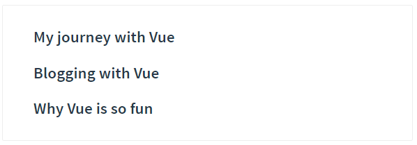

然而在一个典型的应用中，你可能在 `data` 里有一个博文的数组：

```js
new Vue({
  el: '#blog-post-demo',
  data: {
    posts: [
      { id: 1, title: 'My journey with Vue' },
      { id: 2, title: 'Blogging with Vue' },
      { id: 3, title: 'Why Vue is so fun' }
    ]
  }
})
```

并想要为每篇博文渲染一个组件：

```html
<blog-post
  v-for="post in posts"
  v-bind:key="post.id"
  v-bind:title="post.title"
></blog-post>
```

如上所示，我们可以使用 `v-bind` 来动态传递 prop。

**传值案例**

```html
<div id="app">
    <div>
      <input v-model="parentMsg">
      <br>
      <child v-bind:message="parentMsg"></child>
    </div>
</div>
 
<script>
// 注册
Vue.component('child', {
  // 声明 props
  props: ['message'],
  // 同样也可以在 vm 实例中像 "this.message" 这样使用
  template: '<span>{{ message }}</span>'
})
// 创建根实例
new Vue({
  el: '#app',
  data: {
    parentMsg: '父组件内容'
  }
})
</script>
```

### 传递方法

```html
<!DOCTYPE html>
<html lang="zh_CN">
<head>
    <meta charset="UTF-8">
    <meta name="viewport" content="width=device-width, initial-scale=1.0">
    <title>Document</title>
    <script src="./lib/vue.js"></script>
</head>
<body>
    <div id="app">
        <event @func="show"></event>        
    </div>

    <template id="temp3">
        <div>
            <h3>事件调用</h3>
            <button @click="myclick">点我</button>
        </div>
    </template>
    <script>
        var vm = new Vue({
            el: '#app',
            methods: {
                show(a, b){
                    console.log('父组件方法--show()', a, b)
                }
            },
            components: {
                event: {
                    template: '#temp3',
                    methods: {
                        myclick(){ this.$emit('func', '哈哈', '嘿嘿') }
                    }
                }
            }
        })
    </script>
</body>

</html>
```

通过`$emit`调用父组件传递过来的方法，然后子组件通过参数可以向父组件传值

## 4、单个根元素

当构建一个 `<blog-post>` 组件时，你的模板最终会包含的东西远不止一个标题：

```html
<h3>{{ title }}</h3>
```

最最起码，你会包含这篇博文的正文：

```html
<h3>{{ title }}</h3>
<div v-html="content"></div>
```

然而如果你在模板中尝试这样写，Vue 会显示一个错误，并解释道 **every component must have a single root element (每个组件必须只有一个根元素)**。你可以将模板的内容包裹在一个父元素内，来修复这个问题，例如：

```html
<div class="blog-post">
  <h3>{{ title }}</h3>
  <div v-html="content"></div>
</div>
```


## 5、组件注册

### 组件名

定义组件名的方式有两种：

#### 使用 kebab-case

```js
Vue.component('my-component-name', { /* ... */ })
```

当使用 kebab-case (短横线分隔命名) 定义一个组件时，你也必须在引用这个自定义元素时使用 kebab-case，例如 `<my-component-name>`。

#### 使用 PascalCase

```js
Vue.component('MyComponentName', { /* ... */ })
```

当使用 PascalCase (首字母大写命名) 定义一个组件时，你在引用这个自定义元素时两种命名法都可以使用。也就是说 `<my-component-name>` 和 `<MyComponentName>` 都是可接受的。注意，尽管如此，直接在 DOM (即非字符串的模板) 中使用时只有 kebab-case 是有效的。

### 创建组件的三种方式

**方法一**

```js
//1.1 使用Vue.extend来创建全局的Vue组件
var com1 = Vue.extend({
	template: '<h3>this is a h3</h3>' //通过template属性，指定组件要展示的HTML结构
})
//1.2 使用Vue.component('组件的名称',创建出来的组件模板对象)
Vue.component('myCom1', com1)
```

```js
//Vue.component第一个参数，组建的名称在将来引用组建的时候，就是一个标签形式的他来引入
//第二个参数 Vue.extend创建的组件，其中 template就是组件将来要展示的HTML内容

Vue.component('myCom1', Vue.extend({
	template: '<h3>This is a h3</h3>'
}))
```

**方法二**

```js
//注意无论用哪种方式创建出来的组件，组建的template属性指向的模板内容，必须有且只有唯一的一个根元素
Vue.component('mycom2',{
	template: '<h3>这是直接用Vue,component创建出来的组件</h3><span></span>'
})
var vm = new Vue({
    el: '#app',
    data: {

    },
    methods: {

    },
})
```

**方法三**

```html
<template id="temp1">
    <div>
	    <h1>这是在外部定义的组件结构</h1>
    </div>
</template>
<script>
    Vue.component('mycom3', {
    template:'#temp1'
    })
</script>
```

## 6、处理边界情况

### 访问子组件实例或子元素

尽管存在 prop 和事件，有的时候你仍可能需要在 JavaScript 里直接访问一个子组件。为了达到这个目的，你可以通过 `ref` 这个 attribute 为子组件赋予一个 ID 引用。例如：

```
<base-input ref="usernameInput"></base-input>
```

现在在你已经定义了这个 `ref` 的组件里，你可以使用：

```
this.$refs.usernameInput
```

来访问这个 `<base-input>` 实例，以便不时之需。比如程序化地从一个父级组件聚焦这个输入框。在刚才那个例子中，该 `<base-input>` 组件也可以使用一个类似的 `ref` 提供对内部这个指定元素的访问，例如：

```
<input ref="input">
```

甚至可以通过其父级组件定义方法：

```
methods: {
  // 用来从父级组件聚焦输入框
  focus: function () {
    this.$refs.input.focus()
  }
}
```

这样就允许父级组件通过下面的代码聚焦 `<base-input>` 里的输入框：

```
this.$refs.usernameInput.focus()
```

当 `ref` 和 `v-for` 一起使用的时候，你得到的 ref 将会是一个包含了对应数据源的这些子组件的数组。

# 八、路由

> *后端路由*：对于普通的网站，所有的超链接都是URL地址，所有的URL地址都对应服务器上对应的资源；
>
> *前端路由：*对于单页面应用程序来说，主要通过URL中的hash(#号)来实现不同页面之间的切换，同时，hash有一个特点：HTTP请求中不会包含hash相关的内容；所以，单页面程序中的页面跳转主要用hash实现；
>
> 在单页面应用程序中，这种通过hash改变来切换页面的方式，称作前端路由（区别于后端路由）；

## 1、起步

1. 导入 vue-router 组件类库：

```html
<!-- 1. 导入 vue-router 组件类库 -->
  <script src="./lib/vue-router-2.7.0.js"></script>
```

2. 使用 router-link 组件来导航

```html
<!-- 2. 使用 router-link 组件来导航 -->
<router-link to="/login">登录</router-link>
<router-link to="/register">注册</router-link>
```

3. 使用 router-view 组件来显示匹配到的组件

```html
<!-- 3. 使用 router-view 组件来显示匹配到的组件 -->
<router-view></router-view>
```

4. 创建使用`Vue.extend`创建组件

```js
    // 4.1 使用 Vue.extend 来创建登录组件
    var login = Vue.extend({
      template: '<h1>登录组件</h1>'
    });

    // 4.2 使用 Vue.extend 来创建注册组件
    var register = Vue.extend({
      template: '<h1>注册组件</h1>'
    });
```

5. 创建一个路由 router 实例，通过 routers 属性来定义路由匹配规则

```js
// 5. 创建一个路由 router 实例，通过 routers 属性来定义路由匹配规则
    var router = new VueRouter({
      routes: [
        { path: '/login', component: login },
        { path: '/register', component: register }
      ]
    });
```

6. 使用 router 属性来使用路由规则

```js
// 6. 创建 Vue 实例，得到 ViewModel
    var vm = new Vue({
      el: '#app',
      router: router // 使用 router 属性来使用路由规则
    });
```

### 重定向

```js
// 5. 创建一个路由 router 实例，通过 routers 属性来定义路由匹配规则
var router = new VueRouter({
    routes: [
        { path: '/', redcirect: '/login' },
        { path: '/login', component: login },
        { path: '/register', component: register }
    ]
});
```

### 高亮

```css
.router-link-active{
	color: red
}
```

激活的路由默认会有个`.router-link-active`css类

**active-class**

- 类型: `string`

- 默认值: `"router-link-active"`

  设置链接激活时使用的 CSS 类名。默认值可以通过路由的构造选项 `linkActiveClass` 来全局配置。

```js
var router = new VueRouter({
    routes: [     
    ],
    linkActiveClass: 'myactive'
});
```

### query传参

**html代码**

```html
<div id="app" class="container">
    <router-link to="/login?name=hemou&pass=123">登录</router-link>
    <router-link to="/register">注册</router-link>

    <router-view></router-view>
</div>

<template id="temp1">
    <div>
        <h1>登录组件</h1>
        <h4>姓名：{{ name }}</h4>
        <h4>密码：{{ pass }}</h4>
        <h4>直接引用姓名: {{ $route.query.name }}</h4>
    </div>
</template>
```

**js代码**

```js
var login = {
    template: '#temp1',
    data(){
        return {
            name: this.$route.query.name, 
            pass: this.$route.query.pass
        }
    }
}
const router = new VueRouter({
    routes:[
        { path: '/login', component: login },
        { path: '/register', component: register }
    ]
})
var vm = new Vue({
    el: '#app',
    router
})
```


### param传参

**HTML代码**

```html
<div id="app" class="container">
    <router-link to="/register/1/hemou">占位符方式：/login/1/hemou</router-link>
    <router-view></router-view>
</div>
```

**JS代码**

```js
var register = {
    template: '#temp2',
    data(){
        return {
            id: this.$route.params.id,
            name: this.$route.params.name
        }
    }
}
const router = new VueRouter({
    routes:[
        { path: '/login', component: login },
        { path: '/register/:id/:name', component: register },
        { path: '/register', component: register }
    ]
})
var vm = new Vue({
    el: '#app',
    router
})
```

### children属性实现路由嵌套

```html
  <div id="app">
    <router-link to="/account">Account</router-link>

    <router-view></router-view>
  </div>

  <script>
    // 父路由中的组件
    const account = Vue.extend({
      template: `<div>
        这是account组件
        <router-link to="/account/login">login</router-link> | 
        <router-link to="/account/register">register</router-link>
        <router-view></router-view>
      </div>`
    });

    // 子路由中的 login 组件
    const login = Vue.extend({
      template: '<div>登录组件</div>'
    });

    // 子路由中的 register 组件
    const register = Vue.extend({
      template: '<div>注册组件</div>'
    });

    // 路由实例
    var router = new VueRouter({
      routes: [
        { path: '/', redirect: '/account/login' }, // 使用 redirect 实现路由重定向
        {
          path: '/account',
          component: account,
          children: [ // 通过 children 数组属性，来实现路由的嵌套
            { path: 'login', component: login }, // 注意，子路由的开头位置，不要加 / 路径符
            { path: 'register', component: register }
          ]
        }
      ]
    });

    // 创建 Vue 实例，得到 ViewModel
    var vm = new Vue({
      el: '#app',
      data: {},
      methods: {},
      components: {
        account
      },
      router: router
    });
  </script>
```

### 命名视图实现经典布局

1. 标签代码结构：

```html
<div id="app">
    <router-view></router-view>
    <div class="content">
        <router-view name="a"></router-view>
        <router-view name="b"></router-view>
    </div>
</div>
```

2. JS代码：

```js
<script>
    var header = Vue.component('header', {
      template: '<div class="header">header</div>'
    });

    var sidebar = Vue.component('sidebar', {
      template: '<div class="sidebar">sidebar</div>'
    });

    var mainbox = Vue.component('mainbox', {
      template: '<div class="mainbox">mainbox</div>'
    });

    // 创建路由对象
    var router = new VueRouter({
      routes: [
        {
          path: '/', components: {
            default: header,
            a: sidebar,
            b: mainbox
          }
        }
      ]
    });

    // 创建 Vue 实例，得到 ViewModel
    var vm = new Vue({
      el: '#app',
      data: {},
      methods: {},
      router
    });
  </script>
```

3. CSS 样式：

```css
  <style>
    .header {
      border: 1px solid red;
    }

    .content{
      display: flex;
    }
    .sidebar {
      flex: 2;
      border: 1px solid green;
      height: 500px;
    }
    .mainbox{
      flex: 8;
      border: 1px solid blue;
      height: 500px;
    }
  </style>
```


# 九、webpack

## `nrm`的安装使用

作用：提供了一些最常用的NPM包镜像地址，能够让我们快速的切换安装包时候的服务器地址；
什么是镜像：原来包刚一开始是只存在于国外的NPM服务器，但是由于网络原因，经常访问不到，这时候，我们可以在国内，创建一个和官网完全一样的NPM服务器，只不过，数据都是从人家那里拿过来的，除此之外，使用方式完全一样；

1. 运行`npm i nrm -g`全局安装`nrm`包；
2. 使用`nrm ls`查看当前所有可用的镜像源地址以及当前所使用的镜像源地址；
3. 使用`nrm use npm`或`nrm use taobao`切换不同的镜像源地址；

> 注意： nrm 只是单纯的提供了几个常用的 下载包的 URL地址，并能够让我们在 这几个 地址之间，很方便的进行切换，但是，我们每次装包的时候，使用的 装包工具，都是  npm

## 前端的问题

**网页常见的静态资源**

+ JS
   + .js  .jsx  .coffee  .ts（TypeScript  类 C# 语言）

+ CSS
   + .css  .less   .sass  .scss

+ Images
   + .jpg   .png   .gif   .bmp   .svg

+ 字体文件（Fonts）
   + .svg   .ttf   .eot   .woff   .woff2

+ 模板文件
   + .ejs   .jade  .vue【这是在webpack中定义组件的方式，推荐这么用】

**引入的静态资源多了后的问题**

1. 网页加载速度慢， 因为 我们要发起很多的二次请求；
2. 要处理错综复杂的依赖关系

**如何解决上述两个问题**

1. 合并、压缩、精灵图、图片的Base64编码
2. 可以使用之前学过的requireJS、也可以使用webpack可以解决各个包之间的复杂依赖关系；

**什么是webpack**

webpack 是前端的一个项目构建工具，它是基于 Node.js 开发出来的一个前端工具；

**如何完美实现上述的2种解决方案**

1. 使用Gulp， 是基于 task 任务的；
2. 使用Webpack， 是基于整个项目进行构建的；

+ 借助于webpack这个前端自动化构建工具，可以完美实现资源的合并、打包、压缩、混淆等诸多功能。
+ 根据官网的图片介绍webpack打包的过程
+ [webpack官网](http://webpack.github.io/)

==**webpack安装的两种方式**==

1. 运行`npm i webpack -g`全局安装webpack，这样就能在全局使用webpack的命令
2. 在项目根目录中运行`npm i webpack --save-dev`安装到项目依赖中

## 打包构建隔行变色案例

1. 运行`npm init`初始化项目，使用npm管理项目中的依赖包
2. 创建项目基本的目录结构
3. 使用`cnpm i jquery --save`安装jquery类库
4. 创建`main.js`并书写各行变色的代码逻辑：

```js
	// 导入jquery类库
    import $ from 'jquery'

    // 设置偶数行背景色，索引从0开始，0是偶数
    $('#list li:even').css('backgroundColor','lightblue');
    // 设置奇数行背景色
    $('#list li:odd').css('backgroundColor','pink');
```

5. 直接在页面上引用`main.js`会报错，因为浏览器不认识`import`这种高级的JS语法，需要使用webpack进行处理，webpack默认会把这种高级的语法转换为低级的浏览器能识别的语法；
6. 运行`webpack 入口文件路径 输出文件路径`对`main.js`进行处理：

```shell
webpack src/js/main.js dist/bundle.js
```

## 配置文件简化打包命令

1. 在项目根目录中创建`webpack.config.js`
2. 由于运行webpack命令的时候，webpack需要指定入口文件和输出文件的路径，所以，我们需要在`webpack.config.js`中配置这两个路径：

```js
    // 导入处理路径的模块
    var path = require('path');

    // 导出一个配置对象，将来webpack在启动的时候，会默认来查找webpack.config.js，并读取这个文件中导出的配置对象，来进行打包处理
    module.exports = {
        entry: path.resolve(__dirname, 'src/js/main.js'), // 项目入口文件
        output: { // 配置输出选项
            path: path.resolve(__dirname, 'dist'), // 配置输出的路径
            filename: 'bundle.js' // 配置输出的文件名
        }
    }
```

## webpack实时打包构建

+ 由于每次重新修改代码之后，都需要手动运行webpack打包的命令，比较麻烦，所以使用`webpack-dev-server`来实现代码实时打包编译，当修改代码之后，会自动进行打包构建。

+ 运行`cnpm i webpack-dev-server --save-dev`安装到开发依赖

+ 安装完成之后，在命令行直接运行`webpack-dev-server`来进行打包，发现报错
  + 因为只有全局安装的可以直接输入命令，所以此时需要借助于`package.json`文件中的指令，来进行运行`webpack-dev-server`命令
  + 在`scripts`节点下新增`"dev": "webpack-dev-server"`指令
  + ==实时打包，但是dist目录下并没有生成bundle.js文件，这是因为webpack-dev-server将打包好的文件放在了内存中==
   + 把`bundle.js`放在内存中的好处是：由于需要实时打包编译，所以放在内存中速度会非常快
 + 这个时候访问webpack-dev-server启动的`http://localhost:8080/`网站
    + 发现是一个文件夹的面板，需要点击到src目录下，才能打开我们的index首页
    + 此时引用不到bundle.js文件，需要修改index.html中script的src属性为:`<script src="../bundle.js"></script>`
 + 为了能在访问`http://localhost:8080/`的时候直接访问到index首页，可以使用`--contentBase src`指令来修改dev指令，指定启动的根目录：

 ```json
 "dev": "webpack-dev-server --contentBase src"
 ```

 同时修改index页面中script的src属性为`<script src="bundle.js"></script>`

## 通过插件配置启动页

由于使用`--contentBase`指令的过程比较繁琐，需要指定启动的目录，同时还需要修改index.html中script标签的src属性，所以推荐大家使用`html-webpack-plugin`插件配置启动页面.

1. 运行`cnpm i html-webpack-plugin --save-dev`安装到开发依赖
2. 修改`webpack.config.js`配置文件如下：

```js
    // 导入处理路径的模块
    var path = require('path');
    // 导入自动生成HTMl文件的插件
    var htmlWebpackPlugin = require('html-webpack-plugin');

    module.exports = {
        entry: path.resolve(__dirname, 'src/js/main.js'), // 项目入口文件
        output: { // 配置输出选项
            path: path.resolve(__dirname, 'dist'), // 配置输出的路径
            filename: 'bundle.js' // 配置输出的文件名
        },
        plugins:[ // 添加plugins节点配置插件
            new htmlWebpackPlugin({
                template:path.resolve(__dirname, 'src/index.html'),//模板路径
                filename:'index.html'//自动生成的HTML文件的名称
            })
        ]
    }
```

3. 修改`package.json`中`script`节点中的dev指令如下：

```json
"dev": "webpack-dev-server"
```

4. 将index.html中script标签注释掉，因为`html-webpack-plugin`插件会自动把bundle.js注入到index.html页面中！

## 实现自动打开浏览器、热更新和配置默认端口号

==注意：热更新在JS中表现的不明显，可以从一会儿要讲到的CSS身上进行介绍说明！==

**方式1：**

+ 修改`package.json`的script节点如下
  + `--open`表示自动打开浏览器
  + `--port 4321`表示打开的端口号为4321
  + `--hot`表示启用浏览器热更新：

```json
"dev": "webpack-dev-server --hot --port 4321 --open"
```

**方式2：**

1. 修改`webpack.config.js`文件，新增`devServer`节点如下：

```js
devServer:{
        hot:true,
        open:true,
        port:4321
    }
```

2. 在头部引入`webpack`模块：

```js
var webpack = require('webpack');
```

3. 在`plugins`节点下新增：

```js
new webpack.HotModuleReplacementPlugin()
```

## 打包css文件

1. 运行`cnpm i style-loader css-loader --save-dev`
2. 修改`webpack.config.js`这个配置文件：

```js
module: { // 用来配置第三方loader模块的
        rules: [ // 文件的匹配规则
            { test: /\.css$/, use: ['style-loader', 'css-loader'] }//处理css文件的规则
        ]
    }
```

3. 注意：`use`表示使用哪些模块来处理`test`所匹配到的文件；`use`中相关loader模块的调用顺序是从后向前调用的；

## 打包less文件

1. 运行`cnpm i less-loader less -D`
2. 修改`webpack.config.js`这个配置文件：

```js
{ test: /\.less$/, use: ['style-loader', 'css-loader', 'less-loader'] },
```

## 打包sass文件

1. 运行`cnpm i sass-loader node-sass --save-dev`
2. 在`webpack.config.js`中添加处理sass文件的loader模块：

```js
{ test: /\.scss$/, use: ['style-loader', 'css-loader', 'sass-loader'] }
```

## 处理css路径和字体

1. 运行`cnpm i url-loader file-loader --save-dev`
2. 在`webpack.config.js`中添加处理url路径的loader模块：

```js
{ test: /\.(png|jpg|gif)$/, use: 'url-loader' }
```

+ 参数
  + `limit`指定进行base64编码的图片大小；只有小于指定字节（byte）的图片才会进行base64编码：
  + `name`打包后图片的名字

```js
{ test: /\.(png|jpg|gif)$/, use: 'url-loader?limit=410&name=[hash:8]-[name].[ext]'},
{ test: /\.(ttf|eot|svg|woff|woff2)$/, use: 'url-loader' },
```

或者

```json
{ 
    test: /\.(png|jpg|gif)$/, 
    use: 'url-loader?limit=410&name=[hash:8]-[name].[ext]',
    options: {
        limit: 8 * 1024 // 小于 8 kb 就会base64处理
    }    
}
```


## 使用babel处理高级JS语法

1. 运行`cnpm i babel-core babel-loader babel-plugin-transform-runtime --save-dev`安装babel的相关loader包
2. 运行`cnpm i babel-preset-es2015 babel-preset-stage-0 --save-dev`安装babel转换的语法
3. 在`webpack.config.js`中添加相关loader模块，其中需要注意的是，一定要把`node_modules`文件夹添加到排除项：

```js
{ test: /\.js$/, use: 'babel-loader', exclude: /node_modules/ }
```

4. 在项目根目录中添加`.babelrc`文件，并修改这个配置文件如下：

```js
{
    "presets":["es2015", "stage-0"],
    "plugins":["transform-runtime"]
}
```

5. **注意：语法插件`babel-preset-es2015`可以更新为`babel-preset-env`**
6. **它包含了所有的ES相关的语法；**

## Vue中render方法渲染页面

**js代码**

```js
var template = {
    template: '<h1>我是H1</h1>'
}

var vm = new Vue({
    el: '#app',
    render(createElements){
        return createElements(template)
    }
})
```

**html代码**

```html
<body>
    <div id="app">

    </div>
</body>
```

注意这种方式渲染，不然div#app中有什么内容，都会被createElements(template)中的参数模板给替换掉

## 配置.vue组件页面的解析

1. 运行`cnpm i vue -S`将vue安装为运行依赖；

2. 运行`cnpm i vue-loader vue-template-compiler -D`将解析转换vue的包安装为开发依赖；

3. 运行`cnpm i style-loader css-loader -D`将解析转换CSS的包安装为开发依赖，因为.vue文件中会写CSS样式；

4. 在`webpack.config.js`中，添加如下`module`规则：

```js
module: {
    rules: [
        { test: /\.css$/, use: ['style-loader', 'css-loader'] },
        { test: /\.vue$/, use: 'vue-loader' }
    ]
}
```

5. 创建`App.js`组件页面：

```vue
<template>
<!-- 注意：在 .vue 的组件中，template 中必须有且只有唯一的根元素进行包裹，一般都用 div 当作唯一的根元素 -->
	<div>
        <h1>这是APP组件 - {{msg}}</h1>
        <h3>我是h3</h3>
    </div>
</template>

<script>
    // 注意：在 .vue 的组件中，通过 script 标签来定义组件的行为，需要使用 ES6 中提供的 export default 方式，导出一个vue实例对象
    export default {
        data() {
            return {
                msg: 'OK'
            }
        }
    }
</script>

<style scoped>
    h1 {
        color: red;
    }
</style>

```

6. 创建`main.js`入口文件：

```js
// 导入 Vue 组件
import Vue from 'vue'

// 导入 App组件
import App from './components/App.vue'

// 创建一个 Vue 实例，使用 render 函数，渲染指定的组件
var vm = new Vue({
    el: '#app',
    render: c => c(App)
});
```

## 别名 alias

1. 在`webpack.config.js`中添加`resolve`属性：

```js
resolve: {
    alias: {
      'vue$': 'vue/dist/vue.esm.js'
    }
  }
```

# 十、脚手架

## vue create

To create a new project, run:

```bash
vue create hello-world
```

vue3 脚手架的真正配置放在了

==node_modules -> @vue -> cli-service== 

## Pulling 2.x Templates 

Vue CLI >= 3 uses the same `vue` binary, so it overwrites Vue CLI 2 (`vue-cli`). If you still need the legacy `vue init` functionality, you can install a global bridge:

```bash
npm install -g @vue/cli-init
# vue init now works exactly the same as vue-cli@2.x
vue init webpack my-project
```

# 十一、runtime-complier 和 runtime-only

+ runtime-compiler（v1）
  template -> ast -> render -> vdom -> UI

  ```js
  new Vue({
  	el: '#app',
      template: '<App/>',
      components: { App }
  })
  ```

+ runtime-only（V2）（==1.性能更高 2.下面的代码量更少==）
  render -> vdom -> UI

  ```js
  // 1. 
  new Vue({
      el: '#app',
      render: function(createElement){
          // createElement 的三个参数: 1.元素标签 2.参数1的属性 3. 标签内部内容
          return createElement('h2', {class: 'box'}, ['我靠',
                                                     createElement('button', ['按钮'])])
  
      }
  })
  // 2. createElement 传递一个组件
  const cpn = {
      template: '<div>{{msg}}</div>',
      data(){
          return {
              msg: '我是组件'
          }
      }
  }
  new Vue({
      el: '#app',
      render: function(createElement){
          return createElement(cpm)
      }
  })
  
  // 3. 由此演化出
  new Vue({
      el: '#app',
      render: h => h(App)
  })
  ```

  


# 案例

## 1、品牌案例

```html
<!DOCTYPE html>
<html lang="en">
<head>
    <meta charset="UTF-8">
    <meta name="viewport" content="width=device-width, initial-scale=1.0">
    <title>Document</title>
    <script src="lib/vue.js"></script>
    <link href="https://how2j.cn/study/css/bootstrap/3.3.6/bootstrap.min.css" rel="stylesheet">
</head>
<body>
    <div id="app">
        <div class="panel panel-primary">
            <div class="panel-heading">
                <h3 class="panel-title">
                    添加品牌
                </h3>
            </div>
            <div class="panel-body form-inline">
                <label for="">
                    Id: <input type="text" class="form-control" v-model="id">
                </label>
                <label for="">
                    Name: <input type="text" class="form-control" v-model="name">
                </label>
                <label for="">
                    <input type="button" value="添加" class="btn btn-primary" @click="add">
                </label>
                <label for="">
                    搜索关键词：<input type="text" class="form-control">
                </label>
            </div>
        </div>
        
        <div>
            <table class="table table-bordered table-hover table-striped">
                <thead>
                    <tr>
                        <th>Id</th>
                        <th>Name</th>
                        <th>Ctime</th>
                        <th>Operation</th>
                    </tr>
                </thead>
                <tbody>
                    <tr v-for="item in items" :key="item.id">
                        <td>{{ item.id }}</td>
                        <td v-text="item.name"></td>
                        <td>{{ item.date }}</td>
                        <td>
                            <a href="" @click.prevent="del(item.id)">删除</a>
                        </td>
                    </tr>
                </tbody>
            </table>
        </div>
        <div></div>
    </div>

    <script>
        var vm = new Vue({
            el: '#app',
            data: {
                id: '',
                name: '',
                items:[
                    {id: '1', name: '宝马', date: new Date()},
                    {id: '2', name: '奔驰', date: new Date()},
                    {id: '3', name: '大众', date: new Date()}
                ]
            },
            methods: {
                add(){
                    if(this.id != '' && this.name != ''){
                        var car = {id: this.id, name: this.name, date: new Date()}
                        this.items.push(car)
                        this.id = this.name = ''
                    }
                },
                del(id){
                    this.items.some((item, i)=>{
                        if(item.id == id){
                            this.items.splice(i, 1);
                            return true;
                        }
                    })
                }
            }
        })
    </script>
</body>
</html>
```

了解了some函数、splice函数、findIndex函数、filter函数，这些都是js的新方法

```js
//注意：forEach some filter findrndex这些都属于数组的新方法，
//都会对数组中的每一项，进行遍历，执行相关的操作；
return this.list.filter(item =>{
    //if（item.name.indexof（keywords）！=-1）

    //注意：ES6中，为字符串提供了一个新方法，叫做string.prototype.includes（要包含的字符串）

    //如果包含，则返回true，否则返回false
    //contain 
    if(item.name.includes(keywords)){
        return item
    }
})	
```

## 2、品论案例

```html
<!DOCTYPE html>
<html lang="zh_CN">
<head>
    <meta charset="UTF-8">
    <meta name="viewport" content="width=device-width, initial-scale=1.0">
    <title>Document</title>
    <link rel="stylesheet" href="./lib/bootstrap.min.css">
    <script src="./lib/vue.js"></script>
</head>
<body>
    <div id="app" class="container" style="padding-top: 20px;">     
        <div class="panel panel-info">
            <div class="panel-heading">
                <div class="panel-title">
                    <h4>留下你的足迹</h4>
                </div>
            </div>
            <div class="panel-body">
               <comment @func="show"></comment>
            </div>
        </div>
        
        <ul class="list-group">
            <li class="list-group-item" v-for="c in comments">
                <span class="badge">发言人：{{ c.name }}</span>
                {{ c.comment }}
            </li>
        </ul>
    </div>

    <template id="comment">
        <div>
            <div class="form-group">
                <label for="">姓名</label>
                <input type="text" class="form-control" v-model="name">
            </div>
            <div class="form-group">
                <label for="">评论</label>
                <textarea class="form-control" rows="3" v-model="content"></textarea>
            </div>
            <input type="submit" class="btn btn-primary" @click.prevent="remark">
        </div>
    </template>

    <script>
        var commentTemp = {
            template: '#comment',
            data(){
                return {
                    name: '',
                    content: ''
                }
            },
            methods: {
                remark(){
                    var comment = {name: this.name, comment: this.content}
                    var comments = JSON.parse(localStorage.getItem('comments') || '[]')
                    comments.unshift(comment)
                    localStorage.setItem('comments', JSON.stringify(comments))
                    this.name = this.content = ''
                    this.$emit('func')
                }
            }
        }

        var vm = new Vue({
            el: '#app',
            data: {
                comments: ''
            },
            created() {
                this.show()
            },
            methods: {
                show(){
                    this.comments = JSON.parse(localStorage.getItem('comments') || '[]')
                    console.log(this.comments)
                }
            },
            components: {
                comment: commentTemp
            }
        })
    </script>

</body>

</html>
```

