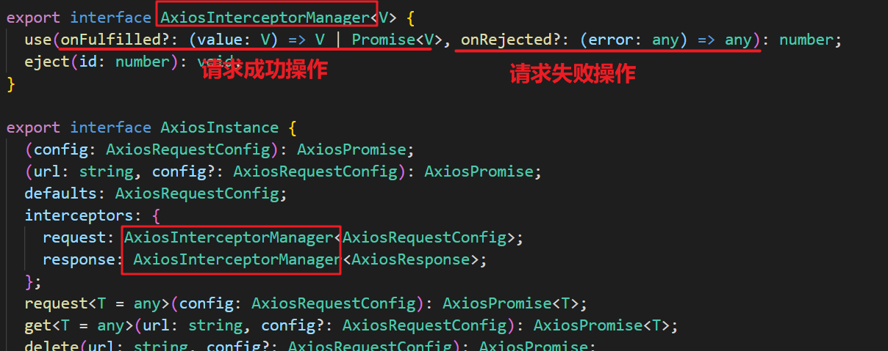

# 选择什么网络模块？

+ 选择一：传统的Ajax是基于XMLHttpRequest（XHR），为什么不用它呢？
  + 非常好解释，配置和调用方式等非常混乱，
  + 编码起来看起来就非常蛋疼.
  + 所以真实开发中很少直接使用，而是使用jQuery-Ajax

+ 选择二：在前面的学习中，我们经常会使用jQuery-Ajax ，为什么不选择它呢？
  + 相对于传统的Ajax非常好用，但是
  + 首先，我们先明确一点：在Vue的整个开发中都是不需要使用jQuery了.
  + 那么，就意味着为了方便我们进行一个网络请求，特意引用一个jQuery，你觉得合理吗？
  + jQuery的代码1w+行.
  + Vue的代码才1w+行.
  + 完全没有必要为了用网络请求就引用这个重量级的框架.

+ 选择三：官方在Vue1.x的时候，推出了Vue-resource，为什么不选择它呢？
  + Vue-resource的体积相对于jQuery小很多.
  + 另外Vue-resource是官准出的.
  + 在Vue2.0退出后，Vue作者就在GitHub的Issues中说明了去掉vue-resource，并且以后也不会再更新。
  + 那么意味着以后vue-reource不再支持新的版本时，也不会再继续更新和维护.
  + 对以后的项目开发和维护都存在很大的隐患.

+ 选择四：在说明不再继续更新和维护vwe-resource的同时，作者还推荐了一个框架：axios为什么不用它呢
  + axios有非常多的优点，并且用起来也非常方便.
  + 稍后，我们对他详细学习.

# axios功能特点

ajax i/o system（个人理解）

Axios 是一个基于 promise 的 HTTP 库，可以用在浏览器和 node.js 中。

+ 在浏览器中发送XMLHttpRequests请求
+ 在node.js 中发送http请求
+ 支持 Promise API
+ 拦截请求和响应
+ 转换请求和响应数据
+ 取消请求
+ 自动转换 JSON 数据
+ 客户端支持防御 XSRF

# axios请求方式

+ axios(config)

+ axios.request(config)
+ axios.get(url[, config])
+ axios.delete(url[, config])
+ axios.head(url[, config])
+ axios.options(url[, config])
+ axios.post(url[, data[, config]])
+ axios.put(url[, data[, config]])
+ axios.patch(url[, data[, config]])

# 请求配置 config

只有 `url` 是必需的。如果没有指定 `method`，请求将默认使用 `get` 方法。

## 常用配置

```js
{
   // `url` 是用于请求的服务器 URL
  url: '/user',

  // `method` 是创建请求时使用的方法
  method: 'get', // 默认方式

  // `baseURL` 将自动加在 `url` 前面，除非 `url` 是一个绝对 URL。
  baseURL: 'https://some-domain.com/api/',
      
  // `timeout` 指定请求超时的毫秒数(0 表示无超时时间)
  // 如果请求话费了超过 `timeout` 的时间，请求将被中断
  timeout: 1000,

  // `headers` 是即将被发送的自定义请求头
  headers: {'X-Requested-With': 'XMLHttpRequest'},
	
  // get 的请求参数
  // 必须是一个无格式对象(plain object)或 URLSearchParams 对象
  params: {
    ID: 12345
  },

  // `data` 是作为请求主体被发送的数据
  // 只适用于这些请求方法 'PUT', 'POST', 和 'PATCH'
  data: {
    firstName: 'Fred'
  },

  // `transformRequest` 允许在向服务器发送前，修改请求数据
  // 只能用在 'PUT', 'POST' 和 'PATCH' 这几个请求方法
  transformRequest: [function (data, headers) {
    // 对 data 进行任意转换处理
    return data;
  }],

  // `transformResponse` 在传递给 then/catch 前，允许修改响应数据
  transformResponse: [function (data) {
    // 对 data 进行任意转换处理
    return data;
  }],
}
```

## 全部配置


```js
{
   // `url` 是用于请求的服务器 URL
  url: '/user',

  // `method` 是创建请求时使用的方法
  method: 'get', // default

  // `baseURL` 将自动加在 `url` 前面，除非 `url` 是一个绝对 URL。
  // 它可以通过设置一个 `baseURL` 便于为 axios 实例的方法传递相对 URL
  baseURL: 'https://some-domain.com/api/',

  // `transformRequest` 允许在向服务器发送前，修改请求数据
  // 只能用在 'PUT', 'POST' 和 'PATCH' 这几个请求方法
  // 后面数组中的函数必须返回一个字符串，或 ArrayBuffer，或 Stream
  transformRequest: [function (data, headers) {
    // 对 data 进行任意转换处理
    return data;
  }],

  // `transformResponse` 在传递给 then/catch 前，允许修改响应数据
  transformResponse: [function (data) {
    // 对 data 进行任意转换处理
    return data;
  }],

  // `headers` 是即将被发送的自定义请求头
  headers: {'X-Requested-With': 'XMLHttpRequest'},

  // `params` 是即将与请求一起发送的 URL 参数
  // 必须是一个无格式对象(plain object)或 URLSearchParams 对象
  params: {
    ID: 12345
  },

   // `paramsSerializer` 是一个负责 `params` 序列化的函数
  // (e.g. https://www.npmjs.com/package/qs, http://api.jquery.com/jquery.param/)
  paramsSerializer: function(params) {
    return Qs.stringify(params, {arrayFormat: 'brackets'})
  },

  // `data` 是作为请求主体被发送的数据
  // 只适用于这些请求方法 'PUT', 'POST', 和 'PATCH'
  // 在没有设置 `transformRequest` 时，必须是以下类型之一：
  // - string, plain object, ArrayBuffer, ArrayBufferView, URLSearchParams
  // - 浏览器专属：FormData, File, Blob
  // - Node 专属： Stream
  data: {
    firstName: 'Fred'
  },

  // `timeout` 指定请求超时的毫秒数(0 表示无超时时间)
  // 如果请求话费了超过 `timeout` 的时间，请求将被中断
  timeout: 1000,

   // `withCredentials` 表示跨域请求时是否需要使用凭证
  withCredentials: false, // default

  // `adapter` 允许自定义处理请求，以使测试更轻松
  // 返回一个 promise 并应用一个有效的响应 (查阅 [response docs](#response-api)).
  adapter: function (config) {
    /* ... */
  },

 // `auth` 表示应该使用 HTTP 基础验证，并提供凭据
  // 这将设置一个 `Authorization` 头，覆写掉现有的任意使用 `headers` 设置的自定义 `Authorization`头
  auth: {
    username: 'janedoe',
    password: 's00pers3cret'
  },

   // `responseType` 表示服务器响应的数据类型，可以是 'arraybuffer', 'blob', 'document', 'json', 'text', 'stream'
  responseType: 'json', // default

  // `responseEncoding` indicates encoding to use for decoding responses
  // Note: Ignored for `responseType` of 'stream' or client-side requests
  responseEncoding: 'utf8', // default

   // `xsrfCookieName` 是用作 xsrf token 的值的cookie的名称
  xsrfCookieName: 'XSRF-TOKEN', // default

  // `xsrfHeaderName` is the name of the http header that carries the xsrf token value
  xsrfHeaderName: 'X-XSRF-TOKEN', // default

   // `onUploadProgress` 允许为上传处理进度事件
  onUploadProgress: function (progressEvent) {
    // Do whatever you want with the native progress event
  },

  // `onDownloadProgress` 允许为下载处理进度事件
  onDownloadProgress: function (progressEvent) {
    // 对原生进度事件的处理
  },

   // `maxContentLength` 定义允许的响应内容的最大尺寸
  maxContentLength: 2000,

  // `validateStatus` 定义对于给定的HTTP 响应状态码是 resolve 或 reject  promise 。如果 `validateStatus` 返回 `true` (或者设置为 `null` 或 `undefined`)，promise 将被 resolve; 否则，promise 将被 rejecte
  validateStatus: function (status) {
    return status >= 200 && status < 300; // default
  },

  // `maxRedirects` 定义在 node.js 中 follow 的最大重定向数目
  // 如果设置为0，将不会 follow 任何重定向
  maxRedirects: 5, // default

  // `socketPath` defines a UNIX Socket to be used in node.js.
  // e.g. '/var/run/docker.sock' to send requests to the docker daemon.
  // Only either `socketPath` or `proxy` can be specified.
  // If both are specified, `socketPath` is used.
  socketPath: null, // default

  // `httpAgent` 和 `httpsAgent` 分别在 node.js 中用于定义在执行 http 和 https 时使用的自定义代理。允许像这样配置选项：
  // `keepAlive` 默认没有启用
  httpAgent: new http.Agent({ keepAlive: true }),
  httpsAgent: new https.Agent({ keepAlive: true }),

  // 'proxy' 定义代理服务器的主机名称和端口
  // `auth` 表示 HTTP 基础验证应当用于连接代理，并提供凭据
  // 这将会设置一个 `Proxy-Authorization` 头，覆写掉已有的通过使用 `header` 设置的自定义 `Proxy-Authorization` 头。
  proxy: {
    host: '127.0.0.1',
    port: 9000,
    auth: {
      username: 'mikeymike',
      password: 'rapunz3l'
    }
  },

  // `cancelToken` 指定用于取消请求的 cancel token
  // （查看后面的 Cancellation 这节了解更多）
  cancelToken: new CancelToken(function (cancel) {
  })
}
```

# 响应结构 response

```js
{
  // `data` 由服务器提供的响应
  data: {},

  // `status` 来自服务器响应的 HTTP 状态码
  status: 200,

  // `statusText` 来自服务器响应的 HTTP 状态信息
  statusText: 'OK',

  // `headers` 服务器响应的头
  headers: {},

   // `config` 是为请求提供的配置信息
  config: {},
 // 'request'
  // `request` is the request that generated this response
  // It is the last ClientRequest instance in node.js (in redirects)
  // and an XMLHttpRequest instance the browser
  request: {}
}
```

# 并发请求

处理并发请求的助手函数

## axios.all(iterable)

**请求**

```js
axios.all([axios({
    url: 'xxx'
}), axios({
    url: 'xxx'
})]).then(results => {
    ...
})
```

**响应结果**

```js
[{// 第一个响应结果
  data: {...},
  status: 200,
  statusText: 'OK',
  headers: {...},
  config: {...},
  request: {...}
}, {// 第二个响应结果
  data: {...},
  status: 200,
  statusText: 'OK',
  headers: {...},
  config: {...},
  request: {...}
}]
```

## axios.spread(callback)

```js
axios.all([axios({
    url: 'xxx'
}), axios({
    url: 'xxx'
})]).then((res1, res2) => {
	console.log(res1) // 第一个响应结果
	console.log(res2) // 第二个响应结果
})
```

# 拦截器

axios提供了拦截器，用于我们在发送每次请求或者得到相应后，进行对应的处理。

那么如何使用拦截器呢？先来看看源码部分



下面就来使用拦截器吧

```js
const service = axios.create({
  baseURL: 'xxx', 
  timeout: 5000 
})

// 请求拦截器
service.interceptors.request.use(config => {
    if (store.getters.token) {
      // 可以添加 token 信息
      config.headers['X-Token'] = getToken()
    }
    return config
  }, error => {
    console.log(error) // for debug
    return Promise.reject(error)
  }
)

// 响应拦截器
service.interceptors.response.use(response => {
    return response.data // 过滤掉其他的信息
  }, error => {
    console.log('err' + error) // for debug 
    return Promise.reject(error)
  }
)
```

# 全局配置

```js
axios.defaults.baseURL = 'https://api.example.com';
axios.defaults.timeout = 5000;
axios.defaults.headers.common['Authorization'] = AUTH_TOKEN;
axios.defaults.headers.post['Content-Type'] = 'application/x-www-form-urlencoded';
```

# axios实例与封装

## 实例

在之前我们通过 `import axios from 'axios'`引入的`axios`对象就是Axios的一个全局实例

当我们进行全局配置时，如

```js
axios.defaults.baseURL = 'https://api.example.com';
```

都是对这个全局实例进行配置，发送请求时使用的也是这个全局的实例

在一般小项目中可能服务只有一个，所以配置全局 axios 的 baseURL 并无不妥，但是随着项目的扩大，服务器地址可能不止一个，那么这样进行配置可能就有点问题了

所以我们可以调用 axios 的 `create` 方法，再创建一个实例，这样不同的实例应用不同的默认配置就比较合理了，如下

```js
const server1 = axios.create({
    baseURL: 'http://111.1.1.1:8080'
    timeout: 5000
})

const server2 = axios.create({
    baseURL: 'http://222.1.1.1:8080'
    timeout: 10000
})

server1({
    url: '/user/index',
}).then(res => {
    ...
})

server2({
    url: '/system/index'
}).then(res => {
    ...
})
```

## 封装

**utils/request.js**

```js
import axios from 'axios'
import { Notification, MessageBox } from 'element-ui'
import store from '@/store'
import { getToken } from '@/utils/auth'

// 创建axios实例
const service = axios.create({
  // axios中请求配置有baseURL选项，表示请求URL公共部分
  baseURL: process.env.VUE_APP_BASE_API,
  // 超时
  timeout: 10000
})

// request拦截器
service.interceptors.request.use(
  config => {
    if (getToken()) {
      config.headers['Authorization'] = getToken() 
    }
    return config
  },
  error => {
    console.log(error)
    Promise.reject(error)
  }
)

// 响应拦截器
service.interceptors.response.use(res => {
    const code = res.data.code
    if (code === 401) {
      MessageBox.confirm(
        '登录状态已过期，您可以继续留在该页面，或者重新登录',
        '系统提示',
        {
          confirmButtonText: '重新登录',
          cancelButtonText: '取消',
          type: 'warning'
        }
      ).then(() => {
        store.dispatch('LogOut').then(() => {
          location.reload() 
        })
      })
    } else if (code !== 200) {
      Notification.error({
        title: res.data.msg
      })
      return Promise.reject('error')
    } else {
      return res.data
    }
  }, error => {
    console.log('err' + error)
    Message({
      message: error.message,
      type: 'error',
      duration: 5 * 1000
    })
    return Promise.reject(error)
  }
)

export default service
```

