[toc]

# 前端基础

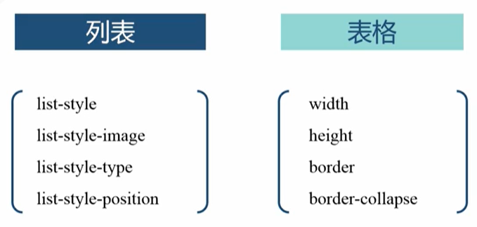

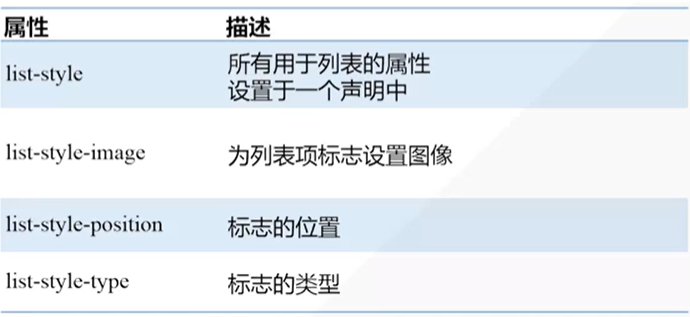

**list-style-type:**

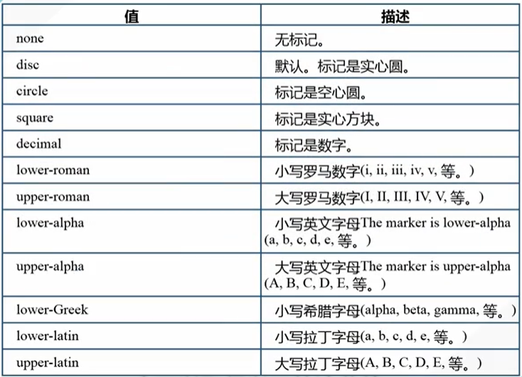

**list-style-postion:**

| 值      | 描述     |
| ------- | -------- |
| inside  | 向右缩进 |
| outside | 向左突出 |

**奇偶选择器：**

:nth-child(odd|even)

# CSS3

## 阴影

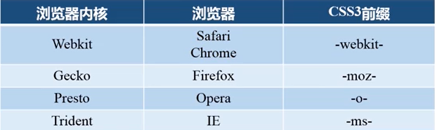

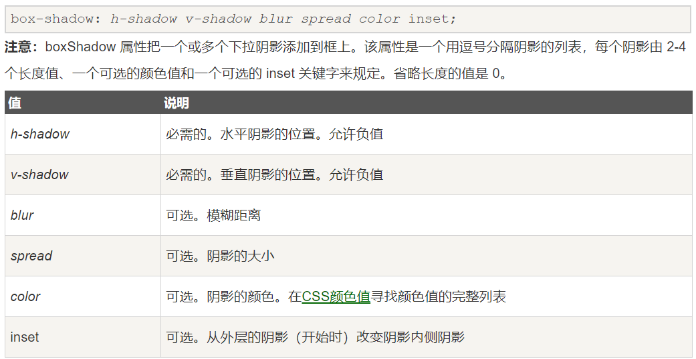

## 文字和文本

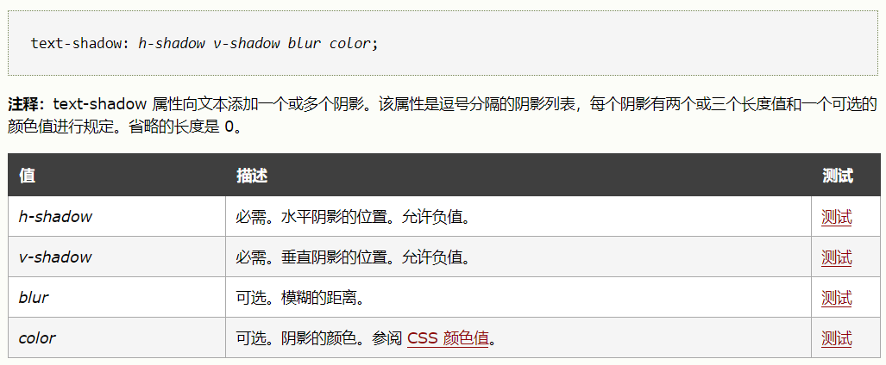

## 2D变换

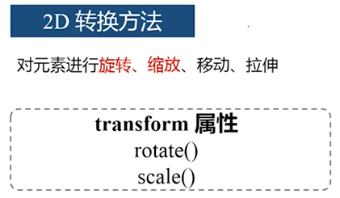

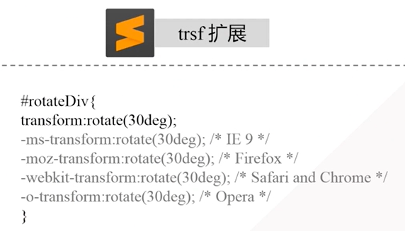

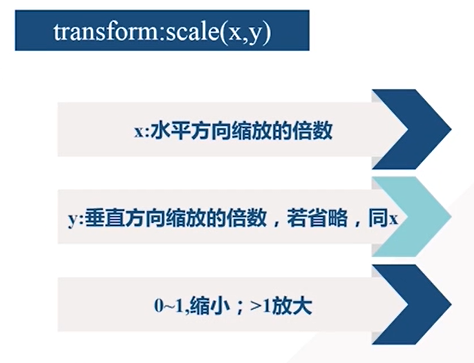

## 过度与动画

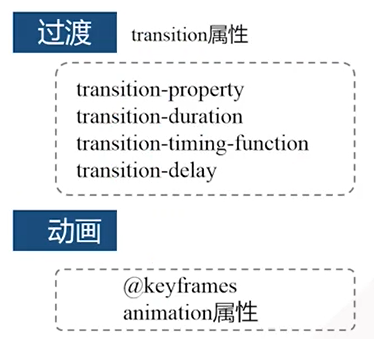

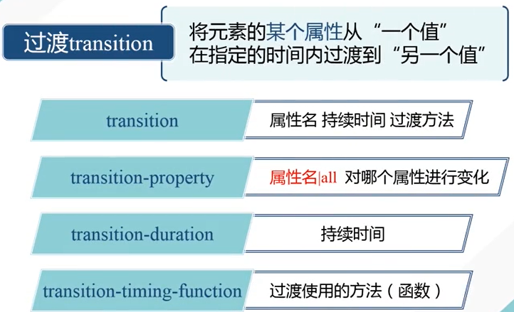

 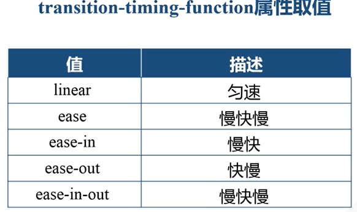

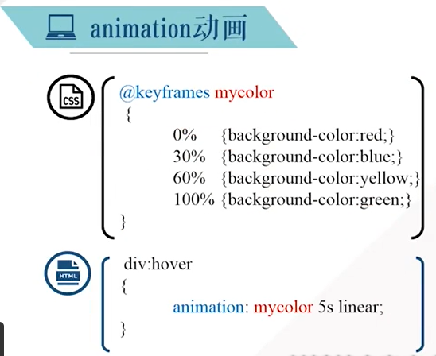

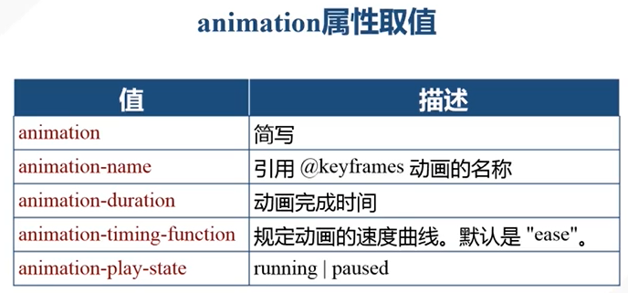

## 3D变换

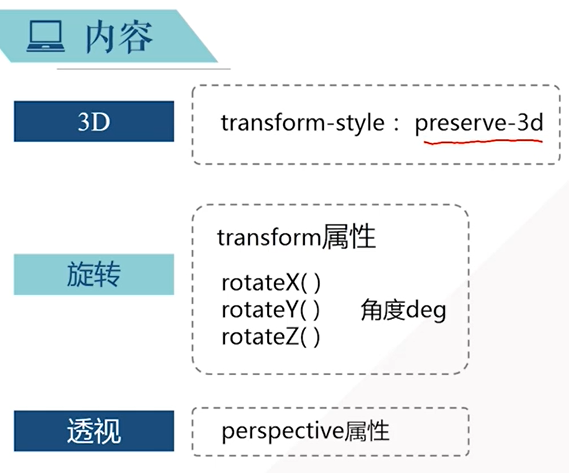

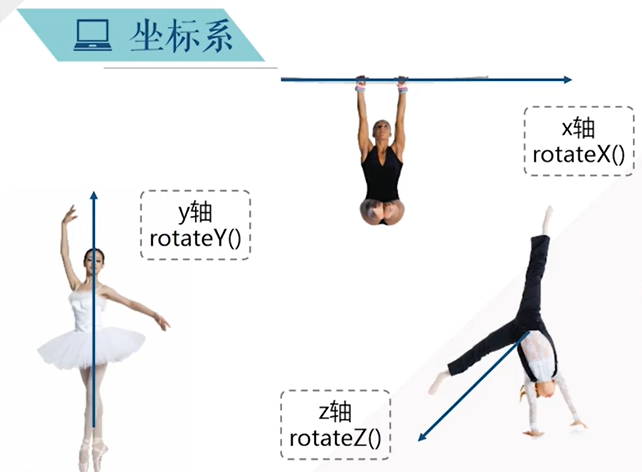

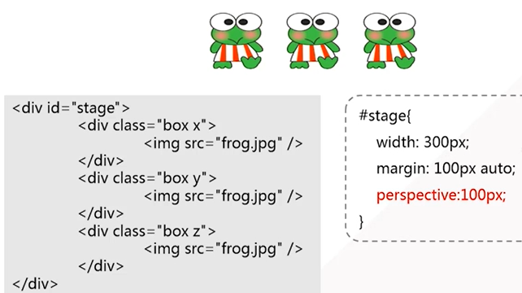

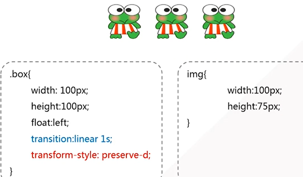

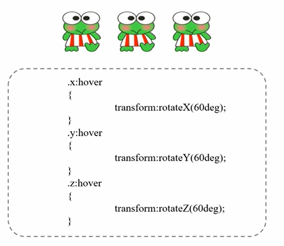

