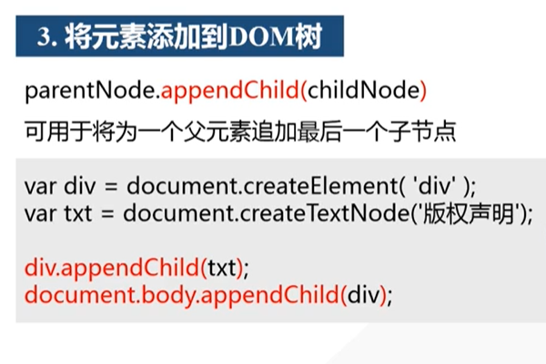

# JavaScript

## Array对象

+ find
+ findInex
+ forEach
+ every
+ some
+ includes
+ map
+ reduce

### 数组转字符串

1、`String(arr)`

将arr中每个元素转为字符串，用逗号分隔

2、`arr.join("连接符")`

### 拼接和选取

1、`concat()`

拼接两个或更多个数组

2、`slice(i, n)`

返回现有数组的一个子数组

### 修改数组

`arr.splice(i, n)`

删除arr中i位置开始的n个元素


## Object对象

### Object.assign()

**语法**

```
Object.assign(target, ...sources)
```

如果目标对象中的属性具有相同的键，则属性将被源对象中的属性覆盖。后面的源对象的属性将类似地覆盖前面的源对象的属性。

**参数**

+ `target`：目标对象
+ `sources`：源对象

## DOM操作

### DOM查找


### DOM修改


### DOM添加

步骤

1. 创建空元素
2. 设置关键属性
3. 将元素添加到DOM树中



