[toc]

# 前端基础

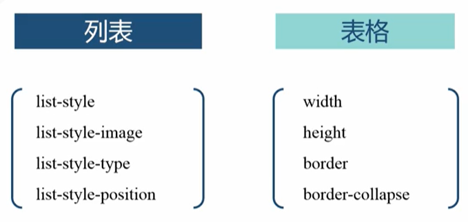

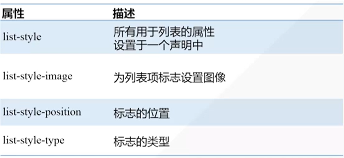

**list-style-type:**

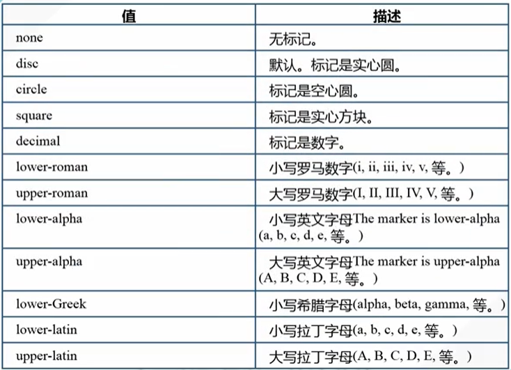

**list-style-postion:**

| 值      | 描述     |
| ------- | -------- |
| inside  | 向右缩进 |
| outside | 向左突出 |

**奇偶选择器：**

:nth-child(odd|even)

# CSS3

## 阴影

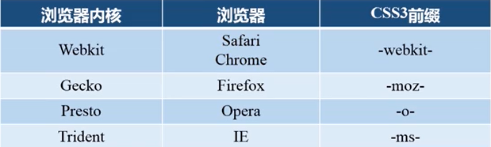

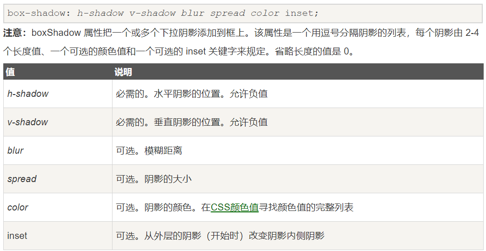

## 文字和文本

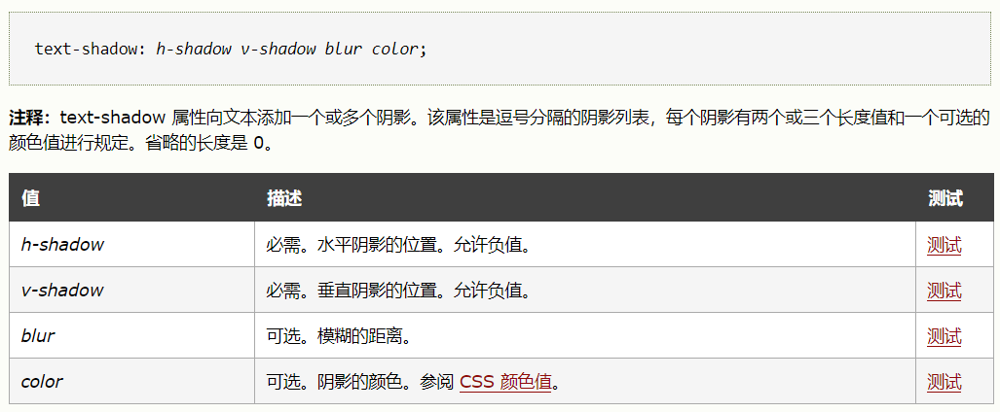

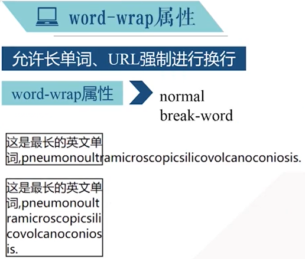

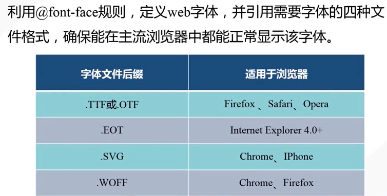

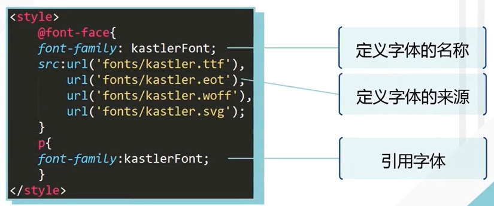

## 2D变换

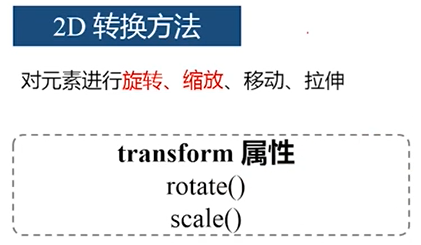

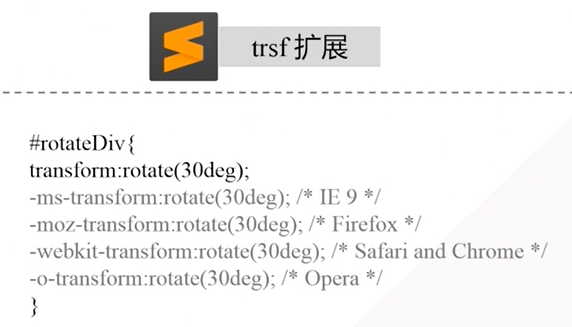

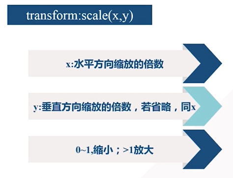

## 过度与动画

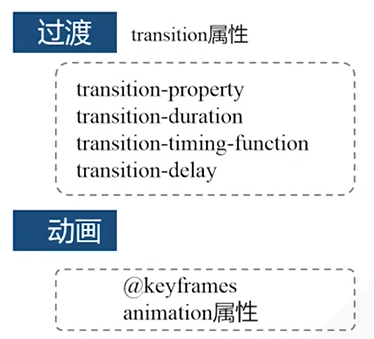

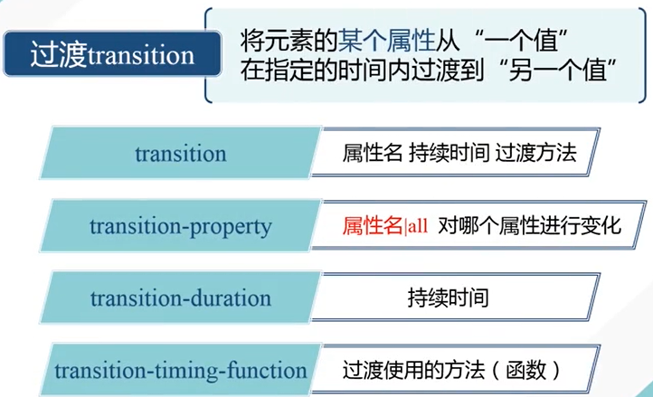

 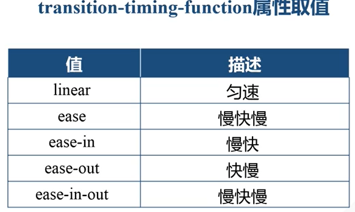

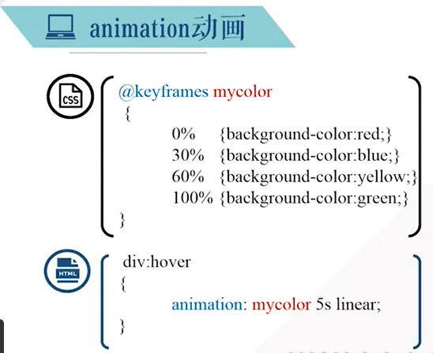

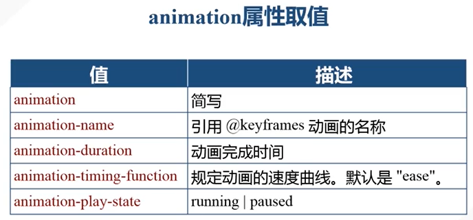

## 3D变换

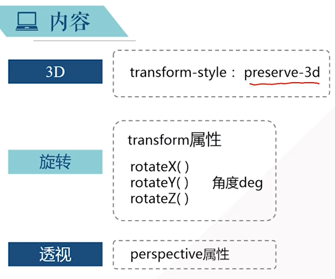

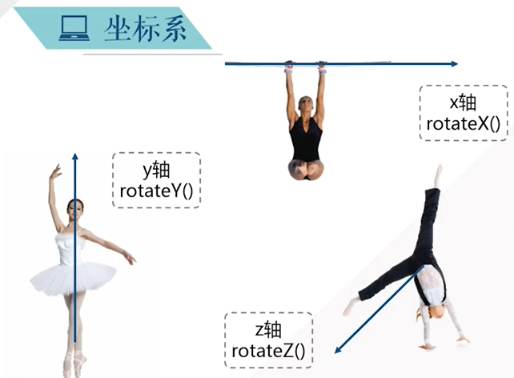

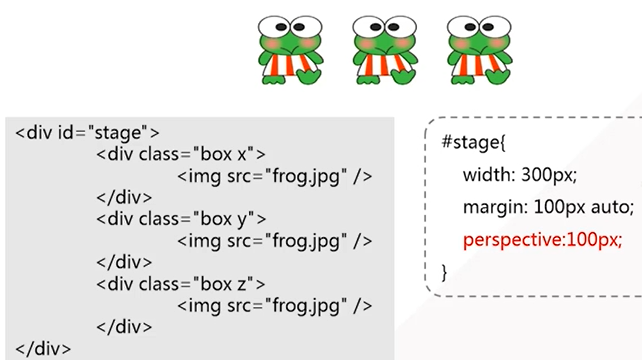

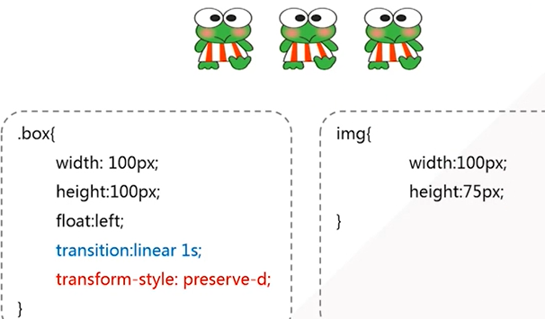

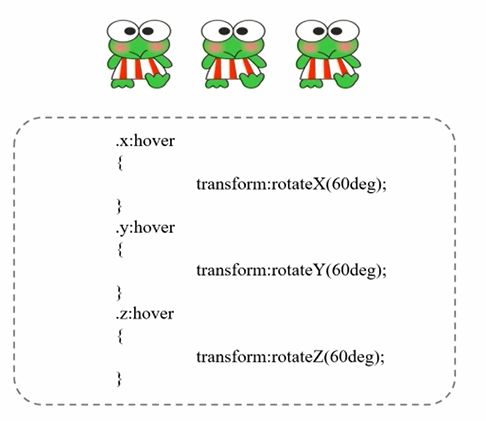

# JavaScript

## 1、数组转字符串

### 1. String(arr)

将arr中每个元素转为字符串，用逗号分隔

### 2. arr.join("连接符")

## 2、拼接和选取

### 1. concat()

拼接两个或更多个数组

### 2. slice(i, n)

返回现有数组的一个子数组

## 3、修改数组

### arr.splice(i, n)

删除arr中i位置开始的n个元素

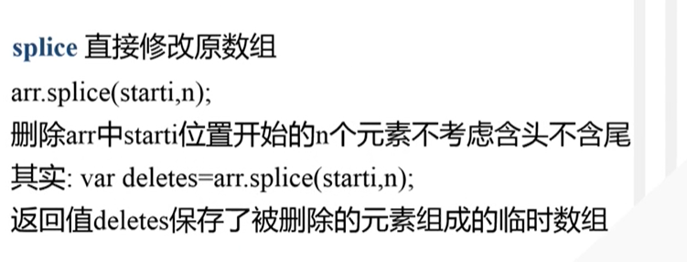

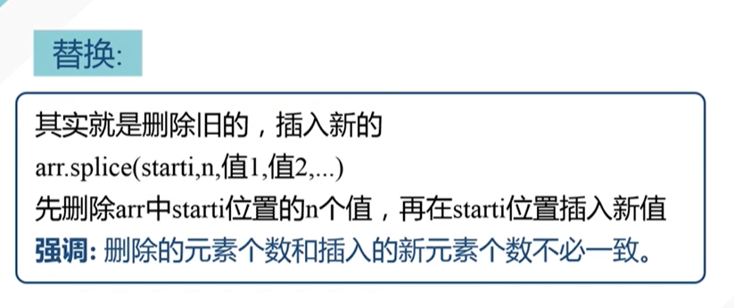

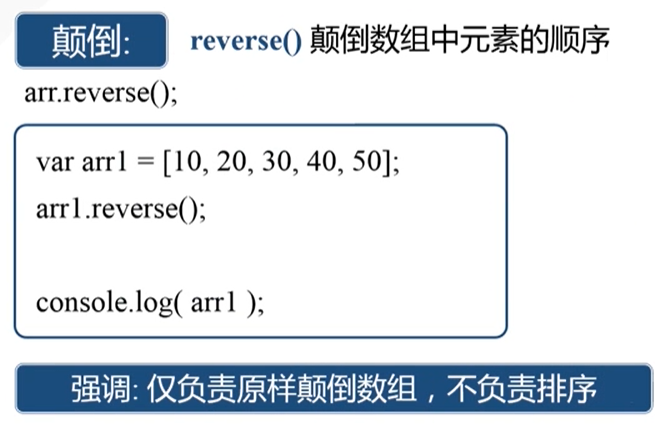

## 4、DOM查找

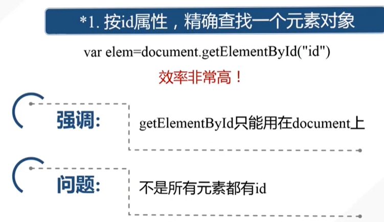

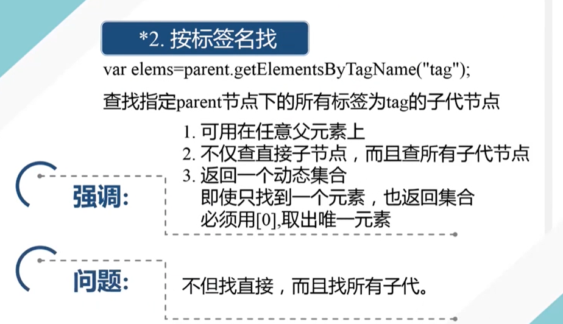

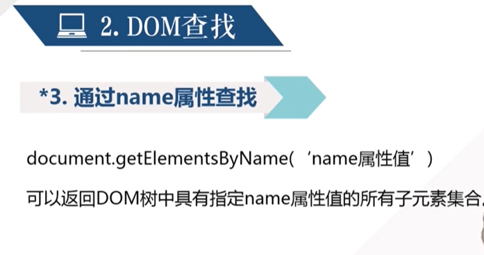

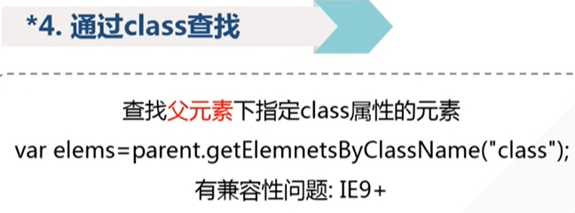

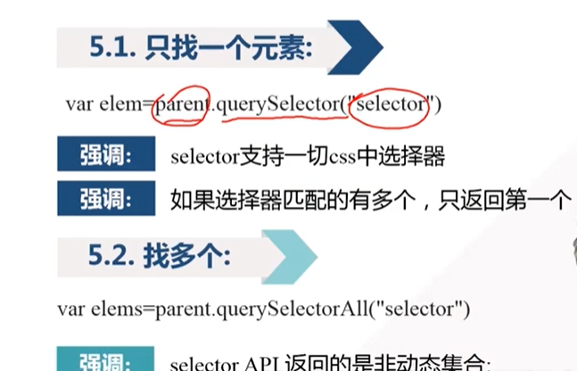

## 5、DOM修改

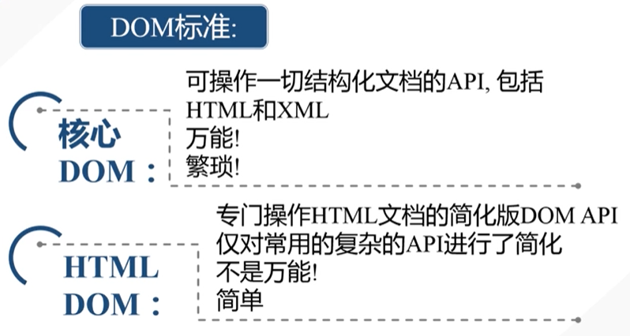

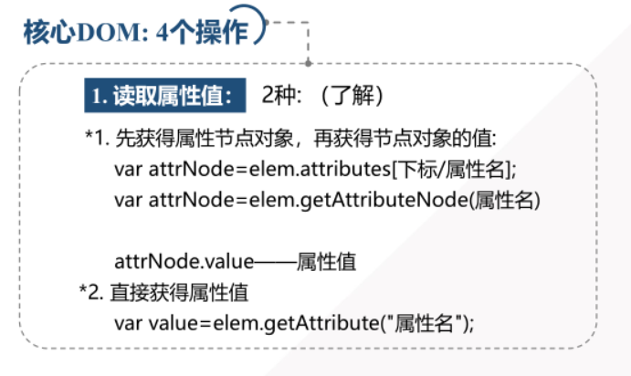

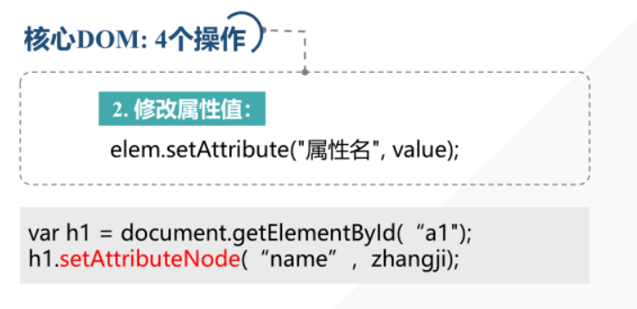

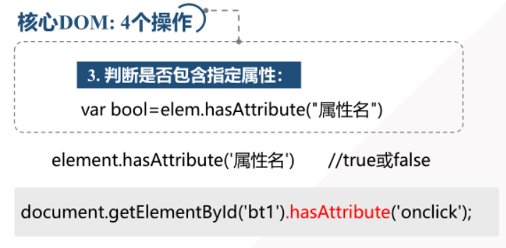

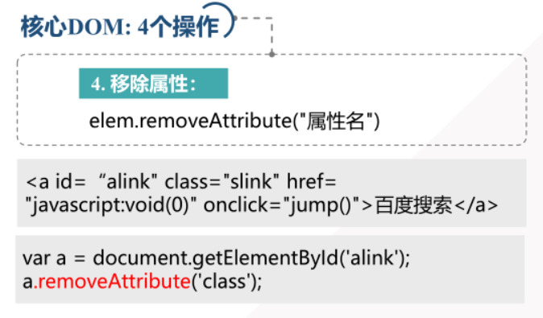

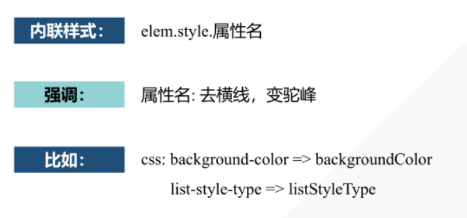

## 6、DOM添加

步骤

1. 创建空元素
2. 设置关键属性
3. 将元素添加到DOM树中

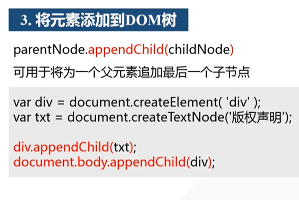