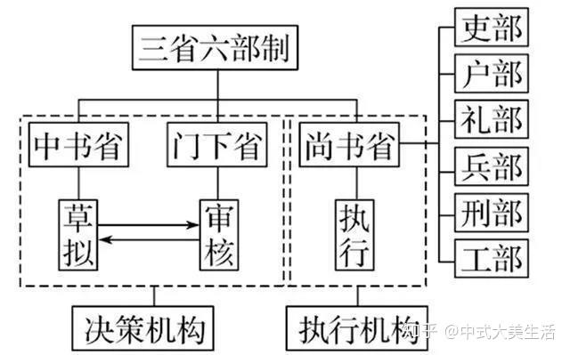

## 三省六部

“三公九卿”，是自先秦开始、延续了千百年的一套官制。到了隋朝，改设三省六部制。

其中“三省”历朝变动较大，而“六部”一直沿袭到清末。

## 三省

**1、中书省**

隋初称“内史省”，是掌管机要、发布政令的机构。

唐宋

+ 以**中书令**为长官，任首席宰相
+ 以**中书侍郎**为副长官，为固定编制的宰相；
+ 以**中书舍人**为核心官职，掌管省内机枢政务。

明朝洪武十三年，中书省废除。

> + **中**：有中心的意思，在官名中，通常表示该官职是属于中央政府的，直接与皇帝或中央政权相关联。
> + **中书**：意指中央的书籍、文翰，也可以理解为中央政府的文书机构，负责起草、审核、颁布文书。
> + **令**：在古代官名中，通常表示该官职是属于地方或者机构的高级官员，类似于现代的领导或者主管。
> + **郎**：郎官通常是指辅助处理事务的官员，一般是做作为副手
>   + “侍郎”可分为左侍郎和右侍郎，分别位于侍中的左右两侧，协助处理各自的事务，因此中侍郎比左右侍郎职位更高一些

**2、门下省**

隋唐时与中书省同掌机要，共议国政，并负责审查诏令，签署章奏，有封驳之权。

长官：侍中，二人，正三品。掌出纳帝命，相礼仪。

元代以后，门下省不再设置。

> + **门**：在古代官名中，通常表示宫门、皇帝的居所，也可以泛指皇帝的身边。
> + **下**：在这里表示附属、隶属。
>
> 综合起来，“门下”指的是皇帝的身边，也可以理解为皇帝身边的机构或官员。

**3、尚书省**

是魏晋至宋的中央最高政令机构，“六部”即从此出。

长官：尚书令，一人，正二品，掌典领百官。

元代尚书省时置时废。明清六部均直接对君主负责，不设尚书省。

> - **尚**：在古代官名中，通常表示尊贵、高尚，也可以理解为主管、领导。
> - **书**：在这里指的是文书、文件。
>
> 综合起来，“尚书”指的是主管文书、文件的高级官员，“省”可以表示部门机构。“尚书省”就是高级官员的机构，也可以理解成高级官员的集合。

## 六部

六部是三省之中尚书省下属的六个部门，为吏部、礼部、兵部、刑部、户部、工部。

每部各辖四司，共为二十四司。

> + **仆**：表示侍奉、辅佐的意思，通常指侍奉君主或高级官员，协助处理政务。
> + **射**：在古代官名中通常表示主管、掌握，这里表示在政务方面具有主管地位。
>
> 综合起来，"仆射"指的是高级官员中负责辅佐主管政务的职位
>
> + **丞**：在古代官名中，“丞”通常表示副职。
>
> "丞"通常是一个官名中的称谓，表示该官员在一定层次中的副职或者助手角色。

+ 吏部

  + 类似今天的中央组织部。
  + 长官为吏部尚书。
  + 掌管天下文官的任免、考课、升降、勋封、调动等事务。
  + 隋唐、五代，吏部为六部之首。

+ 户部

  + 大致相当于现代的民政部和财政部。
  + 长官为户部尚书。
  + 掌管户籍财经的机关。
  + 明清时期户部掌全国疆土、田地 、户籍、赋税、俸饷及一切财政事宜。

+ 礼部

  + 参考今天的外交部、教育部。
  + 长官为礼部尚书。
  + 掌管五礼之仪制及学校贡举之法。
  + 具体：吉、嘉、军、宾、凶五礼；全国学校事务、科举考试、藩属和外国之往来事。

+ 兵部

  + 相当于今日的国防部。
  + 长官为兵部尚书。
  + 掌管武官选用及兵籍、兵械、军令等。

+ 刑部

  + 参考今天的司法部。
  + 长官为刑部尚书。
  + 各朝职责相差较大：隋唐时，刑部只限于对平民及七品以下官员有行刑权，但一般没有处罚权，处罚权基本属于大理寺；
  + 明清两代，刑部作为主管全国刑罚政令及审核刑名的机构，与都察院管稽察、大理寺掌重大案件的最后审理和复核，共为"三法司制"。

+ 工部

  + 参考如今的住房和城乡建设部。
  + 长官为工部尚书。
  + 掌管营造工程事项的机关。
  + 隋代开皇二年始设立工部，掌管各项工程、工匠、屯田、水利。

  

