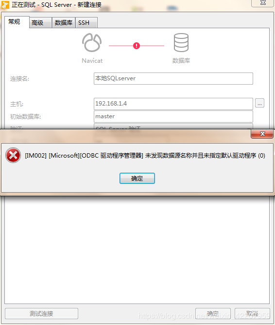
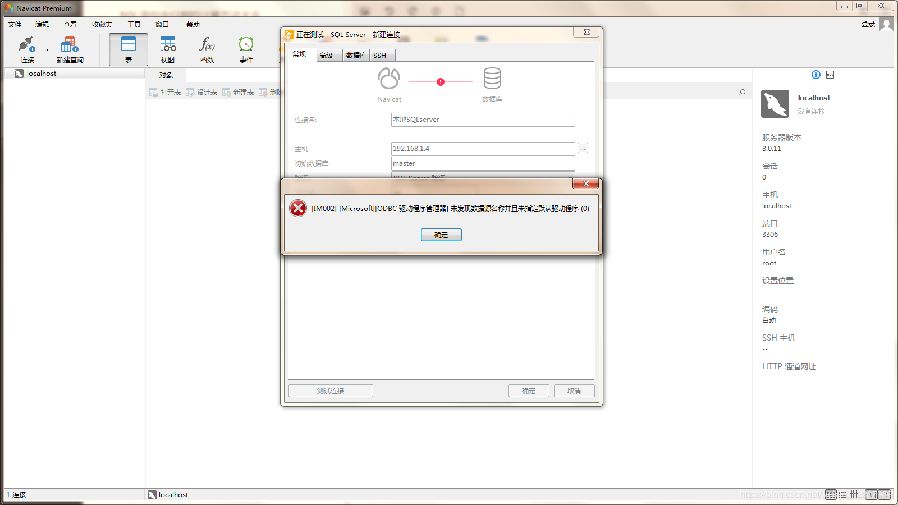
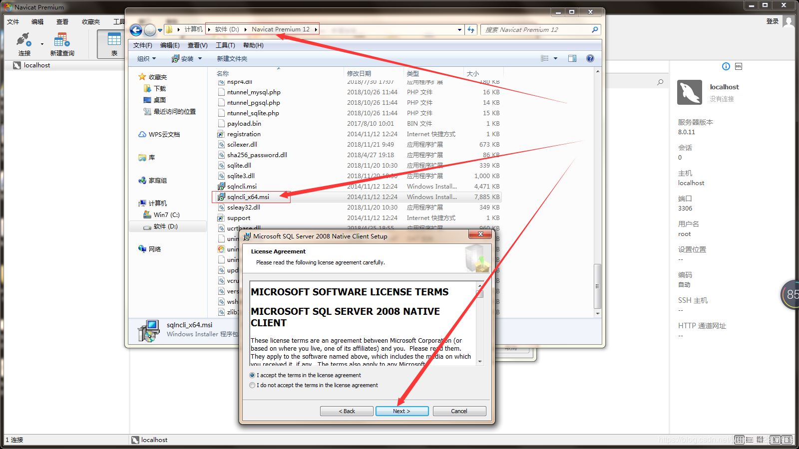
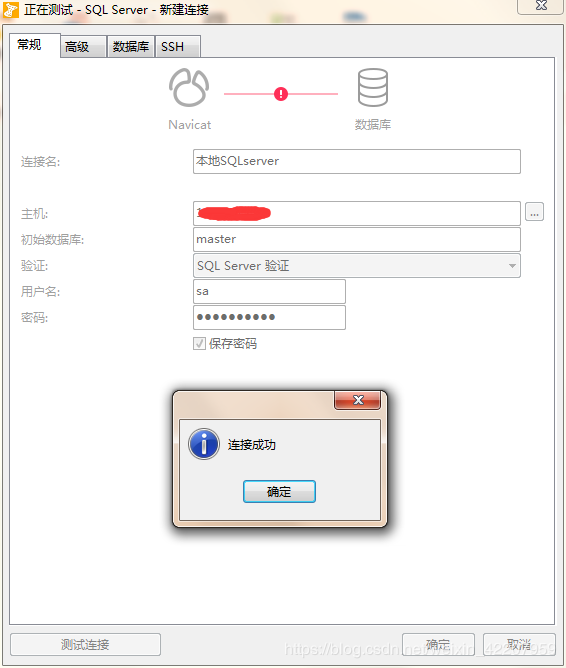

# Docker sqlserver


## 安装

```shell
docker run -e 'ACCEPT_EULA=Y' -e 'SA_PASSWORD=admin123' -p 1433:1433 -v /opt/data/sqlserver/:/var/opt/mssql/data/ --name sqlserver -d mcr.microsoft.com/mssql/server:2017-latest
```


```shell
docker run -e 'ACCEPT_EULA=Y' -e 'SA_PASSWORD=admin123' -e 'SQLSERVER_DATABASE=test' -e 'SQLSERVER_USER=demo' -e 'SQLSERVER_PASSWORD=root' -p 1433:1433 -v /opt/data/sqlserver/:/var/opt/mssql/data/ --name sqlserver -d /sqlserver
```


## 问题

第一次安装navicat premium经常会遇到这个问题，解决很简单，
找到安装目录文件sqlncli_x64.msi，双击安装就可以解决！
下面是详细的图片操作流程：





