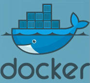
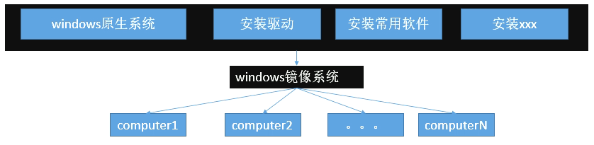
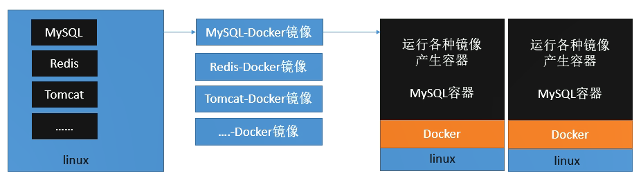
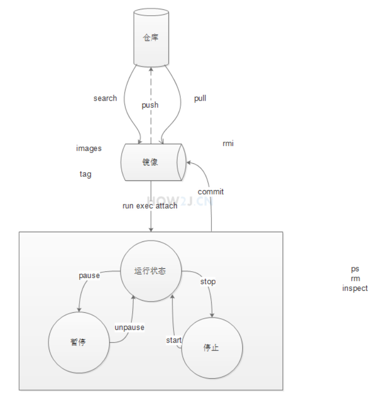
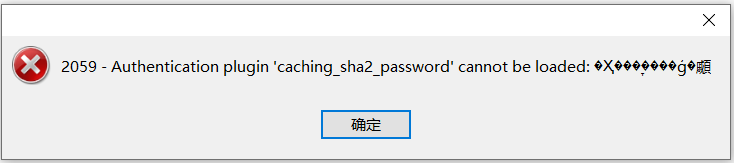
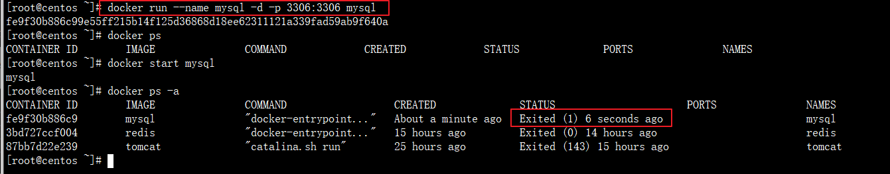
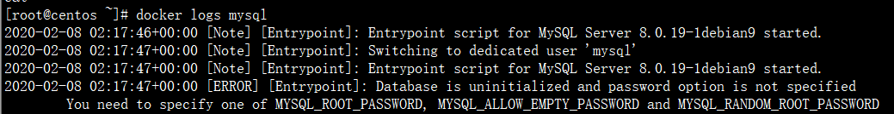
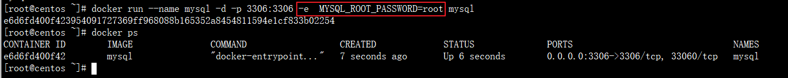

# Docker 教程

## 1、简介

**Docker**是一个开源的应用容器引擎；是一个轻量级容器技术；

Docker支持将软件编译成一个镜像；然后在镜像中各种软件做好配置，将镜像发布出去，其他使用者可以直接使用这个镜像；

运行中的这个镜像称为容器，容器启动是非常快速的。







## 2、核心概念

docker主机(Host)：安装了Docker程序的机器（Docker直接安装在操作系统之上）；

docker客户端(Client)：连接docker主机进行操作；

docker仓库(Registry)：用来保存各种打包好的软件镜像；

docker镜像(Images)：软件打包好的镜像；放在docker仓库中；

docker容器(Container)：镜像启动后的实例称为一个容器；容器是独立运行的一个或一组应用


使用Docker的步骤：

1）、安装Docker

2）、去Docker仓库找到这个软件对应的镜像；

3）、使用Docker运行这个镜像，这个镜像就会生成一个Docker容器；

4）、对容器的启动停止就是对软件的启动停止；

## 3、安装docker

### 3.2 安装

```shell
1、检查内核版本，必须是3.10及以上
uname -r
2、安装docker
yum install docker
3、输入y确认安装
4、启动docker
[root@localhost ~]# systemctl start docker
[root@localhost ~]# docker -v
Docker version 1.12.6, build 3e8e77d/1.12.6
5、开机启动docker
[root@localhost ~]# systemctl enable docker
Created symlink from /etc/systemd/system/multi-user.target.wants/docker.service to /usr/lib/systemd/system/docker.service.
6、停止docker
systemctl stop docker
```

### 3.2 Docker换源

默认docker源下载东西十分的慢，因此需要换源

1、首先修改`daemon.json` 文件

```shell
[root@localhost ~]# vi /etc/docker/daemon.json
```

2、替换成以下内容

```json
{
"registry-mirrors": ["https://mj9kvemk.mirror.aliyuncs.com"]
}
```

3、重启`docker`

```shell
service docker restart
```

演示如下

```shell
[root@localhost ~]# vi /etc/docker/daemon.json
[root@localhost ~]# cat /etc/docker/daemon.json
{
"registry-mirrors": ["https://mj9kvemk.mirror.aliyuncs.com"]
}
[root@localhost ~]# service docker restart
Redirecting to /bin/systemctl restart docker.service
```

## 4、Docker常用命令

### 4.1 镜像相关操作

**1、检索** 

`docker search [keyword]`

**2、拉取**

`docker pull [镜像名]:[tag]`

**3、查看本地镜像**

`docker images`

**4、删除本地镜像**

`docker rmi image-[id]`

Docker的相关镜像可以去[网页](https://hub.docker.com)查看

### 4.2 容器相关操作



**1、运行镜像**

`docker run --name [container-name] -d [image-name]`

`--privileged`：启动容器的时候，把权限带进去

`--name`：自定义容器名

`-d`：后台运行

`-i`：提供交互接口

`-v`：配置文件和持久化存储的挂载，前面的是服务器的文件路径，后面的是容器的路径

`-t`：提供一个 tty (伪终端)，与 -i 配合就可以通过 ssh 工具连接到 这个容器里面去了

`image-name`：指定镜像模板

**2、查看运行中的容器**

`docker ps`

**3、停止运行中的容器**

`docker stop [container-id|container-name]`

**4、查看所有的容器**

`docker ps -a`

**5、删除容器**

`docker rm [container-id|container-name]`

注：容器必须是停止的

**6、端口映射**

`-p [外部端口:内部端口]`

```shell
[root@localhost ~]# docker run -d -p 8080:8080 tomcat
```

**7、查看容器日志**

`docker logs [container-name|container-id]`

### 4.3 其他操作

**1、查看防火墙状态**

`service firewalld status`

**2、临时关闭防火墙**

`service firewalld stop`

**3、以命令行的方式运行容器**

`docker exec -it [container-id|contain-name] bash`

## 5、创建镜像

### MySQL

一般来说数据库容器不需要建立目录映射

```shell
docker run --name mysql -d -p 3306:3306 -e  MYSQL_ROOT_PASSWORD=root mysql
```

- –name：容器名，此处命名为`mysql`
- -e：配置信息，此处配置mysql的root用户的登陆密码
- -p：端口映射，此处映射 主机3306端口 到 容器的3306端口
- -d：后台运行容器，保证在退出终端后容器继续运行

如果要建立目录映射

```shell
duso docker run -p 3306:3306 --name mysql \
-v /usr/local/docker/mysql/conf:/etc/mysql \
-v /usr/local/docker/mysql/logs:/var/log/mysql \
-v /usr/local/docker/mysql/data:/var/lib/mysql \
-e MYSQL_ROOT_PASSWORD=123456 \
-d mysql:5.7
```

- -v：主机和容器的目录映射关系，":"前为主机目录，之后为容器目录

## 6、排错指南

### （1）访问docker中的mysql出错



解决：

1、进入mysql容器命令行中

```shell
[root@localhost ~]# docker exec -it mysql bash
```

2、登录

```shell
 mysql -u root -p
```

3、修改密码

```shell
alter user 'root' identified with mysql_native_password by 'root';
```

实例演示如下

```shell
[root@localhost ~]# docker ps
CONTAINER ID        IMAGE               COMMAND                  CREATED             STATUS              PORTS                               NAMES
70ac6f6a11fd        mysql               "docker-entrypoint..."   5 seconds ago       Up 4 seconds        0.0.0.0:3306->3306/tcp, 33060/tcp   mysql
[root@localhost ~]# docker exec -it mysql bash
root@70ac6f6a11fd:/# mysql -u root -p
Enter password: 
Welcome to the MySQL monitor.  Commands end with ; or \g.
Your MySQL connection id is 8
Server version: 8.0.19 MySQL Community Server - GPL

Copyright (c) 2000, 2020, Oracle and/or its affiliates. All rights reserved.

Oracle is a registered trademark of Oracle Corporation and/or its
affiliates. Other names may be trademarks of their respective
owners.

Type 'help;' or '\h' for help. Type '\c' to clear the current input statement.

mysql> alter user 'root'identified with mysql_native_password by 'root';
Query OK, 0 rows affected (0.18 sec)

```

### （2）创建mysql容器报错

通过docker创建的容器启动后总是非正常关闭



查看错误日志，可以看出，他让我们指定关于密码的参数



正确的创建容器方式，需要显示的指定密码

```shell
[root@centos ~]# docker run --name mysql -d -p 3306:3306 -e  MYSQL_ROOT_PASSWORD=root mysql
```



### （3）Redis相关

1）挂在配置文件

需要添加`-v`参数

```shell
-v /usr/local/redis/redis.conf:/etc/redis/redis.conf
```

2）设置Redis密码

设置密码只需要加上–requirepass

```shell
docker run -d --name myredis -p 6379:6379 redis --requirepass "mypassword"
```

