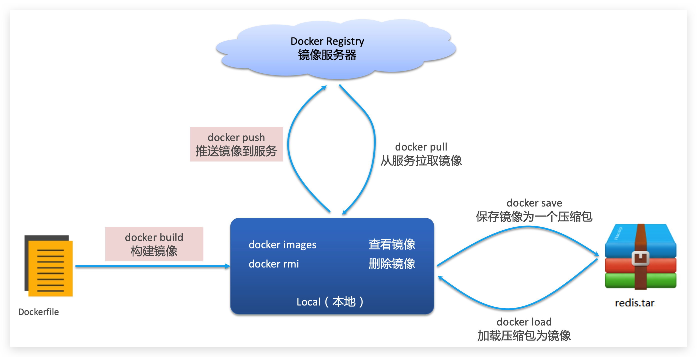
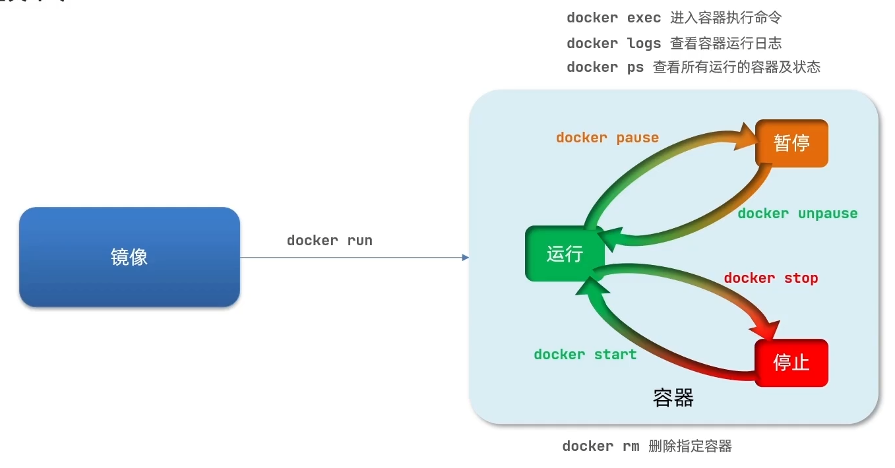
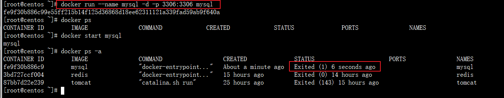

# Docker 教程

## 1、简介

**Docker**是一个开源的应用容器引擎；是一个轻量级容器技术；

Docker支持将软件编译成一个镜像；然后在镜像中各种软件做好配置，将镜像发布出去，其他使用者可以直接使用这个镜像；

运行中的这个镜像称为容器，容器启动是非常快速的。


## 2、核心概念

docker主机(Host)：安装了Docker程序的机器（Docker直接安装在操作系统之上）；

docker客户端(Client)：连接docker主机进行操作；

docker仓库(Registry)：用来保存各种打包好的软件镜像；

docker镜像(Images)：软件打包好的镜像；放在docker仓库中；

docker容器(Container)：镜像启动后的实例称为一个容器；容器是独立运行的一个或一组应用


使用Docker的步骤：

1）、安装Docker

2）、去Docker仓库找到这个软件对应的镜像；

3）、使用Docker运行这个镜像，这个镜像就会生成一个Docker容器；

4）、对容器的启动停止就是对软件的启动停止；

## 3、安装docker

### 3.2 安装

```shell
1、检查内核版本，必须是3.10及以上
uname -r
2、安装docker
yum install docker
3、输入y确认安装
4、启动docker
[root@localhost ~]# systemctl start docker
[root@localhost ~]# docker -v
Docker version 1.12.6, build 3e8e77d/1.12.6
# Docker version 26.1.4 build 5650f9b   —— 2024 年记录的版本
5、开机启动docker
[root@localhost ~]# systemctl enable docker
Created symlink from /etc/systemd/system/multi-user.target.wants/docker.service to /usr/lib/systemd/system/docker.service.
6、停止docker
systemctl stop docker
```

**Ubuntu**

安装命令如下：

```
curl -x http://192.168.56.1:7890 -fsSL https://get.docker.com | bash -s docker --mirror Aliyun
```

~~也可以使用国内 daocloud 一键安装命令：~~（没用了）

```
curl -sSL https://get.daocloud.io/docker | sh
```

### 3.2 Docker换源

默认docker源下载东西十分的慢，因此需要换源

1、首先修改`daemon.json` 文件

```shell
[root@localhost ~]$ vi /etc/docker/daemon.json
```

2、替换成以下内容

```json
{
"registry-mirrors": ["https://u6jsxuzl.mirror.aliyuncs.com"]
}
```

3、重启`docker`

```shell
service docker restart
```

演示如下

```shell
[root@localhost ~]$ vi /etc/docker/daemon.json
[root@localhost ~]$ cat /etc/docker/daemon.json
{
"registry-mirrors": ["https://mj9kvemk.mirror.aliyuncs.com"]
}
[root@localhost ~]$ service docker restart
Redirecting to /bin/systemctl restart docker.service
```

**换其他源，配置如下**

```json
{
  "registry-mirrors" : [
    "http://registry.docker-cn.com",
    "http://docker.mirrors.ustc.edu.cn",
    "http://hub-mirror.c.163.com"
  ],
  "insecure-registries" : [
    "registry.docker-cn.com",
    "docker.mirrors.ustc.edu.cn"
  ], 
  "debug" : true,
  "experimental" : true
}
```

### 3.3 Docker 使用代理

https://docs.docker.com/config/daemon/proxy/#httphttps-proxy

**方法一**，配置`daemon.json`文件：

**注意 json 文件不能有额外的逗号**

`vi /etc/docker/daemon.json`

```python
{
  "proxies": {
    "http-proxy": "http://proxy.example.com:3128",
    "https-proxy": "https://proxy.example.com:3129",
    "no-proxy": "*.test.example.com,.example.org,127.0.0.0/8"
  }
}
```

示例

```
{
  "proxies": {
    "http-proxy": "http://192.168.56.1:7890",
    "https-proxy": "http://192.168.56.1:7890"
  }
}
```

然后重启docker

**方法二**

创建 dockerd 相关的 systemd 目录，这个目录下的配置将覆盖 dockerd 的默认配置

```
$ sudo mkdir -p /etc/systemd/system/docker.service.d
```

新建配置文件 `/etc/systemd/system/docker.service.d/http-proxy.conf`，这个文件中将包含环境变量

```ini
[Service]
Environment="HTTP_PROXY=http://proxy.example.com:80"
Environment="HTTPS_PROXY=https://proxy.example.com:443"
```

如果你自己建了私有的镜像仓库，需要 dockerd 绕过代理服务器直连，那么配置 NO_PROXY 变量：

```ini
[Service]
Environment="HTTP_PROXY=http://proxy.example.com:80"
Environment="HTTPS_PROXY=https://proxy.example.com:443"
Environment="NO_PROXY=your-registry.com,10.10.10.10,*.example.com"
```

多个 `NO_PROXY` 变量的值用逗号分隔，而且可以使用通配符（*），极端情况下，如果 `NO_PROXY=*`，那么所有请求都将不通过代理服务器。

重新加载配置文件，重启 dockerd

```ruby
$ sudo systemctl daemon-reload
$ sudo systemctl restart docker
```

检查确认环境变量已经正确配置：

```
$ sudo systemctl show --property=Environment docker
```

从 docker info 的结果中查看配置项。

这样配置后，应该可以正常拉取 docker 镜像。

## 4、Docker常用命令

### 4.1 镜像相关操作

**1、检索** 

`docker search [keyword]`

**2、拉取**

`docker pull [镜像名]:[tag]`

**3、查看本地镜像**

`docker images`

**4、删除本地镜像**

`docker rmi image-[id]`

Docker的相关镜像可以去[网页](https://hub.docker.com)查看

常见的镜像操作命令如图：



### 4.2 容器相关操作

容器操作的命令如图：



**1、运行镜像**

`docker run --name [container-name] -d [image-name]`

`--privileged`：启动容器的时候，把权限带进去

`--name`：自定义容器名

`-d`：后台运行

`-i`：提供交互接口

`-v`：配置文件和持久化存储的挂载，前面的是服务器的文件路径，后面的是容器的路径

`-t`：提供一个 tty (伪终端)，与 -i 配合就可以通过 ssh 工具连接到 这个容器里面去了

`image-name`：指定镜像模板

**2、查看运行中的容器**

`docker ps`

**3、停止运行中的容器**

`docker stop [container-id|container-name]`

**4、查看所有的容器**

`docker ps -a`

**5、删除容器**

`docker rm [container-id|container-name]`

注：容器必须是停止的

**6、端口映射**

`-p [外部端口:内部端口]`

```shell
[root@localhost ~]# docker run -d -p 8080:8080 tomcat
```

**7、查看容器日志**

`docker logs [container-name|container-id] -f`

跟踪持续查看

### 4.3 数据卷

**数据卷（volume）**是一个虚拟目录，指向宿主机文件系统中的某个目录。


一旦完成数据卷挂载，对容器的一切操作都会作用在数据卷对应的宿主机目录了。

这样，我们操作宿主机的/var/lib/docker/volumes/html目录，就等于操作容器内的/usr/share/nginx/html目录了

数据卷操作的基本语法如下：

```sh
docker volume [COMMAND]
```

docker volume命令是数据卷操作，根据命令后跟随的command来确定下一步的操作：

- create 创建一个volume
- inspect 显示一个或多个volume的信息
- ls 列出所有的volume
- prune 删除未使用的volume
- rm 删除一个或多个指定的volume

**创建和查看数据卷**

**需求**：创建一个数据卷，并查看数据卷在宿主机的目录位置

① 创建数据卷

```sh
docker volume create html
```

② 查看所有数据

```sh
docker volume ls
```

结果：


③ 查看数据卷详细信息卷

```sh
docker volume inspect html
```

结果：


可以看到，我们创建的html这个数据卷关联的宿主机目录为`/var/lib/docker/volumes/html/_data`目录。

**小结**：

数据卷的作用：

- 将容器与数据分离，解耦合，方便操作容器内数据，保证数据安全

数据卷操作：

- docker volume create：创建数据卷
- docker volume ls：查看所有数据卷
- docker volume inspect：查看数据卷详细信息，包括关联的宿主机目录位置
- docker volume rm：删除指定数据卷
- docker volume prune：删除所有未使用的数据卷

**挂载数据卷**

我们在创建容器时，可以通过 -v 参数来挂载一个数据卷到某个容器内目录，命令格式如下：

```sh
docker run \
  --name mn \
  -v html:/root/html \
  -p 8080:80
  nginx \
```

这里的-v就是挂载数据卷的命令：

- `-v html:/root/htm` ：把html数据卷挂载到容器内的/root/html这个目录中


### 4.4 其他操作

**1、查看防火墙状态**

`service firewalld status`

**2、临时关闭防火墙**

`service firewalld stop`

**3、以命令行的方式运行容器**

```shell
docker exec -it [container-id|contain-name] bash
```

**4、复制**

```shell
docker cp [OPTIONS] <source_path> <container>:<destination_path>
docker cp [OPTIONS] <container>:<source_path> <destination_path>
```

## 5、创建容器

### MySQL

一般来说数据库容器不需要建立目录映射

```shell
docker run --name mysql -d -p 3306:3306 -e  MYSQL_ROOT_PASSWORD=root mysql
```

- –name：容器名，此处命名为`mysql`
- -e：配置信息，此处配置mysql的root用户的登陆密码
- -p：端口映射，此处映射 主机3306端口 到 容器的3306端口
- -d：后台运行容器，保证在退出终端后容器继续运行

如果要建立目录映射

```shell
duso docker run -p 3306:3306 --name mysql \
-v /usr/local/docker/mysql/conf:/etc/mysql \
-v /usr/local/docker/mysql/logs:/var/log/mysql \
-v /usr/local/docker/mysql/data:/var/lib/mysql \
-e MYSQL_ROOT_PASSWORD=123456 \
-d mysql:5.7
```

- -v：主机和容器的目录映射关系，":"前为主机目录，之后为容器目录

## 6、高级网络

### 简介

Docker服务默认会创建一个docker0网桥（其上有一个 docker0 内部接口），它在内核层连通了其他的物理或虚拟网卡，这就将所有容器和本地主机都放到同一个物理网络。

Docker默认指定了`docker0`接口的IP地址（172.17.0.1）和子网掩码（255.255.0.0），让主机和容器之间可以通过网桥相互通信，它还给出了`MTU`（接口允许接收的最大传输单元），通常是`1500 Bytes`，或宿主主机网络路由上支持的默认值。这些值都可以在服务启动的时候进行配置。

**注意**

1. 创建容器时将所有容器都连接到 docker0 网桥上，默认在 docker0 网桥的容器都可以使用容器 ip 地址进行通信。
   + 通过 `docker inspect [xxx]`可以查看ip信息
2. 也可以使用容器的名称进行通信，但是<font color=red>使用容器必须自定义网桥而不能使用默认的 docker0</font>

### 网桥

1、查看网桥

```
$ docker network ls
NETWORK ID     NAME                      DRIVER    SCOPE
1dde88146ca8   bridge                    bridge    local
47b70c81e4f8   host                      host      local
63a96f5ed64b   none                      null      local
```

默认网桥：bridge、host、none

2、其他相关命令

```shell
$ docker network --help

Usage:  docker network COMMAND

Manage networks

Commands:
  connect     Connect a container to a network
  create      Create a network
  disconnect  Disconnect a container from a network
  inspect     Display detailed information on one or more networks
  ls          List networks
  prune       Remove all unused networks
  rm          Remove one or more networks
```

3、创建网桥

```
docker network create [-d bridge] (网络名称)
```

4、在指定网络运行容器

```
# 启动时指定网络
docker run -d --network (network-name) ....

# 启动后加入网络
docker network connect (network-name) (container-name|container-id)
```


## 7、排错指南

### （1）访问docker中的mysql出错


解决：

1、进入mysql容器命令行中

```shell
[root@localhost ~]# docker exec -it mysql bash
```

2、登录

```shell
 mysql -u root -p
```

3、修改密码

```shell
alter user 'root' identified with mysql_native_password by 'root';
```

实例演示如下

```shell
[root@localhost ~]# docker ps
CONTAINER ID        IMAGE               COMMAND                  CREATED             STATUS              PORTS                               NAMES
70ac6f6a11fd        mysql               "docker-entrypoint..."   5 seconds ago       Up 4 seconds        0.0.0.0:3306->3306/tcp, 33060/tcp   mysql
[root@localhost ~]# docker exec -it mysql bash
root@70ac6f6a11fd:/# mysql -u root -p
Enter password: 
Welcome to the MySQL monitor.  Commands end with ; or \g.
Your MySQL connection id is 8
Server version: 8.0.19 MySQL Community Server - GPL

Copyright (c) 2000, 2020, Oracle and/or its affiliates. All rights reserved.

Oracle is a registered trademark of Oracle Corporation and/or its
affiliates. Other names may be trademarks of their respective
owners.

Type 'help;' or '\h' for help. Type '\c' to clear the current input statement.

mysql> alter user 'root'identified with mysql_native_password by 'root';
Query OK, 0 rows affected (0.18 sec)

```

### （2）创建mysql容器报错

通过docker创建的容器启动后总是非正常关闭



查看错误日志，可以看出，他让我们指定关于密码的参数


正确的创建容器方式，需要显示的指定密码

```shell
[root@centos ~]# docker run --name mysql -d -p 3306:3306 -e  MYSQL_ROOT_PASSWORD=root mysql
```


### （3）Redis相关

1）挂在配置文件

需要添加`-v`参数

```shell
-v /usr/local/redis/redis.conf:/etc/redis/redis.conf
```

2）设置Redis密码

设置密码只需要加上–requirepass

```shell
docker run -d --name myredis -p 6379:6379 redis --requirepass "mypassword"
```

## 8、不适用 sudo 执行 docker

默认情况下，Docker需要管理员权限。

要以非root用户身份运行Docker命令而不添加[ `sudo` ](https://www.myfreax.com/sudo-command-in-linux/)，您需要将用户添加到`docker`组。该组是在Docker CE软件包安装期间创建的。

~~为此，请运行以下命令：~~（没用）

```bash
sudo usermod -aG docker $USER
```

~~`$USER`是保存您的用户名的环境变量，不用修改，它代表当前登录用户~~


或者

```
sudo gpasswd -a $USER docker #将当前用户添加至docker用户组
newgrp docker #更新docker用户组
```

## 9、修改docker环境变量

```shell
# 查看容器详情
docker inspect ContainID 
# 关闭docker
systemctl stop docker
# 如果关不掉
systemctl stop docker.socket
# 修改容器的json文件
vim  /var/lib/docker/containers/27bdexxxx/config.v2.json
# 启动docker
systemctl start docker
```

## 10、容器自动重启

```shell
docker update --restart=no|always techxuexi 
```

## 11、日志大小与清理

`/opt/docker-sh/docker_log_size.sh` 查所有容器日志大小脚本

```shell
#!/bin/sh
echo "======== docker containers logs file size ========"  
logs=$(find /var/lib/docker/containers/ -name *-json.log)  
for log in $logs  
        do  
             ls -lh $log   
        done 
```


`/opt/docker-sh/clean_docker_log.sh ` 清空所有容器日志脚本

```shell
#!/bin/sh 
echo "======== start clean docker containers logs ========"  
logs=$(find /var/lib/docker/containers/ -name *-json.log)  
for log in $logs  
        do  
                echo "clean logs : $log"  
                cat /dev/null > $log  
        done  
echo "======== end clean docker containers logs ========"  
```


注意添加执行权限 `chmod +x xxx`

## 12、容器打包镜像

```
Usage:  docker commit [OPTIONS] CONTAINER [REPOSITORY[:TAG]]

Create a new image from a container's changes

Aliases:
  docker container commit, docker commit

Options:
  -a, --author string    Author (e.g., "John Hannibal Smith
                         <hannibal@a-team.com>")
  -c, --change list      Apply Dockerfile instruction to the created image
  -m, --message string   Commit message
  -p, --pause            Pause container during commit (default true)
```

示例

```
docker commit -a="angus" -m="angus's tomcat remove doc" b2a3d7b67722  angustomcat:1.0
```


你可以使用 Docker 的 `docker commit` 和 `docker build` 命令来解包镜像、修改内容并重新打包。以下是具体步骤：

1. **解包镜像并运行容器**： 首先，从镜像启动一个容器，将要修改的镜像解包到容器中。

   ```
   docker run -it <image_name> /bin/bash
   ```

   其中，`<image_name>` 是你想要解包的镜像名。

2. **修改容器内容**： 进入容器后，你可以对其内容进行修改，例如在某个文件中添加一行代码。举个例子：

   ```
   echo 'your_new_code_here' >> /path/to/your_file
   ```

3. **提交更改并创建新的镜像**： 修改完成后，退出容器并使用 `docker commit` 创建新的镜像。

   ```
   docker commit <container_id> <new_image_name>
   ```

   其中，`<container_id>` 是你运行的容器 ID，可以通过 `docker ps` 获取，`<new_image_name>` 是你给新镜像起的名字。

4. **重新打包（构建新镜像）**： 你也可以将这些步骤写入一个 `Dockerfile`，然后使用 `docker build` 来重新打包镜像。

   举个例子，先创建一个 `Dockerfile`：

   ```
   FROM <image_name>
   RUN echo 'your_new_code_here' >> /path/to/your_file
   ```

   然后使用以下命令构建新镜像：

   ```
   docker build -t <new_image_name> .
   ```

这样就能解包镜像、添加代码并重新打包。使用 `docker commit` 方法适合对运行中的容器进行快速修改，而 `Dockerfile` 方法更适合自动化和重复使用。


## 13、查看容器挂载的目录

```cmd
docker inspect container_name | grep Mounts -A 20
```

`-A 20` 表示需要查看的行数
