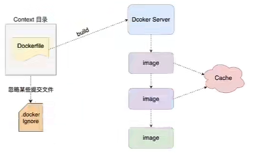

# Dockerfile 笔记

## 简介

Dockerfile就是镜像描述文件，可以通过 Dockerfile 文件构建成一个属于自己的镜像

如何使用 Dockerfile 构建自己的镜像？

1. 在指定位置创建一个 `Dockerfile` 文件，编写 dockerfile 相关语法

2. 通过 Dockerfile 构建镜像

   ```
   docker build -t aa:1.0 .[指定 dockerfile 文件所在位置]
   ```

## 解析过程



## 基础知识

1. 每条保留字指令都必须为大写，且后面都要跟至少一个参数。
2. 指令按照从上到下，顺序执行。
3. #表示注释。
4. 每条指令都会创建一个新的镜像层，并对镜像进行提交。

## 保留命令

官方文档：https://docs.docker.com/engine/reference/builder/

+ FROM：当前镜像是基于哪个镜像的，<font color="red">第一个指令必须是FROM</font>
+ ~~MAINTAINER：镜像维护者的姓名和邮箱地址~~
+ RUN：构建镜像时需要运行的指令
+ EXPOSE：当前容器对外暴露出的端口号
+ WORKDIR：指定在创建容器后，终端默认登录进来的工作目录，一个落脚点
+ ENV：用来在构建镜像过程中设置环境变量
+ ADD：将宿主机目录下的文件拷贝进镜像且ADD命令会自动处理URL和解压tar
  包
+ COPY：类似于ADD，拷贝文件和目录到镜像中。将从构建上下文目录中<原路径>的文件/目录复制到新的一层的镜像内的<目标路径>位置
+ VOLUME：容器数据卷，用于数据保存和持久化工作
+ CMD：指定一个容器启动时要运行的命令。Dockerfiler中可以有多个CMD指令，但只有最后一个生效，CMD会被 `docker run` 之后的参数替换
+ ENTRYPOINT：指定一个容器启动时要运行的命令，ENTRYPOINT 的目的和 CMD 一样，都是在指定容器启动程序及其参数

### FROM

```dockerfile
ARG VERSION=latest
FROM busybox:$VERSION
ARG VERSION
RUN echo $VERSION > image_version
```

### RUN

RUN has 2 forms:

- `RUN <command>` (*shell* form, the command is run in a shell, which by default is `/bin/sh -c` on Linux or `cmd /S /C` on Windows)
- `RUN ["executable", "param1", "param2"]` (*exec* form)

In the *shell* form you can use a `\` (backslash) to continue a single RUN instruction onto the next line. For example, consider these two lines:

```dockerfile
RUN /bin/bash -c 'source $HOME/.bashrc; \
echo $HOME'
```

Together they are equivalent to this single line:

```dockerfile
RUN /bin/bash -c 'source $HOME/.bashrc; echo $HOME'
```

### EXPOSE

> `EXPOSE` 命令只是一个元数据，用于提供关于容器内部服务的信息，以便在容器运行时时可以查看到容器所侦听的端口。
>
> 但并不会实际打开或映射这些端口。它为容器的网络通信提供了一些方便的信息。

```dockerfile
EXPOSE <port> [<port>/<protocol>...]
```

By default, `EXPOSE` assumes TCP. You can also specify UDP:

```dockerfile
EXPOSE 80/udp
```

To expose on both TCP and UDP, include two lines:

```dockerfile
EXPOSE 80/tcp
EXPOSE 80/udp
```

In this case, if you use `-P` with `docker run`, the port will be exposed once for TCP and once for UDP. Remember that `-P` uses an ephemeral high-ordered host port on the host, so the port will not be the same for TCP and UDP.

Regardless of the `EXPOSE` settings, you can override them at runtime by using the `-p` flag. For example

```dockerfile
$ docker run -p 80:80/tcp -p 80:80/udp ...
```

### WORKDIR

```dockerfile
WORKDIR /path/to/workdir
```

 If the `WORKDIR` doesn’t exist, it will be created even if it’s not used in any subsequent `Dockerfile` instruction.

The `WORKDIR` instruction can be used multiple times in a `Dockerfile`. If a relative path is provided, it will be relative to the path of the previous `WORKDIR` instruction. For example:

```dockerfile
WORKDIR /a
WORKDIR b
WORKDIR c
RUN pwd
```

The output of the final `pwd` command in this `Dockerfile` would be `/a/b/c`.

### VOLUME

```
VOLUME xxx
```

你可以把VOLUME理解为，从镜像中**复制**指定卷的文件夹**到本地**`xxx`，然后**再**把本地的该文件夹**挂载**到容器里面去。

### CMD & ENTRYPOINT

用来指定容器启动时默认执行的指令

<font color=red>CMD 指令可以存在多个，但是最有最后一个生效</font>

**使用方式：**

```shell
# 1、直接命令执行
java -jar xxx.jar

# 2、json数组方式(推荐)
['java', '-jar', 'xxx.jar']
```

CMD 可以直接覆盖命令，而 ENTRYPOINT 需要用参数指定需要覆盖的指令

+ CMD：`docker run [images]:[tag] [command] [params] `
+ ENTRYPOINT：`docker run --entrypoint=[command] [images]:[tag] [params]`

**配置使用：**<font color=red>必须使用 json 数组方式</font>

entrypoint 用来书写固定的参数

cmd 用来传递参数

比如：

```
FROM xxx
ENTRYPOINT ['ls']
CMD ['/home']
```

如果我们运行 `docker run xxx:xx`，那么它会执行默认的指令`ls /home`，如果我们想更换地址的话，可以运行`docker run xxx:xx  /root`，这就等效于`ls /root`

## 参数

1、`--network`

使用宿主机的网络来构建 docker

```shell
docker build --network host .
```

2、指定代理

```shell
docker build -t haha . --build-arg https_proxy=http://192.168.31.16:1013 --build-arg http_proxy=http://192.168.31.16:1013
```

