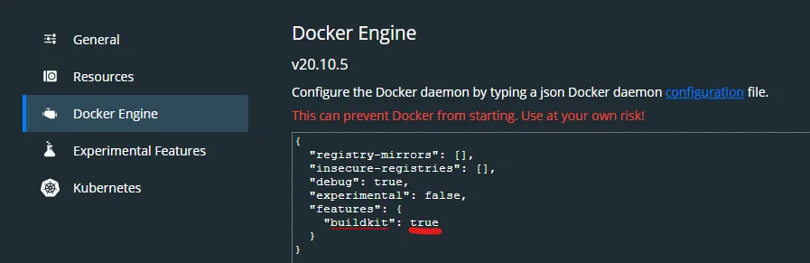

> 译原文：[使用Docker部署由Poetry管理的Python项目的最佳实践](https://blog.csdn.net/2201_75632987/article/details/142000817)
>
> 原文：[Blazing fast Python Docker builds with Poetry](https://medium.com/@albertazzir/blazing-fast-python-docker-builds-with-poetry-a78a66f5aed0)

## 幼稚的做法

我们使用的镜像要有python环境、要下载Poetry、要把我们的代码复制进去、下载依赖和设置项目入口，最简单的做法如下：

```dockerfile
FROM python:3.10.15-bookworm

RUN pip install poetry

COPY . .

RUN poetry install

ENTRYPOINT ["poetry", "run", "python", "-m", "annapurna.main"]
```

在一些项目和教程中看到这样的Dockerfile，非常简单，也容易理解，通过docker build .就能构建起来。但是随着你项目的发展，它会导致构建过程变得复杂和缓慢，镜像也会非常大，接下来我们将会看到如何逐步优化，充分利用缓存加速构建过程和以及减少镜像大小的方法。

## v0.1 简单优化

+ 固定 poetry 版本
+ 编写 `.dockerignore`，忽略 .venv 等其他非代码文件
+ 使用 `poetry install --without dev` 不安装非生产环境必须得依赖

```dockerfile
FROM python:3.10.15-bookworm

RUN pip install poetry==1.4.2

WORKDIR /app

COPY pyproject.toml poetry.lock ./
COPY annapurna ./annapurna

RUN poetry install --without dev

ENTRYPOINT ["poetry", "run", "python", "-m", "annapurna.main"]
```

## v0.2 清除 poetry 缓存

以下优化不推荐，因为缓存在后续的优化方法中可以利用到

+ Poetry支持 `--no-cache` 选项，不产生缓存，但是我可能不会使用它，后面会说明原因（为了利用另一种优化方式【译者】）。
+ 在 RUN 中的命令 `poetry install` 之后，删除缓存目录，确保 `poetry install` 和 `rm` 在同一行命令中，否则 docker 层缓存还会出现在 `rm` 语句之间的层中

```dockerfile
FROM python:3.10.15-bookworm

RUN pip install poetry==1.4.2

ENV POETRY_NO_INTERACTION=1 \
    POETRY_VIRTUALENVS_IN_PROJECT=1 \
    POETRY_VIRTUALENVS_CREATE=1 \
    POETRY_CACHE_DIR=/tmp/poetry_cache

WORKDIR /app

COPY pyproject.toml poetry.lock ./
COPY annapurna ./annapurna

RUN poetry install --without dev && rm -rf $POETRY_CACHE_DIR

ENTRYPOINT ["poetry", "run", "python", "-m", "annapurna.main"]
```

## v0.3 拷贝代码前完成依赖安装

> 对于 docker 缓存存构建，有如下条件：
>
> **COPY 和 ADD 指令：**
>
> - 如果复制的文件没有改变（即文件的内容和上一次构建时相同），Docker 将使用缓存层。
> - 如果任何一个文件发生改变（或时间戳更新），则缓存失效，Docker 会重新执行该指令及其后的所有指令。

由于 COPY 命令在 RUN poetry install 命令之前，所以每当我们修改完代码后，缓存层必会失效，导致每次打包都会重新下载依赖，通过调整这两个命令的顺序，既可优化，不过这要求我们先将依赖 toml 文件先复制过去

```dockerfile
FROM python:3.10.15-bookworm

RUN pip install poetry==1.4.2

ENV POETRY_NO_INTERACTION=1 \
    POETRY_VIRTUALENVS_IN_PROJECT=1 \
    POETRY_VIRTUALENVS_CREATE=1 \
    POETRY_CACHE_DIR=/tmp/poetry_cache

WORKDIR /app

COPY pyproject.toml poetry.lock ./

RUN poetry install --without dev --no-root && rm -rf $POETRY_CACHE_DIR

COPY annapurna ./annapurna

RUN poetry install --without dev

ENTRYPOINT ["poetry", "run", "python", "-m", "annapurna.main"]
```

额外的 `RUN poetry install --without dev` 指令用于在虚拟环境中安装你的项目目录。这是个很用于的例子，如果你需要安装一些自定义脚本的话。需要不需要这一行取决于你的项目。但是无论如何，执行这一步之前你的项目依赖就已经安装好了，这一步的运行速度也会非常快。

## v0.4 多阶段构建

到目前为止，我们的构建速度已经非常快了，但是我们最终的镜像还是很大。我们可以尝试使用多阶段构建来解决。优化的关键在于对于特定的任务阶段选择正确的基础镜像来完成：

+ `python:3.10.15-bookworm`：是一个比较大的镜像，因为它包含很多开发依赖，因此我们将使用它来安装虚拟环境。
+ `python:3.10.15-slim-bookworm`：是一个更小的镜像，这个镜像中只有足以运行Python的最小镜像，我们将会用它来运行我们的应用。

得益于多阶段构建，我们可以把一个阶段的信息传递到另一个阶段，特别是正在构建的虚拟环境：

Poetry不必安装在用于程序运行的阶段。事实上当虚拟环境构建完成，Poetry 对于你的 Python 应用程序来说就编程了不必要的依赖，我们只需要操作环境变量（如VIRTUAL_ENV）就能让 Python 识别正确的虚拟环境。

为了简化，我移除了第二个安装步骤 `RUN poetry install --without dev`，我们示例项目也不需要它（不用让poetry 把你写代码的项目目录安装进虚拟环境中，我们在下载完依赖之后虚拟环境算是构建好了，写代码的项目目录时被COPY到镜像中去的【译者】）。不过，如果需要的话，仍然可以在运行镜像的时候用一条指令来添加它：`RUN pip install poetry && poetry install --without dev && pip uninstall poetry`。

> 当Dockerfile变得复杂的时候，我建议使用Buildkit，这是嵌入Docker CLI的构建套件。它能帮助你快速和安全的构建。

```shell
DOCKER_BUILDKIT=1 docker build --target=runtime .
```

```dockerfile
# The builder image, used to build the virtual environment
FROM python:3.10.15-bookworm AS builder

RUN pip install poetry==1.4.2

ENV POETRY_NO_INTERACTION=1 \
    POETRY_VIRTUALENVS_IN_PROJECT=1 \
    POETRY_VIRTUALENVS_CREATE=1 \
    POETRY_CACHE_DIR=/tmp/poetry_cache

WORKDIR /app

COPY pyproject.toml poetry.lock ./
RUN touch README.md

RUN poetry install --without dev --no-root && rm -rf $POETRY_CACHE_DIR

# The runtime image, used to just run the code provided its virtual environment
FROM python:3.11-slim-buster AS runtime

ENV VIRTUAL_ENV=/app/.venv \
    PATH="/app/.venv/bin:$PATH"

COPY --from=builder ${VIRTUAL_ENV} ${VIRTUAL_ENV}

COPY annapurna ./annapurna

ENTRYPOINT ["python", "-m", "annapurna.main"]
```

## v0.5 Buildkit缓存挂载

我们减小了镜像大小，让只更改代码时的构建速度飞快，我们还能做什么？我们还可以在依赖改变让构建速度也很快。

这个技巧并不广为人知，它相较于之前介绍的那些功能来说比较新颖。它利用了Buildkit缓存挂载功能，Buildkit挂载并管理一个用于缓存的文件夹，有趣的时这个缓存会在多次构建之间持续存在。

通过利用此功能和Poetry的缓存相结合（现在你明白为什么我想要保留缓存了吧？），我们基本上获得了一个每次构建项目时都可以重用的依赖缓存。这样在相同的环境中我们多次构建相同的镜像，构建依赖的过程也能很快。

注意在安装完依赖之后Poetry缓存不会被清理，不然无法在构建过程中存储和重用缓存。这很好，因为Building Kit不会将托管缓存持久化在构建的图像中（另外，它甚至不是我们的运行时镜像）。

```dockerfile
FROM python:3.10.15-bookworm AS builder

RUN pip install poetry==1.4.2

ENV POETRY_NO_INTERACTION=1 \
    POETRY_VIRTUALENVS_IN_PROJECT=1 \
    POETRY_VIRTUALENVS_CREATE=1 \
    POETRY_CACHE_DIR=/tmp/poetry_cache

WORKDIR /app

COPY pyproject.toml poetry.lock ./
RUN touch README.md

RUN --mount=type=cache,target=$POETRY_CACHE_DIR poetry install --without dev --no-root

FROM python:3.11-slim-buster AS runtime

ENV VIRTUAL_ENV=/app/.venv \
    PATH="/app/.venv/bin:$PATH"

COPY --from=builder ${VIRTUAL_ENV} ${VIRTUAL_ENV}

COPY annapurna ./annapurna

ENTRYPOINT ["python", "-m", "annapurna.main"]
```

## 配置 BuildKit 

若要调整 Docker 守护程序的 BuildKit 设置，请按照以下说明操作。

从[这些文档](https://docs.docker.com/develop/develop-images/build_enhancements/#to-enable-buildkit-builds)中了解部分命令行的操作。在 Powershell 中，您可以按以下方式操作：

1. 打开文件，在命令行上，最简单的方法是：

```
notepad "$env:USERPROFILE\.docker\daemon.json"
```

2. 将`"buildkit"`的值更改为`false`，使其看起来像这样：

```
{
  "registry-mirrors": [],
  "insecure-registries": [],
  "debug": true,
  "experimental": false,
  "features": {
    "buildkit": false
  }
}
```

3. 重新启动Docker服务：

```
Restart-Service *docker*
```

----

或者，在Docker Desktop for Windows应用程序中：

打开仪表板 > 设置:

选择**Docker Engine**并编辑 json`"features"`字段，如果它已经为`false`，则无需更改：


