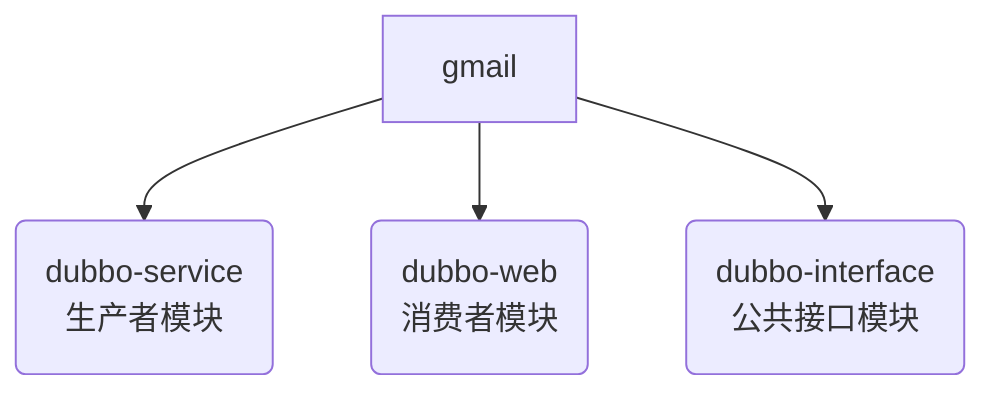

# Dubbo入门案例

## 需求

假设有如下两个服务

+ 消费者 UserController
  + 调用UserServiceImpl的sayHello方法

+ 生产者 UserServiceImpl
  + 提供sayHello方法

上面两个服务在不同的服务器，消费者可以远程调用生产者的功能。

## 工程模块



### 公共接口模块

定义公共接口，并提供给其他模块

1、编写用户接口

```java
package cn.dbstudy.service;

public interface UserService {
    String sayHello();
}
```

2、编写完毕后，进行mvn:install

### 生产者模块

对用户接口的实现，提供相应的服务功能

1、引入依赖

```xml
<artifactId>dubbo-service</artifactId>

<packaging>war</packaging>

<properties>
    <spring.version>5.1.9.RELEASE</spring.version>
    <dubbo.version>2.7.4.1</dubbo.version>
    <zookeeper.version>4.0.0</zookeeper.version>
</properties>

<dependencies>
    <!--spring的坐标-->
    <dependency>
        <groupId>org.springframework</groupId>
        <artifactId>spring-context</artifactId>
        <version>${spring.version}</version>
    </dependency>

    <!--日志-->
    <dependency>
        <groupId>org.slf4j</groupId>
        <artifactId>slf4j-api</artifactId>
        <version>1.7.21</version>
    </dependency>
    <dependency>
        <groupId>org.slf4j</groupId>
        <artifactId>slf4j-log4j12</artifactId>
        <version>1.7.21</version>
    </dependency>

    <!--Dubbo的起步依赖，版本2.7之后统一为rg.apache.dubb -->
    <dependency>
        <groupId>org.apache.dubbo</groupId>
        <artifactId>dubbo</artifactId>
        <version>${dubbo.version}</version>
    </dependency>
    <!--ZooKeeper客户端实现 -->
    <dependency>
        <groupId>org.apache.curator</groupId>
        <artifactId>curator-framework</artifactId>
        <version>${zookeeper.version}</version>
    </dependency>
    <!--ZooKeeper客户端实现 -->
    <dependency>
        <groupId>org.apache.curator</groupId>
        <artifactId>curator-recipes</artifactId>
        <version>${zookeeper.version}</version>
    </dependency>

    <!--公共接口模块-->
    <dependency>
        <groupId>cn.dbstudy</groupId>
        <artifactId>dubbo-interface</artifactId>
        <version>1.0-SNAPSHOT</version>
    </dependency>
</dependencies>

<build>
    <plugins>
        <!--tomcat插件-->
        <plugin>
            <groupId>org.apache.tomcat.maven</groupId>
            <artifactId>tomcat7-maven-plugin</artifactId>
            <version>2.1</version>
            <configuration>
                <port>9000</port>
                <path>/</path>
            </configuration>
        </plugin>
    </plugins>
</build>
```

2、编写配置

2.1 spring配置

```xml
<?xml version="1.0" encoding="UTF-8"?>
<beans xmlns="http://www.springframework.org/schema/beans"
       xmlns:xsi="http://www.w3.org/2001/XMLSchema-instance"
       xmlns:context="http://www.springframework.org/schema/context" xmlns:dubbo="http://dubbo.apache.org/schema/dubbo"
       xsi:schemaLocation="http://www.springframework.org/schema/beans http://www.springframework.org/schema/beans/spring-beans.xsd http://www.springframework.org/schema/context https://www.springframework.org/schema/context/spring-context.xsd http://dubbo.apache.org/schema/dubbo http://dubbo.apache.org/schema/dubbo/dubbo.xsd">

    <!--<context:component-scan base-package="cn.dbstudy.service"/>-->

    <!--1.配置项目的名字，唯一，一般与项目名一致-->
    <dubbo:application name="dubbo-service"/>
    <!--2.配置注册中心的地址-->
    <dubbo:registry address="zookeeper://192.168.56.89:2181"/>
    <!--3.配置dubbo包扫描-->
    <dubbo:annotation package="cn.dbstudy.service"/>
</beans>
```

按以往的经验我们要对标记了`@Service`等注解的包进行扫描，然后他就会帮我们将这些标注了注解的类放到 IoC 容器中，但在本项目中生产者模块和消费者模块会放到两个不同主机上，所以spring的包扫描就没有作用了。

2.2 日志配置

```properties
log4j.rootLogger=info, stdout

log4j.appender.stdout=org.apache.log4j.ConsoleAppender
log4j.appender.stdout.layout=org.apache.log4j.PatternLayout
log4j.appender.stdout.layout.ConversionPattern=%5p %d %C: %m%n
```

2.3 web.xml配置

```xml
<?xml version="1.0" encoding="UTF-8"?>
<web-app xmlns:xsi="http://www.w3.org/2001/XMLSchema-instance"
         xmlns="http://java.sun.com/xml/ns/javaee"
         xsi:schemaLocation="http://java.sun.com/xml/ns/javaee http://java.sun.com/xml/ns/javaee/web-app_2_5.xsd"
         version="2.5">
   <!-- spring -->
    <context-param>
        <param-name>contextConfigLocation</param-name>
        <param-value>classpath*:spring/applicationContext*.xml</param-value>
    </context-param>
    <listener>
        <listener-class>org.springframework.web.context.ContextLoaderListener</listener-class>
    </listener>
</web-app>
```

3、编写代码，实现用户接口

在本模块中，我们要实现所引入dubbo-interface依赖中的用户接口

```java
package cn.dbstudy.service.impl;

import cn.dbstudy.service.UserService;
import org.apache.dubbo.config.annotation.Service;

@Service
public class UserServiceImp implements UserService {

    @Override
    public String sayHello() {
        return "hello dubbo";
    }
}
```

**注意**：

在这里我们<font color=red>使用的是dubbo包下的@Service注解</font>

+ spring内的@Service注解是将该类的对象创建出来，放到 Spring的IOC容器中
+ dubbo内的@Service注解将标注的这个类提供的方法（服务）对外发布。将访问的ip地址，端口，路径注册到注册中心中

### 消费者模块

调用消费者模块的用户接口

1、引入依赖

```xml
<artifactId>dubbo-web</artifactId>

<packaging>war</packaging>

<properties>
    <spring.version>5.1.9.RELEASE</spring.version>
    <dubbo.version>2.7.4.1</dubbo.version>
    <zookeeper.version>4.0.0</zookeeper.version>
</properties>

<dependencies>
    <!-- servlet3.0规范的坐标 -->
    <dependency>
        <groupId>javax.servlet</groupId>
        <artifactId>javax.servlet-api</artifactId>
        <version>3.1.0</version>
        <scope>provided</scope>
    </dependency>
    <!--spring的坐标-->
    <dependency>
        <groupId>org.springframework</groupId>
        <artifactId>spring-context</artifactId>
        <version>${spring.version}</version>
    </dependency>
    <!--springmvc的坐标-->
    <dependency>
        <groupId>org.springframework</groupId>
        <artifactId>spring-webmvc</artifactId>
        <version>${spring.version}</version>
    </dependency>

    <!--日志-->
    <dependency>
        <groupId>org.slf4j</groupId>
        <artifactId>slf4j-api</artifactId>
        <version>1.7.21</version>
    </dependency>
    <dependency>
        <groupId>org.slf4j</groupId>
        <artifactId>slf4j-log4j12</artifactId>
        <version>1.7.21</version>
    </dependency>

    <!--Dubbo的起步依赖，版本2.7之后统一为rg.apache.dubb -->
    <dependency>
        <groupId>org.apache.dubbo</groupId>
        <artifactId>dubbo</artifactId>
        <version>${dubbo.version}</version>
    </dependency>
    <!--ZooKeeper客户端实现 -->
    <dependency>
        <groupId>org.apache.curator</groupId>
        <artifactId>curator-framework</artifactId>
        <version>${zookeeper.version}</version>
    </dependency>
    <!--ZooKeeper客户端实现 -->
    <dependency>
        <groupId>org.apache.curator</groupId>
        <artifactId>curator-recipes</artifactId>
        <version>${zookeeper.version}</version>
    </dependency>


    <!--公共接口模块-->
    <dependency>
        <groupId>cn.dbstudy</groupId>
        <artifactId>dubbo-interface</artifactId>
        <version>1.0-SNAPSHOT</version>
    </dependency>
</dependencies>


<build>
    <plugins>
        <!--tomcat插件-->
        <plugin>
            <groupId>org.apache.tomcat.maven</groupId>
            <artifactId>tomcat7-maven-plugin</artifactId>
            <version>2.1</version>
            <configuration>
                <port>8000</port>
                <path>/</path>
            </configuration>
        </plugin>
    </plugins>
</build>
```

注意和生产者模块不同的是tomcat插件的端口不同，并多引入了spring-webmvc的依赖

2、编写配置

2.1 spring配置

```xml
<?xml version="1.0" encoding="UTF-8"?>
<beans xmlns="http://www.springframework.org/schema/beans"
       xmlns:xsi="http://www.w3.org/2001/XMLSchema-instance"
       xmlns:dubbo="http://dubbo.apache.org/schema/dubbo"
       xmlns:mvc="http://www.springframework.org/schema/mvc"
       xmlns:context="http://www.springframework.org/schema/context"
       xsi:schemaLocation="http://www.springframework.org/schema/beans http://www.springframework.org/schema/beans/spring-beans.xsd
        http://www.springframework.org/schema/mvc http://www.springframework.org/schema/mvc/spring-mvc.xsd
         http://dubbo.apache.org/schema/dubbo http://dubbo.apache.org/schema/dubbo/dubbo.xsd http://www.springframework.org/schema/context https://www.springframework.org/schema/context/spring-context.xsd">

    <mvc:annotation-driven/>
    <context:component-scan base-package="cn.dbstudy.controller"/>

    <!--1.配置项目的名字，唯一，一般与项目名一致-->
    <dubbo:application name="dubbo-web">
        <dubbo:parameter key="qos.port" value="33333"/>
    </dubbo:application>
    <!--2.配置注册中心的地址-->
    <dubbo:registry address="zookeeper://192.168.56.89:2181"/>
    <!--3.配置dubbo包扫描-->
    <dubbo:annotation package="cn.dbstudy.service"/>

</beans>
```

需要注意的是，在`dubbo:application`配置中改变了一下`qos.port`的值，因为演示时使用的是同一台机器，绑定同一个端口会报错，所以在这进行了修改

2.2 日志配置

同生产者模块的日志配置

2.3 web.xml 配置

主要就是配置一下Springmvc

```xml
<?xml version="1.0" encoding="UTF-8"?>
<web-app xmlns:xsi="http://www.w3.org/2001/XMLSchema-instance"
         xmlns="http://java.sun.com/xml/ns/javaee"
         xsi:schemaLocation="http://java.sun.com/xml/ns/javaee http://java.sun.com/xml/ns/javaee/web-app_2_5.xsd"
         version="2.5">
   <!-- Springmvc -->  
    <servlet>
        <servlet-name>springmvc</servlet-name>
        <servlet-class>org.springframework.web.servlet.DispatcherServlet</servlet-class>
        <!-- 指定加载的配置文件 ，通过参数contextConfigLocation加载-->
        <init-param>
            <param-name>contextConfigLocation</param-name>
            <param-value>classpath:spring/springmvc.xml</param-value>
        </init-param>
    </servlet>

    <servlet-mapping>
        <servlet-name>springmvc</servlet-name>
        <url-pattern>*.do</url-pattern>
    </servlet-mapping>

</web-app>
```

3、编写代码，调用用户接口

```java
package cn.dbstudy.controller;

import ...

@RestController
@RequestMapping("/user")
public class UserController {

    @Reference
    private UserService userService;

    @GetMapping("/sayHello")
    public String sayHello() {
        return userService.sayHello();
    }
}
```

这里要注意的是<font color=red>将@Autowired改成了@Reference</font>

+ @Reference
  1. 从zookeeper注册中心获取user Service的访问url
  2. 进行远程调用RPC
  3. 将结果封装为一个代理对象，给注解对象赋值

## 测试

分别运行生产者和消费者模块的mvn:tomcat7命令，然后访问消费者的`/user/sayHello`接口，第一次访问速度会很慢

## 配置总结

```xml
<?xml version="1.0" encoding="UTF-8"?>
<beans xmlns="http://www.springframework.org/schema/beans"
       xmlns:xsi="http://www.w3.org/2001/XMLSchema-instance"
       xmlns:context="http://www.springframework.org/schema/context" xmlns:dubbo="http://dubbo.apache.org/schema/dubbo"
       xsi:schemaLocation="http://www.springframework.org/schema/beans http://www.springframework.org/schema/beans/spring-beans.xsd http://www.springframework.org/schema/context https://www.springframework.org/schema/context/spring-context.xsd http://dubbo.apache.org/schema/dubbo http://dubbo.apache.org/schema/dubbo/dubbo.xsd">

    <!--1.配置项目的名字，唯一，一般与项目名一致-->
    <dubbo:application name="dubbo-service">
        <dubbo:parameter key="qos.port" value="22223"/>
    </dubbo:application>
    <!--2.配置注册中心的地址-->
    <dubbo:registry address="zookeeper://192.168.56.89:2181"/>
    <!--3.配置dubbo包扫描-->
    <dubbo:annotation package="cn.dbstudy.dubbo.service"/>
    <!---->
    <dubbo:protocol name="dubbo" port="20881" />
    <!--k-->
    <dubbo:metadata-report address="zookeeper://192.168.56.89:2181" />
</beans>
```

 
