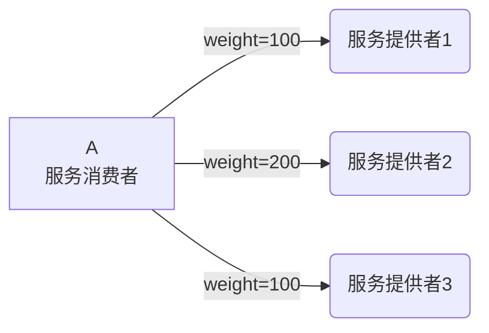
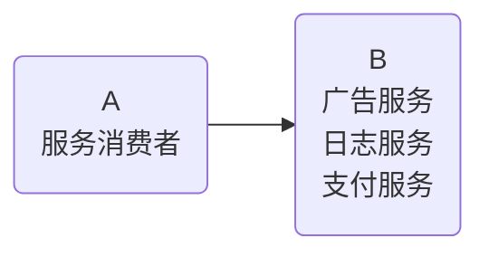

# Dubbo高级特性

## dubbo-admin

1、介绍

+ dubbo-admin 管理平台，是图形化的服务管理页面

+ 从注册中心中获取到所有的提供者 / 消费者进行配置管理

+ 路由规则、动态配置、服务降级、访问控制、权重调整、负载均衡等管理功能

+ dubbo-admin 是一个前后端分离的项目。前端使用vue，后端使用springboot

+ 安装 dubbo-admin 其实就是部署该项目

2、部署

先从github上搜索dubbo-admin，然后下载release，解压到目录后，在dubbo-admin-server模块下找到application.properties修改zookeeper的地址

```properties
admin.registry.address=zookeeper://192.168.56.89:2181
admin.config-center=zookeeper://192.168.56.89:2181
admin.metadata-report.address=zookeeper://192.168.56.89:2181
```

因为第一次启动可能连接zookeeper的时间很长，所以要设置长一点的超时时间

```properties
dubbo.registry.timeout=30000
```

3、查看元数据

我们需要打开我们的生产者spring配置文件加入下面配置

```xml
<!-- 元数据配置 -->
<dubbo:metadata-report address="zookeeper://192.168.149.135:2181" />
```

重新启动生产者，再次打开Dubbo-Admin就能查看元数据了

## 序列化

**两个机器传输数据，如何传输Java对象？**

dubbo 内部已经将序列化和反序列化的过程内部封装了，我们只需要在定义pojo类时<font color=red>实现Serializable接口</font>即可

一般会定义一个公共的pojo模块，让生产者和消费者都依赖该模块。

## 地址缓存

**注册中心挂了，服务是否可以正常访问？**

可以，因为dubbo服务消费者在第一次调用时，会将服务提供方地址缓存到本地，以后在调用则不会访问注册中心。

当服务提供者地址发生变化时，注册中心会通知服务消费者。

## 超时与重试

+ 超时

  + 服务消费者在调用服务提供者的时候发生了阻塞、等待的情形，这个时候，服务消费者会一直等待下去。

  + 在某个峰值时刻，大量的请求都在同时请求服务消费者，会造成线程的大量堆积，势必会造成雪崩。
  + dubbo 利用超时机制来解决这个问题，设置一个超时时间，在这个时间段内，无法完成服务访问，则自动断开连接。
  + 使用timeout属性配置超时时间，默认值1000，单位毫秒。

+ 重试

  + 设置了超时时间，在这个时间段内，无法完成服务访问，则自动断开连接。
  + 如果出现网络抖动，则这一次请求就会失败。
  + Dubbo 提供重试机制来避免类似问题的发生。
  + 通过 retries  属性来设置重试次数。默认为 2 次。

1、服务提供者端设置（推荐）

```java
package cn.dbstudy.dubbo.service.impl;

...
import org.apache.dubbo.config.annotation.Service;

@Service(timeout = 1000, retries = 2)
public class UserServiceImp implements UserService {
```

2、服务调用者设置（可覆盖提供者端的配置）

```java
@RestController
@RequestMapping("/user")
public class UserController {

    @Reference(timeout = 1000, retries = 2)
    private UserService userService;
```

## 多版本

+ 灰度发布：当出现新功能时，会让一部分用户先使用新功能，用户反馈没问题时，再将所有用户迁移到新功能。
+ dubbo 中使用version 属性来设置和调用同一个接口的不同版本

服务提供者

```java
package cn.dbstudy.dubbo.service.impl;

...
import org.apache.dubbo.config.annotation.Service;

@Service(version = "v1.0")
public class UserServiceImp implements UserService {
```

服务调用者

```java
@RestController
@RequestMapping("/user")
public class UserController {
    
    @Reference(timeout = 1000, retries = 2, version = "v1.0")
    private UserService userService;
```

## 负载均衡



```java
public class UserController {

    @Reference(loadbalance = RoundRobinLoadBalance.NAME)
    private UserService userService;
```

负载均衡策略（4种）：

+ Random ：按权重随机，默认值。按权重设置随机概率。
+ RoundRobin ：按权重轮询。
+ LeastActive：先调用活跃调用数最少的机器，若活跃数相同则在其中随机调用。
+ ConsistentHash：一致性 Hash，相同参数的请求总是发到同一提供者。

在idea中双击shift，然后搜索`AbstractLoadBalance`，然后查询它的子类就能找到所有的策略

## 集群容错

```java
public class UserController {

    @Reference(cluster = FailoverCluster.NAME)
    private UserService userService;
```

集群容错模式：

+ Failover Cluster：失败重试。默认值。当出现失败，重试其它服务器 ，默认重试2次，使用 retries 配置。一般用于读操作
+ Failfast Cluster ：快速失败，只发起一次调用，失败立即报错。通常用于写操作。
+ Failsafe Cluster ：失败安全，出现异常时，直接忽略。返回一个空结果。
+ Failback Cluster ：失败自动恢复，后台记录失败请求，定时重发。通常用于消息通知操作。
+ Forking Cluster ：并行调用多个服务器，只要一个成功即返回。
+ Broadcast  Cluster ：广播调用所有提供者，逐个调用，任意一台报错则报错。

在idea中双击shift，然后搜索`Cluster`，然后查询它的子类就能找到所有的策略

## 服务降级



当机器B的访问量过大时，比如CPU，内存占用量快达到峰值了，这时需要将一些不必要的服务关闭，清理内存，保证重要的服务能正常运行，这就是服务降级

```java
public class UserController {
    
    @Reference(mock = "force:return null")
    private UserService userService;
```

服务降级方式：

+ `mock=force:return null`表示消费方对该服务的方法调用都直接返回null值，不发起远程调用。用来屏蔽不重要服务不可用时对调用方的影响。
+ `mock=fail:return null`表示消费方对该服务的方法调用在失败后，再返回null值，不抛异常。用来容忍不重要服务不稳定时对调用方的影响

