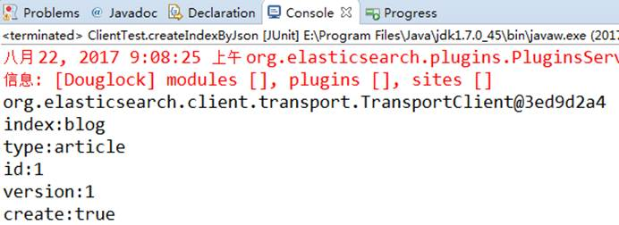
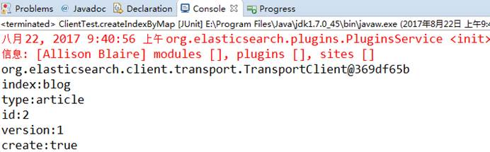
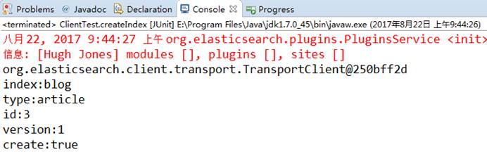
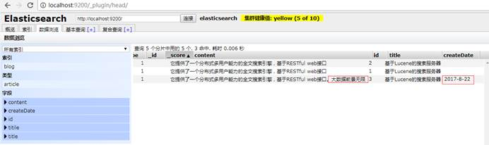
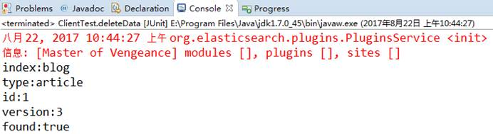

[toc]

# Elasticsearch 笔记

# 一、核心概念

（1）近实时

近实时，两个意思，从写入数据到数据可以被搜索到有一个小延迟（大概1秒）；基于es执行搜索和分析可以达到秒级

（2） Cluster（集群）

集群包含多个节点，每个节点属于哪个集群是通过一个配置（集群名称，默认是elasticsearch）来决定的，对于中小型应用来说，刚开始一个集群就一个节点很正常

（3）Node（节点）

集群中的一个节点，节点也有一个名称（默认是随机分配的），节点名称很重要（在执行运维管理操作的时候），默认节点会去加入一个名称为“elasticsearch”的集群，如果直接启动一堆节点，那么它们会自动组成一个elasticsearch集群，当然一个节点也可以组成一个elasticsearch集群。

**（4）Index（索引-数据库）**

索引包含一堆有**相似结构**的文档数据，比如可以有一个客户索引，商品索引，订单索引，索引有一个名称。

**（5）Type（类型-表）**

每个索引里都可以有一个或多个type，type是index中的一个**逻辑数据分类**，一个type下的document，都有相同的field，比如博客系统，有一个索引，可以定义用户数据type，博客数据type，评论数据type。

**（6）Document（文档-行）**

文档是es中的**最小数据单元**，一个document可以是一条客户数据，一条商品分类数据，通常用**JSON数据**结构表示，每个index下的type中，都可以去存储多个document。

**（7）Field（字段-列）**

Field是Elasticsearch的**最小单位**。一个document里面有多个field，每个field就是一个数据字段。

**（8）mapping（映射-约束）**

数据如何存放到索引对象上，需要有一个映射配置，包括：数据类型、是否存储、是否分词等。

## **Elasticsearch与数据库的类比**

| 关系型数据库（比如Mysql） | 非关系型数据库（Elasticsearch） |
| ------------------------- | ------------------------------- |
| 数据库Database            | 索引Index                       |
| 表Table                   | 类型Type                        |
| 数据行Row                 | 文档Document                    |
| 数据列Column              | 字段Field                       |
| 约束 Schema               | 映射Mapping                     |

## 配置文件

`conf/elasticsearch.yml`配置如下

```yml
# 集群名称
cluster.name: "es_cluster"
 
# 节点名称,这儿我直接取名为 master
node.name: master
# 是否可以成为master节点
node.master: true
# 是否允许该节点存储数据,默认开启
node.data: true
 
# 网络绑定,这里我绑定 0.0.0.0,支持外网访问
network.host: 0.0.0.0
 
# 设置对外服务的http端口，默认为9200
http.port: 9200
 
# 支持跨域访问
http.cors.enabled: true
http.cors.allow-origin: "*"
 
# 设置节点间交互的tcp端口,默认是9300
transport.tcp.port: 9300
 
# 手动指定可以成为 mater 的所有节点的 name 或者 ip，这些配置将会在第一次选举中进行计算
cluster.initial_master_nodes: ["127.0.0.1"]
```

## Docker安装

 dokcer中安装elastic search

（1）下载ealastic search和kibana

```shell
docker pull elasticsearch:7.6.2
docker pull kibana:7.6.2
```

（2）配置

```shell
mkdir -p /dockerdata/elasticsearch/config
mkdir -p /dockerdata/elasticsearch/data
echo "http.host: 0.0.0.0" >/dockerdata/elasticsearch/config/elasticsearch.yml
chmod -R 777 /dockerdata/elasticsearch/
```

（3）启动Elastic search

```shell
docker run --name elasticsearch -p 9200:9200 -p 9300:9300 \
-e  "discovery.type=single-node" \
-e ES_JAVA_OPTS="-Xms64m -Xmx512m" \
-v /dockerdata/elasticsearch/config/elasticsearch.yml:/usr/share/elasticsearch/config/elasticsearch.yml \
-v /dockerdata/elasticsearch/data:/usr/share/elasticsearch/data \
-v  /dockerdata/elasticsearch/plugins:/usr/share/elasticsearch/plugins \
-d elasticsearch:7.6.2 
```

设置开机启动elasticsearch

```shell
docker update elasticsearch --restart=always
```

（4）启动kibana：

```shell
docker run --name kibana -e ELASTICSEARCH_HOSTS=http://192.168.137.14:9200 -p 5601:5601 -d kibana:7.6.2
```

设置开机启动kibana

```shell
docker update kibana  --restart=always
```

（5）测试

查看elasticsearch版本信息： http://192.168.137.14:9200/ 

```json
{
    "name": "0adeb7852e00",
    "cluster_name": "elasticsearch",
    "cluster_uuid": "9gglpP0HTfyOTRAaSe2rIg",
    "version": {
        "number": "7.6.2",
        "build_flavor": "default",
        "build_type": "docker",
        "build_hash": "ef48eb35cf30adf4db14086e8aabd07ef6fb113f",
        "build_date": "2020-03-26T06:34:37.794943Z",
        "build_snapshot": false,
        "lucene_version": "8.4.0",
        "minimum_wire_compatibility_version": "6.8.0",
        "minimum_index_compatibility_version": "6.0.0-beta1"
    },
    "tagline": "You Know, for Search"
}
```

显示elasticsearch 节点信息http://192.168.137.14:9200/_cat/nodes ，

```json
127.0.0.1 76 95 1 0.26 1.40 1.22 dilm * 0adeb7852e00
```

访问Kibana： http://192.168.137.14:5601/app/kibana 

# 二、Java API操作

## 1、获取客户端对象

```java
public void getClient() throws UnknownHostException {
    //设置连接集群名称
    Settings settings = Settings.builder().put("cluster.name", "my-application").build();
    //获取客户端对象
    TransportClient client = new PreBuiltTransportClient(settings);
    client.addTransportAddress(new InetSocketTransportAddress(InetAddress.getLocalHost(), 9300));

    System.out.println(client.toString());
}
```

## 2、创建和删除索引

```java
//创建索引
public void createIndex(){
	client.admin().indices().prepareCreate("blog").get();
	client.close();
}
```

```java
//删除索引
public void deleteIndex(){
	client.admin().indices().prepareDelete("blog").get();
	client.close();
}
```

## 3、新建文档

### （1）源数据json串

当直接在ElasticSearch建立文档对象时，如果索引不存在的，默认会自动创建，映射采用默认方式。

ElasticSearch服务默认端口9300，Web管理平台端口9200

```java
@Test
public void createIndexByJson() throws UnknownHostException {
    // 1 文档数据准备
    String json = "{" + "\"id\":\"1\"," + "\"title\":\"基于Lucene的搜索服务器\","
    + "\"content\":\"它提供了一个分布式多用户能力的全文搜索引擎，基于RESTful web接口\"" + "}";

    // 2 创建文档
    IndexResponse indexResponse = client.prepareIndex("blog", "article", "1").setSource(json).execute().actionGet();

    // 3 打印返回的结果
    System.out.println("index:" + indexResponse.getIndex());
    System.out.println("type:" + indexResponse.getType());
    System.out.println("id:" + indexResponse.getId());
    System.out.println("version:" + indexResponse.getVersion());
    System.out.println("result:" + indexResponse.getResult());

    // 4 关闭连接
    client.close();
}

```



### （2）源数据map方式添加json

```java
@Test
	public void createIndexByMap() {

		// 1 文档数据准备
		Map<String, Object> json = new HashMap<String, Object>();
		json.put("id", "2");
		json.put("title", "基于Lucene的搜索服务器");
		json.put("content", "它提供了一个分布式多用户能力的全文搜索引擎，基于RESTful web接口");

		// 2 创建文档
		IndexResponse indexResponse = client.prepareIndex("blog", "article", "2").setSource(json).execute().actionGet();

		// 3 打印返回的结果
		System.out.println("index:" + indexResponse.getIndex());
		System.out.println("type:" + indexResponse.getType());
		System.out.println("id:" + indexResponse.getId());
		System.out.println("version:" + indexResponse.getVersion());
		System.out.println("result:" + indexResponse.getResult());

		// 4 关闭连接
		client.close();
	}

```




### （3）源数据es构建器添加json

```java
@Test
	public void createIndex() throws Exception {

		// 1 通过es自带的帮助类，构建json数据
		XContentBuilder builder = XContentFactory.jsonBuilder()
            .startObject()
            	.field("id", 3)
				.field("title", "基于Lucene的搜索服务器")
            	.field("content", "它提供了一个分布式多用户能力的全文搜索引擎，基于RESTful web接口。")
            .endObject();

		// 2 创建文档
		IndexResponse indexResponse =
            client.prepareIndex("blog","article","3").setSource(builder).get();

		// 3 打印返回的结果
		System.out.println("index:" + indexResponse.getIndex());
		System.out.println("type:" + indexResponse.getType());
		System.out.println("id:" + indexResponse.getId());
		System.out.println("version:" + indexResponse.getVersion());
		System.out.println("result:" + indexResponse.getResult());

		// 4 关闭连接
		client.close();
	}

```



## 4、搜索文档数据

### （1）单个索引 

```JAVA
@Test
	public void getData() throws Exception {
		
		// 1 查询文档
		GetResponse response = client.prepareGet("blog", "article", "1").get();
		
		// 2 打印搜索的结果
		System.out.println(response.getSourceAsString());
		
		// 3 关闭连接
		client.close();
	}

```


### （2）多个索引

```java
@Test
public void getMultiData() {

    // 1 查询多个文档
    MultiGetResponse response = client.prepareMultiGet()
        .add("blog", "article", "1")
        .add("blog", "article", "2", "3")
        .add("blog", "article", "2").get();

    // 2 遍历返回的结果
    for(MultiGetItemResponse itemResponse:response){
        GetResponse getResponse = itemResponse.getResponse();
        // 如果获取到查询结果
        if (getResponse.isExists()) {
            String sourceAsString = getResponse.getSourceAsString();
            System.out.println(sourceAsString);
        }
    }
    // 3 关闭资源
    client.close();
}

```

结果

```json
{"id":"1","title":"基于Lucene的搜索服务器","content":"它提供了一个分布式多用户能力的全文搜索引擎，基于RESTful web接口"}
{"content":"它提供了一个分布式多用户能力的全文搜索引擎，基于RESTful web接口","id":"2","title":"基于Lucene的搜索服务器"}
{"id":3,"titile":"ElasticSearch是一个基于Lucene的搜索服务器","content":"它提供了一个分布式多用户能力的全文搜索引擎，基于RESTful web接口。"}
{"content":"它提供了一个分布式多用户能力的全文搜索引擎，基于RESTful web接口","id":"2","title":"基于Lucene的搜索服务器"}
```

## 5、更新文档数据

### （1）update

```java
@Test
public void updateData() throws Throwable {

    // 1 创建更新数据的请求对象
    UpdateRequest updateRequest = new UpdateRequest();
    updateRequest.index("blog");
    updateRequest.type("article");
    updateRequest.id("3");

    updateRequest.doc(XContentFactory.jsonBuilder().startObject()
                      // 对没有的字段添加, 对已有的字段替换
                      .field("title", "基于Lucene的搜索服务器")
                      .field("content",
                             "它提供了一个分布式多用户能力的全文搜索引擎，基于RESTful web接口。大数据前景无限")
                      .field("createDate", "2017-8-22").endObject());

    // 2 获取更新后的值
    UpdateResponse indexResponse = client.update(updateRequest).get();

    // 3 打印返回的结果
    System.out.println("index:" + indexResponse.getIndex());
    System.out.println("type:" + indexResponse.getType());
    System.out.println("id:" + indexResponse.getId());
    System.out.println("version:" + indexResponse.getVersion());
    System.out.println("create:" + indexResponse.getResult());

    // 4 关闭连接
    client.close();
}

```



### （2）upsert

设置查询条件, 查找不到则添加IndexRequest内容，查找到则按照UpdateRequest更新。

```java
@Test
public void testUpsert() throws Exception {

    // 设置查询条件, 查找不到则添加
    IndexRequest indexRequest = new IndexRequest("blog", "article", "5")
    .source(XContentFactory.jsonBuilder().startObject().field("title", "搜索服务器").field("content","它提供了一个分布式多用户能力的全文搜索引擎，基于RESTful web接口。Elasticsearch是用Java开发的，并作为Apache许可条款下的开放源码发布，是当前流行的企业级搜索引擎。设计用于云计算中，能够达到实时搜索，稳定，可靠，快速，安装使用方便。").endObject());

    // 设置更新, 查找到更新下面的设置
    UpdateRequest upsert = new UpdateRequest("blog", "article", "5")
    .doc(XContentFactory.jsonBuilder().startObject().field("user", "李四").endObject()).upsert(indexRequest);

    client.update(upsert).get();
    client.close();
}
```

第一次执行

hadoop102:9200/blog/article/5


第二次执行

hadoop102:9200/blog/article/5


## 6、删除文档数据

```java
@Test
public void deleteData() {

    // 1 删除文档数据
    DeleteResponse indexResponse = client.prepareDelete("blog", "article", "5").get();

    // 2 打印返回的结果
    System.out.println("index:" + indexResponse.getIndex());
    System.out.println("type:" + indexResponse.getType());
    System.out.println("id:" + indexResponse.getId());
    System.out.println("version:" + indexResponse.getVersion());
    System.out.println("found:" + indexResponse.getResult());

    // 3 关闭连接
    client.close();
}
```



## 7、条件查询

### （1）查询所有

```java
@Test
public void matchAllQuery() {

    // 1 执行查询
    SearchResponse searchResponse = client.prepareSearch("blog")
        .setTypes("article")
    	.setQuery(QueryBuilders.matchAllQuery()).get();

    // 2 打印查询结果
    SearchHits hits = searchResponse.getHits(); // 获取命中次数，查询结果有多少对象
    System.out.println("查询结果有：" + hits.getTotalHits() + "条");

    Iterator<SearchHit> iterator = hits.iterator();

    while (iterator.hasNext()) {
        SearchHit searchHit = iterator.next(); // 每个查询对象

        System.out.println(searchHit.getSourceAsString()); // 获取字符串格式打印
    }

    // 3 关闭连接
    client.close();
}
```


### （2）对所有字段分词查询

```java
@Test
public void query() {
    // 1 条件查询
    SearchResponse searchResponse = client.prepareSearch("blog").setTypes("article")
        .setQuery(QueryBuilders.queryStringQuery("全文")).get();

    // 2 打印查询结果
    SearchHits hits = searchResponse.getHits(); // 获取命中次数，查询结果有多少对象
    System.out.println("查询结果有：" + hits.getTotalHits() + "条");

    Iterator<SearchHit> iterator = hits.iterator();

    while (iterator.hasNext()) {
        SearchHit searchHit = iterator.next(); // 每个查询对象

        System.out.println(searchHit.getSourceAsString()); // 获取字符串格式打印
    }

    // 3 关闭连接
    client.close();
}
```

### （3）通配符查询

*：表示多个字符（任意的字符）

？：表示单个字符

```java
@Test
public void wildcardQuery() {

    // 1 通配符查询
    SearchResponse searchResponse = client.prepareSearch("blog").setTypes("article")
    .setQuery(QueryBuilders.wildcardQuery("content", "*全*")).get();

    // 2 打印查询结果
    SearchHits hits = searchResponse.getHits(); // 获取命中次数，查询结果有多少对象
    System.out.println("查询结果有：" + hits.getTotalHits() + "条");

    Iterator<SearchHit> iterator = hits.iterator();

    while (iterator.hasNext()) {
        SearchHit searchHit = iterator.next(); // 每个查询对象

        System.out.println(searchHit.getSourceAsString()); // 获取字符串格式打印
    }

    // 3 关闭连接
    client.close();
}

```


### （4）词条查询

```java
@Test
public void termQuery() {

    // 1 第一field查询
    SearchResponse searchResponse = client.prepareSearch("blog").setTypes("article")
    .setQuery(QueryBuilders.termQuery("content", "全")).get();

    // 2 打印查询结果
    SearchHits hits = searchResponse.getHits(); // 获取命中次数，查询结果有多少对象
    System.out.println("查询结果有：" + hits.getTotalHits() + "条");

    Iterator<SearchHit> iterator = hits.iterator();

    while (iterator.hasNext()) {
        SearchHit searchHit = iterator.next(); // 每个查询对象

        System.out.println(searchHit.getSourceAsString()); // 获取字符串格式打印
    }

    // 3 关闭连接
    client.close();
}
```


### （5）模糊查询

```java
@Test
	public void fuzzy() {
		
		// 1 模糊查询
		SearchResponse searchResponse = client.prepareSearch("blog").setTypes("article")
				.setQuery(QueryBuilders.fuzzyQuery("title", "lucene")).get();
		
		// 2 打印查询结果
		SearchHits hits = searchResponse.getHits(); // 获取命中次数，查询结果有多少对象
		System.out.println("查询结果有：" + hits.getTotalHits() + "条");

		Iterator<SearchHit> iterator = hits.iterator();

		while (iterator.hasNext()) {
			SearchHit searchHit = iterator.next(); // 每个查询对象

			System.out.println(searchHit.getSourceAsString()); // 获取字符串格式打印
		}

		// 3 关闭连接
		client.close();
	}

```

## 8、映射相关操作

```java
@Test
	public void createMapping() throws Exception {
		
		// 1设置mapping
		XContentBuilder builder = XContentFactory.jsonBuilder()
				.startObject()
					.startObject("article")
						.startObject("properties")
							.startObject("id1")
								.field("type", "string")
								.field("store", "yes")
							.endObject()
							.startObject("title2")
								.field("type", "string")
								.field("store", "no")
							.endObject()
							.startObject("content")
								.field("type", "string")
								.field("store", "yes")
							.endObject()
						.endObject()
					.endObject()
				.endObject();

		// 2 添加mapping
		PutMappingRequest mapping = Requests.putMappingRequest("blog4").type("article").source(builder);
		
		client.admin().indices().putMapping(mapping).get();
		
		// 3 关闭资源
		client.close();
	}

```

