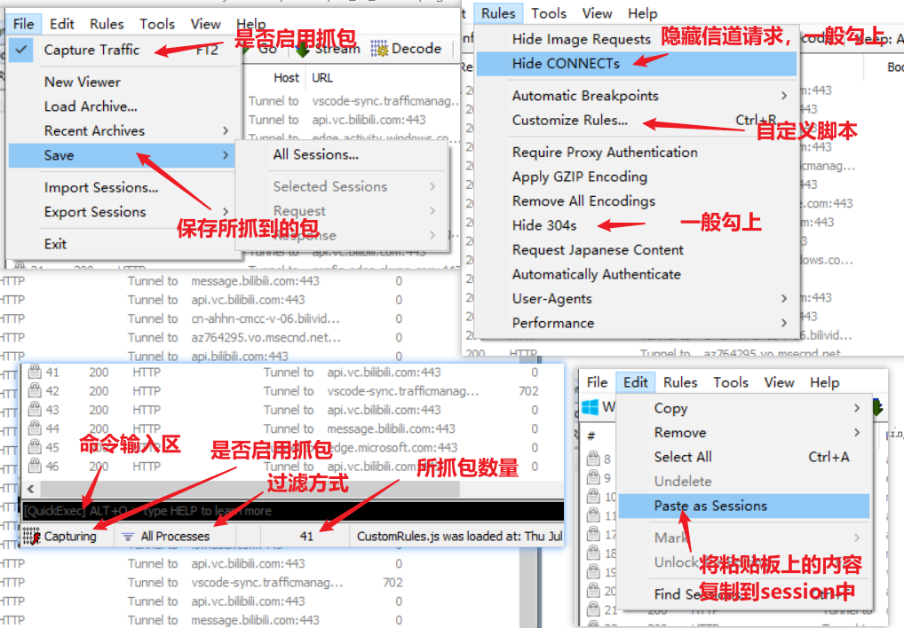
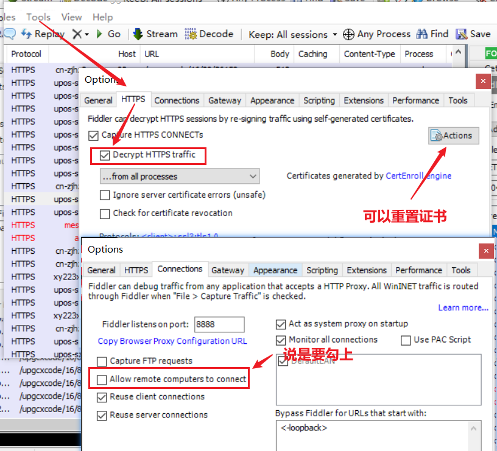

# Fiddler笔记

## 界面介绍

## 抓取https

## 手机抓取包

1. 首先手机电脑要连接同一个局域网
2. 手机访问电脑fiddler所代理的端口，然后安装证书即可

## 其他

+ 基于工具层面的接口测试
  + fiddle , cherles , postman , jmeter , cookie,session , token , http , webserivce ,dubbo ,

+ jenkins集成，mock server搭建

+ 金融︰接口鉴权，接口关联，接口加解密，接口签名

+ 自动化测试
  + httprunner目前唯一的市面上基于yaml的接口自动化测试框架。不重复的造轮子，只组装战车。
  + requests的接口自动化测试框架“（主流）
    + request的二次封装
    + yaml的二次封装
    + 基础封装
    + pytest+allure
    + ini配置文件
    + 日志监控
    + jenkins 等等

