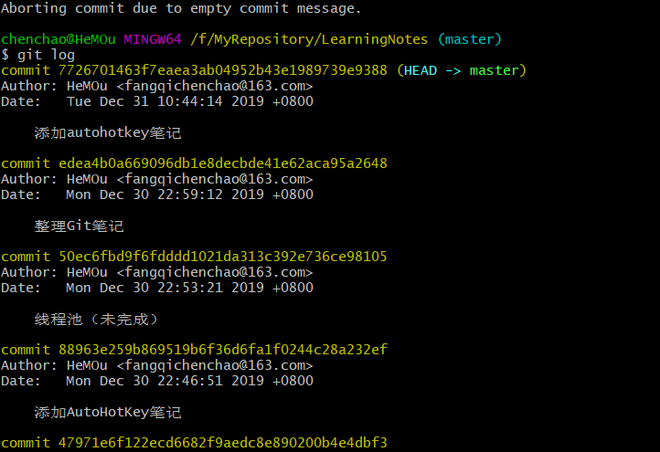
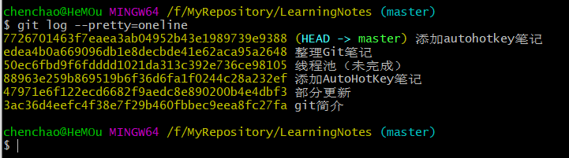

[TOC]


# Git学习

## 一、Git简介

### 1、Git的诞生

Git是什么？

Git是目前世界上最先进的分布式版本控制系统（没有之一）。

Git有什么特点？简单来说就是：高端大气上档次！

那什么是版本控制系统？

如果你用Microsoft Word写过长篇大论，那你一定有这样的经历：

想删除一个段落，又怕将来想恢复找不回来怎么办？有办法，先把当前文件“另存为……”一个新的Word文件，再接着改，改到一定程度，再“另存为……”一个新文件，这样一直改下去，最后你的Word文档变成了这样：


过了一周，你想找回被删除的文字，但是已经记不清删除前保存在哪个文件里了，只好一个一个文件去找，真麻烦。

看着一堆乱七八糟的文件，想保留最新的一个，然后把其他的删掉，又怕哪天会用上，还不敢删，真郁闷。

更要命的是，有些部分需要你的财务同事帮助填写，于是你把文件Copy到U盘里给她（也可能通过Email发送一份给她），然后，你继续修改Word文件。一天后，同事再把Word文件传给你，此时，你必须想想，发给她之后到你收到她的文件期间，你作了哪些改动，得把你的改动和她的部分合并，真困难。

于是你想，如果有一个软件，不但能自动帮我记录每次文件的改动，还可以让同事协作编辑，这样就不用自己管理一堆类似的文件了，也不需要把文件传来传去。如果想查看某次改动，只需要在软件里瞄一眼就可以，岂不是很方便？

这个软件用起来就应该像这个样子，能记录每次文件的改动：

| 版本 |   文件名    | 用户 |          说明          |    日期    |
| :--- | :---------: | :--: | :--------------------: | :--------: |
| 1    | service.doc | 张三 |  删除了软件服务条款5   | 7/12 10:38 |
| 2    | service.doc | 张三 | 增加了License人数限制  | 7/12 18:09 |
| 3    | service.doc | 李四 | 财务部门调整了合同金额 | 7/13 9:51  |
| 4    | service.doc | 张三 |   延长了免费升级周期   | 7/14 15:17 |

这样，你就结束了手动管理多个“版本”的史前时代，进入到版本控制的20世纪。

### 2、Git的安装

安装完git后，在桌面右击找到`git bash here`即可弹出git命令窗口

接着开始进一步配置，在命令函中输入

```git
$ git config --global user.name "Your Name"
$ git config --global user.email "email@example.com"
```

如下图


因为Git是分布式版本控制系统，所以，每个机器都必须自报家门：你的名字和Email地址。你也许会担心，如果有人故意冒充别人怎么办？这个不必担心，首先我们相信大家都是善良无知的群众，其次，真的有冒充的也是有办法可查的。

注意`git config`命令的`--global`参数，用了这个参数，表示你这台机器上所有的Git仓库都会使用这个配置，当然也可以对某个仓库指定不同的用户名和Email地址。

## 二、创建版本库

### 1、git init 创建版本库

在想要的地方创建一个文件夹，打开文件夹后，右击鼠标`git bash here`，然后再命令行窗口输入`git init`，即可在当前文件夹创建一个版本库。如下

```git
$ git init
Initialized empty Git repository in /Users/michael/learngit/.git/
```

所有的版本控制系统，只能跟踪**文本文件**的改动，比如TXT文件，网页，所有的程序代码等等，Git也不例外。版本控制系统可以告诉你每次的改动，比如在第5行加了一个单词“Linux”，在第8行删了一个单词“Windows”。而图片、视频这些二进制文件，虽然也能由版本控制系统管理，但没法跟踪文件的变化，只能把二进制文件每次改动串起来，也就是只知道图片从100KB改成了120KB，但到底改了啥，版本控制系统则没法知道。

这时，当前文件夹就成为了一个仓库，此文件夹的所有内容的增删改都会被记录，但此文件夹之外的文件则不做处理。

### 2、git add 将文件添加到仓库

可以使用`git add`来告诉当前文件需要被添加到仓库，只有被添加的文件才能被提交到仓库，如下

```git
$ git add readme.txt
```

上面的方法以此只能添加一个文件，有时想要一次添加库中**所有**被修改的文件，则可以使用如下命令

```git
$ git add .
```

### 3、git commit 将文件提交到仓库

使用`git commit`告诉git将添加到库中的文件的文件提交到仓库，只有被提交到仓库中的文件，仓库才能详细记录文件的更改信息。如下操作

```git
$ git commit -m "wrote a readme file"
[master (root-commit) eaadf4e] wrote a readme file
 1 file changed, 2 insertions(+)
 create mode 100644 readme.txt
```

`-m`后面跟着的是本次提交的说明，可以输入任何内容，但最好都是有意义的文本，便于以后查看。

`git commit`后面必须要接`-m`参数，如果`-m`为空，那么本次提交就会被中断。

对于add、commit这两步的解释：

* git add 就是把工作区的修改，提交到暂存区
* git commit 把暂存区的修改，保存至本地库
* git push 把本地库的记录，推送至远程库

## 三、版本管理

### 1、git log 查看所有的提交记录

`git log`可以查看所有的提交记录，如下



`git log`命令显示从最近到最远的提交日志，因此我们能看到很长很长一个日志信息，如果觉得输出的信息太多。

### 2、--pretty=oneline 精简日志信息

使用上述命令可以让日志变成一行，更适于观看。如下



上面`7726`那个一大串数字就是提交的**版本号**信息

### 3、git reset --hard head^ 回退版本

`head`代表当前版本，`head^`代表上一个版本，同理，`head^^^`就代表上3个版本，若`^`太多了，则可以写成这样，`head~100`代表上100个版本，因此想要回退到上一个版本则可以如下书写

```git
$ git reset --hard head^
HEAD is now at edea4b0 整理Git笔记
```

现在我们再输入`git log`查看提交日志


则会发现之前的版本提交日志已近不在日志中了。

假如回退后后悔了，那如何再返回到之前的版本呢，这个简单，只要知道版本号我们就可以任意穿梭，虽然日志上没有之前的版本号信息了，但是我们看之前控制台的日志命令就可以知道上一个版本号是以`7706`开头，那么如下就可以还原了

```
$ git reset --hard 7726
HEAD is now at 7726701 添加autohotkey笔记
```

但是如果我是昨天晚上回退的版本，今天早上又想还原，那么之前的日志版本号信息又不存在于控制台中，这时我们就可以使用如下命令

### 4、git reflog 查看命令记录

`git reflog`可以查看所有的输入过的命令，如下


通过命令记录我么可以看出，`7726`版本号是曾经的`head`，因此当我们知道版本号后，又可以还原版本了。

### 5、工作区和版本库

**工作区（Working Directory）**

就是你在电脑里能看到的目录，比如我的`LearningNotes`文件夹就是一个工作区：


**版本库（Repository）**

工作区有一个隐藏目录`.git`，这个不算工作区，而是Git的版本库。

Git的版本库里存了很多东西，其中最重要的就是称为stage（或者叫index）的暂存区，还有Git为我们自动创建的第一个分支`master`，以及指向`master`的一个指针叫`HEAD`。


前面讲了我们把文件往Git版本库里添加的时候，是分两步执行的：

第一步是用`git add`把文件添加进去，实际上就是把文件修改添加到暂存区；

第二步是用`git commit`提交更改，实际上就是把暂存区的所有内容提交到当前分支。

因为我们创建Git版本库时，Git自动为我们创建了唯一一个`master`分支，所以，现在，`git commit`就是往`master`分支上提交更改。

### 6、git status 查看工作区提交状态


### 7、git diff HEAD -- xxx 查看工作区与版本库最新版的区别

### 8、git checkout -- xxx 撤销修改

命令`git checkout -- readme.txt`意思就是，把`readme.txt`文件在工作区的修改全部撤销，这里有两种情况：

一种是`readme.txt`自修改后还没有被放到暂存区，现在，撤销修改就回到和版本库一模一样的状态；

一种是`readme.txt`已经添加到暂存区后，又作了修改，现在，撤销修改就回到添加到暂存区后的状态。

总之，就是让这个文件回到最近一次`git commit`或`git add`时的状态。

### 9、git rm 将文件从版本库中删除

在Git中，删除也是一个修改操作，先添加一个新文件`test.txt`到Git并且提交：

```
$ git add test.txt

$ git commit -m "add test.txt"
[master b84166e] add test.txt
 1 file changed, 1 insertion(+)
 create mode 100644 test.txt
```

一般情况下，你通常直接在文件管理器中把没用的文件删了，或者用`rm`命令删了：

```
$ rm test.txt
```

这个时候，Git知道你删除了文件，因此，工作区和版本库就不一致了，`git status`命令会立刻告诉你哪些文件被删除了：

```
$ git status
On branch master
Changes not staged for commit:
  (use "git add/rm <file>..." to update what will be committed)
  (use "git checkout -- <file>..." to discard changes in working directory)

	deleted:    test.txt

no changes added to commit (use "git add" and/or "git commit -a")
```

现在你有两个选择，一是确实要从版本库中删除该文件，那就用命令`git rm`删掉，并且`git commit`：

```
$ git rm test.txt
rm 'test.txt'

$ git commit -m "remove test.txt"
[master d46f35e] remove test.txt
 1 file changed, 1 deletion(-)
 delete mode 100644 test.txt
```

现在，文件就从版本库中被删除了。

另一种情况是删错了，因为版本库里还有呢，所以可以很轻松地把误删的文件恢复到最新版本：

```
$ git checkout -- test.txt
```

`git checkout`其实是用版本库里的版本替换工作区的版本，无论工作区是修改还是删除，都可以“一键还原”。

 **注意：从来没有被添加到版本库就被删除的文件，是无法恢复的！**

## 四：远程仓库

### 1、关联远程仓库

```git
git remote add origin git@url
```

`origin`就是远程仓库的别名，可以起别的名字，origin是默认叫法，推荐使用，让人一看就知道是远程仓库。

`url`就是你的远程仓库地址，举个例子，如下

```git
$ git remote add origin git@github.com:HeMOua/learning-notes.git
```

`.git`别忘了

### 2、查看本地仓库与远程仓库的关联详情

```git
$ git remote -v
```

### 3、解除远程仓库关联

```git
$ git remote rm origin
```

### 4、推送本地库内容至远程仓库

```git
git push -u origin master
```

把本地库的内容推送到远程，用`git push`命令，实际上是把当前分支`master`推送到远程。

由于远程库是空的，我们第一次推送`master`分支时，加上了`-u`参数，Git不但会把本地的`master`分支内容推送的远程新的`master`分支，还会把本地的`master`分支和远程的`master`分支关联起来，在以后的推送或者拉取时就可以简化命令。

只要本地作了提交，就可以使用简化命令：

```
$ git push origin master
```

把本地`master`分支的最新修改推送至GitHub，现在，我们就拥有了真正的分布式版本库！

### 5、关于报错

在push时可能会出现如下错误

```git
$ git push -u origin master
Connection reset by 192.30.253.112 port 22
fatal: Could not read from remote repository.

Please make sure you have the correct access rights
and the repository exists.
```

下面将根据网络上的资料，以及个人调试来解决这个问题

**5.1 获取git的身份，即名字和邮箱**


**5.2 删除电脑中的`.ssh`文件夹**

通过`everything`搜索或者直接找，一般这个文件夹放在C:/Users/{currentUser}/.ssh

**5.3 git输入命令**

```git
$ ssh-keygen -t rsa -C "user.email"
```

如下图


然后会出现，不管他，一直点回车就行

```git
Generating public/private rsa key pair.
Enter file in which to save the key (/c/Users/fangq/.ssh/id_rsa):
```

最后会变成这样


这时会在.ssh文件夹自动生成`id_rsa`和`id_rsa.pub`，用记事本打开`id_rsa.pub`复制里面的内容。

**5.4、登录github，进入ssh设置**


然后将复制的内容填写到key中，点击add ssh key，然后再重新push一遍，over

**5.5 其他解决办法**

如果在第一步中创建时已经初始化过项目，则这时会提醒

hint: Updates were rejected because the remote contains work that you do 

hint: not have locally. This is usually caused by another repository pushing 

hint: to the same ref. You may want to first integrate the remote changes 

hint: (e.g., 'git pull ...') before pushing again. 

hint: See the 'Note about fast-forwards' in 'git push --help' for details.

因为远程库中已经存在readme文件了，所以需要先pull下来。命令如下：

```git
 $ git pull origin master
```

这时又会报错： 

branch master -> FETCH_HEAD fatal: refusing to merge unrelated histories 

说这两个库有不相干的历史记录而无法合并，这时我们可以加上一个参数 --allow-unrelated-histories 即可成功pull：

```git
 $ git pull origin master --allow-unrelated-histories
```

但是这时会可能会提示必须输入提交的信息，默认会打开vim编辑器，先按 i 切换到插入模式，写完后 Esc→：→wq 即可保存退出编辑器。如果不进入vim编辑器，则会自动生成一个合并代码的commit。然后再使用前面的命令push将本地提交推送到远程仓库。后面如果本地还有commit，就可以直接用 git push origin master 推送。

### 6、克隆仓库

登录GitHub，会发现里面有许多有趣的项目，或者我们自己在GitHub中上传的项目，当我们想把它下载到我们的电脑以做永久保存时，可以使用克隆命令`git clone`。

首先打开一个文件夹，我们将要把网上克隆下载的仓库放置这里，然后右击鼠标找到`git base here`，输入如下命令

```git
$ git clone git@github.com:HeMOua/learning-notes.git
```

这样就可以克隆一个项目到文件夹中了。

GitHub给出的地址不止一个，还可以用`https://github.com/HeMOua/learning-notes.git`这样的地址。实际上，Git支持多种协议，默认的`git://`使用ssh，但也可以使用`https`等其他协议。

下面将具体展示使用方法。


首先点击`1`然后复制`2`中的地址，然后再git命令窗口输入`git clone`，后面打上一个空格再紧跟着我们刚复制的地址。通过`3`可以切换使用`https`的方式还是`ssh`的方式。

## 五、分支管理

### 1、查看当前分支

```git
$ git branch
```

`git branch`会列出所有的分支，并在当前的分支前面加一个`*`号

### 2、创建分支`dev`

```git
$ git branch dev
```

### 3、切换分支至`dev`

```git
$ git checkout dev
```

因为`checkout`命令与前面讲的撤销修改命令是同一个命令，容易让人迷惑，因此最新的git版本提供了新的命令`git switch`来切换分支，如下

```git
$ git switch master
```

#### 3.1 switch命令报错

`git`的`switch`命令是`2.23`版本发布的，通过如下命令查看`git`的版本

```git
$ git --version
```

若是`2.17.1`之前的版本可以使用如下命令进行升级`git`

```git
$ git update
```

若是`2.17.1`之后的版本可以使用如下命令进行升级`git`

```git
$ git update-git-for-windows
```

### 4、创建并切换到`dev`分支

```git
$ git checkout -b dev
```

`git checkout`命令加上`-b`参数表示创建并切换，或使用

```git
$ git switch -c dev
```

### 5、合并当前分支到指定的分支

```git
$ git merge dev
```

`Fast-forward`代表快进模式，就是将当前分支的指针指向指定的分支。

### 6、删除分支`dev`

```git
$ git branch -d dev
```

### 7、查看分支合并图

```git
$ git log --graph --pretty=oneline --abbrev-commit
```

参数`--graph`用来查看分支合并图

参数`--pretty=oneline`表示以单行风格显示

参数`--abbrev-commit`表示简化提交版本号

### 8、--no-ff合并

有时`fast-forward`合并方式，会丢掉部分分支信息，我们可以禁用`fast-forward`合并方式，`merge`时就会生成一个新的`commit`可以看出分支信息。如下

```git
$ git merge --no-ff -m "merge with no-ff" dev
```

### 9、存储库

当我们的工作做到一半时，突发紧急事件需要立即切换到其他分支，但是当前的工作只做到一半，还不能提交，这时我们就可以使用`stash`，将我们的当前状态保存起来，如下

```git
$ git stash
```

然后我们就可以去其他分支，在其他分支上的事忙完了后，**再切换**到之前我们工作的分支，我们可以使用如下命令来查看我们之前的工作信息保存到哪里去了

```git
$ git stash list
stash@{0}: WIP on dev: f52c633 add merge
```

现在我们来恢复它

```git
$ git stash apply stash@{0}
```

但是上面的命令在工作区恢复后，`stash`库并不会删除，要是我们想回复并删除的话，我们可以使用如下命令

```git
$ git stash pop
```

### 10、择优挑选

假如我们当前在`dev`分支中，`dev`是从`master`分出一个分支，在`dev`分支开发的同时，`master`分支也进行了更新，如果我们想把`master`中的某些提交修改复制到`dev`中，我们就可以使用择优挑选`cherry-pick`命令，如下

```git
$ git cherry-pick 4c805e2
```

通过`git cherry-pick`后接**提交版本号**，我们可以将**当前分支**的父分支的**之后**的某次修改提交复制过来

### 11、强行删除分支

```git
$ git branch -D <name>
```

### 12、多人协作

多人协作的工作模式通常是这样：

1. 首先，可以试图用`git push origin <branch-name>`推送自己的修改；
2. 如果推送失败，则因为远程分支比你的本地更新，需要先用`git pull`试图合并；
3. 如果合并有冲突，则解决冲突，并在本地提交；
4. 没有冲突或者解决掉冲突后，再用`git push origin <branch-name>`推送就能成功！

如果`git pull`提示`no tracking information`，则说明本地分支和远程分支的链接关系没有创建，用命令`git branch --set-upstream-to <branch-name> origin/<branch-name>`。

- 查看远程库信息，使用`git remote -v`；
- 本地新建的分支如果不推送到远程，对其他人就是不可见的；
- 从本地推送分支，使用`git push origin branch-name`，如果推送失败，先用`git pull`抓取远程的新提交；
- 在本地创建和远程分支对应的分支，使用`git checkout -b branch-name origin/branch-name`，本地和远程分支的名称最好一致；
- 建立本地分支和远程分支的关联，使用`git branch --set-upstream branch-name origin/branch-name`；
- 从远程抓取分支，使用`git pull`，如果有冲突，要先处理冲突。

### 13、变基

```git
$ git rebase
```

看不懂，暂写个命令

## 六、标签管理

### 1、git tag \<name\> 创建标签

首先**切换**到需要打上标签的分支，然后通过如下命令新建标签

```git
$ git switch master
$ git tag v1.0
```

### 2、git tag 查看所有标签

```git
$ git tag
```

### 3、git tag \<name\> \<commit id\> 指定版本创建标签

首先通过`git log`查看日志信息以获取版本号，如下

```
$ git log
……
$ git tag v0.0 f523c
```

标签不是按时间顺序标出的，而是按字母顺序排序。

### 4、git show \<tagname\> 查看指定标签信息

```git
$ git show v0.9
commit f52c63349bc3c1593499807e5c8e972b82c8f286 (tag: v0.9)
Author: Michael Liao <askxuefeng@gmail.com>
Date:   Fri May 18 21:56:54 2018 +0800

    add merge

diff --git a/readme.txt b/readme.txt
...
```

### 5、 创建带说明的标签

```git
$ git tag -a v0.1 -m "version 0.1 released" 1094adb
```

`-a`指定标签名，`-m`指定说明文字，最后再加上指定的版本号

注意：标签总是和某个commit挂钩。如果这个commit既出现在master分支，又出现在dev分支，那么在这两个分支上都可以看到这个标签。

### 6、删除标签

```git
$ git tag -d v1.0
```

### 7、推送标签至远程

默认情况下，`git push` 命令并不会传送标签到远程仓库服务器上。 在创建完标签后必须显式地推送标签到共享服务器上。 这个过程就像共享远程分支一样——你可以运行如下代码 。[具体说明](https://git-scm.com/book/zh/v2/Git-基础-打标签)

```git
$ git push origin v1.0
```

或者一次性推送所有标签，如下

```git
$ git push origin --tags
```

### 8、删除远程标签

如下命令可以删除一个远程标签。

```git
$ git push origin :refs/tags/<tagname>
```

## 七、自定义Git

### 1、忽略特殊文件

在工作区的根目录下创建一个名为`.gitignore`，在此文件内文件名，`git`就不会对其进行管理。

#### 1.1 强制添加文件

```git
$ git add -f App.class
```

#### 1.2 检查忽略文件的对应规则

```git
$ git check-ignore -v App.class
.gitignore:3:*.class	App.class
```

#### 1.3 取消追踪

若文件已经被追踪，就是已经`add/commit`，那么之后`.gitignore`即使配置了忽略也不会生效，可以使用如下命令取消追踪。

```git
$ git rm --cached <filename>
```

### 2、配置别名

```git
git config --global alias.<aliasname> <realName>
```

### 3、配置文件

存放在`.git/config`目录下

## 其他

### 存储密码

```shell
 git config --global credential.helper store
```

