线程组 -> 请求 -> 请求参数

## 添加线程组并设置参数

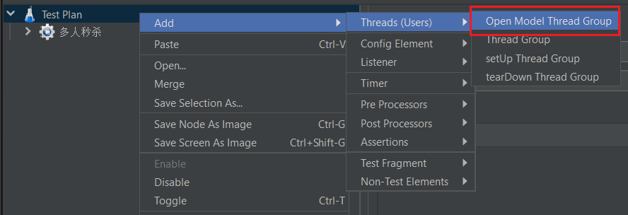

使用1000个线程来发起请求

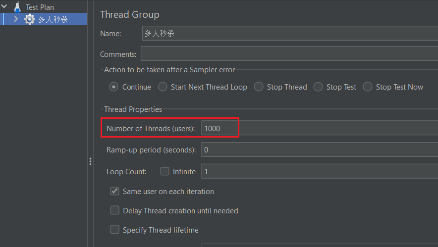

## 发起HTTP请求

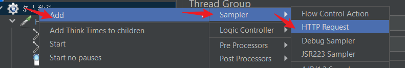

## 请求参数

设置 http header

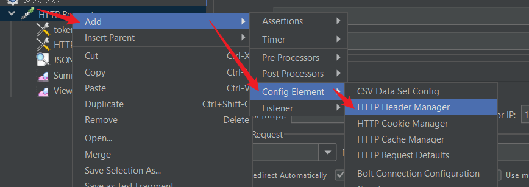

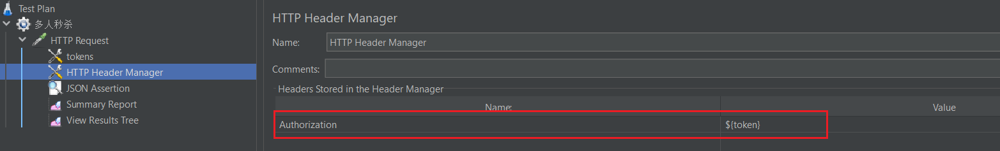

单用户指定具体的header值就行

如果是多用户设置token，需要使用 `${}` 来引用其他数据，这个数据来自于 CSV Data

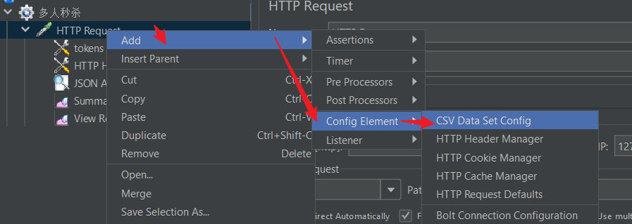

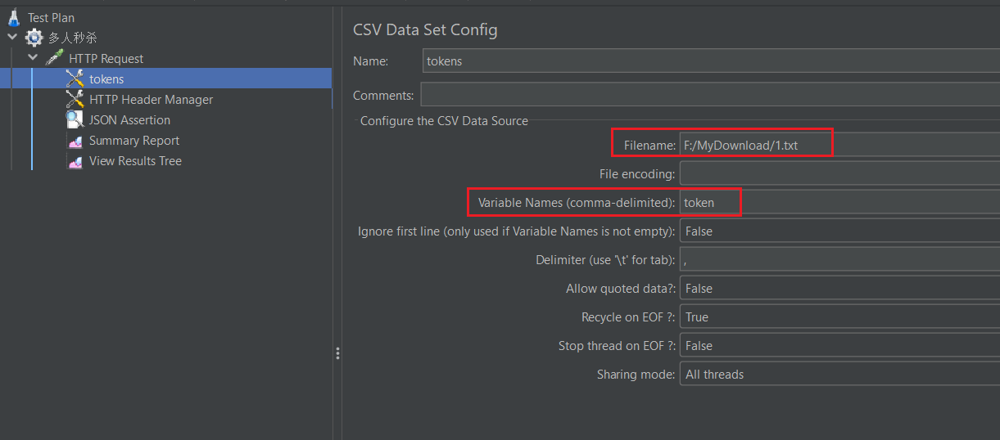

## 请求报告

### 总结报告

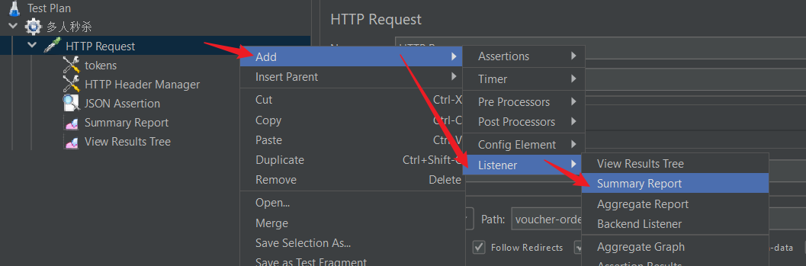

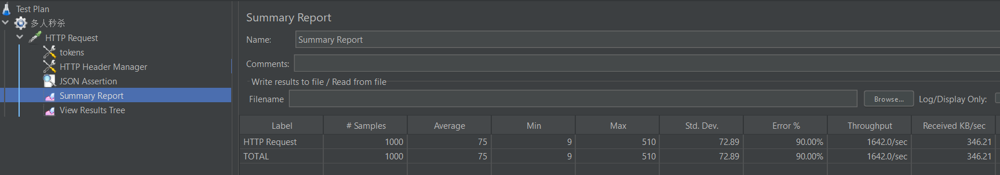

### 具体结果

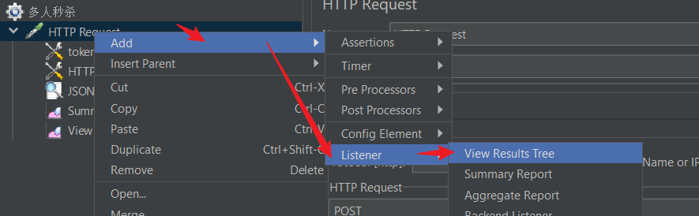

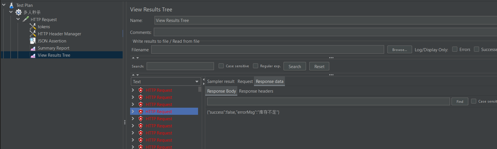

