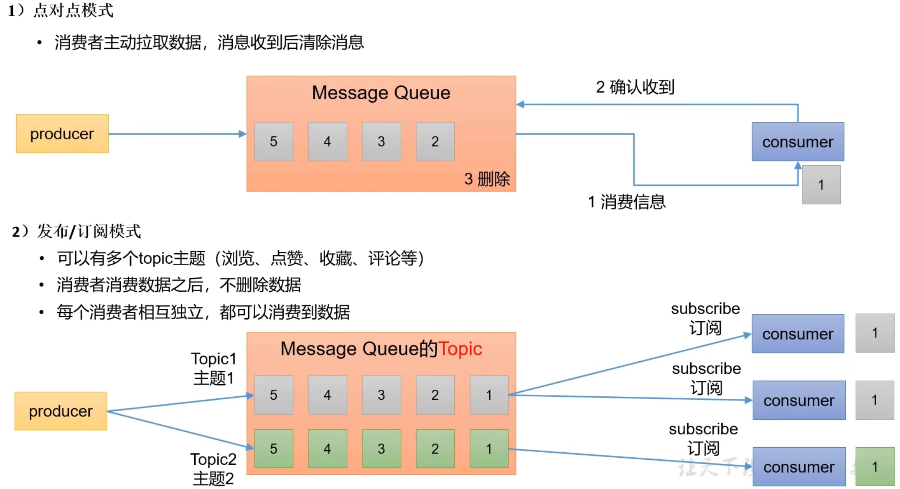

# Kafka概述

## 定义

**Kafka传统定义**：Kafka是一个分布式的基于发布/订阅模式的消息队列 (MessageQueue），主要应用于大数据实时处理领域。

**发布/订阅**：消息的发布者不会将消息直接发送给特定的订阅者，而是将发布的消息分为不同的类别，订阅者只接收感兴趣的消息

**Kafka最新定义**：Kafka是一个开源的分布式事件流平台（Event Streaming Platform），被数千家公司用于高性能数据管道、流分析、数据集成和关键任务应用

## 消息队列

目前企业中比较常见的消息队列产品主要有Kafka、ActiveMQ、RabbitMQ、RocketMQ等。

在大数据场景主要采用Kafka作为消息队列。在JavaEE开发中主要采用ActiveMQ、RabbitMQ、RocketMQ。

### 传统消息队列的应用场景

传统的消息队列的主要应用场景包括：缓存/消峰、解耦和异步通信。

1）**缓冲/消峰**：有助于控制和优化数据流经过系统的速度，解决生产消息和消费消息的处理速度不一致的情况。

2）**解耦**：允许你独立的扩展或修改两边的处理过程，只要确保它们遵守同样的接口约束。

3）**异步通信**：允许用户把一个消息放入队列，但并不立即处理它，然后在需要的时候再去处理它们。

###  消息队列的两种模式

## Kafka 基础架构

