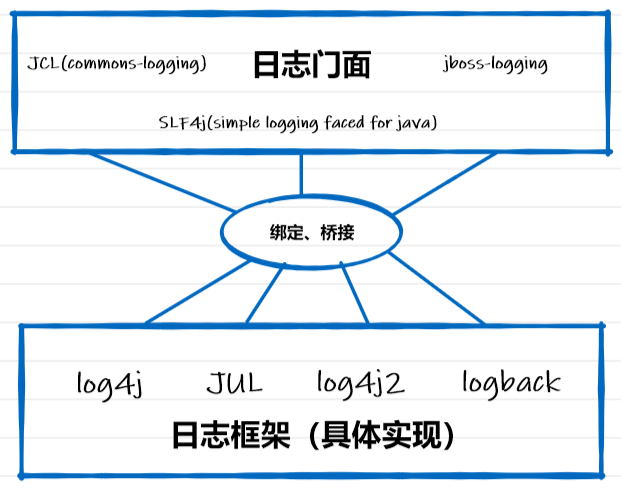
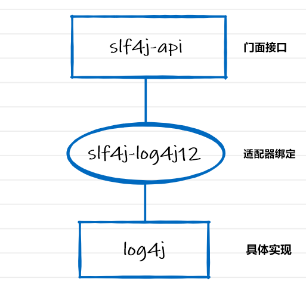
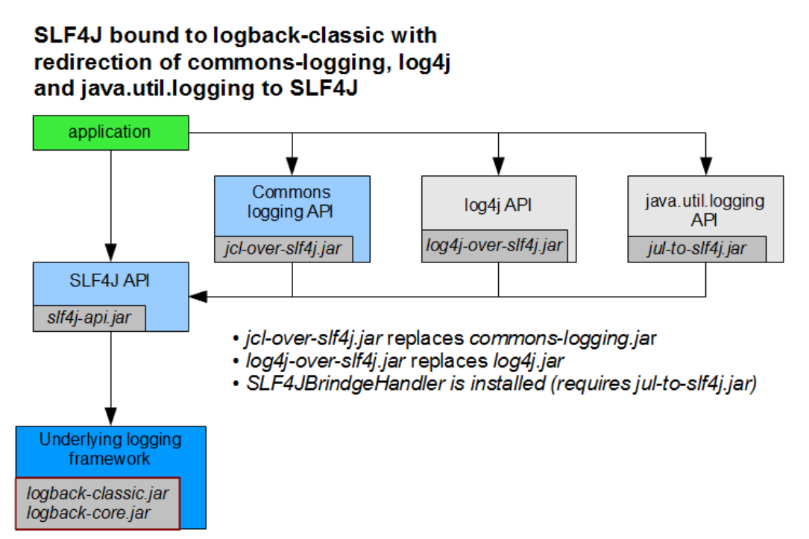
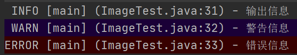

# 日志相关

## 日志

市场上存在非常多的日志框架。如下是常见的日志框架及其相关历史

+ 日志门面（Facade）：所谓门面更底层一点说就是接口，所以在工程中可以通过门面接入不同的日志系统
  + JCL（Apache Commons Logging）：是Apache的一个日志框架，由于是Jakarta小组写的所以命名为JCL，但是最近的一次更新也是在2014年，所以太老了，不推荐使用
  + jboss-logging：使用的场景太少了，不适合使用
  + SLF4j：这个就是为各种loging APIs提供一个简单统一的接口
+ 日志框架（具体实现）
  + Log4j：首次出来，使用状况还不错，但是存在性能问题，所以作者准备升级一下
  + Logback：Log4j的作者觉得重写框架可能太费时间，于是重新写了一个，这就是日志实现
  + Log4j2：是Apache所写的，但是写的太好，许多框架并不适配它
  + JUL（java.util.logging）：java自己的日志框架



## slf4j-api、slf4j-log4j12以及log4j之间的关系

1、slf4j-api ：为java提供的简单日志门面，定义了众多接口。他不负责具体的日志实现，只在编译时负责寻找合适的日志系统进行绑定。

在编译时 slf4j-api 中的 LoggerFactor 类的private final static void bind() 方法会寻找具体的日志实现类绑定主要通过StaticLoggerBinder.getSingleton()

2、slf4j-log4j12

他是链接 slf4j-api 和 log4j 中间的适配器。它实现了 slf4j-api 中 StaticLoggerBinder 接口，从而使得在编译时绑定的是slf4j-log4j12的getSingleton()方法

3、log4j

这个是具体的日志系统。通过slf4j-log4j12初始化Log4j，达到最终日志的输出。



## SLF4j的使用

[SLF4j官网](https://www.slf4j.org) 

以后开发的时候，日志记录方法的调用，不应该来直接调用日志的实现类，而是调用日志抽象层里面的方法；

给系统里面导入slf4j的jar和  logback的实现jar

```java
import org.slf4j.Logger;
import org.slf4j.LoggerFactory;

public class HelloWorld {
    public static void main(String[] args) {
        Logger logger = LoggerFactory.getLogger(HelloWorld.class);
        logger.info("Hello World");
    }
}
```

下图是不同的日志实现统一使用 slf4j 所需要的jar包及其关系


| 类型         | 门面包        | 适配包           | 实现包                                |
| ------------ | ------------- | ---------------- | ------------------------------------- |
| 不绑定       | slf4j-api.jar | 无               | 无                                    |
| logback 实现 | slf4j-api.jar | 无               | logback-classic.jar、logback-core.jar |
| log4j 实现   | slf4j-api.jar | slf4j-log412.jar | log4j.ar                              |
| JUL 实现     | slf4j-api.jar | slf4j-jdk14.jar  | 无，java自带                          |
| 简单绑定     | slf4j-api.jar | 无               | slf4j-simple.jar                      |
| 绑定空操作   | slf4j-api.jar | 无               | slf4j-nop.jar                         |

每一个日志的实现框架都有自己的配置文件。使用slf4j以后，**配置文件还是做成日志实现框架自己本身的配置文件；**

## 日志框架冲突问题

因为不同框架所使用的日志实现各不相同，共处于一个项目中有时会产生问题

+ spring-boot-starter-logging（slf4j+logback）:

+ Spring（commons-logging）

+ Hibernate（jboss-logging）

+ MyBatis...

如何统一日志记录，使不同的框架统一使用slf4j进行输出？


下面就以第一幅图为例，要求使用`slf4j`作为门面接口，日志使用`logback`实现，并且项目使用了spring（spring-core会依赖commons-logging），那么该如何让所有日志统一成`logback`实现呢。



查看上图，首先先不处理日志冲突的问题，那么则需要导入以下依赖

```xml
<properties>
    <slf4j.version>1.7.21</slf4j.version>
    <logback.version>1.1.7</logback.version>
</properties>

...

<dependency>
    <groupId>org.slf4j</groupId>
    <artifactId>slf4j-api</artifactId>
    <version>${slf4j.version}</version>
</dependency>
<dependency>
    <groupId>ch.qos.logback</groupId>
    <artifactId>logback-classic</artifactId>
    <version>${logback.version}</version>
</dependency>
<!-- logback-classic 会依赖 logback-core，不加下面的也行-->
<dependency>
    <groupId>ch.qos.logback</groupId>
    <artifactId>logback-core</artifactId>
    <version>${logback.version}</version>
</dependency>
```

接下来解决冲突，因为spring-core包含了common-logging，所以我们要把它排除出去，然后由图，还需要加一个`jcl-over-slf4j.jar`来进行修复，如下

```xml
<dependency>
    <groupId>org.springframework</groupId>
    <artifactId>spring-core</artifactId>
    <version>${spring.version}</version>
    <exclusions>
        <exclusion>
            <groupId>commons-logging</groupId>
            <artifactId>commons-logging</artifactId>
        </exclusion>
    </exclusions>
</dependency>
<dependency>
    <groupId>org.slf4j</groupId>
    <artifactId>jcl-over-slf4j</artifactId>
    <version>1.7.25</version>
</dependency>
```

**如何让系统中所有的日志都统一到slf4j；**

1、将系统中其他日志框架先排除出去；

2、用中间包来替换原有的日志框架；

3、我们导入slf4j其他的实现

## 输出格式

log4j日志输出格式一览

+ %c 输出日志信息所属的类的全名
+ %logger{20} 限定所属类的全名长度为20
+ %d 输出日志时间点的日期或时间，默认格式为ISO8601，也可以在其后指定格式，比如：%d{yyy-MM-dd HH:mm:ss }，输出类似：2002-10-18- 22：10：28
+ %f 输出日志信息所属的类的类名
+ %l / %line 输出日志事件的发生位置，即输出日志信息的语句处于它所在的类的第几行
+ %m / %msg 输出代码中指定的信息，如log(message)中的message
+ %n 输出一个回车换行符，Windows平台为“rn”，Unix平台为“n”
+ %p / %level 输出级别，即DEBUG，INFO，WARN，ERROR，FATAL。如果是调用debug()输出的，则为DEBUG，依此类推
+ %r 输出自应用启动到输出该日志信息所耗费的毫秒数
+ %t / %thread 输出产生该日志事件的线程名
+ %method 所在的方法

%5p [%t] (%F:%L) - %m%n 就表示：宽度是5的优先等级 线程名称 (文件名:行号) - 信息 回车换行



## log4j.properties

```properties
log4j.rootLogger=debug, stdout, R
 
log4j.appender.stdout=org.apache.log4j.ConsoleAppender
log4j.appender.stdout.layout=org.apache.log4j.PatternLayout
log4j.appender.stdout.layout.ConversionPattern=%5p [%t] (%F:%L) - %m%n
 
log4j.appender.R=org.apache.log4j.RollingFileAppender
log4j.appender.R.File=example.log
log4j.appender.R.MaxFileSize=100KB
log4j.appender.R.MaxBackupIndex=5
log4j.appender.R.layout=org.apache.log4j.PatternLayout
log4j.appender.R.layout.ConversionPattern=%p %t %c - %m%n
```

**释意**

设置日志输出的等级为debug,低于debug就不会输出了
设置日志输出到两种地方，分别叫做 **stdout**和 **R**

```properties
log4j.rootLogger=debug, stdout, R
```

第一个地方stdout, 输出到控制台

```properties
log4j.appender.stdout=org.apache.log4j.ConsoleAppender
```

输出格式是 %5p [%t] (%F:%L) - %m%n

```properties
log4j.appender.stdout.layout=org.apache.log4j.PatternLayout
log4j.appender.stdout.layout.ConversionPattern=%5p [%t] (%F:%L) - %m%n
```

第二个地方R, 以滚动的方式输出到文件，文件名是example.log,文件最大100k, 最多滚动5个文件

```properties
log4j.appender.R=org.apache.log4j.RollingFileAppender
log4j.appender.R.File=example.log
log4j.appender.R.MaxFileSize=100KB
log4j.appender.R.MaxBackupIndex=5
```

输出格式是 %p %t %c - %m%n，在下个步骤讲解

```properties
log4j.appender.R.layout=org.apache.log4j.PatternLayout
log4j.appender.R.layout.ConversionPattern=%p %t %c - %m%n
```

## logback.xml

```xml
<?xml version="1.0" encoding="UTF-8"?>
<configuration>
  <!-- 日志存放路径 -->
  <property name="log.path" value="E:/Cache/FileStorage/logs"/>
  <!-- 日志输出格式 -->
  <property name="log.pattern" value="%d{HH:mm:ss.SSS} [%thread] %-5level %logger{20} - [%method,%line] - %msg%n"/>

  <!-- 控制台输出 -->
  <appender name="console" class="ch.qos.logback.core.ConsoleAppender">
    <encoder>
      <pattern>${log.pattern}</pattern>
    </encoder>
  </appender>

  <!-- 系统日志输出 -->
  <appender name="file_info" class="ch.qos.logback.core.rolling.RollingFileAppender">
    <file>${log.path}/sys-info.log</file>
    <!-- 循环政策：基于时间创建日志文件 -->
    <rollingPolicy class="ch.qos.logback.core.rolling.TimeBasedRollingPolicy">
      <!-- 日志文件名格式 -->
      <fileNamePattern>${log.path}/sys-info.%d{yyyy-MM-dd}.log</fileNamePattern>
      <!-- 日志最大的历史 60天 -->
      <maxHistory>60</maxHistory>
    </rollingPolicy>
    <encoder>
      <pattern>${log.pattern}</pattern>
    </encoder>
    <filter class="ch.qos.logback.classic.filter.LevelFilter">
      <!-- 过滤的级别 -->
      <level>INFO</level>
      <!-- 匹配时的操作：接收（记录） -->
      <onMatch>ACCEPT</onMatch>
      <!-- 不匹配时的操作：拒绝（不记录） -->
      <onMismatch>DENY</onMismatch>
    </filter>
  </appender>

  <appender name="file_error" class="ch.qos.logback.core.rolling.RollingFileAppender">
    <file>${log.path}/sys-error.log</file>
    <!-- 循环政策：基于时间创建日志文件 -->
    <rollingPolicy class="ch.qos.logback.core.rolling.TimeBasedRollingPolicy">
      <!-- 日志文件名格式 -->
      <fileNamePattern>${log.path}/sys-error.%d{yyyy-MM-dd}.log</fileNamePattern>
      <!-- 日志最大的历史 60天 -->
      <maxHistory>60</maxHistory>
    </rollingPolicy>
    <encoder>
      <pattern>${log.pattern}</pattern>
    </encoder>
    <filter class="ch.qos.logback.classic.filter.LevelFilter">
      <!-- 过滤的级别 -->
      <level>ERROR</level>
      <!-- 匹配时的操作：接收（记录） -->
      <onMatch>ACCEPT</onMatch>
      <!-- 不匹配时的操作：拒绝（不记录） -->
      <onMismatch>DENY</onMismatch>
    </filter>
  </appender>

  <!--系统操作日志-->
  <root level="info">
    <appender-ref ref="file_info"/>
    <appender-ref ref="file_error"/>
    <appender-ref ref="console"/>
  </root>

  <!-- 系统模块日志级别控制  -->
  <logger name="com.hemou" level="info"/>
  <!-- Spring日志级别控制  -->
  <logger name="org.springframework" level="warn"/>

</configuration>
```