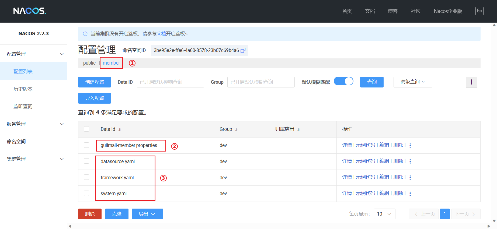

## 注册中心

### 接入Nacos

我们将使用 Alibaba 所提供 nacos 作为注册中心。

0、因为要使用 Alibaba 所开源的 [SpringCloud](https://github.com/alibaba/spring-cloud-alibaba) 产品，因此我们需要引入它的**版本管理依赖**

```xml
<dependencyManagement>
    <dependencies>
        <dependency>
            <groupId>com.alibaba.cloud</groupId>
            <artifactId>spring-cloud-alibaba-dependencies</artifactId>
            <version>2022.0.0.0-RC2</version>
            <type>pom</type>
            <scope>import</scope>
        </dependency>
    </dependencies>
</dependencyManagement>
```

1、接着引入关于注册中心 nacos 的依赖

```xml
 <dependency>
     <groupId>com.alibaba.cloud</groupId>
     <artifactId>spring-cloud-starter-alibaba-nacos-discovery</artifactId>
 </dependency>
```

2、配置 Nacos Server 的地址

```xml
spring.cloud.nacos.discovery.server-addr=127.0.0.1:8848
```

3、使用注解开启服务注册与发现功能

```java
@SpringBootApplication
@EnableDiscoveryClient
public class ProviderApplication {}
```

4、**添加服务名**（必须）

```
spring.application.name=service-provider
server.port=18082
```

### 启动Nacos Server

1、下载 Nacos Server https://github.com/alibaba/nacos/releases

2、启动

+ Linux/Unix/Mac 操作系统，执行命令 `sh startup.sh -m standalone`
+ Windows 操作系统，执行命令 `cmd startup.cmd`

**注意：命令的 `sh` 以及 `cmd` 不一定需要**

### 远程调用

1、首先在需要进行远程调用的模块中引入 Feign 依赖

```xml
<dependencies>
    <dependency>
        <groupId>org.springframework.cloud</groupId>
        <artifactId>spring-cloud-starter-openfeign</artifactId>
    </dependency>
</dependencies>

<dependencyManagement>
    <dependencies>
        <dependency>
            <groupId>org.springframework.cloud</groupId>
            <artifactId>spring-cloud-dependencies</artifactId>
            <version>${spring-cloud.version}</version>
            <type>pom</type>
            <scope>import</scope>
        </dependency>
    </dependencies>
</dependencyManagement>
```

2、编写接口

+ 接口需要标注 `@FeignClient("被调用的模块的spring.application.name")`
+ 申明调用的请求地址

```java
@FeignClient("gulimall-coupon")
public interface CouponFeign {

    @RequestMapping("/coupon/coupon/list")
    public R memberCoupons();
}
```

3、添加启用远程调用注解

```java
@EnableFeignClients(basePackages = "com.hemou.gulimall.member.feign")
@EnableDiscoveryClient
@SpringBootApplication
public class GulimallMemberApplication {}
```

## 配置中心

### 使用

1、引入 nacos 的配置中心依赖

```xml
<dependency>
    <groupId>com.alibaba.cloud</groupId>
    <artifactId>spring-cloud-starter-alibaba-nacos-config</artifactId>
</dependency>
```

2、在需要动态配置的模块的根目录（/src/main/resources）下创建名为 `bootstrap.properties` 配置文件

+ 指定好项目名：`spring.application.name`
+ 指定好配置中心服务地址：`spring.cloud.nacos.config.server-addr`

```properties
spring.application.name=nacos-config-example
spring.cloud.nacos.config.server-addr=127.0.0.1:8848
```

3、使用两个注解

```java
@RefreshScope
class SampleController {

    @Value("${user.name}")
    String userName;

    @Value("${user.age}")
    int age;
}
```

**如果配置中心和当前应用的配置文件中都配置了相同的项，优先使用配置中心的配置。**

### 进阶

#### 命名空间

> 配置隔离

默认命名空间：`public`（保留空间）；默认新增的所有配置都在public空间。

1、开发，测试，生产：利用命名空间来做环境隔离

注意：在微服务的 `src/main/resources/bootstrap.properties` 配置上，需要使用哪个命名空间下的配置，就需要添加相应的 namespace 标识

```
spring.cloud.nacos.config.namespace=9de62e44-cd2a-4a82-bf5c-95878bd5e871
```

2、每一个微服务之间互相隔离配置，每一个微服务都创建自己的命名空间，只加载自己命名空间下的所有配置

#### 配置集

> 所有配置的集合

#### 配置集ID

> 在 Nacos 中表现为 Data ID，也就是配置的文件名，文件名的名称要与微服务的名称一样

#### 配置分组

> 默认情况下，所有的配置都属于 `DEFAULT_GROUP`

需要在`bootstrap.properties` 配置上，添加相应的 group 标识

### 解决方案

+ 为每个**微服务**创建一个**命名空间**
+ 针对不同的开发**环境**创建不同的**组**

### 多配置文件

①：首先在 Nacos Server 为某个微服务创建一个命名空间

②：在该命名空间下创建一个自定义配置

<font color=red>注意：</font>

<font color=red>1、配置的 DataID 一定不要忘了后缀</font>

<font color=red>2、这个自定义配置是以应用名命名的，且必须是 properties 类型文件</font>

③：将 `application.yaml`  中所有的配置拆分开来



最后在 `src/main/resources/bootstrap.properties` 配置上添加相应配置

```properties
spring.application.name=gulimall-member
spring.cloud.nacos.config.server-addr=192.168.56.101:8848

env=dev

spring.cloud.nacos.config.namespace=3be95e2e-ffe6-4a60-8578-23b07c69b4a6
spring.cloud.nacos.config.groupr=${env}

spring.cloud.nacos.config.extension-configs[0].data-id=datasource.yaml
spring.cloud.nacos.config.extension-configs[0].group=${env}
spring.cloud.nacos.config.extension-configs[0].refresh=true

spring.cloud.nacos.config.extension-configs[1].data-id=framework.yaml
spring.cloud.nacos.config.extension-configs[1].group=${env}
spring.cloud.nacos.config.extension-configs[1].refresh=true

spring.cloud.nacos.config.extension-configs[2].data-id=system.yaml
spring.cloud.nacos.config.extension-configs[2].group=${env}
spring.cloud.nacos.config.extension-configs[2].refresh=true
```

