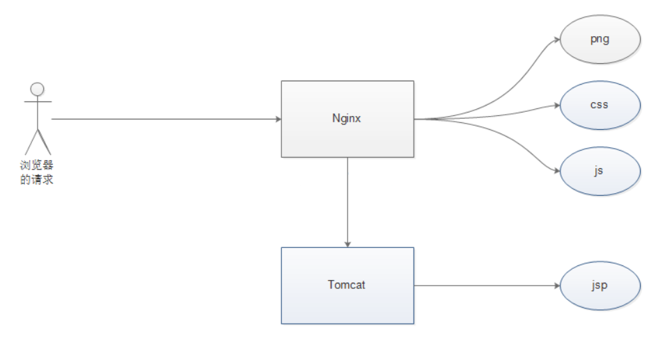
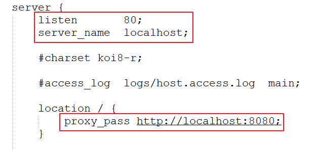
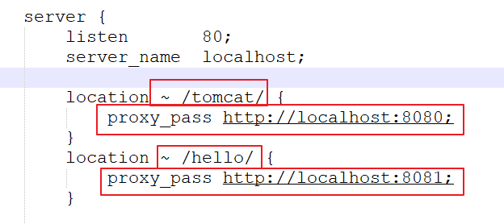
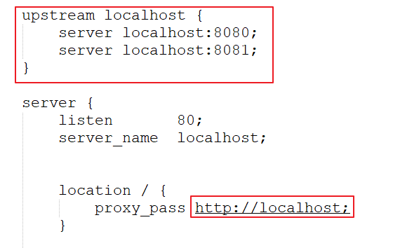
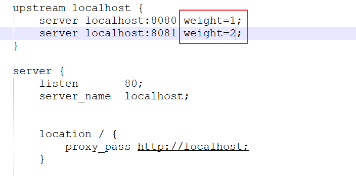
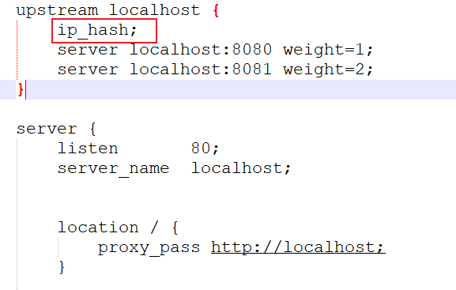
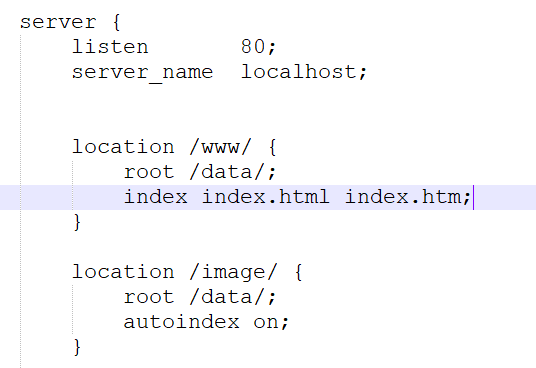
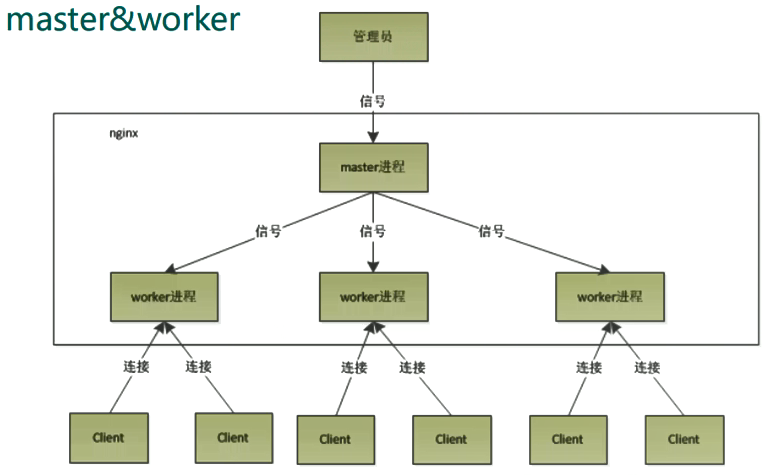
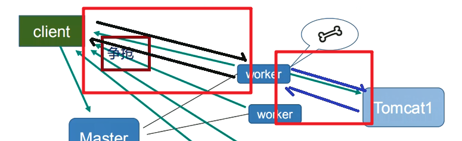

[toc]

# Nginx教程

> ​	Nginx（"engine x"）是一个高性能的HTTP和反向代理服务器，特点是占有内存少，并发能力强，事实上Nginx的并发能力确实在同类型的网页服务器中表现较好。中国大陆使用Nginx网站用户有：百度、京东、新浪、网易、腾讯、淘宝等。
>
> ​	Nginx专为性能优化而开发，性能是其最重要的考量，实现上非常注重效率，能经受高负载的考验，有报告表明能支持高达50，000个并发连接数。

# 一、入门

## 1.1 相关概念

+ 反向代理

> 正向代理：**如果把局域网外的Intemet想象成一个巨大的资源库，则局域网中的客户端要访问Internet，则需要通过代理服务器来访问，这种代理服务就称为正向代理。**比如要访问youtube，但是不能直接访问，只能先找个翻墙软件，通过翻墙软件才能访问youtube，翻墙软件就叫做正向代理。

所谓的反向代理，指的是用户要访问youtube,但是youtube悄悄地把这个请求交给bilibili来做，那么bilibili就是反向代理了。大多数指的就是访问Nginx,但是Nginx把请求交给tomcat来做。

+ 负载均衡

解释一：单个服务器解决不了，我们增加服务器的数量，然后将请求分发到各个服务器上，将原先请求集中到单个服务器上的情况或为将请求分发到多个服务器上，将负载分发到不同的服务器，也就是我们所说的负载均衡。

解释二：负载均衡的概念就是当访问量很大的时候，一个 Tomcat 吃不消了，这时候就准备多个 Tomcat，由Nginx按照权重来对请求进行分配，从而缓解单独一个Tomcat受到的压力

+ 动静分离

解释一：为了加快网站的解析速度，可以把动态页面和静态页面由不同的服务器来解析，加快解析速度。降低原来单个服务器的压力。

解释二：所谓的动静分离就是指图片，img，css，js之类的都交给nginx来处理，nginx处理不了的，比如jsp 就交给tomcat来处理，好处是nginx处理静态内容的吞吐量很高，比tomcat高多了，这样无形中提升了性能。



## 1.2 安装

> 安装环境是CentOS

1、gcc 安装

```shell
yum install gcc-c++
```

2、PCRE pcre-devel 安装

```shell
yum install -y pcre pcre-devel
```

3、zlib 安装

```shell
yum install -y zlib zlib-devel
```

4、OpenSSL 安装

```shell
yum install -y openssl openssl-devel
```

5、下载Nginx安装包

1. 在官网下载，地址https://nginx.org/en/download.html
2. 使用wget命令下载（推荐），如若没有执行`yum install wget`安装

```shell
wget -c https://nginx.org/download/nginx-1.12.0.tar.gz
```

6、解压

```shell
tar -zxvf nginx-1.12.0.tar.gz
cd nginx-1.12.0
```

7、配置（使用默认配置）

```shell
./configure
```

8、编译安装

```shell
make 			# 编译
make install	# 安装
whereis nginx	# 查看安装路径
```

详细参考[这里](https://www.cnblogs.com/boonya/p/7907999.html)

若虚拟机外不能访问Nginx可以参考Linux防火墙笔记

## 1.3 常用命令

> 使用前提条件：必须进入Nginx目录 /usr/lcoal/nginx/sbin

+ 查看版本号

```shell
./nginx -v
```

+ 启动Nginx

```shell
./nginx
```

+ 关闭Nginx

```shell
./nginx -s stop
```

+ 重新加载Nginx

```shell
./nginx -s reload
```

## 1.4 配置文件

1、路径：`/usr/local/nginx/conf/nginx.conf`

2、配置文件组成

```shell
...              #全局块

events {         #events块
   ...
}

http      #http块
{
    ...   #http全局块
    server        #server块
    { 
        ...       #server全局块
        location [PATTERN]   #location块
        {
            ...
        }
        location [PATTERN] 
        {
            ...
        }
    }
    server
    {
      ...
    }
    ...     #http全局块
}
```

**第一部分：全局块**

​	从配置文件开始到`events`块之间的内容，主要会设置一些影响Nginx 服务器整体运行的配置指令，主要包括配置运行Nginx服务器的用户（组）、允许生成的worker process数，进程PID存放路径、日志存放路径和类型以及配置文件的引入等。

+ `worker_processes`：值越大，可以处理的并发处理量越多

**第二部分：`events`块**

​	events 块涉及的指令主要影响Nginx服务器与用户的网络连接

+ `worker_connections`：支持的最大连接数

**第三部分：`http`块**

​	这算是Nginx服务器配置中最频繁的部分，代理、缓存和日志定义等绝大多数功能和第三方模块的配置都在这里。需要注意的是：`http`块也可以包括**http全局块**、**server块**

+ **http 全局块**

​	http全局块配置的指令包括文件引入、MIME-TYPE定义、日志自定义、连接超时时间、单链接请求数上限等。

+ **server 块**

​    这块和虚拟主机有密切关系，虚拟主机从用户角度看，和一台独立的硬件主机是完全一样的，该技术的产生是为了节省互联网服务器硬件成本。

​	每个http块可以包括多个server块，而每个server 块就相当于一个虚拟主机。而每个server块也分为**全局server块**，以及可以同时包含多个**locaton块**。

1、全局 server块

​	最常见的配置是本虚拟机主机的监听配置和本虚拟主机的名称或IP配置。

2、location块

​	一个server块可以配置多个 location块。这块的主要作用是基于Nginx 服务器接收到的请求字符串（例如 servername/uri-string），对虚以主机名称（也可以是IP别名）之外的字符串（例如前面的/uri-string）进行匹配，对特定的请求进行处理。地址定向、数据缓存和应答控制等功能，还有许多第三方模块的配置也在这里进行。

​		该指令用于配置URL

```
location指令说明:该指令用于配置URL

语法如下:
location [ = | ~ | ~* | ^~ ] uri {

}

1、=：用于不含正则表达式的uri前，要求请求字符串与uri严格匹配，如果匹配成功，就停止继续向下搜索并立即处理该请求。
2、~: 用于表示uri包含正则表达式，并且区分大小写。。
3、~*: 用于表示uri包含正则表达式，并且不区分大小写。
4、^~: 用于不含正则表达式的uri前，要求Nginx服务器找到标识uri和请求字符串匹配度最高的1ocation后，立即使用此location处理请求，而不再使用location块中的正则uri和请求字符串做匹配。

注意：如果uri包含正则表达式，则必须要有~或者*标识。
```

# 二、配置实例

## 2.1 反向代理

**实例一**

实现效果：访问www.123.com直接跳转到127.0.0.1:8080

1、首先配置`hosts`文件，将`127.0.0.1 www.123.com`添加到其中

2、修改Nginx配置文件，修改如下



3、然后重启Nginx服务器即可看到效果

**实例二**

实现效果：根据不同的访问路径跳转到不同的端口服务中

1、准备工作

（1）准备两个tomcat服务器，一个8080端口，一个8081端口

（2）给不同的tomcat设置不同的起始页，方便辨认

2、配置Nginx配置文件



3、然后重启Nginx服务器即可看到效果

## 2.2 负载均衡

实例解释：

（1）分配两个tomcat服务器，一个端口为8080， 一个端口为8081

（2）在webapps目录下放置名为`1`的文件夹，在`1`文件夹下防止`1.html`

（3）8080端口的`1.html`显示`8080`这四个大字，8081端口的`1.html`显示`8081`这四个大字

### 分配策略

+ 轮询（默认）

​	每个请求按时间顺序逐一分配到不同的后端服务器，如果后端服务器down掉，能自动剔除。



访问`http://localhost/1/1.html`效果如下：


这两个页面交替出现，频率相同

+ weight（权重）

​	weight代表权，重默认为1，权重越高被分配的客户端越多指定轮询几率，weight和访间比率成正比，用于后端服务器性能不均的情况。



访问`http://localhost/1/1.html`效果如下：


两个页面交替出现，频率比`1:2`

+ ip_hash（ip哈希）

​	每个请求按访间ip的hash结果分配，这样每个访客固定访问一个后端服务器，可以解决session的问题。



效果：每次访问都是同一个页面

+ fair（第三方工具）

​	按后端服务器的响应时间来分配请求，响应时间短的优先分配。

## 2.3 动静分离

1、项目资源准备

2、进行Nignx配置



## 2.4 配置高可用集群

# 三、原理



采用`master-workers`机制

**优势**

+ 对于每个`worker`进程来说，独立的进程，不需要加锁，所以省掉了锁带来的开销
+ 采用独立的进程，可以让互相之间不会影响，一个进程退出后，其它进程还在工作，服务不会中断，`master`进程则很快启动新的`worker`进程
+ `worker`异常退出，会导致当前`worker`上的所有请求失败，不过不会影响到所有请求，所以降低了风险
+ 可以使用`nginx-s reload`热部署，利用nginx进行热部署操作


**需要设置多少`worker`**

> 采用了io多路复用机制，每个worker都是一个独立的进程，但每个进程里只有一个主线程，通过异步非阻塞的方式来处理请求，即使是千上万个请求也不在话下。每个worker的线程可以把一个cpu的性能发挥到极致。

+ `worker`数和服务器的`cpu`数量一致为最佳，设少了会浪费cpu，设多了会造成`cpu`频繁切换上下文带来的损耗。


**设置`worker`的数量**

`worker_processes 4`


**work 绑定 cpu(4 work 绑定 4cpu)**

`worker_cpu_affinity 0001 0010 0100 1000`

**work 绑定 cpu (4 work 绑定 8cpu 中的 4 个)** 

`worker_cpu_affinity 0000001 00000010 00000100 00001000`


**连接数 `worker_connection`**

（1）发送请求，占用了worker几个连接数：**2个或者4个**



（2）最大并发数：

普通的静态访问最大并发数：`worker_connections*worker_processes/2`
HTTP反向代理最大并发数：`worker_connections*worker_processes/4`