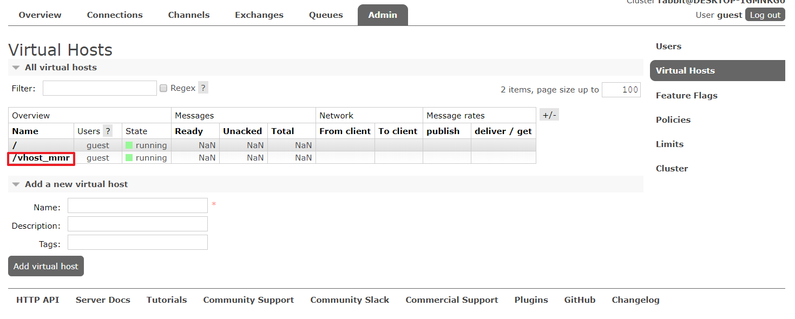
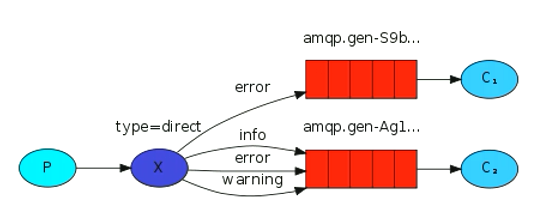

[toc]

# RabbitMQ笔记

# 一、入门

## 1、消息队列解决的问题

+ 异步处理
+ 应用解耦
+ 流量削锋
+ 日志处理

## 2、安装

[链接](https://www.lanzous.com/b00z83cwb)-[密码](2c43)

（1）首先安装Erlang，然后将其bin目录添加至环境变量


（2）安装RabbitMQ

（3）插件配置

```shell
"D:\Program Files\RabbitMQ Server\rabbitmq_server-3.6.5\sbin\rabbitmq-plugins.bat" enable rabbitmq_management
```

（4）以管理员的方式重启RabbitMQ服务

```shell
net stop RabbitMQ && net start RabbitMQ
```

（5）访问

http://127.0.0.1:15672

默认账号：guest，密码：guest

## 3、添加用户


## 4、Virtual host管理

virtual hosts 就相当于`mysql`的单个数据库

（1）创建数据库

刚添加的用户是没有数据库的


因此需要添加一个数据库


一般数据库以`/`开头

（2）将数据库授权给新创建的用户



点击刚创建的数据库


选择用户并授权


现在用户就可以管理并登录刚创建的数据库了

## 5、后台界面


# 二、队列

## 1、简单队列

（1）简介以及相关依赖

简单队列由**消息生产者**、**消息队列**和**消息接收者**组成

下面来编写java实例，编写之前首先导入下面的依赖

```xml
<dependency>
    <groupId>com.rabbitmq</groupId>
    <artifactId>amqp-client</artifactId>
    <version>4.0.2</version>
</dependency>

<dependency>
    <groupId>log4j</groupId>
    <artifactId>log4j</artifactId>
    <version>1.2.17</version>
</dependency>

<dependency>
    <groupId>org.slf4j</groupId>
    <artifactId>slf4j-api</artifactId>
    <version>1.7.10</version>
</dependency>

<dependency>
    <groupId>org.slf4j</groupId>
    <artifactId>slf4j-log4j12</artifactId>
    <version>1.7.5</version>
</dependency>

<dependency>
    <groupId>junit</groupId>
    <artifactId>junit</artifactId>
    <version>4.12</version>
</dependency>
```

（2）获取连接

```java
public class ConnectionUtil {

    public static Connection getCon() throws IOException, TimeoutException {
        //创建连接工厂
        ConnectionFactory factory = new ConnectionFactory();
        //设置服务地址
        factory.setHost("127.0.0.1");
        //设置AMQ端口号
        factory.setPort(5672);
        //设置虚拟主机
        factory.setVirtualHost("/vhost_mmr");
        //用户名
        factory.setUsername("admin");
        //密码
        factory.setPassword("root");
        return factory.newConnection();
    }
}
```

（3）发送者

```java
public class Producers {

    public static final String queueName = "myQueue";

    @Test
    public void testSend() throws IOException, TimeoutException {
        //获取连接对象
        Connection connection = ConnectionUtil.getCon() ;
        //从链接对象中获取一个通道
        Channel channel = connection.createChannel();
        //声明一个队列
        channel.queueDeclare(queueName, false, false, false, null);
        //消息
        String msg = "hello! this is my first message!";
        //发送消息
        channel.basicPublish("", queueName, null, msg.getBytes());
        //关闭资源
        channel.close();
        connection.close();
    }
}
```

（4）接收者

旧的API

```java
public class Recv {

    @Test
    public void testRecv() throws IOException, TimeoutException, InterruptedException {
        //获取连接对象
        Connection con = ConnectionUtil.getCon();
        //创建频道
        Channel channel = con.createChannel();
        //创建消息消费者
        QueueingConsumer consumer = new QueueingConsumer(channel);
        //监听队列
        channel.basicConsume(Send.queueName, true, consumer);
        while(true){
            QueueingConsumer.Delivery delivery = consumer.nextDelivery();
            //获取消息
            String msg = new String(delivery.getBody());
            System.out.println(msg);
        }

    }
}
```

新的API

```java
@Test
public void testRecvNewAPI() throws IOException, TimeoutException {
    //获取连接对象
    Connection con = ConnectionUtil.getCon();
    //创建频道
    Channel channel = con.createChannel();
    //声明队列
    channel.queueDeclare(Send.queueName, false, false, false, null);
    //消息消费者
    DefaultConsumer consumer = new DefaultConsumer(channel) {
        @Override
        public void handleDelivery(String consumerTag, Envelope envelope, AMQP.BasicProperties properties, byte[] body) throws IOException {
            String msg = new String(body, "utf-8");
            System.out.println(msg);
        }
    };
    //监听队列
    channel.basicConsume(Send.queueName, true, consumer);
}
```

（5）简单队列的不足

耦合性高，生产者对应消费者，若有多个消费者获取消息，简单队列则不能满足。而且队列名变更的话相应的东西也得变更。简单队列是1对1的。

## 2、工作队列 Work Queues

实际开发中，生产者发送消息是毫不费力的，而消费者要与实际业务相结合，处理的时间相对较长，两者不匹配，所以就出来工作队列，可以实现1对多。


具体实现就是发送者一次发送多条消息，但是多开几个消费者。

实现的结果就是消息的个数按比例分配，不管那个消费者处理的事件长短，处理消息的数量都基本一致的。

这种方式叫做**轮询分发**（roundfrobin）结果就是不管谁忙活着谁清闲都不会多给一个消息任务消息总是你一个我一个。

## 3、公平分发 fair dispatch


发送者将频道设置如下

```java
//收到几个确认消息之前，不分发消息给消费者
channel.basicQos(1);
```

接收者设置如下

```java
public static void main(String[] args) throws IOException, TimeoutException {
    Connection con = ConnectionUtil.getCon();
    final Channel channel = con.createChannel();
    channel.queueDeclare(Send.queueName, false, false, false, null);
    //修改频道模式
    channel.basicQos(1);
    DefaultConsumer consumer = new DefaultConsumer(channel) {
        @Override
        public void handleDelivery(String consumerTag, Envelope envelope, AMQP.BasicProperties properties, byte[] body) throws IOException {
            String msg = new String(body, "utf-8");
            System.out.println("[3] recv:" + msg);
            try {
                Thread.sleep(1500);
            } catch (InterruptedException e) {
                e.printStackTrace();
            }finally {
                System.out.println("[3] recv done");
                //发送ack标志
                channel.basicAck(envelope.getDeliveryTag(), false);
            }
        }
    };
    //关闭自动应答
    channel.basicConsume(Send.queueName, false, consumer);
}
```

要点就是：

1. 发送者要**修改频道的模式**
2. 接收者除了要修改频道外，再收到处理完消息后要**发送ack数据**
3. 监听方法中要**关闭自动应答**

## 4、消息应答与持久化

（1）消息应答

```java
boolean autoAck = false;
channel.basicConsume(queueName, autoAck, consumer);
```

​	当`autoAck`为`true`时，也就是自动确认模式，一旦rabbitmg将消息分发给消费者，就会从内存中删除；这种情况下，**如果杀死正在执行的消费者，就会丢失正在处理的消息**

​	当`autoAck`为`false`时，也就是手动模式，如果有一个消费者挂掉，就会交付给其他消费者，rabbitmq 支持消息应答，消费者发送一个消息应答，告诉rabbitmq这个消息我已经处理完成你可以删了，然后rabbitmq就删除内存中的消息

（2）消息持久化

```java
//是否持久化
boolean durable = false
//声明队列
channel.queueDeclare(queueName, durable, false, false, null);
```

​	若rabbitmq服务器突然宕机，存在发送者中的数据也会丢失，因此我们可以采用修改声明的队列，让后消息持久化，当`durable`为`true`时表示开启持久化。

## 5、模式

### 5.1 fanout 模式


1、一个生产者，多个消费者

2、每一个消费者都有自己的队列

3、生产者不是将消息发送到队列，而是发送到交换机、转发器 exchange

4、每个队列都要绑定到交换机上

5、生产者发送的消息经过**交换机**到达**队列**就能实现一个消息被多个消费者消费

（1）生产者

```java
public class Send {

    public static final String EXCHANGE_NAME = "myExchange_fanout";

    public static void main(String[] args) throws IOException, TimeoutException {
        Connection con = ConnectionUtil.getCon();
        Channel channel = con.createChannel();
        //声明交换机
        channel.exchangeDeclare(EXCHANGE_NAME, "fanout");
        //发送消息
        String msg = "publish subscribe";
        channel.basicPublish(EXCHANGE_NAME, "", null, msg.getBytes());
        System.out.println("Send:" + msg);

        channel.close();
        con.close();
    }
}
```

执行后消息并没有发送出去，因为rabbitmq中具有**消息存储功能**的只有队列，交换机并没有，因此需要将队列绑定到交换机上

```java
public class Recv {

    public static final String queueName = "myQueue_1";

    public static void main(String[] args) throws IOException, TimeoutException {
        Connection con = ConnectionUtil.getCon();
        Channel channel = con.createChannel();
        channel.queueDeclare(queueName, false, false, false, null);
        //将队列绑定到交换机上
        channel.queueBind(queueName, Send.EXCHANGE_NAME, "");
        channel.basicQos(1);
        DefaultConsumer consumer = new DefaultConsumer(channel) {
            @Override
            public void handleDelivery(String consumerTag, Envelope envelope, AMQP.BasicProperties properties, byte[] body) throws IOException {
                String msg = new String(body, "utf-8");
                System.out.println("[1] recv:" + msg);
                try {
                    Thread.sleep(1000);
                } catch (InterruptedException e) {
                    e.printStackTrace();
                }finally {
                    System.out.println("[1] recv done");
                    channel.basicAck(envelope.getDeliveryTag(), false);

                }
            }
        };
        channel.basicConsume(queueName, false, consumer);
    }
}
```

**总结：**

Fanout Exchange – 不处理路由键，可以称为**订阅模式**。

+ **任何发送到`Fanout Exchange`的消息都会被转发到与该`Exchange`绑定(Binding)的所有`Queue`上。**
+ 这种模式不需要RouteKey
+ 这种模式需要提前将Exchange与Queue进行绑定，一个Exchange可以绑定多个Queue，一个Queue可以同多个Exchange进行绑定。
+ 如果接受到消息的Exchange没有与任何Queue绑定，则消息会被抛弃。

### 5.2 direct 模式



（1）生产者

```java
public class Send {

    public static final String EXCHANGE_NAME = "myExchange_redirect";
    public static void main(String[] args) throws IOException, TimeoutException {
        Connection con = ConnectionUtil.getCon();
        Channel channel = con.createChannel();
        //声明交换机
        channel.exchangeDeclare(EXCHANGE_NAME, "direct");
        //消息
        String msg = "direct message";
        //路由键
        String routeKey = "info";
        channel.basicPublish(EXCHANGE_NAME, routeKey, null, msg.getBytes());
        //关闭资源
        channel.close();
        con.close();
    }
}
```

（2）消费者

```java
public class Recv {
    public static final String QUEUE_NAME = "queue_direct_1";
    public static void main(String[] args) throws IOException, TimeoutException {
        Connection con = ConnectionUtil.getCon();
        Channel channel = con.createChannel();
        //声明队列
        channel.queueDeclare(QUEUE_NAME, false, false, false, null);
        channel.basicQos(1);
        //指定路由键
        channel.queueBind(QUEUE_NAME, Send.EXCHANGE_NAME, "info");
        DefaultConsumer consumer = new DefaultConsumer(channel) {
            @Override
            public void handleDelivery(String consumerTag, Envelope envelope, AMQP.BasicProperties properties, byte[] body) throws IOException {
                String msg = new String(body, "utf-8");
                System.out.println("[1] recv:" + msg);
                try {
                    Thread.sleep(1000);
                } catch (InterruptedException e) {
                    e.printStackTrace();
                }finally {
                    System.out.println("[1] recv done");
                    channel.basicAck(envelope.getDeliveryTag(), false);

                }
            }
        };
        channel.basicConsume(QUEUE_NAME, false, consumer);

    }
}
```

**总结：**

Direct Exchange - 处理路由键，可以称为之**路由模式**。

+ 任何发送到Direct Exchange的消息都会被转发到含有指定RouteKey的Queue。
+ 一般情况可以使用rabbitMQ自带的Exchange：”"(该Exchange的名字为空字符串，下文称其为default Exchange)。
+ 消息传递时需要一个“RouteKey”，可以简单的理解为要发送到的队列名字。
+ 如果vhost中不存在RouteKey中指定的队列名，则该消息会被抛弃。

### 5.3 topic 模式


**总结：**

Topic Exchange – 将路由键和某模式进行匹配，**主题模式**。符号`*`匹配一个或多个单词，符号`*`仅匹配一个单词。

+ 任何发送到Topic Exchange的消息都会被转发到所有关心RouteKey中指定话题的Queue上
+ 这种模式需要RouteKey，也许要提前绑定Exchange与Queue。
+ 在进行绑定时，要提供一个该队列关心的主题，如“#.log.#”表示该队列关心所有涉及log的消息(一个RouteKey为”MQ.log.error”的消息会被转发到该队列)。
+ `#`表示0个或若干个关键字，`*`表示一个关键字。如`log.*`能与`log.warn`匹配，无法与`log.warn.timeout`匹配，但是`log.#`能与上述两者匹配。
+ 如果Exchange没有发现能够与RouteKey匹配的Queue，则会抛弃此消息。

# 三、消息确认机制

> 生产者将消息发送出去之后，消息到底有没有到达rabbitmq 服务器，默认的情况是不知道的。

## 1、事务机制

（1）方法

+ `txSelect`：用户将当前`channel`设置为`transation`模式
+ `txCommit`：用户提交事务
+ `txRollback`：回滚事务

（2）生产者

```java
public class Send {

    public static final String QUEUE_NAME = "myQueue";

    public static void main(String[] args) throws IOException, TimeoutException {
        //获取连接对象
        Connection connection = ConnectionUtil.getCon() ;
        //从链接对象中获取一个通道
        Channel channel = connection.createChannel();
        //声明一个队列
        channel.queueDeclare(QUEUE_NAME, false, false, false, null);
        //消息
        String msg = "hello! this is my first message!";
        //发送消息
        try {
            channel.txSelect();
            channel.basicPublish("", QUEUE_NAME, null, msg.getBytes());
            channel.txCommit();
        } catch (IOException e) {
            e.printStackTrace();
            channel.txRollback();
        }
        //关闭资源
        channel.close();
        connection.close();
    }

}
```

此模式比较耗时，降低了rabbitmq的吞吐量

## 2、Confirm 模式

​	生产者将信道设置成confirm模式，一旦信道进入confirm模式，所有在该信道上面发布的消息都会被指派一个唯一的ID（从1开始）。

​	一旦消息被投递到所有匹配的队列之后，broker就会发送一个确认给生产者（包含消息的唯一ID），这就使得生产者知道消息已经正确到达目的队列了。

​	如果消息和队列是可持久化的，那么确认消息会将消息写入磁盘之后发出，broker回传给生产者的确认消息中deliver-tag域包含了确认消息的序列号，此外broker也可以设置basic.ack的mulfiple域，表示到这个序列号之前的所有消息都已经得到了处理。

​	Confirm模式最大的好处在于他是异步

（1）开启`confirm`模式

```java
channel.confirmSelect();
```

（2）编程模式

+ 普通模式：发一条  `waitForConfirms()`
+ 批量：发一批 `waitForConfirms()`
+ 异步：提供一个回调方法

（3）普通方法

```java
public class Send {

    public static final String QUEUE_NAME = "myQueue";
    public static void main(String[] args) throws IOException, TimeoutException, InterruptedException {
        //获取连接对象
        Connection connection = ConnectionUtil.getCon() ;
        //从链接对象中获取一个通道
        Channel channel = connection.createChannel();
        //声明一个队列
        channel.queueDeclare(QUEUE_NAME, false, false, false, null);
        //设置confirm模式
        channel.confirmSelect();
        //消息
        String msg = "hello! this is my first message!";
        //发送消息
        channel.basicPublish("", QUEUE_NAME, null, msg.getBytes());
        //检测
        if(!channel.waitForConfirms()){
            System.out.println("发送失败");
        }else{
            System.out.println("发送成功");
        }
        //关闭资源
        channel.close();
        connection.close();
    }
}
```

（4）批量

一次发送多条消息

```java
for(int i = 0; i < 10;i++){
	channel.basicPublish("", QUEUE_NAME, null, msg.getBytes());
}
```

（5）异步

​	Channel 对象提供的`ConfirmListener()`回调方法只包含deliveryTag（当前 Chanel发出的消息序号）,我们需要自己为每一个Channel维护一个unconfirm的消息序号集合

​	每publish一条数据，集合中元素加1

​	每回调一次handleAck方法，unconfirm 集合删掉相应的一条（multiple=false）或多条（multiple=true）记录

​	从程序运行效率上看，这个unconfirm集合最好采用有序集合SortedSet 存储结构

```java
public class Send {

    public static final String QUEUE_NAME = "myQueue";
    public static void main(String[] args) throws IOException, TimeoutException, InterruptedException {
        //获取连接对象
        Connection connection = ConnectionUtil.getCon() ;
        //从链接对象中获取一个通道
        Channel channel = connection.createChannel();
        //声明一个队列
        channel.queueDeclare(QUEUE_NAME, false, false, false, null);
        //设置confirm模式
        channel.confirmSelect();
        //未确认的消息标识
        final SortedSet<Long> confirmSet = Collections.synchronizedSortedSet(new TreeSet<>());
        //添加回调函数
        channel.addConfirmListener(new ConfirmListener() {
            @Override
            public void handleAck(long deliveryTag, boolean multiple) throws IOException {
                if(multiple){
                    System.out.println("handleAck --- success");
                    confirmSet.headSet(deliveryTag+1).clear();
                }else{
                    System.out.println("handle --- fail");
                    confirmSet.remove(deliveryTag);
                }
            }

            @Override
            public void handleNack(long deliveryTag, boolean multiple) throws IOException {
                if(multiple){
                    System.out.println("handleNack --- success");
                    confirmSet.headSet(deliveryTag+1).clear();
                }else{
                    System.out.println("handleNack --- fail");
                    confirmSet.remove(deliveryTag);
                }
            }
        });
        //消息
        String msg = "hello! this is my first message!";
        //发送消息
        while(true){
            long seqNo = channel.getNextPublishSeqNo();
            channel.basicPublish("", QUEUE_NAME, null, msg.getBytes());
            confirmSet.add(seqNo);
        }
    }
}
```