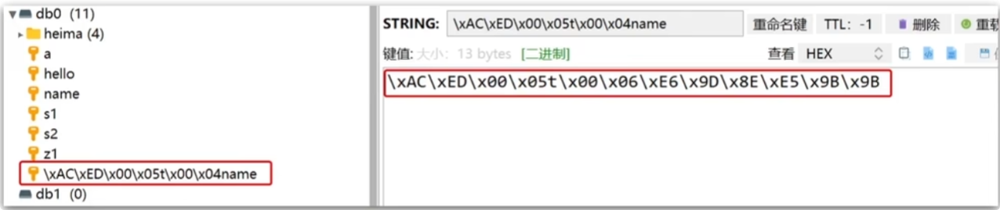
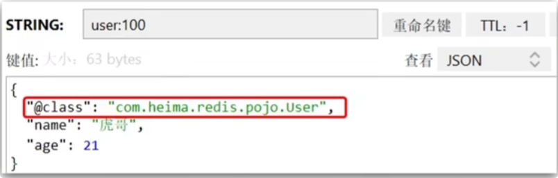
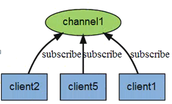
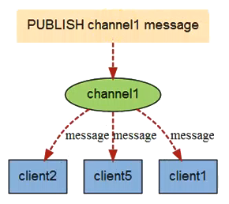
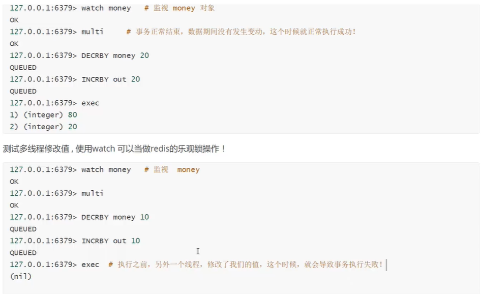
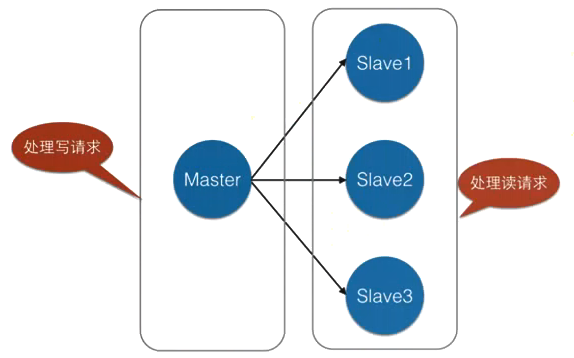
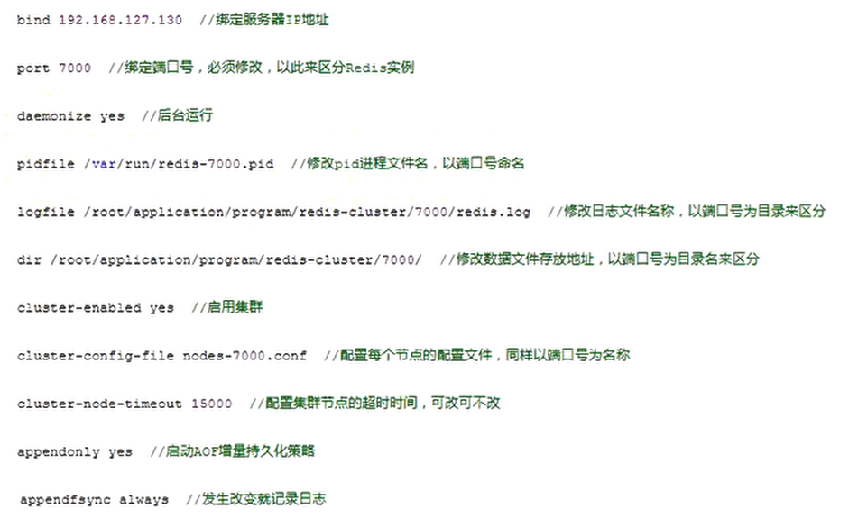
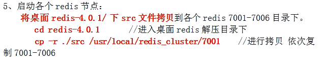

[toc]

## Redis 笔记

# 一、入门

## 1、Redis简介

​	Redis 是完全开源免费的，遵守BSD协议，是一个高性能（NOSQL）的key-value 数据库，Redis是一个开源的使用ANSI C语言编写、支持网络、可基于内存亦可持久化的日志型、Key-Value数据库，并提供多种语言的API。从2010年3月15日起，Redis的开发工作由Wware主持。从2013年5月开始，Redis的开发由Pivotal赞助。

​	Redis是一个简单的，高效的，分布式的，基于内存的缓存工具。架设好服务器后，通过网络连接（类似数据库），提供Key-Value 式缓存服务。简单，是Redis突出的特色。简单可以保证核心功能的稳定和优异。

## 2、NoSQL介绍

​	NoSQL，泛指非关系型的数据库。随着互联网 web2.0网站的兴起，传统的关系数据库在应付web2.0网站，特别是超大规模和高并发的SNS类型的web2.0纯动态网站已经显得力不从心，暴露了很多难以克服的问题，而非关系型的数据库则由于其本身的特点得到了非常迅速的发展。NoSQL数据库的产生就是为了解决大规模数据集合多重数据种类带来的挑战，尤其是大数据应用难题。

+ NoSQL
  + 数据与数据之间没有关联关系
  + 数据模型比较简单
  + 需要灵活性更强的IT系统
  + 对数据库性能要求较高
  + 不需要高度的数据一致性
  + 对于给定key，比较容易映射复杂值的环境
+ SQL
  + 关系型数据库，表与表之间建立关联关系

### 2.1 NoSQL数据库四大分类

+ 键值（Key-Value）存储数据库
  + 这一类数据库主要会使用到一个哈希表，这个表中有一个特定的键和一个指针指向特定的数据。Key/value 模型对于IT系统来说的优势在于简单、易部署。但是如果DBA只对部分值进行查询或更新的时候，Key/value 就显得效率低下了。举例如：Tokyo Cabinet/Tyrant，**Redis**，Voldemort，Oracle BDB.
+ 列存储数据库
  + 这部分数据库通常是用来应对分布式存储的海量数据。键仍然存在，但是它们的特点是指向了多个列。这些列是由列家族来安排的。如：Cassandra，**HBase**，Riak.
+ 文档存储数据库
  + 文档型数据库的灵感是来自于Lotus Notes办公软件的，而且它同第一种键值存储相类似。该类型的数据模型是版本化的文档，半结构化的文档以特定的格式存储，比如JSON。
    文档型数据库可以看作是键值数据库的升级版，允许之间嵌套键值。而且文档型数据库比键值数据库的查询效率更高。如：CouchDB，**MongoDb**。国内也有文档型数据库SequoiaDB，已经开源。
+ 图形数据库
  + 图形结构的数据库同其他行列以及刚性结构的SQL数据库不同，它是使用灵活的图形模型，并且能够扩展到多个服务器上。NoSQL数据库没有标准的查询语言（SQL），因此进行数据库查询需要制定数据模型。许多NoSQL数据库都有REST式的数据接口或者查询API。如：**Neo4J**，InfoGrid，Infinite Graph.

### 2.3 Redis 优势

+ Redis 支持数据的持久化，可以将内存中的数据保存在磁盘中，重启的时候可以再次加载进行使用。
+ Redis 不仅仅支持简单的key-value类型的数据，同时还提供list，set，zset，hash 等数据结构的存储。
+ Redis 支持数据的备份，集群高可用功能。

### 2.4 Redis 特点

+ 性能极高：Redis能读的速度是110000次/s，写的速度是81000次/s。
+ 丰富的数据类型：Redis 支持的类型 String，List，Hash，Set 及Ordered Set数据类型操作。
+ 原子：Redis的所有操作都是原子性的，意思就是要么成功执行要么失败完全不执行。
  单个操作是原子性的。多个操作也支持事务，即原子性，通过MULTI和EXEC指令包起来。
+ 丰富的特性：Redis还支持publish/subscribe，通知，key 过期等等特性。

## 3、Redis启动

### 3.1 启动`Redis`服务

1、进入Redis安装目录： `/usr/local/redis`

2、执行命令：`./bin/redis-server`

### 3.2 启动Redis客户端

1、执行命令：`./bin/redis-cli`

```
redis-cli -h 192.168.56.101 -p 6379 -a root   # 不安全

> redis-cli -h 192.168.56.101 -p 6379  # 推荐
> AUTH [username] password
```


## 4、Redis配置文件

> Redis的配置文件位于Redis安装目录下，文件名为redis.conf（Windows名为redis.windows.conf）。

### 4.1 复制配置文件

因为make install后，配置文件并不存在，使用的是默认配置，而我们通常是手动配置，因此我们要把配置文件复制到安装目录中，将`redis.conf`复制到redis的安装目录下

```shell
 cp redis-5.0.7/redis.conf /usr/local/redis/
```

### 4.2 `redis.conf`配置文件详解

**1、Redis 默认不是以守护进程的方式运行，可以通过该配置项修改，使用yes启用护进程**

```conf
daemonize no
```

**2、当Redis以守护进程方式运行时，Redis 黑默认会把pid写入/var/run/redis.pid文件，可以通过pidfile指定**

```conf
pidfile/var/run/redis.pid
```

**3、指定Redis 监听端口，默认端口为6379，为什么选用6379作为默认端口，因为6379在手机按键上MERZ对应的号码，而MERZ取自意大利歌女Alessia Merz的名字**

```
port 6379
```

**4、绑定主机地址**

```
bind 127.0.0.1
```

**5、当客户端闲置多长时间后关闭连接，如果指定为0，表示关闭该功能**

```
timeout 300
```

**6.指定日志记录级别，Redis总共支持四个级别：debug、verbose、notice、warning，黑默认为verbose** 

```
loglevel verbose
```

**7.日志记录方式，默认为标准输出，如果配置Redis为守护进程方式运行，而这里又配置为日志记录方式为标准输出，则日志将会发送给/dev/null** 

```
logfile stdout
```

**8、设置数据库的数量，黑默认数据库为0，可以使用SELECT \<dbid>命令在连接上指定数据库id** 

```
databases 16
```

**9、指定在多长时间内，有多少次更新操作，就将数据同步到数据文件，可以务个条件配合**

```
save <seconds> <changes>
```

Redis默认配置文件中提供了三个条件

```
save 900 1
save 300 10
save 60 10000
```

分别表示900秒（15分钟）内有1个更改，300秒（5分钟）内有10个更改以及60秒内有10000个更改。

**10、指定存储至本地数据库时是否压缩数据，黑默认为yes，Redis 采用LZF压缩，如果为了节省CPU时间，可以关闭该选项，但会导致数据库文件变的巨大**

```
rdbcompression yes
```

**11、指定本地数据库文件名，默认值为dump.rdb** 

```
dbfilename dump.rdb
```

**12.指定本地数据库存放目录**

```
dir ./
```

**13、设置当本机为slave服务时，设置master服务的IP地址及端口，在Redis启动时，它会自动从master 进行数据同步**

```
slaveof <masterip> <masterport>
```

**14.当master服务设置了密码保护时，slave 服务连接master的密码**

```
masterauth <master-password>
```

==**15.设置Redis 连接密码，如果配置了连接密码，客户端在连接Redis 时需要通过AUTH<password>**==
==**命令提供密码，默认关闭**==

```
requirepass foobared
```

**16、设置同一时间最大客户端连接数，默认无限制，Redis可以同时打开的客户端连接数为Redis 进程可以打开的最大文件描述符数，如果设置maxclients 0，表示不作限制。当客户端连接数到达限制时，Redi s会关闭新的连接并向客户端返回 max number of clients reached 错误信息**

```
maxclients 128
```

**17.指定Redis 最大内存限制，Redis在启动时会把数据加载到内存中，达到最大内存后，Redis会先尝试清除已到期或即将到期的Key，当此方法处理后，仍然到达最大内存设置，将无法再进行写入操作，但仍然可以进行读取操作。Redis新的vm机制，会把Key存放内存，Value 会存放在swap区**

```
maxmemory <bytes>
```

**18、指定是否在每次更新操作后进行日志记录，Redis在默认情况下是异步的把数据写入磁盘，如果不开启，可能会在断电时导致一段时间内的数据丢失。因为redis本身同步数据文件是按上面save条件来同步的，所以有的数据会在一段时间内只存在于内存中。默认为no** 

```
appendonly no
```

**19.指定更新日志文件名，默认为appendonly.aof** 

```
appendfilename appendonly.aof
```

**20.指定更新日志条件，共有3个可选值**

+ no：表示等操作系统进行数据缓存同步到磁盘（快）
+ always：表示每次更新操作后手动遇用fsync（）将数据写到磁盘（慢，安全）
+ everysec：表示每秒同步一次（折中，默认值）

```
appendfsync everysec
```

#### 常用配置

```properties
# 监听地址
bind 0.0.0.0
# 守护进程
daemonize yes
# 密码
requirepass root

# 监听端口
port 6379
# 工作目录，默认是当前目录，也就是 redis-server 的运行目录
dir .
# 数据库数量
databases 16
# redis 能使用的最大内存
maxmemory 512mb
# 日志文件，可以指定文件名
logfile "redis.log"
```

### 4.3 淘汰策略

​	redis作为优秀的中间缓存件，时常会存储大量的数据，即使采取了集群部署来动态扩容，也应该即时的整理内存，维持系统性能如果数据一直新增，内存很快就会占满）

​	在redis中有两种解决方案

+ 为数据设置超时时间，设定内存空间，建议内存不要超过1G256-512M
+ **采用LRU算法动态将不用的数据删除。**内存管理的一种页面置换算法，对于在内存中但又不用的数据块（内存块）叫做LRU，操作系统会根据哪些数据属于LRU而将其移出内存而腾出空间来加载另外的数据
  + `allkeys-lru`：查询所有的key中最近最不常使用的数据进行删除，这是应用最广泛的策略。
  + `volatile-lfu`：从已设置过期的Keys中，删除一段时间内使用次数最少使用的
  + `allkeys-random`：查询所有的key，之后随机删除。
  + `volatile-Iru`：设定超时时间的数据中，删除最不常使用的数据.
  + `volatile-ttl`：查询全部设定超时时间的数据，之后排序，将马上将要过期的数据进行删除操作
  + `volatile-random`：在已经设定了超时的数据中随机删除。
  + `No-eviction`：如果设置为该属性，则不会进行删除操作，如果内存溢出则报错返回

### 4.4 使用自定义Redis配置启动

1、编辑`redis.conf`配置文件

2、redis默认配置必须修改项

（1）`daemonize no` -> `daemonize yes`

（2）`bind 127.0.0.1`  注释掉

（3）`requirepass`  设置密码

**3、加载配置文件并启动Redis**

```shell
 ./bin/redis-server ./redis.conf 
```

**4、远程服务上执行命令**

```shell
redis-cli -h [ip地址] -p [端口] -a [密码]
```

## 5、Redis关闭

**第一种：断电、非正常关闭。容易数据丢失**

```shell
# 查询pid
ps -ef | grep -i redis
kill -9 PID
```

**第二种：正常关闭，数据保存**

```shell
./bin/redis-cli shutdown
```

# 二、Redis基本命令

## 基本操作

1. 切换数据库 ： select [num]，默认0号数据库
2. 查看数据库中所有的key  ：keys *
3. 清空当前数据库：flushdb
4. 清空清空所有数据库数据：flushall
5. 查看数据库大小：dbsize

## Redis命令描述

### 1.1 Redis 键 key

>Redis键命令用于管理redis的键，常用：
>
>+ KEYS：查看符合模板的所有key，<font color=red>不建议在生产环境设备上使用</font>
>+ DEL：删除一个指定的key
>+ EXISTS：判断key是否存在
>+ EXPIRE：给一个key设置有效期，有效期到期时该key会被自动删除
>+ TTL：查看一个KEY的剩余有效期

（1）==DEL key==

该命令用于在key存在的时候删除key

（2）DUMP key

序列化给定的key，并返回被序列化的值

（3）==EXISTS key==

检查给定 key是否存在

（4）==EXPIRE key secons==

为给定key设置过期时间，单位秒

（5）PEXPIRE key milliseconds

为给定key设置过期时间，单位毫秒

（6）==TLL key==

返回给定key的剩余生存时间，单位秒

（7）PTLL  key

返回给定key的剩余生存时间，单位毫秒

（8）PERSIST key

移除key 的过期时间，将key永久保持

（9）KEYS pattern

查找所有符合给定模式（pattern）的key。
keys通配符获取所有与pattern匹配的key，返回所有与该匹配

通配符：

+ *代表所有
+ ?表示代表一个字符

（10）RANDOM KEY

从当数据库中随机返回一个key，不常用。

（11）RENAME key newkey

修改key的名称

（12）==MOVE key db==

将当前数据库的key移动到给定的数据库db当中

（13）==TYPE key==
返回key所储存的值的类型

### 1.2 应用场景

EXPIRE key seconds
1、限时的优惠活动信息
2、网站数据缓存（对于一些需要定时更新的数据，例如：积分排行榜）
3、手机验证码
4、限制网站访客访问频率（例如：1分钟最多访问10次）

### 1.3 Key的命名建议

redis 单个key 存入512M大小
1、key不要太长，尽量不要超过1024字节，这不仅消耗内存，而且会降低查找的效率
2、key也不要太短，太短的话，key的可读性会降低
3、在一个项目中，key最好使用统一的命名模式，例如`user:123:password`、`项目名:业务名:类型:id`

# 三、Redis数据类型

## 1、string 

### 1.1 简介

+ string 是redis 最基本的类型，一个key对应一个value。
+ string 类型的三种格式

  + 字符串
  + int
  + float

+ string 类型是二进制安全的。意思是redis的string可以包含任何数据。比如jpg图片或者序列化的对象。
  + 二进制安全：在传输数据时，保证二进制数据的信息安全，也就是不被篡改、破译等，如果被攻击，能够及时检测出来
  + 特点
    + 编码、解码发生在客户端完成，执行效率高
    + 不需要频繁的编解码，不会出现乱码
+ string 类型是Redis最基本的数据类型，一个键最大能存储512MB。

  

### 1.2 string命令

**常见命令**

+ SET：添加或者修改已经存在的一个String类型的键值对
+ GET：根据key获取String类型的value
+ MSET：批量添加多个String类型的键值对
+ MGET：根据多个key获取多个String类型的value
+ INCR：让一个整型的key自增1
+ INCRBY：让一个整型的key自增并指定步长，例如：incrby num2让num值自增2
+ INCRBYFLOAT：让一个浮点类型的数字自增并指定步长
+ SETNX：添加一个String类型的键值对，前提是这个key不存在，否则不执行
+ SETEX：添加一个String类型的键值对，并且指定有效期

**（1）赋值语法**

```shell
set KEY_NAME VALUE #重点
```

Redis SET命令用于设置给定key的值。如果key已经存储值，SET就覆写旧值，且无视类型


```shell
setnx key value #重点，分布式锁解决方案之一
```

只有在key 不存在时设置key的值，若存在则设置失败。Setnx（SET if Not eXists）命令在指定的key 不存在时，为key设置指定的值

同时设置一个或多个key-value对


```
setex key second val
```

设置值和expire


```
mset key value[key value...]
```

同时设置一个或多个key-value对

**（2）取值语法**

```
get KEY_NAME #重点
```

Redis GET命令用于获取指定key的值。如果key不存在，返回nil。如果key储存的值不是字符串类型，返回一个错误。


```
getrange key start end
```

用于获取存储在指定key中字符串的子字符串。字符串的截取范围由 start和end两个偏移量决定（包括start 和end在内）


```
getbit key offset
```

对key所储存的字符串值，获取指定偏移量上的位（bit）


```
mget key1[key2..]
```

获取所有（一个或多个）给定key的值


```
getset 语法：GETSET KEY_NAME VALUE Getset 
```

命令用于设置指定key的值，并返回key的旧值，当key不存在时，返回nil 


```shell
strlen key
```

返回key所储存的字符串值的长度


**（3）删除语法**

```
del KEY_Name
```

删涂指定的KEY，如果存在，返回值数字类型。

**（4）自增/自减**

```shell
incr KEY_Name  #重点
```

Incr 命令将key中储存的数字值增1。如果key不存在，那么key的值会先被初始化为0，然后再执行INCR操作


```shell
incrby KEY_Nane [增量值] #重点
```

自增：Incrby 命令将key中储存的数字加上指定的增量值


```shell
decr KEY_NAKE 或 DECYBY KEY_NAME [减值] #重点
```

自减：decR命令将key中储存的数字减1


```base
append KEY_WAME VALUE 
```

字符串拼接：Append 命令用于为指定的key 追加至未尾，如果不存在，为其赋值

#### 常用

+ set key value   # 设置值
+ get key             # 获取值
+ append key value  # 追加值
+ strlen key         # 值的长度
+ incr                  # 自增 1
+ decr                 # 自减1
+ incrby  val        # 自增val
+ decrby val        # 自建val
+ getrange key start end  # 截取字符串，闭区间
+ setrange key offset val  # 设置字符串

### 1.3 应用场景

1、**String 通常用于保存单个字符串或JSON字符串数据**

2、因**String是二进制安全的**，所以你完全可以把一个图片文件的内容作为字符串来存储

3、**计数器**（常规key-value缓存应用。常规计数：微博数，粉丝翅）

**INCR等指令本身就具有原子操作的特性**，所以我们完全可以利用redis的INCR、INCRBY、DECR、DECRBY等指令来实现原子计数的效果。假如，在某种场景下有3个客户端同时读取了mynum的值（值为2），然后对其同时进行了加1的操作，那么，最后mynum的值一定是5。不少网站都利用redis的这个特性来实现业务上的统计计数需求。

## 2、哈希（Hash）

### 2.1 简介

`Redis hash`是一个`string`类型的`field`和`value`的映射表，hash特别适合用于存储对象。`Redis`中每个`hash` 可以存储2^32^-1 键值对（40多亿）可以看成具有`KEY`和`VALUE`的`MAP`容器，该类型非常适合于存储值对象的信息，如：`uname`，`upass`，`age`等。该类型的数据仅占用很少的磁盘空间（相比于`JSON`）

### 2.1 Hash命令

常用命令

+ HSET key field value：添加或者修改hash类型key的field的值
+ HGET key field：获取一个hash类型key的field的值
+ HMSET：批量添加多个hash类型key的field的值
+ HMGET：批量获取多个hash类型key的field的值
+ HGETALL：获取一个hash类型的key中的所有的field和value
+ HKEYS：获取一个hash类型的key中的所有的field
+ HVALS：获取一个hash类型的key中的所有的value
+ HINCRBY：让一个hash类型key的字段值自增并指定步长
+ HSETNX：添加一个hash类型的key的field值，前提是这个field不存在

**（1）赋值语法**

```shell
HSET KEY FIELD VALUE #为指定的KEY，设定FILD/VALUE
HMSET KEY FIELD VALUE [FIELD1, VAUE1] ... #同时将多个field-value（域-值）对设置到哈希表key中

eg.
hmset users uname guo age 20 address "北京市”
```

**（2）取值语法**

```
HGET KEY FIELD
```

获取存储在HASH中的值，根据FIELD得到VALUE 


```
HMGET key field [field1]
```

获取key所有给定字段的值


```
HGETALL key
```

返回HASH表中所有的字段和值


```
HKEYS key
```

获取所有哈希表中的字段


```
HLEN key
```

获取哈希表中字段的数量

**（3）删除语法**

```
HDEL KEY FIDLE [FIDLE] ...
```

删除一个或多个HASH表字段

**（4）其它语法**

```
HSETNX key field value
```

只有在字段field不存在时，设置哈幕表字段的值


```
HINCRBY key field increment
```

为哈希表key中的指定字段的整数值加上增量increment。


```
HINCRBYFLOAT key field increment
```

为哈希表key中的指定字段的浮点数值加上增量increment。


```
HEXISTS key field
```

查看哈希表key中，指定的字段是否存在

### 2.3 应用场景

Hash的应用场景：（存储一个用户信息对象数据）

+ 常用于存储一个对象

​	为什么不用string存储一个对象？

​	hash 是最接近关系数据库结构的数据类型，可以将数据库一条记录或程序中一个对象转换成hashmap存放在redis中。

​	用户ID为查找的key，存储的value用户对象包含姓名，年龄，生日等信息，如果用普通的key/value 结构来存储，主要有以下2种存储方式：

​	第一种方式将用户ID作为查找key，把其他信息封装成一个对象以序列化的方式存储，这种方式的缺点是，增加了序列化/反序列化的开销，并且在需要修改其中一项信息时，需要把整个对象取回，并且修改操作需要对并发进行保护，引入检查（CAS）等复杂问题。

​	第二种方法是这个用户信息对象有多少成员就存成多少个key-value对儿，用用户ID+对应属性的名称作为唯一标识来取得对应属性的值，虽然省去了序列化开销和并发问题，但是用户ID为重复存储，如果存在大量这样的数据，内存浪费还是非常可观的。

**总结**
	Redis 提供的Hash很好的解决了这个问题，Redis的Hash实际是内部存储的Value为一个HashMap，并提供了直接存取这个Map成员的接口

## 3、列表（list）

### 3.1 简介

​	Redis列表是简单的字符串列表，按照插入顺序排序。你可以添加一个元素到列表的头部（左边）或者尾部（右边）一个列表最多可以包含2^32^-1个元素（每个列表超过40亿个元素）类似JAVA中的**LinkedList**

### 3.2 list命令

常见命令

+ LPUSH key element..：向列表左侧插入一个或多个元素
+ LPOP key：移除并返回列表左侧的第一个元素，没有则返回nil
+ RPUSH key element..：向列表右侧插入一个或多个元素
+ RPOP key：移除并返回列表右侧的第一个元素
+ LRANGE key star end：返回一段角标范围内的所有元素
+ BLPOP和BRPOP：与LPOP和RPOP类似，只不过在没有元素时等待指定时间，而不是直接返回il

**1）赋值命令**

```shell
LPUSH key valuel[value2]
```

将一个或多个值插入到列表头部（从左侧添加）


```shell
RPUSH key value1[value2]
```

在列表中添加一个或多个值（从右侧添加）


```shell
LPUSHX key value
```

将一个值插入到已存在的列表头部。如果列表不在，操作无效


```shell
RPUSHX key value
```

一个值插入已存在的列表尾部（最右边）。如果列表不在，操作无效。

**2）取值语法**

```shell
LLEN key
```

获取列表长度


```shell
LINDEX key index
```

通过索引获取列表中的元素


```shell
LRANGE key start stop
```

获取列表指定范围内的元素

描述：返回列表中指定区间内的元素，区间以偏移量START和END指定。其中0表示列表的第一个元素，1表示列表的第二个元素，以此类推。也可以使用负数下标，以-1表示列表的最后一个元素，-2表示列表的倒数第二个元素，以此类推。

**3）删除语法**

```shell
LPOP key
```

移除并获取列表的第一个元素（从左侧删除）


```
RPOP key 
```

移除列表的最后一个元素，返回值为移除的元素（从右侧删除）


```shell
BLPOP key1 [key2] timeout
```

移出并获取列表的第一个元素，如果列表没有元素会阻塞列表直到等待超时或发现可弹出元素为止。


```shell
BRPOP key1 [key2] timeout
```

移出并获取列表的最后一个元素，如果列表没有元素会阻塞列表直到等待超时或发现可弹出元素为止。


```
LTRIM key start stop 
```

对一个列表进行修剪（trim），就是说，让列表只保留指定区间内的元素，不在指定区间之内的元素都将被删除。

**4）修改语法**

```
LSET key index value 
```

通过索引设置列表元素的值


```
LINSERT key BEFORE|AFTER wor1d value
```

在列表的元素前或者后插入元素描述：将值value 插入到列表key当中，位于值world之前或之后。

**5）高级语法**

```shell
RPOPLPUSH source destination
```

移除列表的最后一个元素，并将该元素添加到另一个列表并返回

示例描述：

```shell
RPOPLPUSH a1 a2	#a1的最后元素移到a2的左侧
RPOPLPUSH a1 a1	#循环列表，将最后元素移到最左侧
```


```shell
BRPOPLPUSH source destination timeout
```

从列表中弹出一个值，将弹出的元素插入到另外一个列表中并返回它；如果列表没有元素会阻塞列表直到等待超时或发现可弹出元素为止。

## 4、集合（set）

### 4.1 简介

​	Redis中的Set是string类型的无序集合，集合成员是唯一的，这就意味着集合中不能出现重复的数据

​	集合中最大的成员数为2^32^-1（4294967295，每个集合可存储40多亿个成员）。
类似于JAVA中的Hashtable 集合.

​	 redis的集合对象set的底层存储结构特别神奇，底层使用了intset和hashtable两种数据结构存储的，intset 我们可以理解为数组，hashtable 就是普通的哈希表（key为set的值，value为null）。

​	intset 内部其实是一个数组（int8_t coentents数组），而且存储数据的时候是有序的，因为在查找数据的时候是通过二分查找来实帜的。

### 4.2 set命令

+ SADD key member..：向set中添加一个或多个元素
+ SREM key member..：移除set中的指定元素
+ SCARD key：返回set中元素的个数
+ SISMEMBER key member：判断一个元素是否存在于set中
+ SMEMBERS：获取set中的所有元素
+ SINTER key1key2.：求key1与key2的交集
+ SDIFF key1key2.：求key1与key2的差集
+ SUNION key1key2.：求key1和key2的并集

**（1）赋值语法**

```shell
SADD key memberl[member2]
```

向集合添加一个或多个成员

**（2）取值语法**

```shell
SCARD key
```

获取集合的成员数


```
SMEMBERS key 
```

返回集合中的所有成员


```
SISMEMBER key member 
```

判断 memker 元素是否是集key的成员（开发中：验证是否存在判断）


```
SRANDMEMBER key [count]
```

返回集合中一个或多个随机数

**（3）删除语法**

```
SREM key member1[member2]
```

移除集合中一个或多个成员


```
SREM key[count]
```

移除并返回集合中的一个随机元素


```shell
SMOVE source destination member
```

将member 元素从source集合移动到destination集合

**（3）差集语法**

```
 SDIFF key1 [key2]
```

返回给定所有集合的差集（左侧）


```shell
SDIFFSTORE destination key1[key2]
```

返回给定所有集合的差集并存储在destination中

**（4）交集语法**

```
SINTER key1 [key2]
```

返回给定所有集合的交集（共有数据）


```shell
SINTERSTORE destination key1 [key2]
```

返回给定所有集合的交集并存储在 destination中

**（5）并集语法**

```
SUNION key1 [key2]
```

返回所有给定集合的并集


```shell
SUNIONSTORE destination key1 [key2]
```

所有给定集合的并集存储在 destination集合中

## 5、有序集合（sorted set）ZSET

### 5.1 简介

​	Redis 有序集合和集合一样也是string类型元素的集合，且不允许重复的成员。

​	不同的是每个元素都会关联一个double类型的分数。redis正是通过分数来为集合中的成员进行从小到大的排序。有序集合的成员是唯一的，但分数（score）却可以重复。

​	集合是通过哈希表实现的，所以添加，删除，查找的复杂度都是o(1)。集合中最大的成员数为2^32^-1（每个集合可存储40多亿个成员）。

​	**Redis的zset是有序、且不重复**（很多时候，我们都将redis中的有序集合叫做zsets.这是因为在redis，有序集合相关的操作指令都是以z开头的）

### 5.2 zset命令

+ ZADD key score member：添加一个或多个元素到
+ sorted set,如果已经存在则更新其score值
+ ZREM key member：删除sorted set中的一个指定元素
+ ZSCORE key member：获取sorted set中的指定元素的score值
+ ZRANK key member：获取sorted set中的指定元素的排名
+ ZCARD key：获取sorted set中的元素个数
+ ZCOUNT key min max：统计score值在给定范围内的所有元素的个数
+ ZINCRBY key increment member：让sorted set中的指定元素自增，步长为指定的increment值
+ ZRANGE key min max：按照score排序后，获取指定排名范围内的元素
+ ZRANGEBYSCORE key min max：按照score排序后，获取指定score范围内的元素
+ ZDIFF、ZINTER、ZUNION：求差集、交集、并集

**（1）赋值语法**

```shell
ZADD key score1 member1[score2 member2]
```

向有序集合添加一个或多个成员，或者更新已存在成员的分数

**（2）取值语法**

```
ZCARD key
```

 获取有序集合的成员数


```
ZCOUNT key min max 
```

计算在有序集合中指定区间分数的成员数


```
ZRANK key member 
```

返回有序集合中指定成员的索引


```
ZRANGE key start stop [WITHSCORES]
```

通过索引区间返回有序集合成指定区间内的成员（低到高）


```
ZREVRANGE key start stop [WITHSCORES]
```

返回有序集中指定区间内的成员，通过索引，分数从高到底

**（3）删除语法**

```shell
ZREM key member [member]
```

移除有序集合中的一个或多个成员


```
ZREMRANGEBYRANK key start stop
```

移除有序集合中给定的排名区间的所有成员（第一个是0）


```
ZREMRANGEBYSCORE key min max
```

移除有序集合中给定的分数区间的所有成员

# 四、应用

## 1、Java连接Redis

> ​	在官方网站列一些Java 客户端访问，有：`Jedis`/`Redisson`/`Jredis`/`JDBC-Redis`等，其中官方推荐使用`Jedis`和`Redisson`。常用**Jedis**。

 **（1）、导入maven依赖**

```xml
<dependency>
    <groupId>redis.clients</groupId>
    <artifactId>jedis</artifactId>
    <version>2.9.0</version>
</dependency>
```

**（2）创建Redis对象**

```java
//第一个参数主机ip，第二个参数端口号
Jedis jedis = new Jedis("192.168.17.130", 6379);
```

**（3）登录密码**

```java
jedis.auth("root");
jedis.select(0);  // 选择库
```

**（4）设置值**

```ajva
jedis.set("name", "hemou");
```

## 2、Jedis工具类

**（1）连接池配置**

```java
JedisPoolConfig poolConfig = new JedisPoolConfig();
poolConfig.setMaxTotal(5);//设置最大连接数
poolConfig.setMaxIdle(1);//设置最大空闲数
```

**（2）创建连接对象**

```java
JedisPool pool = new JedisPool(poolConfig, host, port);
```

**（3）获取Jedis**

```java
public Jedis getJedis() {
    Jedis jedis = pool.getResource();
    jedis.auth("root");
    return jedis;
}
```

**（4）关闭资源**

```java
public void close(Jedis jedis){
	jedis.close();
} 
```

## 3、Java操作String、hash

### （1）通用操作

1）检测连接

```java
Jedis jedis = new Jedis(host, port);
jdeids.auth("root");
System.out.println(jedis.ping());
```

2）判断键是否存在

```java
jedis.exists("key");
```

### （2）操作string

1）设置值

```java
jedis.set("no1", "第一");
```

2）获取值

```java
jedis.get("no1");
```

### （3）操作hash

1）设置值

```java
jedis.hset(key, "id", "1");
```

2）设置多个值

```java
Map<String, String> hash = new HashMap<String, String>();
hash.put(...);
jedis.hmset(key, hash);
```

### （4） Jedis 连接池

```java
public cass JedisConnectionFactory{
    private static final JedisPool jedisPool;

    static {
        JedisPooLConfig jedisPooLConfig = new JedisPooLConfig();
        //最大连接
        jedisPooLConfig.setMaxTotal(8);
        //最大空闲连接
        jedisPoolConfig.setMaxIdle(8);
        //最小空闲连接
        jedisPooConfig.setMinIdle(0);
        //设置最长等待时间， ms，当没连接是最多等待多长时间
        jedisPooLConfig.setMaxwaitMillis(200);
        jedisPool = new JedisPool(
            jedisPooLConfig,
            "192.168.150.101", // 主机
            6379,              // 端口 
            1000,              // 超时
            123321);           // 密码
    }
    //获取]edis对象
    public static Jedis getJedis(){
        return jedisPool.getResource();
    }
}
```


## 4、RedisTemplate

### 4.1 简介

​	Spring data提供了RedisTemplate模版它封装了redis 连接池管理的逻辑，业务代码无须关心获取，释放连接逻辑；spring redis 同时支持了Jedis，Jredis，rjc客户端操作；在RedisTemplate中提供了几个常用的接口方法的使用，分别是

+ `private ValueOperations<K,V> valueOps;` 
+ `private HashOperations<K,V> hashOps;`
+ `private ListOperations<K,V> listOps;` 
+ `private SetOperations<K,V> setOps;` 
+ `private ZSetOperations<K,V> zSetOps;`

### 4.2 SpringData使用RedisTemplate模板

**（1）引入依赖**

```xml
<dependency>
    <groupId>redis.clients</groupId>
    <artifactId>jedis</artifactId>
    <version>2.9.0</version>
</dependency>
<dependency>
    <groupId>org.springframework.data</groupId>
    <artifactId>spring-data-redis</artifactId>
    <version>1.4.2.RELEASE</version>
</dependency>
```

**（2）对实体Bean进行序列化，实现序列化接口，并且一定要生成序列化id**

**（3）配置xml配置文件**

```xml
    <bean id="jedisPoolConfig" class="redis.clients.jedis.JedisPoolConfig">
        <property name="maxTotal" value="50"/>
        <property name="maxIdle" value="5"/>
    </bean>

    <bean id="jedisConnectionFactory" class="org.springframework.data.redis.connection.jedis.JedisConnectionFactory">
        <property name="hostName" value="101.200.52.57"/>
        <property name="port" value="6379"/>
        <property name="password" value="redisroot"/>
        <property name="poolConfig" ref="jedisPoolConfig"/>
    </bean>

    <bean class="org.springframework.data.redis.core.RedisTemplate">
        <property name="connectionFactory" ref="jedisConnectionFactory"/>
    </bean>
```

**（4）string模板操作**

1）获取string类型的操作对象

```java
ValueOperations<String, String> opsForValue = redisTemplate.opsForValue();
```

2）判断是否存在键

```java
redisTemplate.hasKey(key)
```

3）获取值

```java
opsForValue.get(key)
```

4）设置值

```java
opsForValue.set(key, "redisTestDemo1");
```

5）配置键值序列化配置

RedisTemplate 默认会使用 JDK 序列化工具进行序列化，可能会产生如下的情况



这样不仅可读性差，可能会发生意外错误，而且内存占用较大，因此需要进行序列化配置

```xml
<bean id="redisTemplate" class="org.springframework.data.redis.core.RedisTemplate">
    <property name="connectionFactory" ref="jedisConnectionFactory"/>
    <property name="valueSerializer">
        <bean class="org.springframework.data.redis.serializer.StringRedisSerializer"/>
    </property>
    <property name="keySerializer">
        <bean class="org.springframework.data.redis.serializer.StringRedisSerializer"/>
    </property>
</bean>
```

**（5）hash模板操作**

1）获取操作对象

```java
HashOperations<String, Object, Object> opsForHash = redisTemplate.opsForHash();
```

2）判断键是否存在

```java
opsForHash.hasKey("user", id)
```

3）获取值

```java
opsForHash.get("user", id)
```

4）设置值

```java
opsForHash.put("user", user.getId(), user);
```

5）配置键值序列化配置

**（6）list模板操作**

1）通过@Resoure从获取redisTemplate中获取操作对象

```java
@Autowired
RedisTemplate<String, Object> redisTemplate;

@Resoure(name = "redieTemplate")
ListOperations<String, Object> list;
```

2）添加值

```
list.leftPush(key, value);
list.reghtPush(key, value);
```

3）向左边添加多个数

```java
list.leftPushAll(key, ...value);
list.rightPushAll(key, ...value);
```

4）取值

```
List<Object> list = list.range(key, start, end);
```

### 4.3 序列化相关

如果使用 json 序列化器来序列化对象时 RedisTemplate 会自动添加类的全路径，如下：



为了在反序列化时知道对象的类型，JSON序列化器会将类的class类型写入json结果中，存入Redis，会带来额外的内存开销。

因此，为了节省内存空间，我们并不会使用 JSON 序列化器来处理 value，而是统一使用 String 序列化器，要求只能存储 String 类型的 key 和 value。当需要存储 java 对象时，手动完成对象的序列化和反序列化。

spring 提供了一个 `StringRedisTemplate` 类，它 key 和 value 默认的序列化方式就是 string，通过我们可以使用 jackson 的 ObjectMapper 进行序列化和反序列化。

## 5、其他

+ **（1）缓存穿透**

  ​	缓存穿透是指查询一个一定不存在的数据，由于缓存是不命中时需要从数据库查询，查不到数据则不写入缓存，这将导致这个不存在的数据每次请求都要到数据库去查询，造成缓存穿透。

  ​	解决办法：持久层查询不到就缓存空结果，查询时先判断缓存中是否exists（key），如果有直接返回空，没有则查询后返回，注意insert 时需清除查询的key，否则即便DB中有值也查询不到（当然也可以设置空缓存的过期时间）

  **（2）缓存雪崩**

  ​	如果缓存集中在一段时间内失效，发生大量的缓存穿透，所有的查询都落在数据库上，造成了缓存雪崩。

  ​	这个没有完美解决办法，但可以分析用户行为，尽量让失效时间点均匀分布。大多数系统设计者考虑用加锁或者队列的方式保证缓存的单线程（进程）写，从而避免失效时大量的并发请求落到底层存储系统上。

  **（3）热点key**

  ​	热点key：某个key 访问非常频繁，当key失效的时候有大量线程来构建缓存，导致负载增加，系统崩溃

  **解决办法**

  + 使用锁，单机用synchronized，lock等，分布式用分布式锁。
  + 缓存过期时间不设置，而是设置在key对应的value里。如果检测到存的时间超过过期时间则异步更新缓存。
  + 在value设置一个比过期时间to小的过期时间值t1，当t1过期的时候，延长t1并做更新缓存操作。
  + 设置标签缓存，标签缓存设置过期时间，标签缓存过期后，需异步地更新实际缓存

# 五、Redis发布订阅

## 1、简介

​	Redis发布订阅（pub/sub）是一种消息通信模式：发送者（pub）发送消息，订阅者
（sub）接收消息。Redis客户端可以订阅任意数量的频道。

## 2、示例

频道：**channel1**

客户端：**clientx**



当有新消息通过**PUBLISH**命令发送给频道channel1时，这个消息就会被发送给订阅它的三个客户端



## 3、命令

**（1）订阅频道**

```
SUBSCRIBE channel [channel...]
```

订阅给定的一个或多个频道的信息


```
PSUBSCRIBE pattern [pattern...]
```

订阅一个或多个符合给定模式的频道

**（2）发布频道**

```
PUBLISH channel message 
```

将信息发送到指定的频道

**（3）退订频道**

```
UNSUBSCRIBE [channel [channel..…]]
```

指退订给定的频道


```
PUNSUBSCRIBE [pattern [pattern...]]
```

退订所有给定模式的频道。

# 六、Redis多数据库

​	Redis中数据库是由一个整数索引标识，而不是由一个数据库名称。默认情况下，一个客户端连接到数据库0。
redis 配置文件中下面的参数来控制数据库总数：

```
database 16 //（从0开始1 2 3...15）
```

**（1）切换数据库**

```
select 数据库
```

切换数据库

**（2）移动数据**

```
move key [名称] [数据库]
```

移动数据，将当前key 移动另个库

**（3）清除数据**

```
flushdb
```

清除当前数据库的所有key 


```
flusha11
```

清除整个Redis的数据库所有key

# 七、Redis事务

## 1、简介

​	Redis事务可以一次执行多个命令（允许在一次单独的步骤中执行一组命令），并且带有以下两个重要的保证：

+ 批量操作在发送EXEC命令前被放入队列缓存

+ 收到EXEC命令后进入事务执行，事务中任意命令执行失败，但是语法正确，其余的命令依然可以被执行。在事务执行过程，其他客户端提交的命令请求不会插入到事务执行命令序列中。

  

  **1、Redis会将一个事务中的所有命令序列化，然后按顺序执行**

  **2、执行中不会被其它命令插入，不许出现加赛行为**


一个事务从开始到执行会经历以下三个阶段：

+ 开始事务

+ 命令入队

+ 执行事务

  

  事务的**错误处理**：队列中的某个命令出现了**报告错误**，也就是语法错误，执行时整个的所有队列都会被取消。

## 2、命令

+ `MULTI`：标记一个事务块的开始。
+ `EXEC`：执行所有事务块内的命令。
+ `DISCARD`：取消事务，放弃执行事务块内的所有命令。
+ `UNWATCH`：取消WATCH命令对所有key的监视。
+ `WATCH key [key...]`： 监视一个（或多个）key，如果在事务执行之前这个（或这些）key 被其他命令所改动，那么事务将被打断。



# 八、Redis持久化

## 1、RDB

​	RDB：是redis的**默认持久化机制**。RDB相当于照快照，保存的是一种状态。几10G数据一>几KB快照
快照是默认的持久化方式。这种方式是就是将内存中数据以快照的方式入到二进制文件中，默认的文件名为dump.rdb。

+ 优点
  + 快照保存数据极快、还原数据极快
  + 适用于灾难备份

+ 缺点
  + 小内存机器不适合使用，RDB机制符合要求就会照快照
  + 快照条件
    + 服务器正常关闭时`./bin/redis-cli shutdown`
    + key 满足一定条件，会进行快照
      + save 900 1		//每900秒（15分钟）至少1个key发生变化，产生快照
      + save 300 10     //每300秒（5分钟）至少10个key发生变化，产生快照
      + save 60 10000//每60秒（1分钟）至少10000个key发生变化，产生快照

## 2、AOF

​	由于快照方式是在一定间隔时间做一次的，所以如果redis意外down掉的话，就会丢失最后一次快照后的所有修改。如果应用要求不能丢失任何修改的话，可以采用aof 持久化方式。

​	`Append-only file:aof` 比快照方式有更好的持久化性，是由于在使用aof 持久化方式时，redis会将每一个收到的写命令都通过write函数追加到文件中（默认是appendonly.aof）。当redis重启时会通过重新执行文件中保存的写命令来在内存中重建整个数据库的内容。

**有方式如下（默认是：每秒fsync一次）**

+ appendonly yes 						//启用aof 持久化方式
+ #appendfsync always			  //收到写命令就立即写入磁盘，最慢，但是保证完全的持久化
+ appendfsync everysec			 //每秒钟写入磁盘一次，在性能和持久化方面做了很好的折中
+ #appendfsync no					 //完全依赖os，性能最好，持久化没保证

# 九、Redis缓存与数据库一致性

## 1、实时同步

​	对强一致要求比较高的，应采用实时同步方案，即查询缓存查询不到再从DB查询，保存到缓存。更新缓存时，先更新数据库，再将缓存的设置过期（建议不要去更新缓存内容，直接设置缓存过期）

+ @Cacheab1e：查询时使用，注意Long 类型需转换为Sting类型，否则会抛异常
+ @CachePut：更新时使用，使用此注解，一定会从DB上查询数据
+ @CacheEvict：删除时使用
+ @Caching：组合用法

## 2、异步队列

对于并发程度较高的，可采用异步队列的方式同步，可采用kafka等消息中间件处理消息生产和消费。

## 3、同步工具

​	阿里的同步工具canal实现方式是模拟mysql slave和master的同步机制，监控DBbitlog的日志更新来触发缓存的更新，此种方法可以解放程序员双手，减少工作量，但在使用时有些局限性。

## 4、采用UDF自定义函数的方式

面对mysq1的API进行编程，利用触发器进行缓存同步，但UDF 主要是c/c++语言实现，学习成本高。

# 十、高级

## 1、问题

​	一般来说，要将Redis运用于工程项目中，只使用一台Redis是万万不能的，原因如下：

+ 从结构上，单个Redis服务器会发生单点故障，并且一台服务器需要处理所有的请求负载，压力较大；
+ 从容量上，单个Redis服务器内存容量有限，就算一台Redis 服务器内容容量为256G，也不能将所有内容用作Redis存储内存，一般来说，单台Redis最大使用内存不应该超过20G。

## 2、相关概念

### 2.1 高可用

​	“高可用性”（High Availability）通常来描述一个系统**经过专门的设计**，从而减少停工时间，而保持其服务的高度可用性

### 2.2 高并发

​	高并发（High Concurrency）是互联网分布式系统架构设计中必须考虑的因素之一，它通常是指，通过设计保证系统能够同时并行处理很多请求。
高并发相关常用的一些指标有响应时间（ResponseTime），吞吐量（Throughput），每秒查询率QPS（Query Per Second），并发用户数等。

+ **响应时间**：系统对请求做出响应的时间。如系统处理一个HTTP请求要200ms，那么200ms就是系统响应时间

+ **吞吐量**：单位时间内处理的请求数量。

+ **QPS**：每秒响应请求数。在互联网领域，这个指标和吞吐量区分的没有这么明显。

+ **并发用户数**：同时承载正常使用系统功能的用户数量。例如一个即时通讯系统，同时在线量一定程度上代表了系统的并发用户数。

  

提高系统并发能力的方式，方法论上主要有两种：垂直扩展（Scale Up）与水平扩展（Scale Out）

**垂直扩展**：提升单机处理能力。垂直扩展的方式又有两种：
（1）增强单机硬件性能，例如：增加CPU核数如32核，升级更好的网卡如万兆，升级更好的硬盘如SSD，扩充硬盘容量如2T，扩充系统内存如128G。

（2）提升单机架构性能，例如：使用Cache 来减少I/O次数，使用异步来增加单服务吞吐量，使用无锁数据结构来减少响应时间；在互联网业务发展非常迅猛的早期，如果预算不是问题，强烈建议使用“增强单机硬件性能”的方式提升系统并发能力，因为这个阶段，公司的战略往往是发展业务抢时间，而“增强单机硬件性能”往往是最快的方法。
	总结：不管是提升单机硬件性能，还是提升单机架构性能，都有一个致命的不足：单机性能总是有极限的。所以互联网分布式架构设计高并发终极解决方案还是水平扩展。


**水平扩展**：只要增加服务器数量，就能线性扩充系统性能。水平扩展对系统架构设计是有要求的，难点在于：如何在架构各层进行可水平扩展的设计

## 3、Redis主从复制

### 3.1 简介

​	应用场景：电子商务网站上的商品，一般都是一次上传，无数次浏览的，说专业点也就是”多读少写”。

**主从复制**：一个Redis服务可以有多个该服务的复制品，这个Redis 服务称为Master，其它复制称为Slaves



​	如图中所示，我们将一台Redis 服务器作主库（Matser），其他三台作为从库（Slave），主库只负责写数据，每次有数据更新都将更新的数据同步到它所有的从库，而从库只负责读数据。这样一来，就有了两个好处：

1、读写分离，不仅可以提高服务器的负载能力，并且可以根据读请求的规模自由增加或者减少从库的数量。

2、数据被复制成了了好几份，就算有一台机器出现故障，也可以使用其他机器的数据快速恢复。
需要注意的是：在Redis 主从模式中，一台主座可以拥有多个从座，但是一个从库只能隶属于一个主库。

### 3.2 Redis主从复制配置

​	在Redis中，要实现主从复制架构非常简单，只需要在从数据库的配置文件中加上如下命令即可：
1、主数据库不需要任务配置，创建一个从数据库：

```shell
port 6380				# 从服务的端口号
slaveof 127.0.0.1 6379	# 指定主服务器
./bin/redis-server./redis.conf --port 6380 --slaveof 127.0.0.1 6379
```

加上slaveof参数启动另一个Redis实例作为从库，并且监听6380端口

2、登录到从服务客户端：

```shell
./bin/redis-cli -p 6380 -a root
```

3、切换


```shell
slaveof on one 			# 变回主，不是任何从
slaveof [ip地址] [端口号] # 变回从
```

## 4、Redis Cluster集群

### 4.1 简介

+ 为了在大流量访问下提供稳定的业务，集群化是存储的必然形态
+ 未来的发展趋势肯定是云计算和大数据的紧密结合
+ 只有分布式架构能满足要求

### 4.2 Redis Cluster集群特点

+ 所有的redis节点彼此互联（PING-PONG机制），内部使用二进制协议优化传输速度和带宽。
+ 节点的fail是通过集群中超过半数的节点检测失效时才生效。
+ 客户端与redis节点直连，不需要中间proxy层.客户端不需要连接集群所有节点，连接集群中任何一个可用节点即可。
+ redis-cluster把所有的物理节点映射到[0-16383]slot上（不一定是平均分配），cluster负责维护
+ Redis 集群预分好16384个哈希槽，当需要在Redis集群中放置一个key-value 时，redis 先对key 使用crc16算法算出一个结果，然后把结果对16384求余数，这样每个key都会对应一个编号在0-16383之间的哈希槽，redis会根据节点数量大致均等的将哈希槽映射到不同的节

### 4.3 Redis Cluster容错

​	容错性，是指软件检测应用程序所运行的软件或硬件中发生的错误并从错误中恢复的能力，通常可以从系统的可靠性、可用性、可测性等几个方面来衡量。

+ 通过redis-cluster的投票来进行容错
  + 投票过程是集群中所有master参与，如果**半数以上**master 节点与master节点**通信超时**（cluster-node-timeout），认为当前I master节点挂掉.
  + 什么时候整个集群不可用（cluster_state:fail）？
    如果集群任意master挂掉，且当前master没有slave.集群进入fail状态，也可以理解成集群的slot映射[0-16383]不完整时进入fail 状态.如果集群超过半数以上master挂掉，无论是否有slave，集群进入fail状态.

### 4.4 Redis-cluster 节点分配

（官方推荐）三个主节点分别是：A，B，C三个节点，它们可以是一台机器上的三个端口，可以是三台不同的服务器。那么，采用哈希槽（hash slot）的方式来分配16384个slot的话，它们三个节点分别承担的slot区间是：

+ 节点A覆盖0-5460

+ 节点B覆盖5461-10922

+ 节点C覆盖10923-16383

  

​	**新增一个主节点**：新增一个节点D，redis cluster的这种做法是从各个节点的前面各拿取一部分slot到D上

节点A覆盖1365-5460

节点B覆盖6827-10922

节点C覆盖12288-16383

节点D覆盖0-1364，5461-6826，10923-12287

## 5、Redis Cluster集群搭建

### 5.1 简介

​	集群中至少应该有奇数个节点，所以搭建集群最少需要3主机。同时每个节点至少有一个备份节点，所以下面最少需要创建使用6台机器，才能完成Redis Cluster集群（主节点、备份节点由redis-cluster 集群确定）

​	**真集群**：准备6条服务器
192.168.1.110：6739
192.168.1.111：6739
192.168.1.112：6739

​	**假集群**：一台服务器存在6个redis服务
192.168.1.111：6739 6380 6381 6382 ...

### 5.2 搭建流程

1、创建Redis节点安装目录

```shell
mkdir/usr/1ocal/redis_cluster # 指定目录下创建redis_cluster
```

2、在redis_cluster目录下，创建7001-7006个文件夹下

```shell
mkdir 7001 70027003 7004 7005 7006
```

3、并将redis-conf分别拷贝到7001-7006文件夹下

```shell
cp /root/redis-4.0.1/redis.conf ./7001
```

4、分别修改如下配置文件，修改如下内容

同时protected-mode是为了禁止公网访问redis cache，加强redis安全的。它启用的条件，有两个：

+ 某有bind ip
+ 没有设置访问密码

由于Linux上的redis处于安全保护模式这就让你无法从虚拟机外部去轻松建立连接。如果外部访问：redis.conf中设置保护模式为 

```conf
protected-mode no
```



