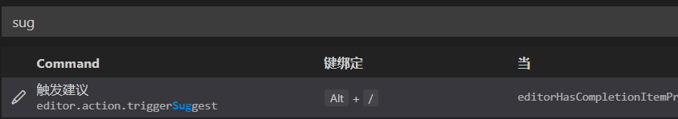
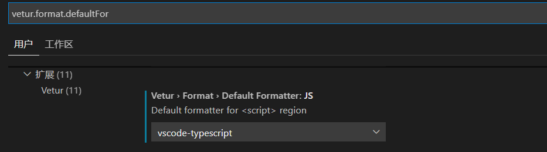

# VSCode设置


> 首先打开`settings.json`配置文件
> 1. 打开设置，可以按快捷键`CTRL + ,`
> 2. 在搜索栏搜索`settings.json`，看到`在settings.json中编辑`超链后点进去


### 修改HTML默认语言为中文
添加如下设置
```
"emmet.variables": {
    "lang": "zh_CN",
    "charset": "UTF-8"
}
```
### emmet的tab触发时灵时不灵
添加如下设置
```
"emmet.triggerExpansionOnTab": true
```

### 自定义智能提示
左下角设置按钮->键盘快捷方式->搜索栏搜"*sug*"->修改
完成后可以用`Alt+/`自动提示了



### vscode的vetur插件格式化代码不自动加分号

把"vetur.format.defaultFormatter.js": “prettier”,改为 “vetur.format.defaultFormatter.js”: “vscode-typescript”



### 设置不同语言的缩进格式

```json
"[javascript]": {
    "editor.tabSize": 2
},
"editor.tabSize": 4
```
这样就可以设置全局缩进为 4，而 js 的缩进为 2 了

————————————
更多设置参考[文档](https://code.visualstudio.com/docs/editor/codebasics)