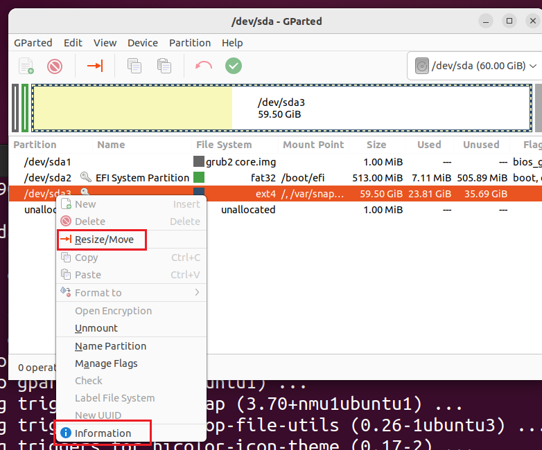
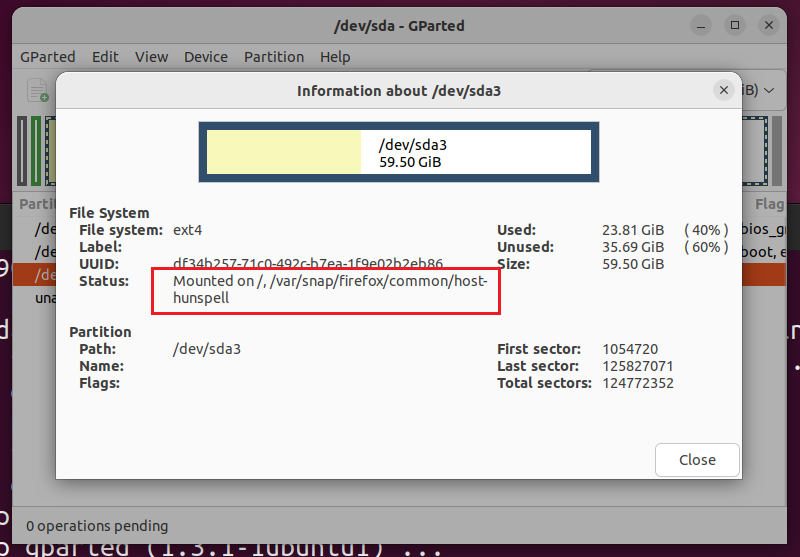
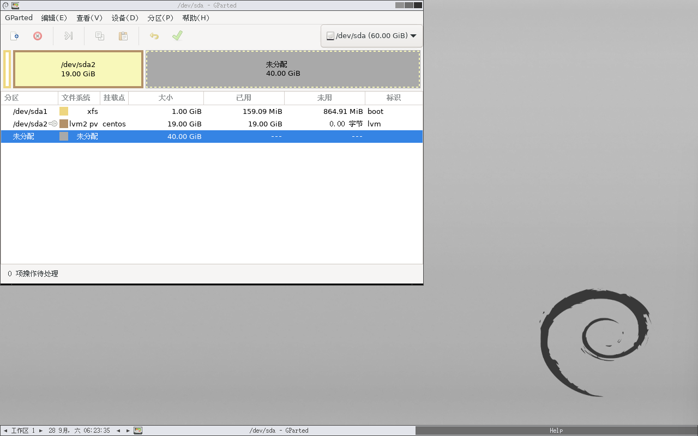

# 虚拟机磁盘扩容

## 主机存在图形界面

1、进入 virtualbox 安装模板，或者将安装目录添加到环境变量

2、找到需要扩容的虚拟机文件 `xxx.vdi`

3、执行扩容命令

```
VBoxManage.exe modifyhd "E:\VirtualMachine\ubuntu-22.04.2\ubuntu-22.04.2.vdi" --resize 61440
```

61440 = 1024mb * 60，也就是60G

3、进入系统，下载`GParted`

4、选择要扩容的盘



这时可能会提示当前磁盘正在使用中，这时可以点击 `information`，取消当前磁盘所挂载的路径



```shell
sudo -s
mount -o remount -rw /
mount -o remount -rw /var/snap/firefox/common/host-hunspell
```

最后然后点击菜单栏：GParted -> 刷新设备

就能调整大小了

## 主机不存在图形界面

### 扩容 vdi

1、找到需要扩容的虚拟机文件 `xxx.vdi`

2、执行扩容命令

```shell
VBoxManage.exe modifyhd "E:\VirtualMachine\ubuntu-22.04.2\ubuntu-22.04.2.vdi" --resize 61440
```

61440 = 1024mb * 60，也就是60G

### 扩展分区

[GParted -- Download](https://gparted.org/download.php)

1、下载 GParted，然后虚拟机挂载这个 iso，开机时启动它

2、启动后，选择第一个


3、选择 `Don't touch keymap`


4、输入 26 ，选择简体中文


5、输入 0


6、进入分区界面，可以参考上面【主机存在图形界面】



### 调整逻辑卷

分区结束后，还需要调整逻辑卷大小，存在不同类型的文件系统，操作方式不同

#### 检查文件系统

首先，可以使用 `lsblk` 或 `blkid` 命令查看该逻辑卷的文件系统类型：

```shell
lsblk -f
```

或者：

```shell
sudo blkid
```

#### EXT4 文件系统

1. 检查逻辑卷的名称

首先，确认逻辑卷的名称，以确保你将正确的卷扩展到新大小。可以使用以下命令查看当前的逻辑卷：

```shell
sudo lvdisplay
```

2. 扩展逻辑卷

假设你要扩展的逻辑卷为 `/dev/mapper/centos-root`，可以使用以下命令将其扩展到 60G：

```shell
sudo lvextend -L 60G /dev/mapper/centos-root
```

如果你只想使用所有可用的空间，可以使用：

```shell
sudo lvextend -l +100%FREE /dev/mapper/centos-root
```

3. 调整文件系统大小

扩展逻辑卷后，接下来需要调整文件系统的大小。对于 `ext4` 文件系统，使用以下命令：

```shell
sudo resize2fs /dev/mapper/centos-root
```

4. 验证

最后，使用 `df -h` 命令来检查文件系统的使用情况，确保空间已成功增加：

```shell
df -h
```

#### XFS 文件系统

`xfs` 文件系统不支持在运行时缩小，但可以扩展。

1. **扩展逻辑卷**（如果还没有扩展的话）：

   ```shell
   sudo lvextend -L 60G /dev/centos/root
   ```

   或者使用可用空间：

   ```shell
   sudo lvextend -l +100%FREE /dev/centos/root
   ```

2. **扩展文件系统**： 对于 `xfs`，使用以下命令：

   ```shell
   sudo xfs_growfs /dev/centos/root
   ```

## 清理

要压缩 VirtualBox 中的 VDI 文件，你可以按照以下步骤操作：

1. **关闭虚拟机**：确保你的虚拟机已经完全关闭，而不是暂停或挂起状态。

2. **清理虚拟机内部的空间**：在虚拟机内，运行以下命令来清理空间（可选，但推荐）：

   ```
   # ubuntu
   sudo apt-get clean
   sudo apt-get autoremove
   # Centos
   sudo yum clean all
   sudo yum autoremove
   ```

3. 重新标记0，压缩时，会将磁盘中标记为0的空间压缩，所以需要对空闲的磁盘使用dd工具批量填充为0后删除，能够带来压缩率的提升。

   + 删除快照

   + ```shell
     cd /
     sudo dd if=/dev/zero of=/free
     sudo rm -rf /free
     ```

4. **使用 VirtualBox 的 `VBoxManage` 命令**： 你可以使用 `VBoxManage` 命令来压缩 VDI 文件。打开终端并运行：

   ```
   VBoxManage modifymedium disk /path/to/your/disk.vdi --compact
   ```

   请将 `/path/to/your/disk.vdi` 替换为你的 VDI 文件的实际路径。

5. **检查 VDI 文件的大小**：压缩完成后，检查 VDI 文件的大小是否有所改变。