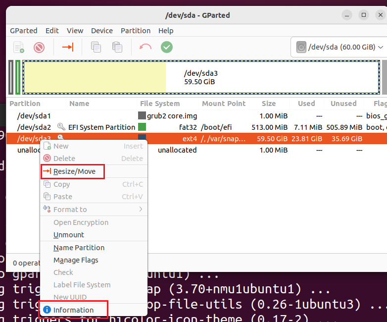
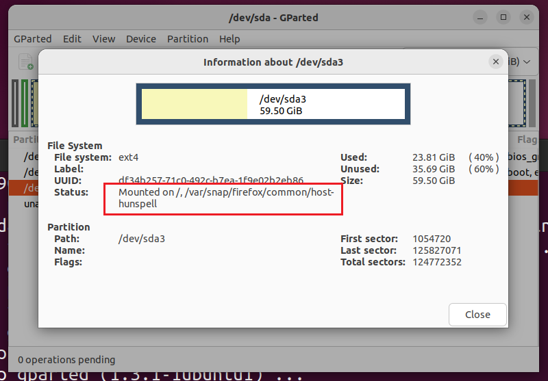

1、进入 virtualbox 安装模板，或者将安装目录添加到环境变量

2、找到需要扩容的虚拟机文件 `xxx.vdi`

3、执行扩容命令

```
VBoxManage.exe modifyhd "E:\VirtualMachine\ubuntu-22.04.2\ubuntu-22.04.2.vdi" --resize 61440
```

61440 = 1024mb * 60，也就是60G

3、进入系统，下载`GParted`

4、选择要扩容的盘



这时可能会提示当前磁盘正在使用中，这时可以点击 `information`，取消当前磁盘所挂载的路径



```shell
sudo -s
mount -o remount -rw /
mount -o remount -rw /var/snap/firefox/common/host-hunspell
```

最后然后点击菜单栏：GParted -> 刷新设备

就能调整大小了