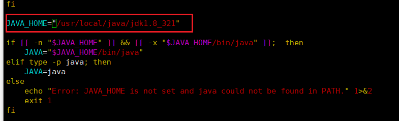

# zookeeper安装

0、安装jdk

1、下载zookeeper，apache-zookeeper-3.5.6-bin.tar.gz

网址 https://archive.apache.org/dist/zookeeper/zookeeper-3.4.11/

```shell
wget [url]
```

2、解压

```shell
sudo tar -zxvf apache-zookeeper-3.5.6-bin.tar.gz 
sudo mv apache-zookeeper-3.5.6-bin /usr/local/zookerper
```

3、配置

前往zookeeper的conf文件夹下，发现zoo_sample.cfg，但是zoo.cfg才是有效配置名，所以我们复制一份

```shell
cp conf/zoo_sample.cfg conf/zoo.cfg
```

4、修改数据目录

默认的数据目录为`/tmp/zookeeper`，所以我们要给他换个位置，vi编辑zoo.cfg

```
# 将dataDir=/tmp/zookeeper改为如下代码
dataDir=/usr/local/zookerper/zkdata
```

5、命令

在zookeeper目录下

```shell
bin/zkServer.sh start # 启动zookeeper
bin/zkServer.sh stop  # 停止zookeeper
bin/zkServer.sh status # 查看zookeeper状态
```

**注意** ：有时可以会报找不到JAVA_HOME，这时需要修改bin目录的zkEnv.sh文件，在if判断之前加上JAVA_HOME路径


