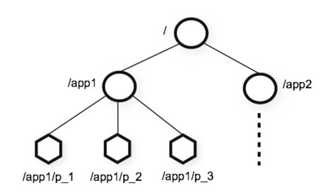
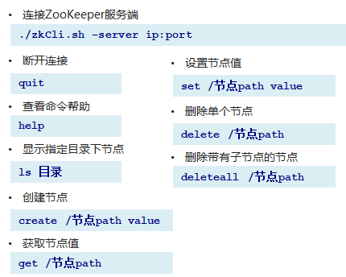
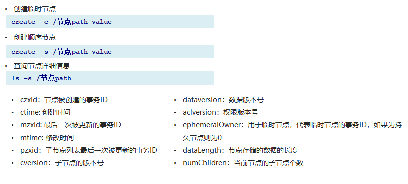
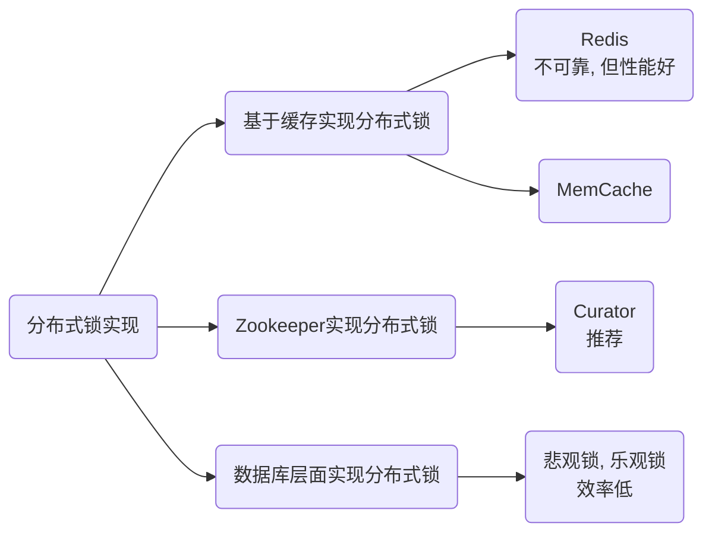

# Zookeeper命令操作

## Zookeeper简介

1. Zookeeper 是 Apache Hadoop 项目下的一个子项目，是一个树形目录服务。
2. Zookeeper 翻译过来就是 动物园管理员，他是用来管 Hadoop（大象）、Hive(蜜蜂)、Pig(小 猪)的管理员。简称zk
3. Zookeeper 是一个分布式的、开源的分布式应用程序的协调服务。
4. Zookeeper 提供的主要功能包括：
   + 配置管理
   + 分布式锁
   + 集群管理

## 数据模型

ZooKeeper是一个树形目录服务其数据模型和Unix的文件系统目录树很类似，拥有一个层次化结构。

这里面的每一个节点都被称为：ZNode，每个节点上都会保存自己的数据和节点信息。



节点可以拥有子节点，同时也允许少量（1MB）数据存储在该节点之下。

节点可以分为四大类：

+ `PERSISTENT` 持久化节点 
+ `EPHEMERAL` 临时节点 ：-e
+ `PERSISTENT_SEQUENTIAL` 持久化顺序节点 ：-s
+ `EPHEMERAL_SEQUENTIAL` 临时顺序节点  ：-es

## 服务端命令

前往zookeeper的bin目录下

+ 启动 ZooKeeper 服务: `./zkServer.sh start`
+ 查看 ZooKeeper 服务状态: `./zkServer.sh status`
+ 停止 ZooKeeper 服务: `./zkServer.sh stop`
+ 重启 ZooKeeper 服务: `./zkServer.sh restart `

## 客户端命令

前往zookeeper的bin目录下





## JavaAPI操作

### Curator简介

Curator 是 Apache ZooKeeper 的Java客户端库。

+ 常见的ZooKeeper Java API ：
  + 原生Java API
  + ZkClient
  + Curator
    + Curator 项目的目标是简化 ZooKeeper 客户端的使用。
    + Curator 最初是 Netfix 研发的,后来捐献了 Apache 基金会,目前是 Apache 的顶级项目。
    + 官网：http://curator.apache.org/

### 引入依赖

```xml
<dependencies>
    <dependency>
        <groupId>junit</groupId>
        <artifactId>junit</artifactId>
        <version>4.13.1</version>
        <scope>test</scope>
    </dependency>

    <!--curator -->
    <dependency>
        <groupId>org.apache.curator</groupId>
        <artifactId>curator-framework</artifactId>
        <version>4.0.0</version>
    </dependency>
    <dependency>
        <groupId>org.apache.curator</groupId>
        <artifactId>curator-recipes</artifactId>
        <version>4.0.0</version>
    </dependency>

    <!--日志-->
    <dependency>
        <groupId>org.slf4j</groupId>
        <artifactId>slf4j-api</artifactId>
        <version>1.7.21</version>
    </dependency>
    <dependency>
        <groupId>org.slf4j</groupId>
        <artifactId>slf4j-log4j12</artifactId>
        <version>1.7.21</version>
    </dependency>
</dependencies>

<build>
    <plugins>
        <plugin>
            <groupId>org.apache.maven.plugins</groupId>
            <artifactId>maven-compiler-plugin</artifactId>
            <version>3.8.1</version>
            <configuration>
                <source>1.8</source>
                <target>1.8</target>
            </configuration>
        </plugin>
    </plugins>
</build>
```

### 创建连接

创建连接涉及到下面4个参数

1. connectString         		– 连接字符串，zkServer的地址和端口，多个则以","隔开
2. sessionTimeoutMs        – 会话超时时间
3. connectionTimeoutMs  – 连接超时时间
4. retryPolicy                     – 重连策略，所有策略均实现RetryPolicy接口

```java
// 重试策略
RetryPolicy retryPolicy = new ExponentialBackoffRetry(3000, 10);
// 方式1
CuratorFramework client = CuratorFrameworkFactory.
    newClient("192.168.56.89:2181", 60 * 1000, 15 * 1000, retryPolicy);

// 方式2
CuratorFramework client = CuratorFrameworkFactory.builder()
        .connectString("")
        .sessionTimeoutMs(60 * 1000)
        .connectionTimeoutMs(15 * 1000)
        .retryPolicy(retryPolicy)
        .namespace("dubbo-study")
        .build();

client.start();
```

注意方式2中链式构造时多指定了一个`namespace`的参数，默认情况下所有的操作都是在`/`上进行的，如果指定了名称空间参数则会在`/[namespace]`上进行操作

### 增删改查

1、添加

如果创建节点，没有指定数据，则认将当前客户端的ip作为数据存储

```java
// 1. 基本创建
String path = client.create().forPath("/app1");
// 2. 创建节点，带有数据
String path = client.create().forPath("/app1", "dubbo".getBytes());
// 3. 设置节点类型
// 默认类型：持久化
String path = client.create().withMode(CreateMode.PERSISTENT).forPath("/app1");
// 4. 创建多级节点
String path = client.create().creatingParentsIfNeeded().forPath("/app1/p1");
```

**注意**：

即使在客户端命令中也只不能直接创建多级节点的，但是curator提供了`creatingParentsIfNeeded`方法则则可以解决这个问题。

2、查询

对应于原始的客户端命令有以下三个命令

+ 查询数据：`get`
+ 查询子节点：`ls`
+ 查询节点状态信息：`ls -s`

```java
// 1. 查询数据 get
byte[] bytes = client.getData().forPath("/app1");
System.out.println(new String(bytes));
// 2. 查询子节点 ls
List<String> pathList = client.getChildren().forPath("/app1");
System.out.println(pathList);
// 注意，因为设置了命名空间，所以下面的`/`真正代表的是`/[namespace]`
pathList = client.getChildren().forPath("/");
System.out.println(pathList);
// 3. 查询节点状态信息 ls -s
Stat stat = new Stat();
client.getData().storingStatIn(stat).forPath("/app1");
System.out.println(stat);
```

3、修改

```java
// 1. 修改数据
client.setData().forPath("/app1", "hello world".getBytes());
// 2. 根据版本修改
// 先查询版本
Stat stat = new Stat();
client.getData().storingStatIn(stat).forPath("/app1");
// 根据版本修改
client.setData().withVersion(stat.getVersion()).forPath("/app1", "hello world".getBytes()); 
```

4、删除

```java
// 1. 删除单个节点
client.delete().forPath("/app1");
// 2. 删除带子节点的节点
client.delete().deletingChildrenIfNeeded().forPath("/app1");
// 3. 必须成功的删除
// *比如因为网络抖动导致删除超时，那么他会不断尝试删除操作，直到成功为止
client.delete().guaranteed().forPath("/app2");
// 4. 回调
client.delete().guaranteed().inBackground(new BackgroundCallback() {
    @Override
    public void processResult(CuratorFramework client, CuratorEvent event) 
        throws Exception {
        System.out.println("已删除");
        System.out.println(event);
    }
}).forPath("/app2");
```

### Watch事件监听

**介绍**

ZooKeeper允许用户在指定节点上注册些 Watcher，并且**在一些特定事件触发的时候**，ZooKeeper服务端**会将事件通知到感兴趣的客户端**上去，该机制是 ZooKeeper实现分布式协调服务的重要特性

ZooKeeper中引入了 Watcher机制来实现了**发布/订阅功能**，能够让**多个订阅者同时监听某一个对象**，当一个对象自身状态变化时，会通知所有订阅者。

ZooKeeper原生支持通过注册 Watcher来进行事件监听，但是其使用并不是特别方便需要开发人员自己反复注册 Watcher，比较繁琐。

Curator引入了 Cache来实现对 ZooKeeper服务端事件的监听

ZooKeeper提供了三种 Watcher：

+ NodeCache：只是监听某一个特定的节点
+ PathChildrenCache：监控—个 ZNode的子节点
+ TreeCache：可以监控整个树上的所有节点，类似于 PathChildrenCache和 NodeCache的组合

**代码实现**

1、监听指定节点

```java
// 1. 创建NodeCache对象
NodeCache nodeCache = new NodeCache(client, "/app1");
// 2. 注册监听
nodeCache.getListenable().addListener(new NodeCacheListener() {
    @Override
    public void nodeChanged() throws Exception {
        System.out.println("节点变化了");
        
        // 获取修改节点后的数据
        byte[] data = nodeCache.getCurrentData().getData();
        System.out.println(new String(data));
    }
});
// 3. 开启监听,如果设置为true，则在开启监听时，会加载缓冲数据数据
nodeCache.start(true);
```

2、监听某一结点的子节点

```java
// 1. 创建NodeCache对象，第三个参数为true则缓存节点数据
PathChildrenCache pathChildrenCache = new PathChildrenCache(client, "/app1", true);
// 2. 注册监听
pathChildrenCache.getListenable().addListener(new PathChildrenCacheListener() {
    @Override
    public void childEvent(CuratorFramework client, PathChildrenCacheEvent event) throws Exception {
        System.out.println(event);
        // 获取类型
        PathChildrenCacheEvent.Type type = event.getType();
        // 判断类型是否符合
        if (type.equals(PathChildrenCacheEvent.Type.CHILD_UPDATED)) {
            // 获取数据
            byte[] data = event.getData().getData();
            System.out.println(new String(data));
        }
    }
});
// 3. 开启监听
pathChildrenCache.start();
```

**注意**：

获取节点数据时，要先调用`PathChildrenCacheEvent`的`getData()`方法，然后对这个获取到的对象再调用一次`getData()`

3、监听某个节点自己以及所有子节点

```java
// 1. 创建监听器
TreeCache treeCache = new TreeCache(client, "/app2");
// 2. 注册监听
treeCache.getListenable().addListener(new TreeCacheListener() {
    @Override
    public void childEvent(CuratorFramework client,
                           TreeCacheEvent event) throws Exception {
        System.out.println(event);
    }
});
// 3. 开启监听
treeCache.start();
```

### 分布式锁实现

#### 简介

在我们进行单机应用开发，涉及并发同步的时候，我们往往釆用 synchronized或者Lok的方式来解决多线程间的代码同步问题，这时多线程的运行都是在同一个JVM之下，没有任何问题。

但当我们的应用是分布式集群工作的情况下，属于多JVM下的工作环境，跨JVM之间已经无法通过多线程的锁解决同步问题。

那么就需要—种更加高级的锁机制，来处理种跨机器的进程之间的数据同步问题—这就是分布式锁。



#### 原理

核心思想：当客户端要获取锁，则创建节点，使用完锁，则删除该节点。

1. 客户端获取锁时，在lock节点下创建<font color=red>临时顺序</font>节点
   + 临时：如果机器宕机了且节点是持久的，那么机器所加持的锁就永远不会被解除，其他机器就会一直处于等待状态；而如果是临时的，机器一宕机会话就会结束，机器所加持的锁会自动解除
   + 顺序：后续判断机器是否获取到了锁是与节点的序号有关
2. 然后获取lock下面的所有子节点，客户端获取到所有的子节点之后，如果发现自己创建的子节点序号最小，那么就认为该客户端获取到了锁。使用完锁后，将该节点删除
3. 如果发现自己创建的节点并非lock所有子节点中最小的，说明自己还没有获取到锁，此时客户端需要找到比自己小的那个节点，同时对其注册事件监听器，监听删除事件。
   + 只找与自己最近的比自己小的节点
   + 监听对方的删除事件
4. 如果发现比自己小的那个节点被删除，则客户端的Watcher会收到相应通知，此时再次判断自己创建的节点是否是lock子节点中序号最小的，如果是则获取到了锁，如果不是则重复以上步骤继续获取到比自己小的一个节点并注册监听。

#### 实现

在 Curator中有五种锁方案

+ `InterProcessSemaphoreMutex`：分布式排它锁（非可重入锁）
+ `InterProcessMutex`：分布式可重入排它锁
+ `InterProcessReadwritelock`：分布式读写锁
+ `InterProcessMultiLock`：将多个锁作为单个实体管理的容器
+ `InterProcessSemaphoreV2`：共享信号量

```java
public class Ticket12306 implements Runnable {

    private int tickets = 10; // 数据库的票数

    private InterProcessMutex lock;

    public Ticket12306() {
        RetryPolicy retryPolicy = 
            new ExponentialBackoffRetry(3000, 10);
        CuratorFramework client = CuratorFrameworkFactory.builder()
                .connectString("192.168.56.89:2181")
                .sessionTimeoutMs(60 * 1000)
                .connectionTimeoutMs(15 * 1000)
                .retryPolicy(retryPolicy)
                .build();
        client.start();
        lock = new InterProcessMutex(client, "/lock");
    }

    @Override
    public void run() {
        while(true) {
            try {
                // 获取锁
                lock.acquire(3, TimeUnit.SECONDS);

                // 处理票数
                if (tickets > 0) {
                    System.out.println(Thread.currentThread() + ":" + tickets);;
                    tickets--;
                } else {
                    break;
                }
            } catch (Exception exception) {
                exception.printStackTrace();
            } finally {
                // 释放锁
                try {
                    if (lock.isAcquiredInThisProcess()) {
                        lock.release();
                    }
                } catch (Exception exception) {
                    exception.printStackTrace();
                }
            }
        }
    }
    
    public static void main(String[] args) {
        Ticket12306 ticket12306 = new Ticket12306();

        // 创建客户端
        new Thread(ticket12306, "携程").start();
        new Thread(ticket12306, "飞猪").start();
    }
}
```

注意创建`CuratorFramework`对象时一定要先调用`start()`方法:disappointed_relieved:

