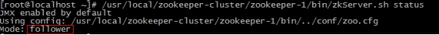
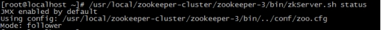
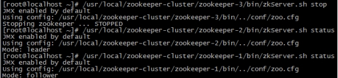
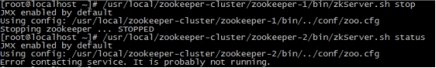
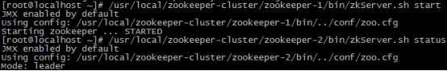
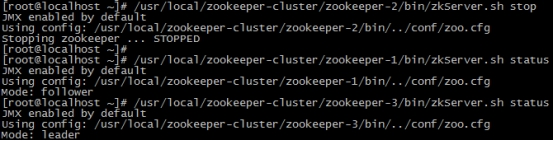
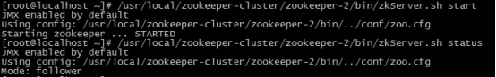
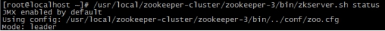
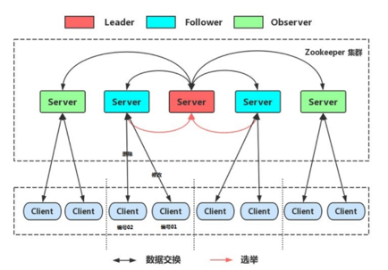

# Zookeeper集群

## Leader选举

+ Serverid：服务器ID
  + 比如有三台服务器，编号分别是1，2，3，编号越大在选择算法中的权重越大。
+ Zxid：数据ID
  + 服务器中存放的最大数据D值越大说明数据越新在选举算法中数据越新权重越大
+ 在 Leader选举的过程中，如果某台 ZooKeeper，获得了超过半数的选票，则此 ZooKeeper就可以成为 leader了。
  + 假如zookeeper集群有5台机器，首先启动1号机器，它给自己投一票，但是没有超过半数所以他不能称为leader
  + 然后启动2号机器，它也给自己投一票，因为它的号码大，所以1号机器也投他一票，但是票数还没过半，所以2好机器也不能称为leader
  + 启动3号机器，他先给自己投一票，然后1、2号机器也给他投一票，票数过半，所以3号机器称为leader
  + 现在启动4号机器，但是目前已经有了3号机器作为leader，所以4号机器也只能给1号投一票

## 搭建集群

### 搭建要求

真实的集群是需要部署在不同的服务器上的，但是在我们测试时同时启动很多个虚拟机内存会吃不消，所以我们通常会搭建**伪集群**，也就是把所有的服务都搭建在一台虚拟机上，用端口进行区分。

我们这里要求搭建一个三个节点的Zookeeper集群（伪集群）。

### 准备工作

重新部署一台虚拟机作为我们搭建集群的测试服务器。

（1）安装JDK  【此步骤省略】。

（2）Zookeeper压缩包上传到服务器

（3）将Zookeeper解压 ，建立/usr/local/zookeeper-cluster目录，将解压后的Zookeeper复制到以下三个目录

/usr/local/zookeeper-cluster/zookeeper-1

/usr/local/zookeeper-cluster/zookeeper-2

/usr/local/zookeeper-cluster/zookeeper-3

```shell
[root@localhost ~]# mkdir /usr/local/zookeeper-cluster
[root@localhost ~]# cp -r  apache-zookeeper-3.5.6-bin /usr/local/zookeeper-cluster/zookeeper-1
[root@localhost ~]# cp -r  apache-zookeeper-3.5.6-bin /usr/local/zookeeper-cluster/zookeeper-2
[root@localhost ~]# cp -r  apache-zookeeper-3.5.6-bin /usr/local/zookeeper-cluster/zookeeper-3
```

（4）创建data目录 ，并且将 conf下zoo_sample.cfg 文件改名为 zoo.cfg

```shell
mkdir /usr/local/zookeeper-cluster/zookeeper-1/data
mkdir /usr/local/zookeeper-cluster/zookeeper-2/data
mkdir /usr/local/zookeeper-cluster/zookeeper-3/data

mv  /usr/local/zookeeper-cluster/zookeeper-1/conf/zoo_sample.cfg  /usr/local/zookeeper-cluster/zookeeper-1/conf/zoo.cfg
mv  /usr/local/zookeeper-cluster/zookeeper-2/conf/zoo_sample.cfg  /usr/local/zookeeper-cluster/zookeeper-2/conf/zoo.cfg
mv  /usr/local/zookeeper-cluster/zookeeper-3/conf/zoo_sample.cfg  /usr/local/zookeeper-cluster/zookeeper-3/conf/zoo.cfg
```


（5） 配置每一个Zookeeper 的dataDir 和 clientPort 分别为2181  2182  2183

修改/usr/local/zookeeper-cluster/zookeeper-1/conf/zoo.cfg

```shell
vim /usr/local/zookeeper-cluster/zookeeper-1/conf/zoo.cfg

clientPort=2181
dataDir=/usr/local/zookeeper-cluster/zookeeper-1/data
```

修改/usr/local/zookeeper-cluster/zookeeper-2/conf/zoo.cfg

```shell
vim /usr/local/zookeeper-cluster/zookeeper-2/conf/zoo.cfg

clientPort=2182
dataDir=/usr/local/zookeeper-cluster/zookeeper-2/data
```

修改/usr/local/zookeeper-cluster/zookeeper-3/conf/zoo.cfg

```shell
vim /usr/local/zookeeper-cluster/zookeeper-3/conf/zoo.cfg

clientPort=2183
dataDir=/usr/local/zookeeper-cluster/zookeeper-3/data
```


### 配置集群

（1）在每个zookeeper的 data 目录下创建一个 myid 文件，内容分别是1、2、3 。这个文件就是记录每个服务器的ID

```shell
echo 1 >/usr/local/zookeeper-cluster/zookeeper-1/data/myid
echo 2 >/usr/local/zookeeper-cluster/zookeeper-2/data/myid
echo 3 >/usr/local/zookeeper-cluster/zookeeper-3/data/myid
```

（2）在每一个zookeeper 的 zoo.cfg配置客户端访问端口（clientPort）和集群服务器IP列表。

集群服务器IP列表如下

```shell
vim /usr/local/zookeeper-cluster/zookeeper-1/conf/zoo.cfg
vim /usr/local/zookeeper-cluster/zookeeper-2/conf/zoo.cfg
vim /usr/local/zookeeper-cluster/zookeeper-3/conf/zoo.cfg

server.1=192.168.149.135:2881:3881
server.2=192.168.149.135:2882:3882
server.3=192.168.149.135:2883:3883
```

解释：server.服务器ID=服务器IP地址：服务器之间通信端口：服务器之间投票选举端口

### 启动集群

启动集群就是分别启动每个实例。

```shell
/usr/local/zookeeper-cluster/zookeeper-1/bin/zkServer.sh start
/usr/local/zookeeper-cluster/zookeeper-2/bin/zkServer.sh start
/usr/local/zookeeper-cluster/zookeeper-3/bin/zkServer.sh start
```

 

启动后我们查询一下每个实例的运行状态

```shell
/usr/local/zookeeper-cluster/zookeeper-1/bin/zkServer.sh status
/usr/local/zookeeper-cluster/zookeeper-2/bin/zkServer.sh status
/usr/local/zookeeper-cluster/zookeeper-3/bin/zkServer.sh status
```

先查询第一个服务

 

Mode为follower表示是**跟随者**（从）

再查询第二个服务Mod 为leader表示是**领导者**（主）

 

查询第三个为跟随者（从）

 

### 模拟集群异常

（1）首先我们先测试如果是从服务器挂掉，会怎么样

把3号服务器停掉，观察1号和2号，发现状态并没有变化

```shell
/usr/local/zookeeper-cluster/zookeeper-3/bin/zkServer.sh stop

/usr/local/zookeeper-cluster/zookeeper-1/bin/zkServer.sh status
/usr/local/zookeeper-cluster/zookeeper-2/bin/zkServer.sh status
```

 

由此得出结论，3个节点的集群，从服务器挂掉，集群正常

（2）我们再把1号服务器（从服务器）也停掉，查看2号（主服务器）的状态，发现已经停止运行了。

```shell
/usr/local/zookeeper-cluster/zookeeper-1/bin/zkServer.sh stop

/usr/local/zookeeper-cluster/zookeeper-2/bin/zkServer.sh status
```

 

由此得出结论，3个节点的集群，2个从服务器都挂掉，主服务器也无法运行。因为可运行的机器没有超过集群总数量的半数。

（3）我们再次把1号服务器启动起来，发现2号服务器又开始正常工作了。而且依然是领导者。

```shell
/usr/local/zookeeper-cluster/zookeeper-1/bin/zkServer.sh start

/usr/local/zookeeper-cluster/zookeeper-2/bin/zkServer.sh status
```


 

（4）我们把3号服务器也启动起来，把2号服务器停掉,停掉后观察1号和3号的状态。

```shell
/usr/local/zookeeper-cluster/zookeeper-3/bin/zkServer.sh start
/usr/local/zookeeper-cluster/zookeeper-2/bin/zkServer.sh stop

/usr/local/zookeeper-cluster/zookeeper-1/bin/zkServer.sh status
/usr/local/zookeeper-cluster/zookeeper-3/bin/zkServer.sh status
```

 

发现新的leader产生了~  

由此我们得出结论，当集群中的主服务器挂了，集群中的其他服务器会自动进行选举状态，然后产生新得leader 

（5）我们再次测试，当我们把2号服务器重新启动起来启动后，会发生什么？2号服务器会再次成为新的领导吗？我们看结果

```shell
/usr/local/zookeeper-cluster/zookeeper-2/bin/zkServer.sh start

/usr/local/zookeeper-cluster/zookeeper-2/bin/zkServer.sh status
/usr/local/zookeeper-cluster/zookeeper-3/bin/zkServer.sh status
```



 

我们会发现，2号服务器启动后依然是跟随者（从服务器），3号服务器依然是领导者（主服务器），没有撼动3号服务器的领导地位。

由此我们得出结论，当领导者产生后，再次有新服务器加入集群，不会影响到现任领导者。

## 集群角色

在ZooKeeper集群服中务中有三个角色：

+ Leader 领导者 ：          
  1. 处理事务请求（增删改）
  1. 集群内部各服务器的调度者
+ Follower 跟随者 ：
  1. 处理客户端非事务请求（查），转发事务请求给Leader服务器
  2. 参与Leader选举投票

+ Observer 观察者：
  1. 处理客户端非事务请求，转发事务请求给Leader服务器



例子：

Follower收到客户端的一个删除请求，因为Follower做不了事务操作，所以他将操作转发给Leader，Leader做完了删除请求后，发现其他Server少了一个节点，于是它将他自己的数据同步到其他的服务器中

