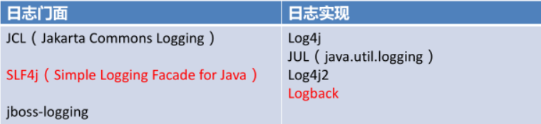
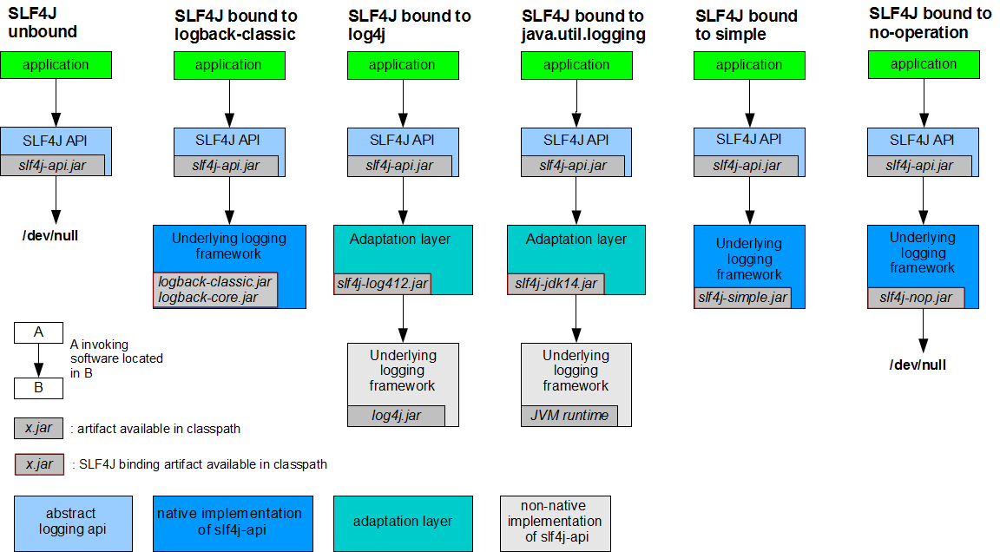
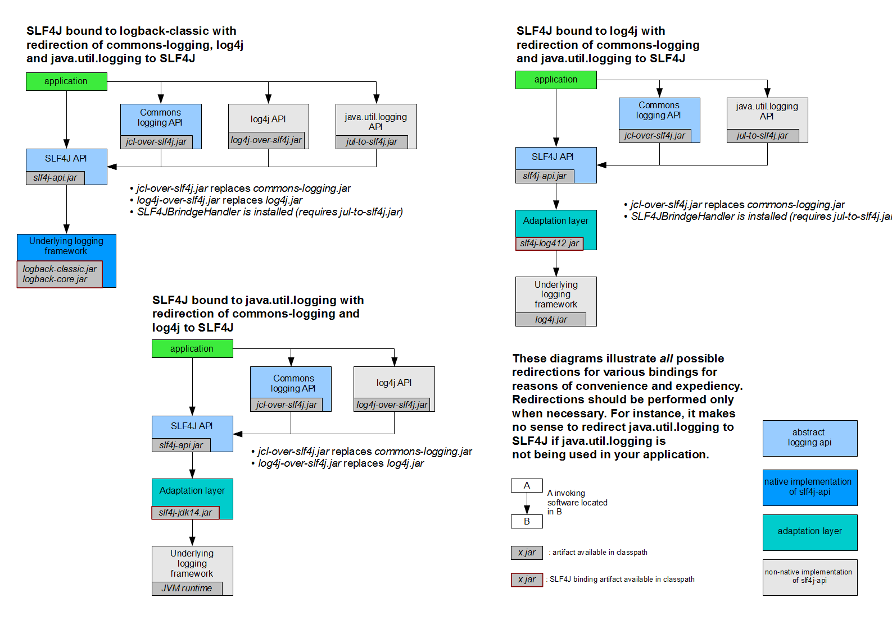

[toc]

## 日志相关笔记

## 1、简述

市场上存在非常多的日志框架。JUL（java.util.logging），JCL（Apache Commons Logging），Log4j，Log4j2，Logback、SLF4j、jboss-logging等。Spring在框架内容部使用JCL，spring-boot-starter-logging采用了sif4j+logback的形式，Spring Boot也能自动适配（jul、log4j2、logback）并简化配置



日志框架历史：

+ JCL：是Apache的一个日志框架，由于是Jakarta小组写的所以命名为JCL，但是最近的一次更新也是在2014年，所以太老了，不推荐使用
+ jboss-logging：使用的场景太少了，不适合使用
+ Log4j：首次出来，使用状况还不错，但是存在性能问题，所以作者准备升级一下
+ Logback：Log4j的作者觉得重写框架可能太费时间，于是重新写了一个，这就是日志实现
+ SLF4j：这个就是Log4j2的日志门面
+ Log4j2：是Apache所写的，但是写的太好，许多框架并不适配它

**Spring**使用**JCL**也就是commons-logging

**SpringBoot**选用 **SLF4j**和**logback**


## 2、SLF4j的使用

> [如何在系统中使用SLF4j](https://www.slf4j.org) 

以后开发的时候，日志记录方法的调用，不应该来直接调用日志的实现类，而是调用日志抽象层里面的方法；

给系统里面导入slf4j的jar和  logback的实现jar

```java
import org.slf4j.Logger;
import org.slf4j.LoggerFactory;

public class HelloWorld {
  public static void main(String[] args) {
    Logger logger = LoggerFactory.getLogger(HelloWorld.class);
    logger.info("Hello World");
  }
}
```

图示；



每一个日志的实现框架都有自己的配置文件。使用slf4j以后，**配置文件还是做成日志实现框架自己本身的配置文件；**

## 3、遗留问题

a（slf4j+logback）: Spring（commons-logging）、Hibernate（jboss-logging）、MyBatis、xxxx

统一日志记录，即使是别的框架和我一起统一使用slf4j进行输出？



**如何让系统中所有的日志都统一到slf4j；**

1、将系统中其他日志框架先排除出去；

2、用中间包来替换原有的日志框架；

3、我们导入slf4j其他的实现