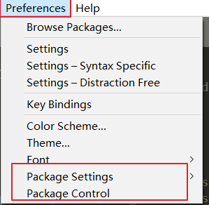
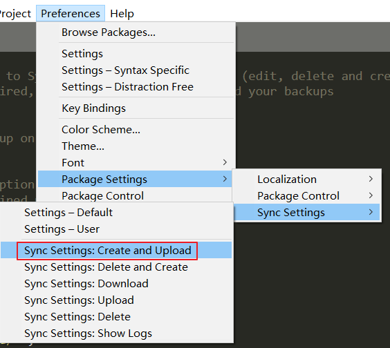

[toc]

# Sublime 使用

# 一、预备

## 1、安装Package Control

浏览选项卡，有一个选项卡的子项内容应该是`install Package Control`，点击后过一段时间，出现了如下图所示内容就代表安装完毕



## 2、同步插件

​	打开命令框`ctrl + shift + p`，然后输入`pi`，找到`Package Control：install Package`选项则可以进行插件安装

​	稍等一会，会出来一个插件列表，在输入框里输入`sync settings`，下载这个插件



​	然后选择创建，在里面填入你的token id就行了，格式如下

```settings
{
    // Brings write permission to Sync Settings over your gists
    // This option is not required, if you only want to download your backups
    "access_token": ""
}
```

## 3、中文插件

搜索chinese就能找到

## 4、前端插件

emmet

tab 缩进失效，只能用 ctrl + [ 或者 ctrl + ] 替代

## 5、编码插件

当文件编码默认为gbk或其他非utf8时，可以下载一个名为`convertToUTF8`的插件

## 6、其他插件

图标插件：a file icon


# 二、快捷操作

<kbd>Alt</kbd>+<kbd>Shift</kbd>+<kbd>2</kbd>：将页面分为两个屏幕

<kbd>Alt</kbd>+<kbd>Shift</kbd>+<kbd>1</kbd>：恢复单屏

<kbd>Ctrl</kbd>+<kbd>J</kbd>：选择一个单词

<kbd>Ctrl</kbd>+<kbd>L</kbd>：选择一行

<kbd>Ctrl</kbd>+<kbd>鼠标左键</kbd>：产生多个光标

<kbd>Ctrl</kbd>+<kbd>D</kbd>：选择选中项的下一个匹配项

<kbd>Alt</kbd>+<kbd>F3</kbd>：选择选中项的所有匹配项

<kbd>Ctrl</kbd>+<kbd>Shift</kbd>+<kbd>'</kbd>：选择与光标关联的开始和结束标签

<kbd>Ctrl</kbd>+<kbd>Shift</kbd>+<kbd>A</kbd>：选择父容器的内容

<kbd>Ctrl</kbd>+<kbd>Shift</kbd>+<kbd>↑/↓</kbd>：上移或下移行

<kbd>Ctrl</kbd>+<kbd>Shift</kbd>+<kbd>M</kbd>：选择括号内的内容

<kbd>Ctrl</kbd>+<kbd>Shift</kbd>+<kbd>Y</kbd>：计算数学表达式

<kbd>Ctrl</kbd>+<kbd>↑/↓</kbd>：递增或递减数字（步长为1）

<kbd>Alt</kbd>+<kbd>Shift</kbd>+<kbd>↑/↓</kbd>：递增或递减数字（步长为10）

# 三、自定义快捷键

## 用默认浏览器打开

首选项 -> 快捷键设置

配置如下

```json
[
    { "keys": ["f12"], "command": "open_in_browser" }
]
```


# 四、自动补全

`link:css` 	自动补全css链接样式

# 五、配置

```json
{
    "update_check": false, // 取消更新
    "hot_exit": false, // 退出软件提示保存
    "remember_open_files": false // 是否记住上次未关闭的文件
}
```

