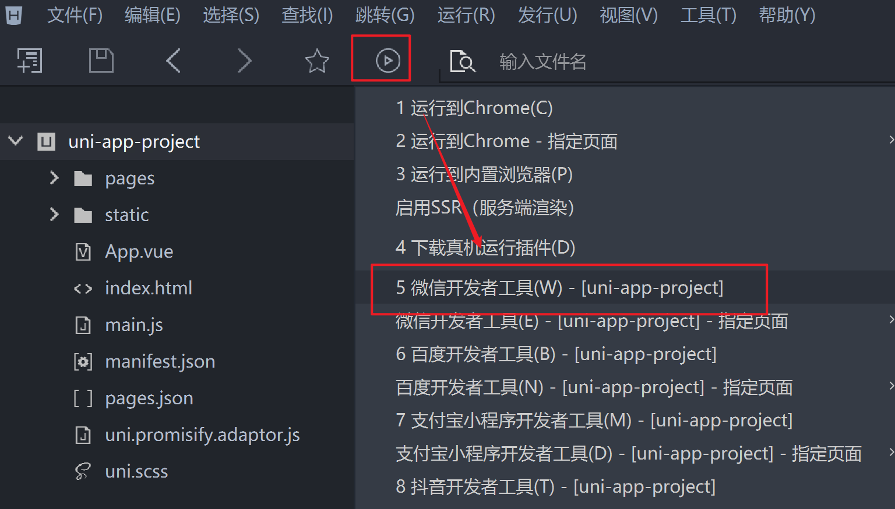

# 环境搭建

## 创建uni-app项目

uni-app支持两种方式创建项目：

1. 通过HBuilderX创建

   + 1、首页 -> 创建项目 -> 新建uni-app项目 -> 选择 Vue3
     

   + 2、顶部菜单【工具】-> 【插件安装】。安装 uni-app（Vue3）插件，以编译 Vue3 到任何其他平台
     

   + 3、首次运行需要指定微信开发者工具
     

     

   + 4、编译，可能会产生一下报错

     

     按照指示打开端口即可

     

   + 5、小技巧
     

   + 6、HBuilderX 和 微信开发者工具关联

     

2. 通过命令行创建（暂无教程）

官网链接：https://zh.uniapp.dcloud.io/quickstart-cli.html

+ Vue3 + ts：`npx degit dcloudio/uni-preset-vue#vite-ts my-vue3-project`
+ Vue3 + js：`npx degit dcloudio/uni-preset-vue#vite my-vue3-project`

