# 核心系统

## 食物★★★

+ 前期吃米虱木（土培砖）

+ 接着刺花（液培砖）
  + 刺花正常6周期成熟，在有农业站的情况下生长速率可以加快一半，也就是3周期成熟
  + 成熟的刺花能产生1600千卡，然后再弄一个炒菜的，经过烹饪可以产生2000卡
  + 一个小人一周期消耗1000卡，也就是1一个小人只要1.5个刺花就行了

种完刺花米虱木就可以拆掉了，免得小人跑来跑去

## 公厕★★★

**户外**

堆肥可能会产生污染气体，则需要解锁气体第三级科技的**除污**

用10千克的水盖住产生污染氧的东西，这样他就不会再产污染氧了，所以可以在堆肥旁边铺一层水，以防止污染氧冒出来

**厕所**

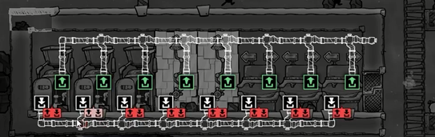

解锁液体科技的**净化**（筛子）

因为水池、浴室的消耗和废水产生是1比1，但是马桶没消耗1会产生2，所以不平衡，因此需要一个液培砖种植**芦苇**来抵消消耗

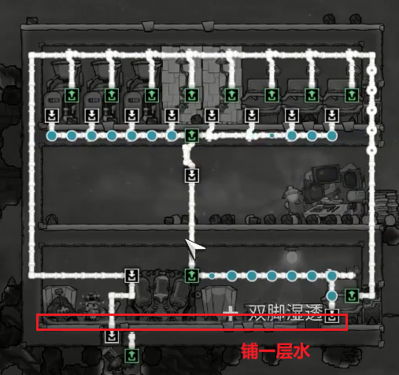

## 制氧★★★★

等基地密封好后，就要准备制氧了，首先制氧设备使用**电解机**，材质是**金汞奇**，因为它可以提高过热温度，管道要用隔热的**火成岩**，中层承重的砖头应该是透气的**花岗岩**

+ 首先一个小人消耗100克氧气/秒，而电解器每秒产生888克气体/秒，如果小人数大于8，就要两台电解器
+ 供电
  + 一个气泵抽气500克/秒，一个电解器要两个气泵，所以**两个电解器要用4个气泵**
  + 一个气泵耗电240瓦，一个电解器耗电120瓦，所以4个气泵960瓦，2个电解器240瓦，共1200瓦
  + 为了构成最初的循环还需要一个煤炭发电机来进行最初的供电，以及可能的后续补电
+ 管道
  + 水管道比较简单直接将家里水或者野外的水抽经电解器就行
  + 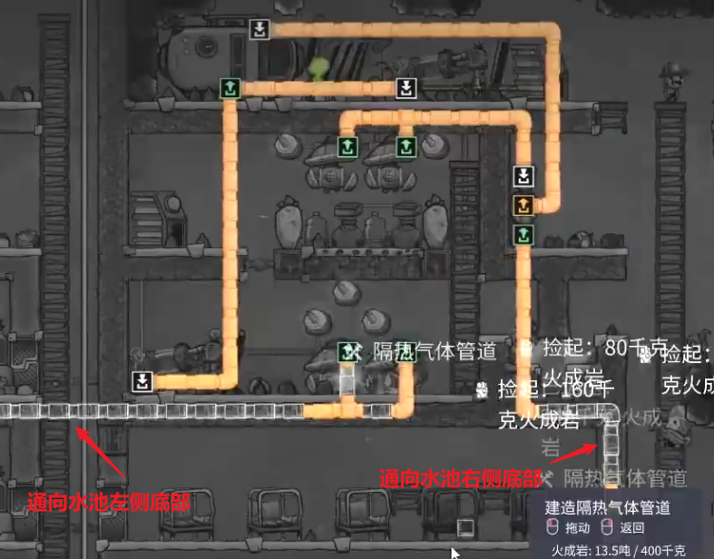
  + 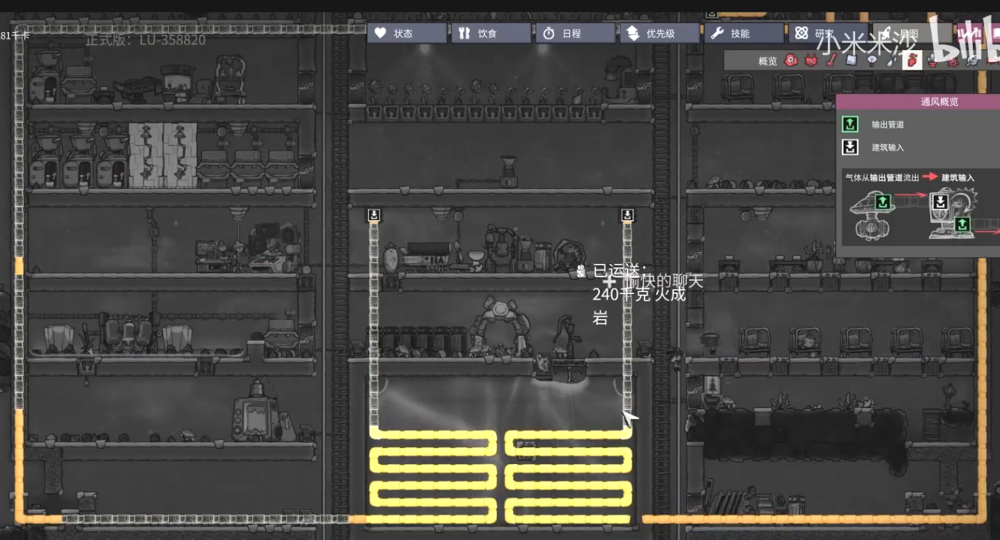
+ 自动化
  + 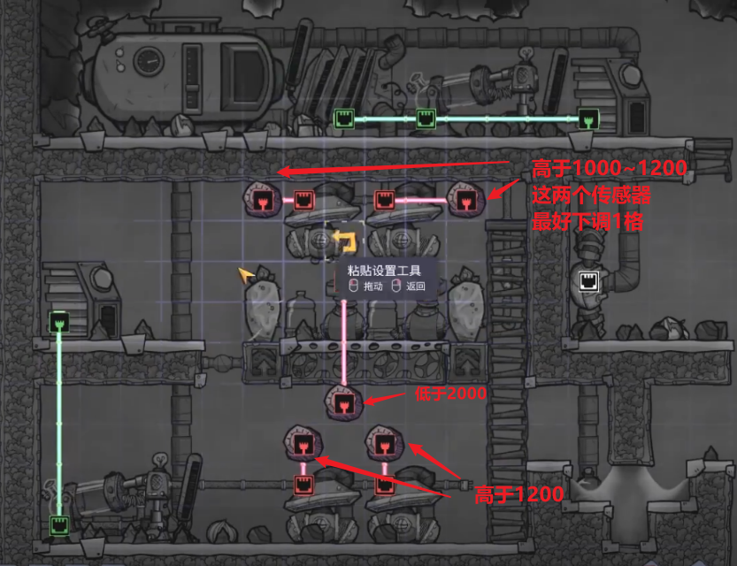
+ 电路
  + 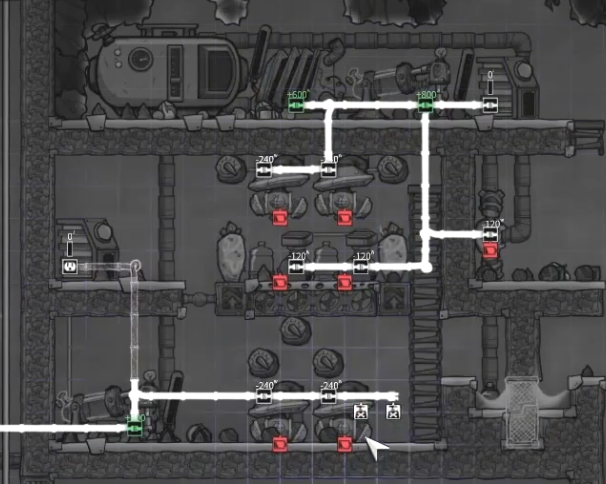

## 电力★★

1、发电设备要远离农作物

2、升级大电池后立马拆掉小电池，避免不同步造成小人的误判

3、升级电力系统：需要用到智能电池，但是要先研究**精炼科技**（碎石机）

然后升级自动化系统，设置阈值

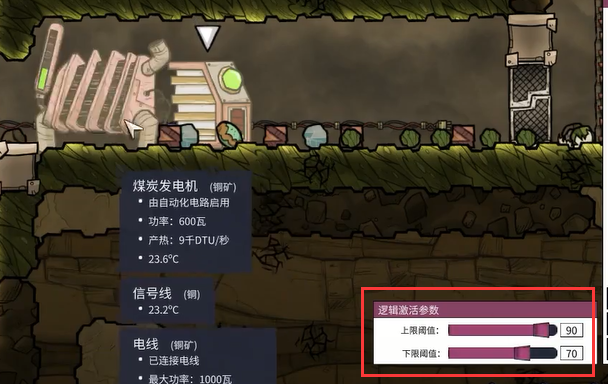

4、一般到后期电力就会过载，这时基地里只有一个电网是不行的，所以可以新建一个煤炭发电机，然后构成**两个电网**

5、后期会在基地外部建工业区，那时会用上粗电线，但是**粗电线非常耗资源**，对于小的部件可以用上细电线，但是细电线练粗电线容易过载，这时就得用上**变压器**了，它可以将高压电线转换为细电线能承受的电压

6、注意**高压线和细电线不能直接相连**，要用电线桥

## 太空服★★

太空服锻造台、太空服存放柜、太空服检查站

需要注意的是==太空服检查站需要将卸载状态改为空置==

## 动物★★

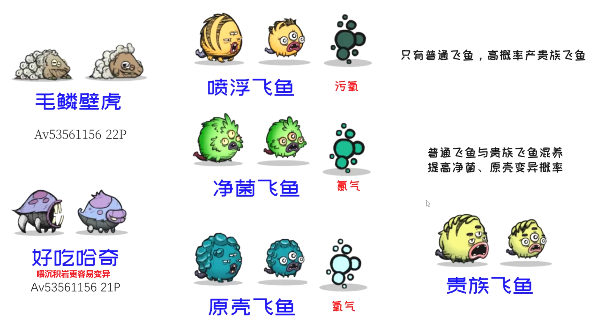

养哈奇需要投喂站来喂东西

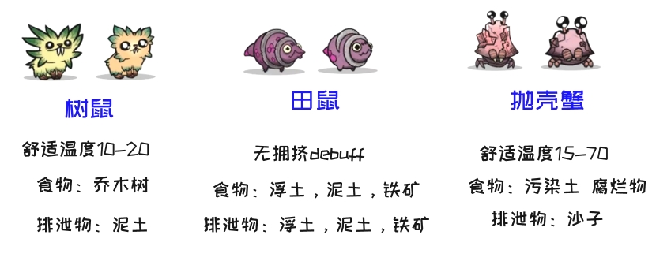

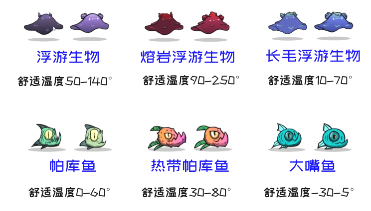

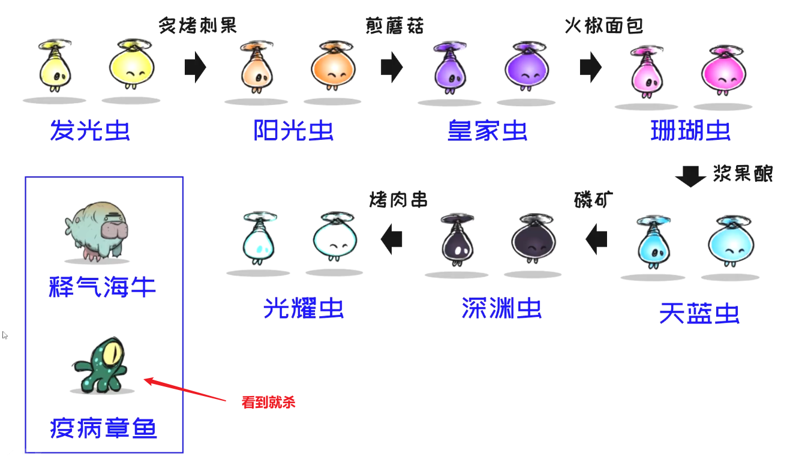

一个动物需要12个格子，如果房间16*4=64，那么顶多养5只

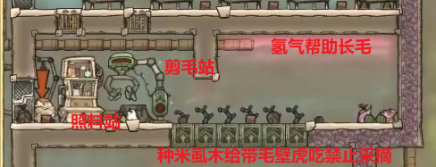

养带毛壁虎后可以建造站台->纺织机，这样小人就有衣服穿了

## 餐厅★

食物保鲜：把储存盒放在二氧化碳多的地方

高档餐厅，需要一个娱乐建筑（**饮水机**），还有一个装饰度20的装饰物（解锁装饰科技）

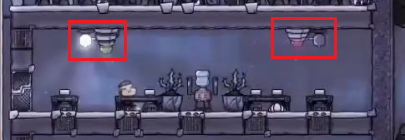

可以设置自动化感应开灯

## 二氧化碳处理★

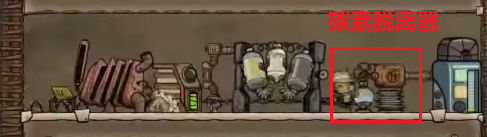

## 营房

透气砖

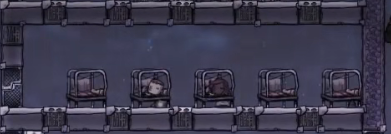

## 公园

需要解锁**食物科技**后面的**农业**，添加一个公园标识

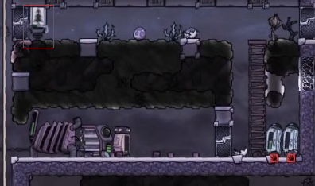

当然上面的公园是零时的，到后面基地最底一层要留一层泥土，然后想办法搞个**树鼠**，这样它就能自己种树，然后形成一个公园

## 温室

建造一个农业站可以大大减少农作物成熟的时间

## 士气

影响因素：食物、装饰、休息时间、房间、娱乐室

