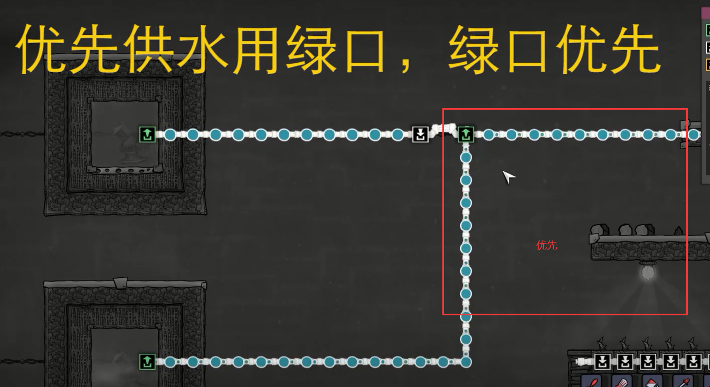
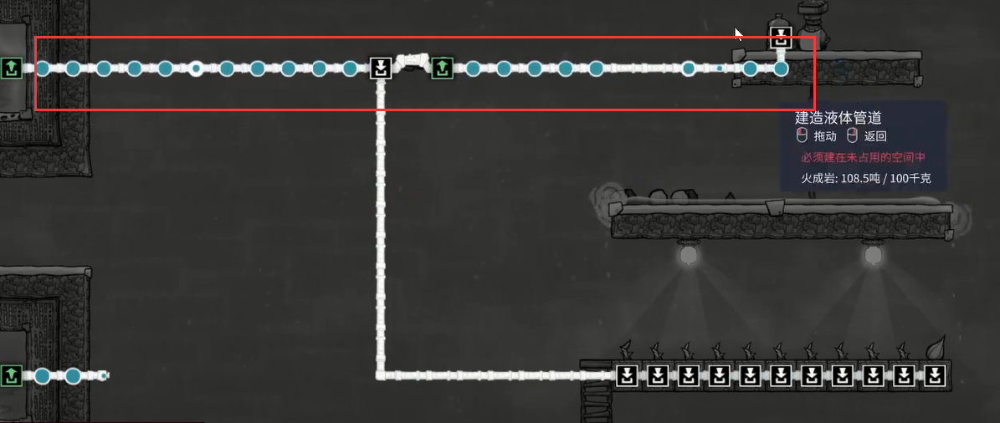
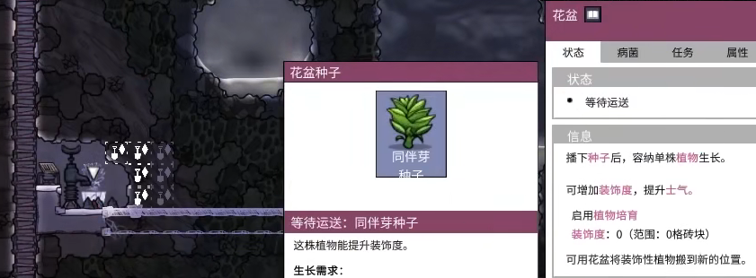

## 管道优先级

供水：

取水：连白口的滞后

## 提高小人工作效率

+ 滑杆

+ 先拆一半瓷砖，让东西掉落下一层，让后再拆另一层
+ 某些项目旁边有光线会提高速度，如下
  + 研究站，所以可以把**工作站放在打印舱**旁边
  + 厕所、沐浴室
  + 营房吃饭

## 水资源整合

up主习惯把水放在复制门下面，9格深左右

为防止湿身，需要解锁管道科技

树鼠、鱼好东西

## 防止粘液肺病菌

+ 先使用装瓶器铺一层水
  + 因为挖带病菌的泥土后，淤泥脱落至水中就不会散发了
  + 挖的时候注意，先挖靠下面的泥土

+ 然后在花盆里种个同伴牙种子（也不是必要的）
  + 因为花香（病菌）也会占一个格子
  + 即使病菌散发了也不会弄到家里

