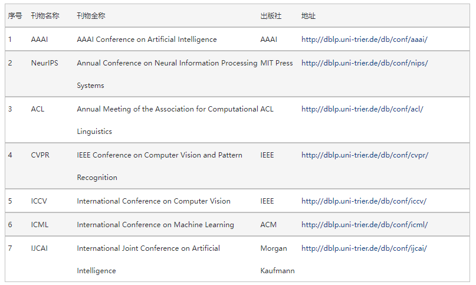

# CCF

CCF学术评价的官方网址： https://www.ccf.org.cn/Academic_Evaluation/By_category/。

[● 人工智能-中国计算机学会 (ccf.org.cn)](https://www.ccf.org.cn/Academic_Evaluation/AI/)

## CCF A 类期刊

| 序号 | 刊物名称 | 刊物全称                                                | 出版社    | 地址                                       |
| ---- | -------- | ------------------------------------------------------- | --------- | ------------------------------------------ |
| 1    | AI       | Artificial Intelligence                                 | Elsevier  | http://dblp.uni-trier.de/db/journals/ai/   |
| 2    | TPAMI    | IEEE Trans on Pattern Analysis and Machine Intelligence | IEEE      | http://dblp.uni-trier.de/db/journals/pami/ |
| 3    | IJCV     | International Journal of Computer Vision                | Springer  | http://dblp.uni-trier.de/db/journals/ijcv/ |
| 4    | JMLR     | Journal of Machine Learning Research                    | MIT Press | http://dblp.uni-trier.de/db/journals/jmlr/ |

## CCF A 类会议

对于人工智能方向，CCF的A类会议有：

| 排名 |                           会议名称                           | H5指数 | 上升指数 | TK5指数 | CCF等级 | 基础研究创新指数 | THU等级 | 指标图 |
| :--: | :----------------------------------------------------------: | :----: | :------: | :-----: | :-----: | :--------------: | :-----: | :----: |
|  23  | [**[TITS\]**IEEE Transactions on Intelligent Transportation Systems](https://www.aminer.cn/conference/5eeb1307b5261c744f15bd41) |   88   |    61    |  22.5   |    B    |      26.30       |    B    |        |
|  24  | [**[SIGKDD\]**ACM Knowledge Discovery and Data Mining](https://www.aminer.cn/conference/5eeb1307b5261c744f15bcd3)08/23/2020Online |   88   |    66    |   50    |    A    |      43.16       |    A    |        |
|  39  | [**[TKDE\]**IEEE Transactions on Knowledge and Data Engineering](https://www.aminer.cn/conference/5eeb1307b5261c744f15bcb5) |   77   |    47    |   20    |    A    |      25.73       |    -    |        |
|  54  | [**[SPL\]**IEEE Signal Processing Letters](https://www.aminer.cn/conference/5eeb1307b5261c744f15bdd0) |   65   |    37    |   28    |    C    |      14.39       |    B    |        |
|  93  | [**[CIKM\]**ACM International Conference on Information and Knowledge Management](https://www.aminer.cn/conference/5eeb1307b5261c744f15bcd7) |   53   |    45    |   26    |    B    |      11.25       |    B    |        |
| 125  | [Applied Intelligence](https://www.aminer.cn/conference/5eeb1307b5261c744f15bd75) |   42   |    33    |   14    |    C    |      10.54       |    B    |        |
