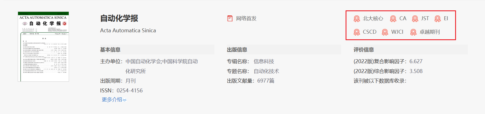

# 期刊分级

## 划分方式

1）按期刊所处地划分

+ CN：国内刊号
+ ISSN：国外刊号

2）按地域划分

划分为两种：国家级和省级，一般没有明确划分，都是习惯性的按照期刊的主管主办单位划
分（约定俗成）

国家级一般是指：国家级单位主管主办的刊物，例如《基础教育》，由中华人名共和国教育
部主管主办

省级一般是指：各省、自治区等省级部门主管主办的刊物，例如《江西社会科学》，由江西
省社会科学院主管主办

## 核心期刊

> 核心期刊是某学科某领域的顶尖期刊，指那些发表该学科该领域论文较多、使用率（含被引率、摘转率和流通率）较高、学术影响较大的期刊。
>
> 一般所含专业情报质量高、信息量大，能代表专业学科发展水平并受到本学科读者重视。

### 国内核心

核心来源一般由七大核心期刊，一般你搜索期刊的时候就会给出该期刊属于哪个核心。

+ 北大核心（北大中文核心）
  + 作为==普及最广==的北大核心；
+ 南大核心(中文社会科学引文索引（CSSC)来源期刊）
  + 作为==最权威的==南大核心；
+ 科技核心(中国科技论文统计源期刊（CSTPCD))
  + 又名“统计源核心”，全称“科技统计源核心期刊”。目录每年更新一次，分为社会科学卷和自然科学卷。可从中信所官网下载目录，==知网上并不会标注==。
  + 作为==医药机构==的科核；
+ CSCD（中国科学引文数据库）
  + 作为==理科==的CSCD
+ 人文社科核心(中国人文==社会==科学核心期刊（CHSSCD))
+ 中国人文社会科学学报学会“中国人文==社科==学报核心期刊”
+ 万方数据股份有限公司的“中国核心期刊遴选数据库"

**总结**：北大和南大核心是更加综合性的，而其他的是专注于某个特定领域；前四个用的比较多，但是不同的学校对于核心的认同不同，比如A学校认同北大核心，B学校认同南大核心，一定要在投论文的时候注意这一点，不要觉得是核心就行，比如你一个搞计算机的去投什么人文社科核心（也不是不可能出现这种人）

#### 国内期刊核心机构售价

一般去找机构，核心机构售价一般3W-3.5w左右

### 国际核心(SCI、SSCI、A&HCI、EI)

1. SCI（科学引文索引）
   + 属于==理工科==
   + 按jcr划分
     + Q1、Q2、Q3、Q4(平均4等分，各占25%)
   + 按中科院划分
     + Q1(5%)、Q2(6-20%)、Q3(21-50%)、Q4(51-100%)
2. SSCI（社会科学引文索引）
   + SCI的姊妹篇，属于==社会科学==
3. A&HCI（艺术人文引文索引）
   + 属于==艺术类==
4. EI（工程索引）

#### 国际期刊核心(SCI)机构售价

般去找机构，
sci4区5W+
sci2区8W+
sci1区10wW+,不封J顶
顶刊也有人卖，但没具体问过

### 国际会议核心(ISTP、EI)

国际会议，简而言之，就是世界各地不定期举办的学术研讨会，针对某个会议主题面向世界
征文，会后以此次会议名称为刊名，以会议论文集的形式出版，并递交 EI-CA 或 ISTP 数据库检
索。

1. CPCI/ISTP会议（科技会议录索引）
   + 知名度不高
2. EI会议（理工科类会议索引）

有些学校不认可会议，会议甚至一度被认为给钱就行，一定要弄清楚学校认不认可，尤其是本科生保研.

如果研究生认可，可以发这个保底保毕业(一般来说，花钱就中)

## 普刊

不是核心，那就是普刊了，这就不多赘述了

**普刊机构售价**

一般去找机构，普刊售价4000-5000元左右，懂得都懂了吧。

## 顶刊、权威、A、B、C、D类

> 一般为学校内部期刊评级
>

### 什么是顶刊

非要给个硬性条件，一般是指 sci 一区 top，以 letpub 搜索的 nature 为例，会给出是否为 top 期刊

实则都是看口碑，防止出现纠纷，有些学校内部评级也会给出具体的顶刊有哪些

### 学校内部期刊评级

说了那么多，最后基本都是按照学校给定的文件划分，每个学校划分不一样，这种文件一般找辅导员要。

## 计算机领域特有期刊评级(CCF)

### CCF 和 SCI 的区别

CCF 是计算机领域的权威人士排的评级，而 SCI 分区是根据期刊影响因子来划分的。SCI 的范
围更广，涉及的学科也更多，而CCF主要关注计算机领域。

计算机协会中有查询地址：https:/www.ccf.org.cn/Academic_Evaluation/By_category/

### 国际期刊

一般分为A、B、C三类 

国际期刊大都是以SCI为准，部分学校以CCF为准

### 国内期刊

一般分为T1、T2、T3类

但是，我认为划分，一般就三大期刊(计算机学报、软件学报、计算机研究与发展)和其他

### 会议

CCF会议分为A、B、C三个会议（很多学校不认可会议，up主学校才把A类会议定义为我们学校的A类期刊，评奖学金的时候，加分为30分，而一篇sci4区加分也有30分。）

==什么是顶会？==

其实没有严格的定义，顶会产出与CCFA类，甚至CCFA类中没有的也被叫做顶会。

真的要强行给定义，不参考CCF,一般就是参考：CORE,Computer Science Conference Rankings的A+类，这个相当于国外的CCF机构给出的排名当然也有参考QUALIS的，不多做描述，毫无意义。

一般顶会的名头都是约定俗成来的，即国际大牛(和你无关，你认可有毛用)对这个会议的认可度。

## 水刊怎么确定

1. 先去百度学术或谷歌学术找到你领域内近两年的论文，然后确定论文的期刊名，并统计
   下来
2. 然后通过1etpu或者知网给你找到的所有期刊进行级别排名
3. 越差的越水