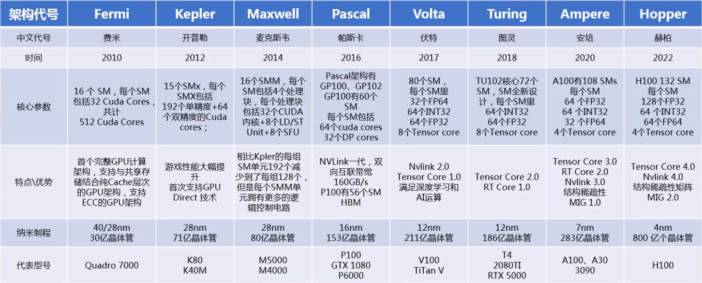

# 显卡相关

## 简介

+ 很久之前，显卡都是集成在主板的**北桥**上面
+ 然后，intel 将北桥砍掉，把显卡功能集成在了CPU上面，因此称之为**核芯显卡**，然而这种方式显卡会与CPU抢占内存，因此性能并不强
+ 最后，出现了**独立显卡**，它由 PCB 板和专门供电以及散热的独立硬件组成

## 设计

目前市面上的 GPU 芯片主要由 AMD、intel、NVIDIA 这三家厂商设计

厂商一般只设计不生产，因此它们会提供显卡的标准规格给第三方进行设计

显卡规格分为两类：

**公版显卡**：使用提供默认的标准规格进行设计

**非公版**：

+ 超公版：在原公版标准上堆料，拉高频率
+ 普通非公版：AIC 用自己的理解，适当的增减元器件，拉高频率，划分自己的型号
+ 丐版：用料和频率弱于公版，价格便宜

> **关于AIC和AIB的说明**
>
> - AIC是英伟达官方合作伙伴，由英伟达直接供给GPU芯片。
> - AIB同理，为AMD官方合作伙伴，AMD芯片直供。
>
> 
>
> **英伟达 AIC**
>
> - **华硕、技嘉、微星**
> - **七彩虹、影驰、耕升**
> - **索泰、映众、铭瑄**
>
> **AMD AIB**
>
> - **蓝宝石、迪兰、撼迅**
> - **华硕、华擎、技嘉、微星**
> - **讯景、盈通、瀚铠**

### NVIDIA 命名规范

由 【前缀】【代号】【后缀】

**1、前缀**

一般的版本有GTX、GTS、GT、GS排序是GTX>GTS>GT>GS

+ GS（入门级）普通版或GT的简化版。
+ GT（主流级）常见的游戏芯片。比GS高一个档次因为GT没有缩减管线和顶点单元。
+ GTS（性能级）介于GT和GTX之间的版本GT的加强版
+ GTX（GTeXueme旗舰级）
+ RTX（更牛逼）

**2、代号**

GTX1060，前两位表示显卡的**代数**，后两位表示**战斗力**，都是越高越好

**3、后缀**

`Ti`代表强化版本，`M`表示笔记本专用版本

### AMD命名规范

RX系列命名规则， 【前缀】【代号】【后缀】

**1、前缀**

以前的 R3~R9 系列显卡出到第 3 代就变成了 `RX`

**2、代号**

由 4 开始往上数，比如`RX4??`、`RX5??`

**2、后缀**

`XT`代表强化版本，`D`表示中国特供

## 性能比较

主要观察：型号、架构、流处理器数、核心频率

### 型号

参考上面的命名规划

### 架构

就相当于普通、中级、高级程序员，架构越好，能力越强，开发速度就越快

每一代的代号都是以科学家的名字命名的

### 流处理器数

就比如程序员的数量，人越多越牛逼

### 核心频率

类似于程序员的开发速度，频率越高，开发速度越快

### 例子

+ 入门级显卡：GTX 750ti 和 GTX 660 能在 1080p **最低画质**的 60 帧数玩 3a 大作

+ 中端甜品卡：GTX 1060 和 RX 580 能在 1080p **中高画质**的 60 帧数玩 3a 大作

## 显示器相关

开启全特效所需显存建议

- （1080p）1920x1080分辨率：建议4GB~6GB显存容量；
- （1.5K）2560x1080分辨率：建议4GB~6GB显存容量；
- （2K）2560x1440分辨率：建议6GB~8GB显存容量；
- （2.5k）2560×1600分辨率：建议6GB~8GB显存容量；
- （4K）3840x2160分辨率：建议8GB~11GB以上显存容量。

