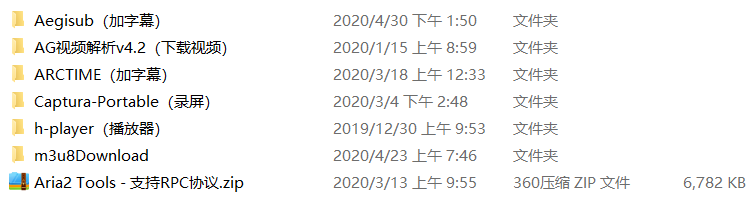
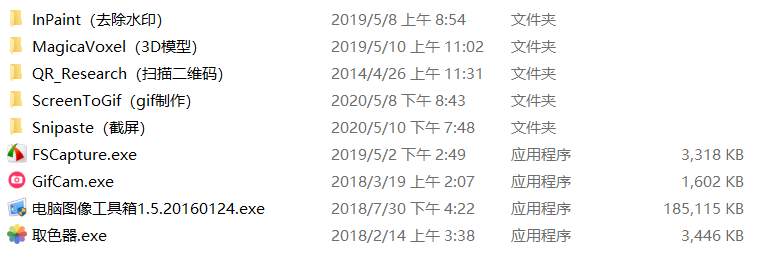
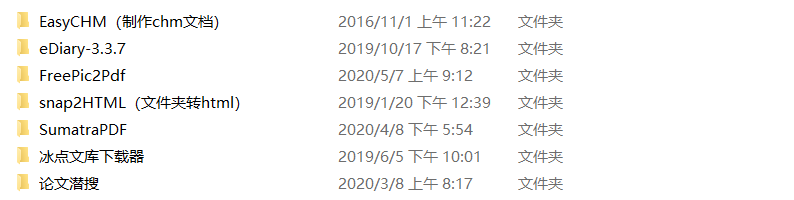
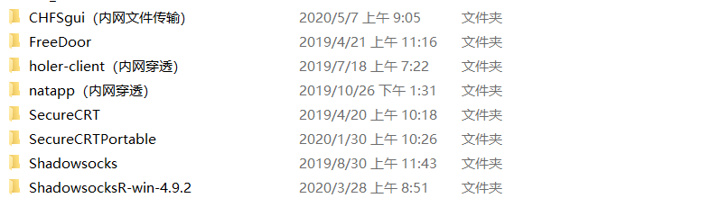
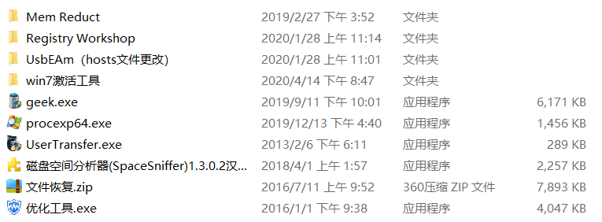
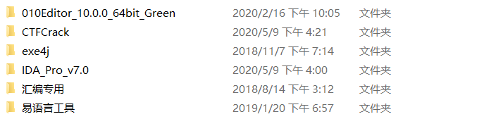

# Windows 软件

## 1、视频相关

## 2、音乐相关

+ Dopamine（多巴胺）
+ Mcool（十分的精简）

## 3、办公相关

+ officeBox
+ scrcpy（电脑控制手机）
+ superDic（生成密码字典）
+ totalCMD（查看office文档巨快）（搜飞扬时空）
+ zoomlt（放大屏幕，讲课专用）
+ capslock+
+ [AirDroid手机控制电脑](http://daishu.baidu.com/)

## 4、图像处理相关

## 5、文档笔记相关

+ [人工智能文章创作助手](https://www.52pojie.cn/thread-1147758-1-1.html)

## 6、旅行相关

+ 12306Bypss（抢票）

## 7、网络相关

## 8、系统相关

## 9、计算机类

## 建议：

https://www.zhihu.com/question/411922752

