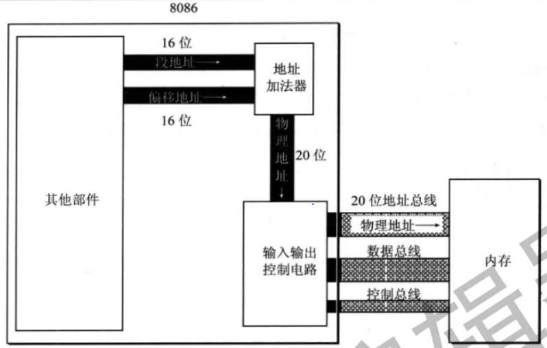

# 寄存器(cup工作原理)

## 1、CPU

一个典型的CPU（此处讨论的不是某一具体的CPU）由<font color=green>运算器、控制器</font>、<font color=red>寄存器（CPU工作原理）</font>等器件构成，这些器件靠内部总线相连。简单地说，在CPU中：

+ 运算器进行信息处理；
+ 寄存器进行信息存储；
+ 控制器控制各种器件进行工作；
+ 内部总线连接各种器件，在它们之间进行数据的传送。

寄存器是CPU中程序员可以用指令读写的部件。程序员通过改变各种寄存器中的内容来实现对CPU的控制。

不同的CPU，寄存器的个数、结构是不相同的。<font color=green>8086CPU有14个寄存器</font>，每个寄存器有一个名称。这些寄存器是：AX、BX、CX、DX、SI、DI、SP、BP、IP、CS、SS、DS、ES、PSW。

## 2、通用寄存器

<font color=green>8086CPU所有的寄存器都是16位</font>的，可以存放<font color=green>两个字节</font>。AX、BX、CX、DX这4个寄存器通常用来存放一般性的数据，被称为通用寄存器。

8086CPU上一代的寄存器都是8位的， 为了兼容，8086CPU的4个通用寄存器可分为两个独立使用的8位寄存器来用。

+ AX可分为AH和AL；
+ BX可分为BH和BL；
+ CX可分为CH和CL；
+ DX可分为DH和DL。

## 3、字在寄存器中的存储

 出于对兼容性的考虑，8086CPU可以一次性处理以下两种尺寸的数据。

+ 字节：记为byte，一个字节由8个bit组成，可以存在8位寄存器中。
+ 字：记为word，一个字由两个字节组成，这两个字节分别称为这个字的高位字节和低位字节。

## 4、几条汇编指令

|汇编指令	|控制CPU完成的操作	|				用高级语言的语法描述|
| ---- | ---- | ---- |
|mov ax，18|	将18送入寄存器AX				|	AX=18| 
|mov ah，78	|将78送入寄存器AH				|	AH=78|
|add  ax，8	|将寄存器AX中的数值加上8			|	AX=AX+8|
|mov ax.   bx	|将寄存器BX中的数据送入寄存器AX	|	AX=BX |
|add  ax，bx	|将AX和BX中的数值相加，结果存在AX中|	AX=AX+BX|

注：<font color=red>操作的对象位数必须一样</font>，否则全部位错误指令。

eg.下列全部为错误指令

```
mov ax，b1	 （在8位寄存器和16位寄存器之间传送数据）
mov bh，ax	 （在16位寄存器和8位寄存器之间传送数据了)
mov al，20000 （8位寄存器最大可存放值为255的数据）
add al，100H	 （将一个高于8位的数据加到一个8位寄存器中）
```

## 5、物理地址

我们知道，CPU访问内存单元时，要给出内存单元的地址。所有的内存单元构成的存储空间是一个一维的线性空间，每一个内存单元在这个空间中都有唯一的地址，我们将这个唯一的地址称为物理地址。

## 6、16位结构的CPU

+ 运算器一次最多可以处理16位的数据；
+ 寄存器的最大宽度为16位；
+ 寄存器和运算器之间的通路为16位。

## 7、8086CPU给出物理地址的方法



8086CPU有20位地址总线，可以传送20位地址，达到1MB寻址能力。8086CPU又是16位结构，在内部一次性处理、传输、暂时存储的地址为16位。

从8086CPU的内部结构来看，如果将地址从内部简单地发出，那么它只能送出16位的地址，表现出的寻址能力只有64KB。

地址加法器采用<font color=red>物理地址=段地址x16+偏移地址</font>的方法用段地址和偏移地址合成物理地址。

## 8、“段地址 x 16 + 偏移地址 = 物理地址” 的本质含义

CPU在访问内存时，用一个<font color=green>基础地址（段地址×16）</font>和一个相对于基础地址的偏移地址相加，给出内存单元的物理地址。

更一般地说，8086CPU的这种寻址功能是“<font color=red>基础地址+偏移地址=物理地址</font>”寻址模式的一种具体实现方案。8086CPU中，段地址×16可看作是基础地址。

## 9、段的概念

 段地址 x 16 必然是是16的倍数，也就是基础地址的最低位一定是0。
偏移地址为16位，16位地址的寻址能力位64kb，所以一个段的最大长度为64kb。

## 10、段存储器

段地址在8086CPU的段寄存器中存放。8086CPU有4个段寄存器：CS、DS、SS、ES。当3086CPU要访问内存时由这4个段寄存器提供内存单元的段地址。本章中只看一下CS。

## 11、CS和IP

CS和IP是8086CPU中两个最关键的寄存器，它们指示了CPU当前要读取指令的地址。CS为代码段寄存器，IP为指令指针寄存器，从名称上我们可以看出它们和指令的关系。

<font color=red>8086机中，任意时刻，CPU将CS:IP指向的内容当作指令执行。</font>

在8086CPU加电启动或复位后（即CPU刚开始工作时）CS和IP被设置为CS=FFFFH，IP=0000H，即在8086PC机刚启动时，CPU从内存FFFFOH单元中读取指令执行，FFFFOH单元中的指令是8086PC机开机后执行的第一条指令。

## 12、修改CS、IP的指令

若想同时修改CS、IP的内容，可用形如“<font color=red>jmp  段地址：偏移地址</font>”的指令完成

若想仅修改IP的内容，可用形如“<font color=red>jmp  某一合法寄存器</font>”的指令完成

## 13、代码段

对于8086PC机，在编程时，可以根据需要，将一组内存单元定义为一个段。

可以将长度为N（N≤64KB）的一组代码，存在一组地址连续、起始地址为16的倍数的内存单元中，这段内存是用来存放代码的，从而定义了一个代码段。

## 实验

1、debug的使用

我们用到的Debug功能。

+ 用Debug的R命令查看、改变CPU寄存器的内容；
+ 用Debug的D命令查看内存中的内容；
+ 用Debug的E命令改写内存中的内容；
+ 用Debug的U命令将内存中的机器指令翻译成汇编指令；
+ 用Debug的T命令执行一条机器指令；
+ 用Debug的A命令以汇编指令的格式在内存中写入一条机器指令。