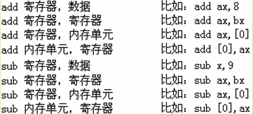

# 寄存器(内容访问)

## 1、内存中字的存储

我们提出字单元的概念：字单元，即<font color=green>存放一个字型数据（16位）</font>的内存单元，**由两个地址连续的内存单元组成**。高地址内存单元中存放字型数据的高位字节，低地址内存单元中存放字型数据的低位字节。

## 2、DS和 [ address ]

8086CPU中有一个DS寄存器，通常用来存放要<font color=red>访问数据的段地址</font>。

比如我们要读取10000H单元的内容，可以用如下的程序段进行。

```
	mov  bx，1000H
	mov  ds，bx 
	mov  al，[0]
```

上面的3条指令将10000H（1000：0）中的数据读到al中。

显然，此时mov指令的格式应该是：mov 寄存器名，内存单元地址。

含义：将段地址 : 内存单元地址单元传送到寄存器。

8086CPU不支持将数据直接送入段寄存器的操作，ds是一个段寄存器，所以`mov ds,1000H`这条指令是非法的。所以只好用一个寄存器来进行中转，即先将1000H送入一个一般的寄存器，如bx，再将bx中的内容送入ds。

## 3、字的传送

因为8086CPU是16位结构，有16根数据线，所以，可以一次性传送16位的数据，也就是说可以一次性传送一个字。只要在mov指令中给出16位的寄存器就可以进行16位数据的传送了。
比如：

```
mov bx，1000H
mov ds，bx
mov ax，[0]		//1000：0处的字型数据送入ax 
mov [0]，cx		//cx中的16位数据送到1000：0处
```

## 4、mov、add、sub指令



## 5、数据段

我们可以将一组长度为N（N≤64K）、地址连续、起始地址为16的倍数的内存单元当作专门存储数据的内存空间，从而定义了一个数据段。

比如我们用123B0H~123BH这段空间来存放数据：

+ 段地址：123BH
+ 长度：10字节

## 6、栈

8086CPU提供入栈和出栈指令：（最基本的）PUSH（入栈）pop（出栈）

+ push ax：将寄存器ax中的数据送入栈中；
+ pop  ax：从栈顶取出数据送入ax。

8086CPU的入栈和出栈操作都是<font color=red>以字为单位进行</font>的。8086CPU中，有两个寄存器：

+ 段寄存器SS		存放栈顶的段地址
+ 寄存器SP		存放栈顶 的需移地址

任意时刻，SS:SP指向向栈顶元素。

**push ax**
（1）SP=SP-2；
（2）将ax中的内容送入SS:SP指向的内存单元处，SS:SP此时括向新栈顶。

**pop ax**
（1）将SS:SP指向的内存单元处的数据送入ax中；
（2）SP=SP+2·SS:SP括向当前栈顶下面的单元，以当前栈顶下面的单元为新的栈顶。

## 7、栈段

将一段内存当作栈段，仅仅是我们在编程时的一种安排，CPU并不会由于这种安排，就在执行push、pop等栈操作指令时就自动地将我们定义的栈段当作栈空间来访问。