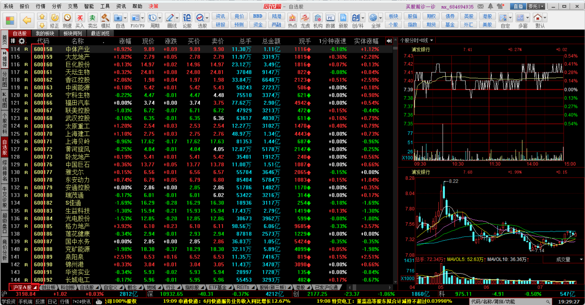
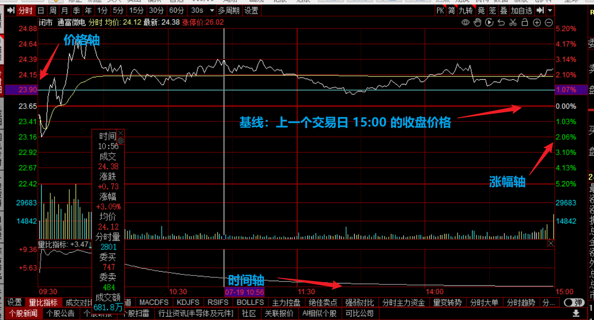
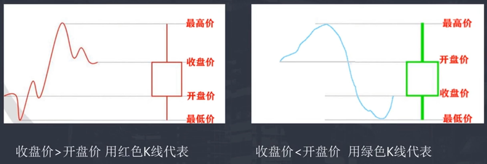
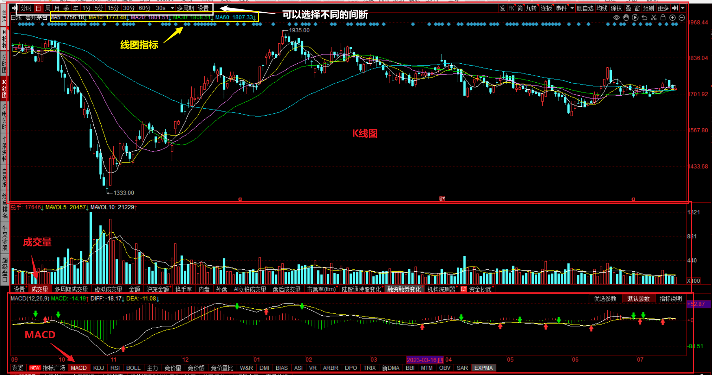
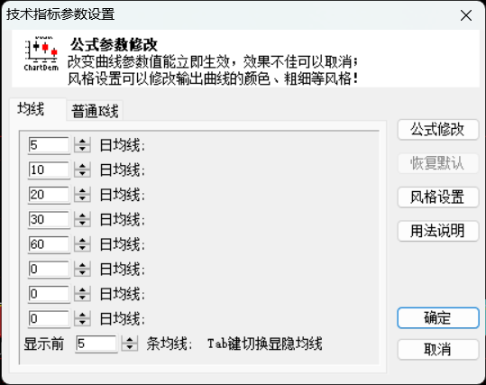
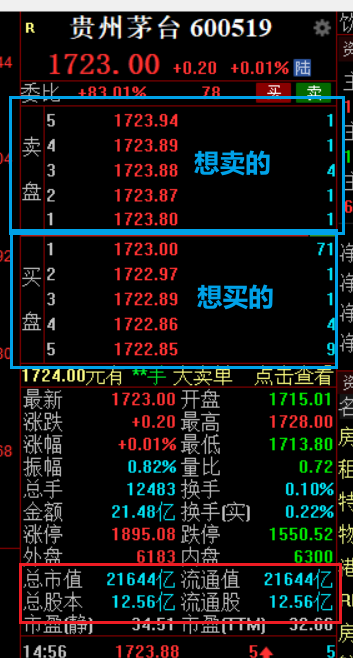
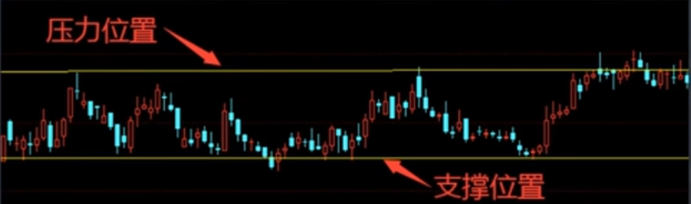
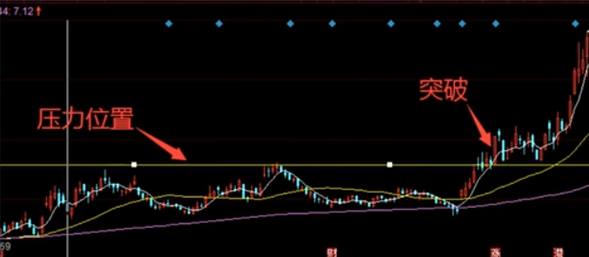
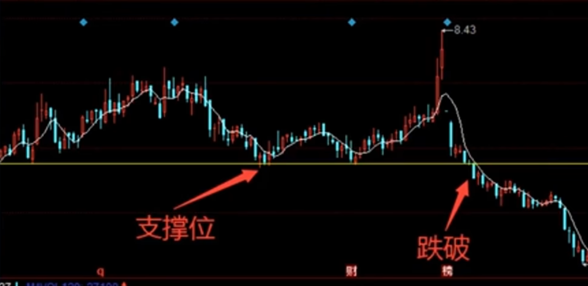

> 使用软件：炒股一般用的软件有：**同花顺**、通达信、东方财富、大智慧等等（排名不分先后）

## 股票分类

我国上市公司的股票有A股、B股、H股、N股、S股等的区分。（不用记太多，我们要做的一般只有沪深A股）我们做的股票一般就是沪深A股：说白了就是在上海和深圳上市交易的A股。

+ 60开头的股票 —— 上证A股
+ 0开头的股票 —— 深证A股
+ 3开头的股票 —— 创业板（证卷公司去开通）
+ 688开头的股票 —— 科创版（最低50W资金）后期可能政策改变

## 交易时间

股票的交易时间每周一到周五

+ 上午09:30到11:30
+ 下午13:00到15:00

所以一天就4个小时。周六周日休市不交易（国家法定节日不交易）

**注意：**

+ 9:15 到 9:20 随便挂单随便撤单
+ 9:20 到 9:25 不可撤单时间（可以挂单）

## 股票的涨跌幅

+ 沪深A股：0和60开头每天的涨跌幅是10% —— （最高涨10%最低跌10%）
+ 创业板3开头的股票：涨跌幅是20% —— （最高涨20%最低跌20%）
+ 新股第一天涨跌幅44%（68开头的科创版除外）
+ 科创版68开头股票，前5个交易日无限制，后面涨跌幅是20%
+ ST股：亏损股的涨跌幅是5%（最高涨5%最低跌5%）

## 分时图

## K线图

## 交易规则

### 股票价格

**股票最低是买1手（1手=100股），也就是说，我们实股票都是按100股的整数倍来买的**

有人问，我们买股票最低需要多少钱，这个没有固定的答案，目前沪深A股，价格最低的一只非ST股票价格比方是1.13元，我们最低就要1.13*100=113元来买股票了。

### 交易费

当前股票交易费用由三部分组成：佣金、印花税、过户费（仅上海股票收取）

1. 印花税：1%（卖的时候才收取，此为国家税收，全国统一）。
2. 过户费：深圳交易所无此项费用，上海交易所收费标准（按成交金额的0.02&permil; 人民币）
3. 交易佣金：最高收费为万3，最低收费5元。各家券商收费不一，开户前可咨询清楚
   + 比如交易佣金为万3，我只买了一万，所以佣金为3元，但是最低5元，所以还是要交5元

## 看盘软件基本操作

### 查询股票

一般输入股票名称的首字母
比方说“第一创业”输入 `dycy` 四个首字母按回车即可，也可以输入股票代码002797按回车即可。

想关注的几只股票，我们可以加入”自选股”方便后面观察，找到股票，我们点鼠标右键 -> 加入自选股

看K线图的时候，我们可以利用键盘上面的，上下键是放大和缩小，返回键按键盘左上角的esc键即可

如果要看某一天的的分时图，我们选中当天的k线图，把鼠标左键连续点击2下即可

### 软件界面

#### k线图\_成交量\_MACD

第一个：均线

比如5日均线：这5天的收盘价相加，再除以5得到的数值用线连接起来

第二个：成交量

比如120日成交量：120天的所有成交量相加，再除以120得到的数值用线连接起来

第三个：MACD 

比较复杂，没有必要去记住他的计算值，大概记住他的参考意义即可。白线到黄线上面，大概就后面上涨概率大

这些值都是可以修改的，根据实际情况修改（右击某条线 -> 修改指标参数）

#### 盘口

总股本 * 最新 = 总市值（12.56亿 * 1723 = 21644 亿）

流通股 * 最新 = 流通值（12.56亿 * 1723 = 21644 亿）

流通值代表可以交易的金额，它如果小于市值，表示该公司有股份属实公司股东不可用来交易

## 股市关键点

### 支撑位和压力位

+ 压力位：当股票上涨过程中，股价快要到达上一次上涨趋势的高点时，就是压力位。可以考虑卖出股票
+ 支撑位：当股票下跌过程中，股价快要下跌到上一次下跌趋势的低位时，就是支撑位。可以考虑买入股票

### 突破和跌破

+ 突破：当股价上涨过程中，价格冲过上一次上涨趋势的高位时，称之为突破，上涨力量很大，可以考虑买入股票

+ 跌破：当股票下跌过程中，股价下跌冲过上一次的下跌趋势低位时，称之为跌破，下跌力量很大，可以考虑卖出股票

## 股票买卖机制

+ 仓位：股市里面的资金就是仓位比方你有100万，半仓就是50万1/3仓就是33.3万1/4仓就是25万

+ 可以输入我们想要买入的一个价格，等待成交。如果没有成交，也是可以撤单的

+ 股票交易是T+1机制
  + 今天买的股票，今天是不可以卖出的，必须过完本天以后，后面才可以卖出