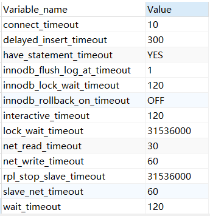

# MySQL数据库连接超时(wait_timeout)问题的处理

## 1、首先查看Mysql连接时间的相关变量

```mysql
show variables like '%timeout%'
```

结果如下图所示



重点关注`interactive_timeout`和`wait_timeout`，单位秒

+ **interactive_timeout**：服务器关闭交互式连接前等待活动的秒数。交互式客户端定义为在mysql_real_connect()中使用CLIENT_INTERACTIVE选项的客户端。又见wait_timeout
+ **wait_timeout**：服务器关闭非交互连接之前等待活动的秒数。在线程启动时，根据全局wait_timeout值或全局interactive_timeout值初始化会话wait_timeout值，取决于客户端类型(由mysql_real_connect()的连接选项CLIENT_INTERACTIVE定义)，又见interactive_timeout

**maxLifeTime参数需要设置为小于**`min(数据库的wait_timeout，HA代理的超时时间，其他代理的超时时间);`也就是说maxLifeTime不仅要像HikariCP官方说的那样小于数据库的wait_timeout，还要小于包括HA代理在内的所有介于数据库和业务应用之间其他代理的超时时间。

## 参考

1、[HikariCP不断打印WARN日志Failed to validate connection com.mysql.jdbc.JDBC4Connection@xxxxx (...) Possibly consider using a shorter maxLifetime value. (itxueyuan.com)](https://article.itxueyuan.com/d677Kg)

2、[Hikaril过一段时间就出错，Possibly consider using a shorter maxLifetime value问题_Fansj91的博客-CSDN博客](https://blog.csdn.net/qq_36296358/article/details/105852485)