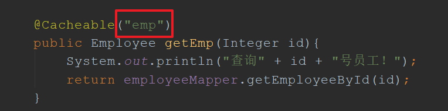

# SpringBoot排错指南

## 普通问题

（1）编写实现了`WebMvcConfigurer`接口的类，并加上`@Configuration`不起效果

**解决：**将`@Configuration`拼写错了，写成了`@Configurable`

（2）在`WebMvcConfigurer`配置类中添加`LocaleResolver`组件没效果

**解决：**方法名写错了，应使用默认名`localeResolver`，而不能是其他

（3）访问静态资源的时候总是会被自定义拦截器拦截

**解决：**拦截器方法，可以通过`handler`判断当前是什么`handler`，如是`ResourceHttpRequestHandler`的话则放行，如下

```java
public boolean preHandle(HttpServletRequest request, HttpServletResponse response, Object handler) throws Exception {
        if(handler instanceof ResourceHttpRequestHandler)
            return true;
}
```

## Redis相关

（1）No cache could be resolved for 'Builder[public cn.springboot.cache.bean.Empl

**解决：**每一个缓存组件要标注自己的名字，就是cacheNames属性不能空，如下就能解决

